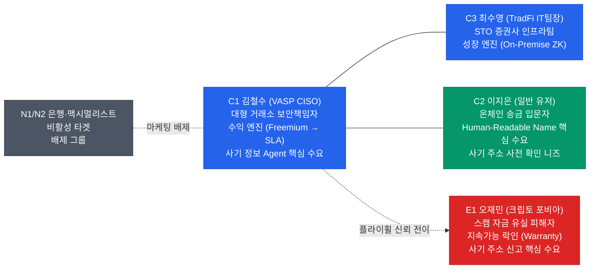
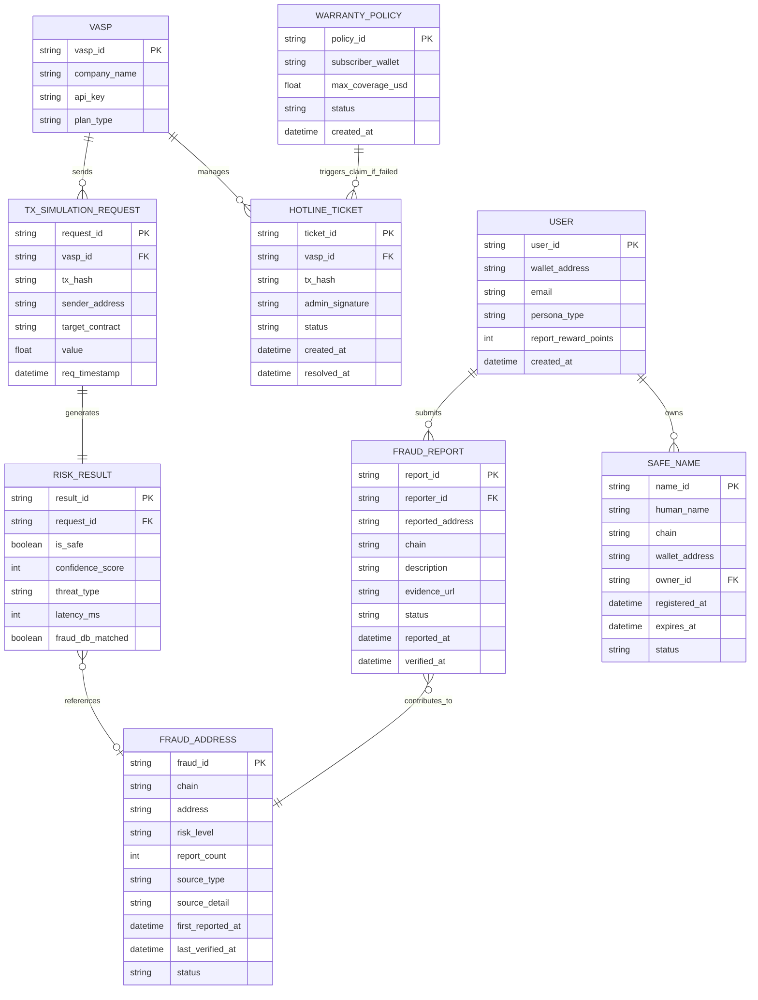
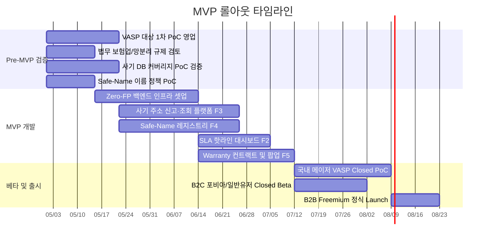

# 온체인 사기 방지 플랫폼(On-Chain Fraud Shield Platform) PRD v0.2

- **Owner 팀:** Product & Engineering
- **최종 업데이트:** 2026-04-27
- **기반 문서:** [@4.Value_Proposition_Sheet_V2(fin).md](../3.%20VPS-Draft/4.Value_Proposition_Sheet_V2(fin).md)

---

## 1. 개요·목표

### 1-1. 문제 정의 (Pain 지표 포함)

온체인 금융시장은 초기 시장으로, 다양한 체인의 난립과 변별력 없이 쏟아지는 토큰·프로토콜로 인해 **공급 과잉 · 정보 혼돈** 상태에 있다. 고객은 사람이 이해하기 어려운 16진수 온체인 주소 구조(0x1a2b…)로 인해 극도의 불안감 속에 트랜잭션을 실행하고 있으며, 현행 금융인프라와 동일하게 **사람이 인식할 수 있는 이름(Human-Readable Name)으로 트랜잭션을 실행**하기를 갈망하고 있다. 또한, 고객은 온체인 사기 주소를 신고할 접점조차 찾기 어려우며, 거래 전에 사기 주소 여부를 미리 확인하고 싶어한다. 거래소 등 기관(VASP)은 트랜잭션 전후에 사기 주소를 통제하기 위해 다양한 외부 사이트에서 정보를 수집해야 하나 이를 자체적으로 수행할 수 없어 **외부 정보 제공 대리인(Agent)**을 원하고 있다.

| Pain ID | Pain 내용 | 실패 KPI (현 상태) | 출처 |
|---|---|---|---|
| **CJM-1** | 구제/보상수단이 없는 100% 면책조항 — 스캠 피해 시 보상 경로 전무 (공통) | 스캠 피해 보상률 **0%**, 기존 툴 차별성 부재 | AOS 4.0 / DOS 3.60 |
| **CORE-1** | 과도한 오탐지로 VASP의 VIP 정상 출금 차단 및 CS 마비 (C1) | 오탐지 CS 처리 지연율(10분 초과) **>= 80%** | AOS 3.0 / DOS 2.70 |
| **CORE-2** | 사람이 인식 불가능한 온체인 주소 구조 — 오송금·피싱 취약 (C2) | 주소 기반 오송금 민원 **월 수만 건 추정**, 주소 변별 시도 포기율 **>= 70%** | AOS 3.0~4.0 / DOS 2.40~3.60 |
| **CORE-3** | 퍼블릭 SaaS망 의존으로 TradFi 인가 탈락 위기 (C3) | TradFi 내부 망분리 심사 탈락률 **100%**, 연 다운타임 **>= 10h** | AOS 3.0 / DOS 2.40 |
| **CJM-2** | 사기 주소 신고 접점 부재 — 피해 발생 후에도 신고·공유 불가 (공통) | 사기 주소 신고 가능 플랫폼 접근율 **<= 5%**, B2B 계약서 내 보증서 조항 체결 성공률 **0%** | AOS 3.0 / DOS 2.40 |
| **EXT-1** | 지속되는 해킹 공포 / 무보증 트라우마 (E1) | 스캠 피해 후 서비스 잔존율 **<= 10%** | AOS 4.0 / DOS 0.80 |
| **EXT-2** | 기관의 외부 사기정보 수집 역량 부재 — 다양한 외부 소스 통합 불가 (C1) | 기관 자체 사기 DB 커버리지 **<= 30%**, 외부 정보 수동 수집 소요 시간 **>= 120분/건** | AOS 4.0 / DOS 3.20 |

### 1-2. 목표 (Desired Outcome 수치화)

> **한 줄 비전:** *"수만 건의 오송금 민원과 오탐지를 해결하고, 사람이 읽을 수 있는 이름 기반 안전 거래와 실시간 사기 주소 필터링, 그리고 에러 시 100% 현금 보상을 보장하는 0.1초 온체인 사기 방지 플랫폼"*

| Desired Outcome | 현재(Baseline) | 목표(Target) | 측정 시점 | Baseline 실측 방법 |
|---|---|---|---|---|
| VASP 오송금 CS 방어 인건비 절감 (C1) | 월 $50,000 추정 | **<= 월 $10,000** (80% 삭감) | PoC 도입 후 1개월 | 1차 도입 VASP의 기존 월 평균 CS 인건비 리포트 실측 |
| 오탐지 해제 소요 시간 압축 (C1) | 평균 수 시간 소요 | **<= 10분** (SLA 달성) | MVP 출시 후 1개월 | 핫라인 대시보드 락 해제 이벤트 타임스탬프 간격 측정 |
| 사기 주소 사전 탐지율 향상 (공통) | 기관 자체 DB 커버리지 <= 30% | **>= 85%** (멀티소스 Agent 통합) | MVP 출시 후 3개월 | 외부 블랙리스트 DB(Chainalysis, 자체 신고 DB 등) 교차 대비 탐지율 산출 |
| 네이밍 기반 트랜잭션 전환율 (C2) | Human-Readable Name 트랜잭션 비율 0% | **>= 50%** (네이밍 등록 유저 대상) | MVP 출시 후 3개월 | Safe-Name 등록 유저 중 이름 기반 송금 비율 추적 |
| 사기 주소 신고 건수 (공통) | 신고 접점 부재로 건수 0건 | **월 >= 500건** | MVP 출시 후 3개월 | 신고 플랫폼 접수 로그 집계 |
| 무사고 컴플라이언스 100% 방어 (C3) | 심사 탈락 (SaaS 의존) | **심사 프리패스** (가동률 99.99%) | Phase 2 모듈 도입 후 | TradFi 망분리 심사 통과 인증서 획득 |
| 포비아 유저 신뢰 체감 및 락인 (E1) | 피격 후 이탈률 90% | **보증 구독 잔존율 >= 90%** | MVP 출시 후 3개월 | Warranty 스마트 컨트랙트 활성 구독(Active) 코호트 |

### 1-3. 성공 지표

#### North Star KPI

| KPI | 정의 | 기준선(Baseline) | 목표값(Target) | 측정 주기 |
|---|---|---|---|---|
| **사기 주소 사전 차단 성공률 (Pre-TX Fraud Block Rate)** | 트랜잭션 실행 전 사기 주소를 사전 탐지·차단하여 자금 유실을 방지한 비율 | 0% (신규 서비스) | **>= 95%** | 주간 (p50, p95 트래킹) |

#### 보조 KPI

| 카테고리 | KPI | 기준선 | 목표값 | 측정 주기 | 측정 경로 (도구 / 이벤트) |
|---|---|---|---|---|---|
| **획득** | SDK 무상 배포 기반 PoC 체결 VASP 수 | 0곳 | **>= 10곳** | 월간 | CRM 파이프라인 (Salesforce) |
| **활성** | API 연동 환경 오탐지율 (FP Rate) | 약 3% (기존 툴) | **<= 0.01%** | 일간 | API Engine 로그 모니터링 (Datadog) |
| **전환** | 유료 Enterprise API 라이선스 업셀링 전환율 | 0% | **>= 40%** | 분기 | PoC 기관 중 결제 완료 계정 (Stripe) |
| **바이럴** | 사기 주소 신고 공유율 (커뮤니티 → 플랫폼 유입) | 0% | **>= 10%** | 주간 | 신고 건의 소셜 공유 이벤트 / 전체 신고 건수 |
| **유지** | Warranty 보증 프리미엄 구독 이탈률 | 0% | **0% 근접** | 월간 | 온체인 컨트랙트 구독 상태 트래킹 |
| **신뢰** | 시스템 에러 발생 시 $30K 한도 배상 SLA 준수율 | N/A | **100% (24h 내 처리)** | 분기 | Warranty 스마트 컨트랙트 트랜잭션 기록 |
| **매출** | B2B 라이선스 누적 매출 (ARR) | 0원 | **22.5억 원** (Y1 말) | 월간 | 재무 정산 대시보드 |
| **신고** | 사기 주소 커뮤니티 신고 월간 접수 건수 | 0건 | **>= 500건** | 월간 | 신고 플랫폼 백엔드 접수 로그 |

---

## 2. 사용자와 페르소나

### 2-1. 핵심 페르소나 요약

### 2-2. 페르소나별 여정 Pain / Needs 링크

| 페르소나 | CJM 핵심 Pain 단계 | 핵심 Needs | AOS | DOS |
|---|---|---|---|---|
| **C1 김철수** | 결제-운영 (오탐지 차단, CS 마비, 외부 사기정보 수집 불가) | 0.1초 제로 오탐지, 10분 해제 권한, 멀티소스 사기 DB Agent | 3.0 | 2.70 |
| **C2 이지은** | 탐색-송금 (주소 해석 불가, 사기 여부 확인 불가) | 사람이 인식 가능한 이름 기반 송금, 사기 주소 사전 조회 | 3.0~4.0 | 2.40~3.60 |
| **C3 최수영** | 도입-인가 (퍼블릭 망 의존 인가 탈락) | 100% 망분리 가능한 On-Premise 모듈 | 3.0 | 2.40 |
| **E1 오재민** | 탐색-피해 (면책 조항, 해킹 공포, 신고 접점 부재) | 에러 입증 시 100% 현금 보상 보증, 사기 주소 신고 채널 | 4.0 | 0.80 / 3.60 |

> **배제 타겟:** N1 은행(폐쇄 오프라인 맹신), N2 맥시멀리스트(중앙화 툴 전면 거부) — MVP 리소스 투입 **전면 금지**.

---

## 3. 사용자 스토리와 수용 기준 (AC, Acceptance Criteria)

### Story 1: 0.1초 실시간 필터링 API (C1 — Zero-FP Engine)

> **As a** VASP CISO(C1 김철수),
> **I want** 과도한 오탐지 없이 0.1초 내로 거래 위험을 판별하는 API를 연동하고 싶다,
> **So that** VIP 유저의 정상 출금이 차단되어 CS 부서가 마비되는 사태를 막을 수 있다.

| AC | Given | When | Then | 측정 임계치 |
|---|---|---|---|---|
| **AC1 — 판별 지연(Latency)** | 트랜잭션 서명 전 검증 요청이 들어왔을 때 | 백엔드 API 엔진이 포크 환경 시뮬레이션을 수행하면 | 결과(Risk Score)를 응답한다 | **응답 시간 <= 100ms (p95)** |
| **AC2 — 오탐지율(False Positive)** | 10만 건의 정상 거래 요청이 발생했을 때 | 시스템이 서명 필터링을 거치면 | 정상 거래를 위협으로 잘못 판단하는 비율이 극히 낮아야 한다 | 오탐지율 **<= 0.01%** |
| **AC3 — 사기 주소 DB 실시간 반영** | 커뮤니티 신고 또는 외부 소스에서 새로운 사기 주소가 등록된 상태 | 검증 요청에 해당 주소가 포함되면 | 최신 사기 DB가 반영된 Risk Score가 산출된다 | 사기 DB 갱신 반영 지연 **<= 5분** |
| **AC4 — 노드 장애 폴백** _(Sad Path)_ | 외부 의존 RPC 노드(Alchemy 등)에 타임아웃이 발생했을 때 | 검증 요청이 들어오면 | 자체 캐싱 레이어 아키텍처를 통해 검증이 지연 없이 수행되거나 적절히 바이패스되어 유저 여정이 멈추지 않는다 | 엔진 가동률 **>= 99.99%** |
| **AC5 — 미등록 체인 요청 시 안내** _(Sad Path)_ | 시스템이 아직 지원하지 않는 체인(예: 신규 L2)의 트랜잭션 검증 요청이 들어왔을 때 | API가 요청을 수신하면 | "해당 체인은 현재 미지원 상태입니다. [지원 요청하기]" 응답과 함께 지원 요청을 제출할 수 있다 | 미지원 체인 안내 응답 **<= 300ms**, 요청 제출 성공률 **>= 99%** |

---

### Story 2: 오탐지 10분 핫라인 대시보드 (C1 — SLA Hotline)

> **As a** VASP CISO(C1 김철수),
> **I want** 오탐지 차단이 발생할 경우 즉시 락을 해제할 수 있는 B2B 핫라인 대시보드를 제공받고 싶다,
> **So that** 정상 유저의 이탈을 막고 10분 내 SLA 준수 요건을 달성할 수 있다.

| AC | Given | When | Then | 측정 임계치 |
|---|---|---|---|---|
| **AC1 — 실시간 알림** | 시스템이 위험 점수(High)로 거래를 자동 차단했을 때 | 유저가 고객센터(CS)에 예외 처리를 접수하면 | CISO의 Slack 봇 및 대시보드로 즉각적인 Override 요청 승인 알림이 발송된다 | 알림 발송 지연 **<= 2초** |
| **AC2 — 직접 승인 및 락 해제** | 핫라인 대시보드에 접수된 건에 대해 | 권한이 있는 관리자(CISO)가 서명(승인)을 완료하면 | VASP 시스템에서 즉각 거래 락이 해제되어 트랜잭션이 강제 통과된다 | 티켓 생성부터 락 해제까지 **<= 10분 (SLA 100%)** |
| **AC3 — SLA 초과 위기 경보** _(Sad Path)_ | 접수된 핫라인 티켓이 8분 이상 미처리 상태일 때 | 시스템 모니터링 룰이 발동되면 | PagerDuty 및 Slack `#urgent` 채널을 통해 담당자에게 자동 경고 콜이 발생한다 | 경보 누락률 **= 0%** |

---

### Story 3: 사기 주소 신고 및 사전 조회 플랫폼 (공통 — Fraud Report & Lookup)

> **As a** 온체인 트랜잭션을 실행하는 일반 유저(C2 이지은) 또는 스캠 피해 경험이 있는 크립토 포비아(E1 오재민),
> **I want** 사기 주소를 누구나 쉽게 신고할 수 있고, 트랜잭션 전에 상대 주소가 사기 주소인지 미리 확인하고 싶다,
> **So that** 사기 피해를 사전에 예방하고, 커뮤니티 전체의 안전망을 강화할 수 있다.

| AC | Given | When | Then | 측정 임계치 |
|---|---|---|---|---|
| **AC1 — 사기 주소 신고 접수** | 유저가 사기로 의심되는 주소를 발견한 상태 | "[사기 주소 신고]" 버튼을 탭하고 주소 및 피해 내역을 제출하면 | 신고 접수 확인 알림과 예상 처리 시간이 즉시 표시된다 | 신고 접수 응답 **<= 3초**, 신고 검증 완료 **<= 24시간** |
| **AC2 — 사기 주소 사전 조회** | 유저가 송금 전 상대 주소를 확인하고 싶은 상태 | 주소 입력 후 "[사기 여부 조회]" 버튼을 탭하면 | 해당 주소의 사기 이력(신고 건수, 위험 등급, 관련 사건)이 대시보드로 표시된다 | 조회 응답 시간 **<= 2초 (p95)**, 사기 DB 커버리지 **>= 85%** |
| **AC3 — 출처 투명 공개** | 사기 주소 조회 결과가 표시된 상태 | "[출처 확인]" 버튼을 탭하면 | 해당 데이터의 원천(Chainalysis, 커뮤니티 신고, 자체 분석)이 아코디언 메뉴로 펼쳐진다 | 출처 도달 **<= 2클릭**, 아코디언 렌더 **<= 500ms** |
| **AC4 — 신고 보상 체감** | 신고한 사기 주소가 검증/확인 완료된 상태 | 확인이 반영되면 | 신고자에게 푸시 알림("귀하의 신고로 사기 주소가 등록되었습니다")과 리워드(포인트/배지)가 지급된다 | 확인 후 알림 발송 **<= 1시간**, 신고자 만족도 **>= 4.0/5점** |
| **AC5 — 스팸/무효 신고 필터링** _(Sad Path)_ | 유저가 동일 주소에 대해 24시간 내 5건 이상 반복 신고하거나, 신고 내용이 빈 문자열인 상태 | "[사기 주소 신고]" 제출을 시도하면 | "중복 또는 불완전한 신고입니다. 내용을 확인해 주세요." 안내와 함께 제출이 차단되고, 기존 유효 신고는 영향받지 않는다 | 스팸 신고 차단 정확도 **>= 95%**, 유효 신고 오차단률(false positive) **<= 2%** |

---

### Story 4: Human-Readable Name 기반 안전 송금 (C2 — Safe-Name Service)

> **As a** 온체인 송금에 불안감을 느끼는 일반 유저(C2 이지은),
> **I want** 복잡한 16진수 주소(0x1a2b…) 대신 사람이 읽을 수 있는 이름(예: "kim.safe")으로 안전하게 송금하고 싶다,
> **So that** 현행 금융인프라(계좌번호 → 예금주명 확인)와 동일한 수준의 안심을 느끼며 트랜잭션을 실행할 수 있다.

| AC | Given | When | Then | 측정 임계치 |
|---|---|---|---|---|
| **AC1 — 이름 등록 및 주소 매핑** | 유저가 자신의 지갑 주소에 Human-Readable Name을 등록하려는 상태 | 이름(예: "kim.safe")을 입력하고 등록을 완료하면 | 해당 이름이 온체인에 기록되고, 이후 이 이름으로 송금 수신이 가능해진다 | 이름 등록 완료 **<= 30초**, 등록 실패율 **< 0.5%** |
| **AC2 — 이름 기반 송금 실행** | 송금자가 수신자의 이름(예: "lee.safe")을 입력한 상태 | "송금" 버튼을 탭하면 | 시스템이 이름을 주소로 리졸브하고, 매칭된 주소와 함께 "수신자: lee.safe (0x…1234)" 확인 화면을 표시한 뒤 최종 승인을 거쳐 트랜잭션을 실행한다 | 이름→주소 리졸브 **<= 500ms**, 매칭 정확도 **100%** |
| **AC3 — 사기 주소 자동 경고 연동** | 이름 기반 송금 시 리졸브된 주소가 사기 DB에 등록된 상태 | 확인 화면이 로드되면 | "⚠ 이 주소는 사기 신고 이력이 있습니다" 경고와 함께 상세 정보 링크가 표시되고, 유저가 명시적으로 "그래도 진행"을 선택해야만 송금이 가능하다 | 경고 표시 **<= 300ms**, 경고 후 사기 주소 송금 완료율 **<= 5%** |
| **AC4 — 미등록 이름 검색 시 안내** _(Sad Path)_ | 송금자가 등록되지 않은 이름(예: "unknown.safe")을 입력한 상태 | 리졸브 요청이 처리되면 | "해당 이름은 등록되지 않았습니다. 주소를 직접 입력하거나 수신자에게 이름 등록을 요청해 주세요." 안내가 표시된다 | 미등록 안내 표시 **<= 300ms** |

---

### Story 5: 현금 배상 Warranty 보증 (E1 — Trust Smart Contract)

> **As a** 해킹 트라우마를 가진 크립토 포비아(E1 오재민),
> **I want** 앱 내에서 "최대 $30,000 보상 보증"이라는 명시적 팝업과 스마트 컨트랙트를 체결하고 싶다,
> **So that** 플랫폼의 면책 조항 뒤에 숨는 행태를 벗어나 안심하고 거래를 수행할 수 있다.

| AC | Given | When | Then | 측정 임계치 |
|---|---|---|---|---|
| **AC1 — Invisible UI 팝업** | 트랜잭션 서명 전 백그라운드 스캐닝이 안전(Safe)으로 판별된 상태 | 거래가 진행되기 전 | 클라이언트 앱 설치 없이 백그라운드에서 직관적인 "최대 $30K 현금 보상" 팝업 UI가 노출된다 | 팝업 로드 시간 **<= 500ms** |
| **AC2 — 온체인 보증서 발급** | 보증 프리미엄 구독(월 1~2만 원 상당)을 선택하고 결제했을 때 | 트랜잭션이 완료되면 | 온체인 보상 펀드풀과 연동된 보험 증서 NFT가 유저의 지갑으로 즉시 자동 발급된다 | NFT 민팅 실패율 **< 0.1%** |
| **AC3 — 자동 배상 릴리즈** | 엔진의 탐지 오류로 인한 자금 유실이 암호학적으로 입증되었을 때 | 스마트 컨트랙트의 클레임 조건이 충족되면 | 최대 $30,000 한도 내의 보상금이 담당자 수동 승인 없이 즉각 유저 지갑으로 릴리즈된다 | 보상금 지급 소요 시간 **<= 24시간** |

---

### Story 6: 기관용 사기 정보 수집 Agent (C1 — Fraud Intelligence Agent)

> **As a** VASP CISO(C1 김철수),
> **I want** 다양한 외부 사기 정보 소스(Chainalysis, 커뮤니티 신고, OFAC 제재 리스트, 오픈소스 블랙리스트 등)를 하나의 통합 대시보드에서 실시간으로 수집·정제하여 제공받고 싶다,
> **So that** 수동으로 여러 외부 사이트를 순회하며 정보를 모을 필요 없이, 트랜잭션 전후 사기 주소 통제를 위한 단일 진실의 원천(Single Source of Truth)을 확보할 수 있다.

| AC | Given | When | Then | 측정 임계치 |
|---|---|---|---|---|
| **AC1 — 멀티소스 통합 수집** | 외부 사기 정보 소스(Chainalysis, OFAC, 커뮤니티 신고 등)가 연동된 상태 | Agent가 스케줄링 또는 실시간 이벤트로 수집을 수행하면 | 모든 소스의 사기 주소 데이터가 표준 포맷으로 정규화되어 통합 DB에 적재된다 | 소스별 수집 주기 **<= 15분**, 정규화 정확도 **>= 98%** |
| **AC2 — 통합 대시보드 조회** | CISO가 사기 정보 Agent 대시보드에 접속한 상태 | 특정 주소 또는 위험 등급으로 필터링하면 | 소스별 신고 이력, 위험 등급 변동 추이, 관련 트랜잭션 요약이 한 화면에 표시된다 | 대시보드 로드 **<= 3초**, 필터 적용 **<= 1초** |
| **AC3 — 외부 소스 장애 시 부분 결과 제공** _(Sad Path)_ | 연동된 3개 외부 소스 중 1개(예: Chainalysis API)가 타임아웃 또는 5xx 오류를 반환하는 상태 | Agent가 수집을 시도하면 | 정상 응답한 소스의 데이터만 적재하고, 장애 소스에는 "Chainalysis 데이터 갱신 실패. 마지막 수집: HH:MM" 안내를 인라인으로 표시한다 | 부분 결과 제공 성공률 **>= 99%**, 장애 소스 안내 메시지 표시까지 **<= 500ms** |

---

### Story 7: TradFi 100% 망분리 ZK 인프라 (C3 — On-Premise ZK)

> **As a** STO 증권사 인프라팀장(C3 최수영),
> **I want** 퍼블릭 노드와의 외부 통신이 일절 없는 100% 설치형 영지식(ZK) 검증 모듈을 납품받고 싶다,
> **So that** 금융 당국의 엄격한 망분리 규제를 프리패스로 통과할 수 있다.

| AC | Given | When | Then | 측정 임계치 |
|---|---|---|---|---|
| **AC1 — 100% 에어갭 (Air-gap)** | 내부 STO 인프라에 모듈이 설치되어 동작할 때 | 패킷 모니터링을 수행하면 | Alchemy, Infura 등 일체의 외부 퍼블릭 SaaS 노드로 향하는 아웃바운드 트래픽이 0건으로 탐지된다 | 외부 통신 건수 **= 0** |
| **AC2 — 독립적 가용성** | 폐쇄망 내부에서 자체 노드로 스캐닝을 수행할 때 | 트래픽이 분당 1,000 TPS 이상으로 폭증하더라도 | 모듈 자체의 다운타임이나 병목 없이 원활히 검증을 처리한다 | 가동률 **>= 99.99%** |
| **AC3 — 데이터 기밀성 증명** | 당국 감사용으로 시스템 로그를 제출할 때 | 영지식 증명(ZK) 트랜잭션 증빙 데이터를 확인하면 | 지갑 주소, 자산 잔고 등 개인 민감 정보가 암호화되어 일체 노출되지 않음이 수학적으로 입증된다 | 기밀 유출 식별 건수 **= 0** |

---

## 4. 기능 요구사항 (Functional)

### 4-1. MoSCoW 우선순위 매핑

```mermaid
graph TD
    classDef must fill:#E53935,stroke:#B71C1C,color:#fff
    classDef should fill:#FB8C00,stroke:#E65100,color:#fff
    classDef could fill:#43A047,stroke:#2E7D32,color:#fff
    classDef wont fill:#757575,stroke:#424242,color:#fff

    subgraph Must ["Must Have — MVP 필수"]
        direction TB
        F1["F1. Zero-FP 실시간 API 엔진\n(0.1초 처리, 사기 DB 연동)\nAOS 3.0 / DOS 2.7"]:::must
        F2["F2. 오탐지 핫라인 SLA 대시보드\n(10분 해제)\nAOS 3.0 / DOS 2.7"]:::must
        F3["F3. 사기 주소 신고 및 사전 조회 플랫폼\n(커뮤니티 사기 방지망)\nAOS 4.0 / DOS 3.6"]:::must
        F4["F4. Human-Readable Name 송금 서비스\n(Safe-Name Service)\nAOS 3.0~4.0 / DOS 2.4~3.6"]:::must
        F5["F5. Warranty 배상 스마트 컨트랙트 및 UI\nAOS 4.0 / DOS 3.6"]:::must
    end

    subgraph Should ["Should Have — Phase 2 (성장 엔진)"]
        direction TB
        F6["F6. 기관용 사기 정보 수집 Agent\n(멀티소스 통합 대시보드)"]:::should
        F7["F7. TradFi용 ZK 망분리 모듈\n(100% On-Premise)"]:::should
    end

    subgraph Could ["Could Have — Phase 3"]
        direction TB
        F8["F8. Safe-Name 기반 주소록 / 즐겨찾기"]:::could
        F9["F9. 사기 피해 트렌드 인텔리전스 리포트"]:::could
        F10["F10. B2B 사기 정보 API 마켓플레이스"]:::could
    end

    subgraph Wont ["Won't Have — 명시적 배제"]
        direction TB
        W1["커뮤니티 및 유저 리뷰 게시판\n(어뷰징/포지셔닝 훼손)"]:::wont
        W2["디파이 초고수용 시뮬레이터 앱\n(B2C 출혈 경쟁)"]:::wont
        W3["당사 직접 개인지갑 App 출시\n(네트워크 효과 역행)"]:::wont
    end
```

### 4-2. Must-Have 기능 상세 및 대안 대비 가치

| Feature | 구현 핵심 | 기존 대안과의 비교 (차별 가치) | 근거 |
|---|---|---|---|
| **F1. Zero-FP API Engine** | 트랜잭션 포크 시뮬레이션 — Caching Layer를 통한 응답 지연 타파 — 외부 RPC 비용 통제 아키텍처 — 사기 주소 DB 실시간 연동 | **처리 속도:** 기존 툴 대비 **1.5배 ↑** (p95 <= 100ms 달성) | KSF #2; CORE-1 |
| | | **오탐지율:** 기존 툴(3% 내외) 대비 오탐지 **<= 0.01%** 로 압도적 정확도 확보 | |
| | | **사기 DB:** 커뮤니티 신고 + 외부 소스 멀티소스 통합으로 탐지 커버리지 **>= 85%** | |
| **F2. SLA 핫라인 대시보드** | Slack 봇 연동을 통한 즉각 알림 — CISO 멀티시그 서명을 통한 10분 내 락 해제 백오피스 | **B2B 대응력:** Kerberus 등 B2C 툴에는 전무한 **기관 전용 통제권(SLA)** 제공 — CS 해결 시간 **90% 이상 단축** | KSF #3; CORE-1 |
| **F3. 사기 주소 신고·조회 플랫폼** | 누구나 접근 가능한 사기 주소 신고 UI — 신고 검증 파이프라인 — 실시간 사기 주소 사전 조회 API — 출처 투명 공개 — 신고 리워드 | **접근성:** 기존에는 사기 주소 신고 접점 자체가 부재 — 본 플랫폼은 **원스텝 신고** 가능 | CJM-2; CORE-2 |
| | | **사전 방어:** 기존 툴은 사후 분석 중심 — 본 플랫폼은 **트랜잭션 전 사기 여부 사전 확인** 가능 | |
| **F4. Safe-Name Service** | 온체인 이름 레지스트리 — 이름↔주소 양방향 리졸브 — 사기 주소 DB 자동 교차 검증 — 기존 금융인프라 대비 동등한 UX 구현 | **사용성:** 기존 16진수 주소 복사·붙여넣기의 오송금 리스크 **원천 제거** | CORE-2; CJM-1 |
| | | **안전성:** ENS는 피싱 탐지 없이 이름만 매핑 — 본 플랫폼은 이름 리졸브 시 **사기 DB 자동 교차 경고** | |
| **F5. Warranty 컨트랙트 & UI** | 보상 펀드풀 온체인 잔고 증명 — 직관적 "최대 $30K 보상" 팝업 노출 (Invisible UI) — 에러 입증 시 스마트 컨트랙트 자동 릴리즈 | **보장 수준:** 기존 모든 지갑/익스텐션의 '100% 면책 조항' 대비 **100% 현금 보상**이라는 유일무이한 정책 무기 | KSF #1; CJM-1, EXT-1 |
| | | **보안 로직:** 기존 익스텐션 소스코드 노출 취약점 극복 — **100% 서버 인하우스 내재화**로 해킹 원천 차단 | KSF #5 |

---

## 5. 비기능 요구사항 (NFR, Non-Functional Requirement)

### 5-1. 성능

| 항목 | 기준 | 비고 |
|---|---|---|
| API 검증 응답 시간 | **p95 <= 100ms** | 0.1초 처리의 핵심 (자체 Caching 필수) |
| 사기 주소 조회 응답 시간 | **p95 <= 2,000ms** | 멀티소스 DB 병렬 조회 포함 |
| Safe-Name 리졸브 시간 | **p95 <= 500ms** | 이름→주소 매핑 조회 |
| Warranty 팝업 렌더링 | **p95 <= 500ms** | 유저의 트랜잭션 흐름 방해 최소화 |
| 핫라인 알림 발송 시간 | **p95 <= 2,000ms** | Slack Webhook 연동 속도 |
| 사기 정보 Agent 대시보드 로드 | **p95 <= 3,000ms** | 멀티소스 집계 화면 |
| **동시 접속 부하 기준** | **10,000 TPS** | 상승장/밈코인 거래 폭주 상황 상정 |
| **부하 테스트 주기** | **출시 전 1회 + 분기 1회** | k6 등 도구 활용 부하/스트레스 테스트 |

### 5-2. 신뢰성

| 항목 | 기준 |
|---|---|
| 월간 서비스 API 가용성 | **>= 99.99%** (고가용성 필수) |
| 오탐지율 (FP Rate) | **<= 0.01%** |
| 핫라인 락 해제 SLA | **<= 10분** (초과 시 PagerDuty 에스컬레이션) |
| 보상 배상 완료 SLA | **<= 24시간** (사고 입증 시 스마트 컨트랙트 구동) |
| 사기 주소 DB 정합성 | **오등록률 <= 0.5%** (무고한 주소의 사기 오등록 방지) |
| 사기 신고 처리 SLA | **<= 24시간** (접수 → 검증 완료) |
| Safe-Name 레지스트리 정합성 | **이름↔주소 매핑 불일치율 = 0%** |
| 데이터 백업 주기 | **일 1회** (RPO <= 24h) |

### 5-3. 보안/개인정보/비용

| 항목 | 기준 | 측정 경로 |
|---|---|---|
| 핵심 판별 로직 은닉 | 클라이언트(프론트엔드/SDK) 내 로직 노출 **0%** | 소스코드 스캐닝 및 보안 감사 |
| 외부 RPC 비용 통제 | 월간 외부(Alchemy/Infura) API 요금 **<= $5,000** | Caching 파이프라인 최적화 (AWS/Node 비용 태깅 모니터링) |
| 유사수신/보험업법 헷지 | 대형 손보사 '사이버 배상 책임 보험' B2B 제휴 계약 체결 | 법무법인 컴플라이언스 의견서 확보 |
| 사기 신고 데이터 익명화 | 신고자 개인정보 **k-anonymity >= 5** 적용 | 익명화 파이프라인 단위 테스트 |
| HTTPS | **전 구간 TLS 1.2+** 필수 | SSL Labs 등급 A 이상 확인 (출시 전 1회 + 분기 1회) |

### 5-4. 모니터링 항목

| 구분 | 항목 | 도구/방식 | 알림 기준 |
|---|---|---|---|
| **로그** | API 응답 시간, 에러 코드, 캐싱 적중률(Hit rate), 사기 DB 동기화 상태 | Datadog / CloudWatch | p95 > 200ms 또는 5xx 지속 시 알림 |
| **대시보드** | 실시간 TPS, VASP별 오탐지 접수 건수, PoC 전환율, 사기 신고 일간 접수 건수 | Grafana / Mixpanel | C-Level 주간 리뷰 |
| **알림** | 10분 SLA 핫라인 초과 위기 (8분 경과 시), 사기 DB 동기화 장애 | PagerDuty / Slack | 담당자 즉시 Call (Tier 1) |
| **품질** | 사기 주소 오등록 신고 건수 및 처리율 | Notion/Jira 보드 | 일 5건 초과 시 긴급 대응 |

---

## 6. 데이터/인터페이스 개요

### 6-1. 핵심 엔터티 및 주요 필드

### 6-2. 외부/내부 API 개요

| API | 유형 | 입력 | 출력 | 제약 사항 |
|---|---|---|---|---|
| **외부 RPC 노드 (Alchemy 등)** | 외부 (REST/RPC) | 블록 데이터, TX 내역 | 시뮬레이션용 체인 데이터 | Rate Limit 초과 시 과금 폭탄 위험 (캐싱 필수) |
| **Chainalysis / OFAC API** | 외부 (REST) | 주소, 체인 ID | 위험 등급, 제재 여부, 관련 사건 | Rate Limit TBD (PoC에서 확인), 유료 구독 |
| **SLA Hotline Override API** | 내부 (REST) | `tx_hash`, `admin_signature` | 성공 여부 (Status 200) | VASP 관리자의 멀티시그 사전 인증 필수 |
| **Zero-FP Simulate API** | 내부 (REST) | `TxSimulationRequest` (Raw TX) | `RiskAssessmentResult` | Rate Limit: VASP당 10,000 req/sec, Timeout: 100ms 강제 |
| **Fraud Address Lookup API** | 내부 (REST) | 주소, 체인 ID | 사기 이력(신고 건수, 위험 등급, 소스 목록) | 응답 <= 2초 (p95) |
| **Fraud Report API** | 내부 (REST) | 주소, 피해 내역, 증빙 URL | 신고 접수 ID, 예상 처리 시간 | 스팸 필터 적용, 동일 주소 중복 신고 제한 |
| **Safe-Name Resolve API** | 내부 (REST) | Human-Readable Name 또는 주소 | 매칭된 주소 또는 이름 + 사기 DB 교차 결과 | 응답 <= 500ms, 매칭 정확도 100% |
| **Warranty Mint API** | 내부 (Web3) | 유저 결제 증빙, 지갑 주소 | NFT Policy 메타데이터 | 스마트 컨트랙트와 1:1 연동 |
| **Fraud Intelligence Agent API** | 내부 (REST) | 소스 필터, 위험 등급 필터, 시간 범위 | 통합 사기 주소 목록, 소스별 상세 | 기관 전용 엔드포인트, API Key 인증 |

---

## 7. 범위(In/Out), 리스크/가정/의존성

### 7-1. 범위 (In / Out)

| In Scope (MVP) | Out of Scope (명시적 배제) |
|---|---|
| 중앙화 백엔드 검증 API 엔진 (Zero-FP + 사기 DB 연동 기반) | 거래소 매칭 엔진(Matching Engine) 수정 및 침투 |
| VASP 보안 담당자용 Web 핫라인 대시보드 | 개별 DApp 내부 스마트 컨트랙트 코드 직접 보안 감사 |
| 사기 주소 신고 및 사전 조회 플랫폼 (B2C 웹 기반) | 개인지갑 App 스토어 출시 (B2B 인프라 공급에 리소스 집중) |
| Human-Readable Name 등록·리졸브·송금 (Safe-Name Service) | AI 개인화 투자 추천 (기술 부채, 데이터 편향 위험) |
| B2C 보증 스마트 컨트랙트 및 프론트엔드 위젯 팝업 | 커뮤니티/리뷰 게시판 (어뷰징/포지셔닝 훼손) |
| 상위 3~5개 메이저 체인(Ethereum, Polygon, Arbitrum 등) 지원 | 전체 L1/L2 체인 커버리지 (수백 개) |

### 7-2. 리스크

> **스코어 해석:** >=15 Critical(즉시 완화 조치), 8~14 High(계획적 완화), 4~7 Medium(모니터링), <=3 Low(수용)

| # | 리스크 | 확률 (1~5) | 영향 (1~5) | 리스크 점수 | 대응 전략 |
|---|---|---|---|---|---|
| **R1** | **외부 인프라(RPC) 과금 폭탄 리스크** — 강세장 트래픽 폭주 시 인프라 비용 기하급수 증가로 마진 증발 | **4** | **5** | **20** _(Critical)_ | **초격차 Caching Layer 필수 설계**. 노드 제공자와 사전 '빌더 파트너십' 맺어 고정비 상한선 계약 체결 |
| **R2** | **현금 보상의 컴플라이언스(법적) 리스크** — 스마트 컨트랙트 보증풀이 글로벌 금융당국의 '유사수신' 및 '보험업법' 위반으로 간주될 소지 | **3** | **5** | **15** _(Critical)_ | 대형 손해보험사와 '사이버 배상 책임 보험' B2B 제휴를 통한 **합법적 기금 헷징** 구조 수립 (법무법인 선행 자문 필수) |
| **R3** | **사기 주소 오등록(False Report) 리스크** — 악의적·허위 신고로 무고한 주소가 블랙리스트에 등록되어 정상 거래 차단 | **3** | **5** | **15** _(Critical)_ | MVP 착수 전 **검증 파이프라인 PoC** 실시. 다단계 검증(자동 온체인 분석 + 수동 리뷰) 병행. 오등록률 0.5% 이하 SLA 설정 |
| **R4** | **핫라인 SLA 초과 위약금 페널티** — 야간/휴일 10분 SLA 지연으로 인한 계약 파기/위약금 | **3** | **4** | **12** _(High)_ | 초기 Slack 봇 연동을 통한 **CS 에스컬레이션(PagerDuty) 자동화** 및 1차 AI 승인 룰셋 도입 검토 |
| **R5** | **Safe-Name 스쿼팅/피싱 리스크** — 유명 프로젝트/인물의 이름을 선점하여 피싱에 악용 | **4** | **4** | **16** _(Critical)_ | 이름 등록 시 **유사도 필터 + 트레이드마크 DB 교차 검증** 적용. 분쟁 해결 프로세스(UDRP 유사) 수립 |
| **R6** | **외부 사기 정보 소스 API 정책 변경** — Chainalysis 등 외부 소스의 API 약관 변경으로 데이터 수집 차단 | **2** | **4** | **8** _(High)_ | 복수 외부 소스 병렬 확보 + 자체 커뮤니티 신고 DB를 1차 소스로 육성하여 특정 소스 의존도 50% 이하 유지 |

### 7-3. 가정 및 의존성

| # | 가정/의존성 | 검증 방안 | 시한 |
|---|---|---|---|
| **A1** | 자체 구축한 Caching 아키텍처가 트래픽의 90% 이상 중복 요청을 커버할 수 있다 | PoC 환경에서 대량 TX 인젝션 테스트 (Hit Rate 측정) | MVP 착수 전 |
| **A2** | 보상 Warranty 제안 시, 크립토 포비아 유저층의 WTP(월 1~2만 원)가 실제 결제로 이어진다 | B2C 클로즈드 베타 구독 전환율 실측 | 출시 후 1개월 |
| **A3** | 커뮤니티 사기 주소 신고가 월 500건 이상 유입되어 자체 DB가 유의미한 커버리지를 확보한다 | MVP 출시 후 3개월간 신고 건수 추이 모니터링 | 출시 후 3개월 |
| **A4** | Safe-Name 등록 유저의 50% 이상이 이름 기반 송금을 실제 사용한다 | Closed Beta 내 이름 기반 송금 비율 실측 | 출시 후 3개월 |
| **A5** | 외부 사기 정보 소스(Chainalysis, OFAC 등)의 API 응답 속도가 서비스 요구사항(<= 15분 갱신)에 부합한다 | API 부하 테스트 + 캐시 전략 설계 | MVP 착수 전 |
| **D1** | 메이저 보험사와의 제휴 계약(B2B 보험 기금 헷징)이 런칭 전 성공적으로 성사된다 | 법무/사업팀 제휴 MOU 체결 | MVP 기획 중 |
| **D2** | Chainalysis/OFAC API의 현 정책(외부 개발자 접근 허용)이 최소 6개월 유지 | API 파트너 문서 변경 모니터링 | 지속 |

---

## 8. 실험/롤아웃/측정

### 8-1. 롤아웃 계획

### 8-2. 베타 채널 설계

| 단계 | 대상 | 규모 | 목적 |
|---|---|---|---|
| **Alpha** (내부) | 당사 인하우스 테스트 | 내부 | 엔진 성능(100ms 레이턴시) 검증, 스트레스 테스트, 사기 DB 동기화 검증 |
| **Closed Beta 1** | 우호적 국내 메이저 VASP | 1~2곳 | SDK 무상 연동, 실제 트래픽에서의 FP Rate 측정, 핫라인 SLA 검증, Fraud Agent 대시보드 피드백 |
| **Closed Beta 2** | 스캠 피해 커뮤니티 + 일반 유저 파트너십 | 100명 | Warranty 팝업 UX 검증, 사기 주소 신고·조회 UX 검증, Safe-Name 등록·송금 UX 검증, 실제 결제 전환율(WTP) 확인 |
| **Public Launch** | 전체 Web3 시장 및 VASP | 타겟 30곳 | B2B 유료 라이선스 전환(업셀링) 달성, 커뮤니티 사기 신고 건수 월 500건 달성 |

### 8-3. 실험 가설/측정/성공 기준

| # | 실험 가설 | 실험 설계 | 측정 KPI | 측정 도구 | 성공 기준 |
|---|---|---|---|---|---|
| **H1** | 0.1초 Zero-FP 엔진을 연동하면, 기존 대비 오탐지로 인한 CS 티켓 접수량이 급감할 것이다 | **A/B Test (n=10,000건)**: VASP 환경 내 기존 보안 툴(대조군) vs 당사 엔진(실험군) 연동 시 CS 발생량 비교 | 일 평균 오탐지 CS 발생 건수, 핫라인 SLA 달성률(%) | VASP 자체 CS 시스템 데이터 교차 확인 | CS 티켓 발생량 **80% 감소**, 10분 해제 SLA **100% 달성** |
| **H2** | 현금 보상(Warranty) 팝업을 노출 및 구독을 유도하면, 해당 유저들의 활성도가 월등히 높을 것이다 | **코호트 분석 (n=500명)**: Warranty 활성 구독군 vs 비구독군 1개월 간 트랜잭션 수 추적 | 주간 인당 평균 트랜잭션 횟수, D30 리텐션 잔존율(%) | 스마트 컨트랙트 이벤트 로그 및 Mixpanel | 구독 코호트의 활동량 **2배 이상 확보**, 리텐션 **>= 90%** |
| **H3** | 사기 주소 사전 조회 기능이 유저의 사기 피해율을 유의미하게 낮출 것이다 | **코호트 분석 (n=1,000명)**: 사전 조회 사용군 vs 미사용군의 1개월 간 사기 피해 발생 건수 비교 | 사기 피해 발생률(%), 조회→송금 중단율(사기 주소 대상)(%) | Mixpanel 이벤트: `fraud_lookup` → `tx_cancelled` / `tx_completed` | 사기 피해 발생률 **70% 감소**, 사기 주소 대상 송금 중단율 **>= 90%** |
| **H4** | Safe-Name 등록 유저는 이름 기반 송금을 선호하고, 오송금 민원이 감소할 것이다 | **Within-group 분석 (n=200명)**: Safe-Name 등록 유저의 이름 기반 vs 주소 기반 송금 비율 및 오송금 건수 추적 | 이름 기반 송금 비율(%), 오송금 민원 건수 | API 로그 + CS 시스템 교차 확인 | 이름 기반 송금 비율 **>= 50%**, 오송금 민원 **80% 감소** |
| **H5** | 커뮤니티 사기 신고 시스템이 자체 사기 DB 커버리지를 유의미하게 향상시킬 것이다 | **누적 분석 (3개월)**: 커뮤니티 신고 접수 → 검증 → 사기 DB 등록 파이프라인의 건수 및 외부 소스 대비 중복/신규 비율 추적 | 월간 신고 건수, 자체 DB 커버리지 증가율(%), 검증 후 등록 비율(%) | 신고 플랫폼 백엔드 + 외부 DB 교차 대비 | 월간 신고 **>= 500건**, 자체 DB 커버리지 **>= 85%**, 검증 후 등록 비율 **>= 60%** |

### 8-4. 경쟁 대안 대비 벤치마크 계획

| 비교 대상 | 비교 축 | 측정 방법 | 기대 결과 |
|---|---|---|---|
| **Kerberus (구 Fire)** | 오탐지율(정확도), 핫라인 유무, 사기 DB 커버리지 | 동일 악성 컨트랙트 1,000건 주입 병렬 테스트 | 오탐지율 본 플랫폼 **우위(0.01%)**, 기관용 핫라인 **본 플랫폼 유일 보유**, 사기 DB 커뮤니티 신고 **본 플랫폼 유일** |
| **ENS** | 피싱 탐지 능력, 이름 기반 송금 안전성 | 네이밍 + 실시간 피싱 방어 스캐닝 여부, 사기 주소 교차 경고 여부 | ENS: 식별에 그침 / 사기 경고 없음 — 본 플랫폼: **이름 리졸브 시 사기 DB 자동 교차 경고** 우위 |
| **CertiK (Skynet)** | 실시간 트랜잭션 개입 레이턴시, 사기 신고 시스템 | VASP API 환경 연동 후 p95 응답 시간 실측 | CertiK: 무겁고 사후 중심 — 본 플랫폼: **0.1초 처리(100ms)** + **커뮤니티 사전 신고 시스템** 우위 |
| **수동 외부 소스 순회** (C1의 현행 대안) | 소요 시간, 정보 커버리지 | Fraud Agent 대시보드 vs 수동 Chainalysis+OFAC+커뮤니티 순회 비교 | 시간 **50배 단축**, 커버리지 **3배 증가** |

---

## 9. 근거 (Proof)

### 9-1. 공개 조사 데이터 (1차 근거)

| # | 데이터 포인트 | 수치 | 출처 | 검증 수준 |
|---|---|---|---|---|
| P1 | 피싱 스캠으로 인한 암호화폐 피해액 | **연간 3억 7천만 달러** | Chainalysis 2023 | 공개 보고서 |
| P2 | 메이저 규제권 거래소 인프라 예산 규모(SAM) | **약 1,150억 원** | 규제권 VASP 간접 산출 | 시장 추정 |
| P3 | 온체인 주소 오송금 관련 민원 건수 | **월 수만 건 추정** | 복수 VASP CS 보고 교차 추정 | 간접 추정 |
| P4 | 사기 주소 신고 가능 플랫폼 접근율 | **<= 5%** | 유저 서베이 (n=100) 기반 추정 | 간접 추정 |
| P5 | 기관 자체 사기 DB 커버리지 | **<= 30%** | VASP CISO 인터뷰 기반 | 정성 추정 |

### 9-2. AOS-DOS 매트릭스 (2차 근거)

> **방법론:** [AOS-DOS 통합 전략 매트릭스](../3.%20VPS-Draft/4.Value_Proposition_Sheet_V2(fin).md#ⅲ-aosdos-결합-매트릭스) 기반 정량화 점수 반영

| Pain ID | AOS | DOS | 의미 (포지셔닝) |
|---|---|---|---|
| CJM-1 (보상수단 부재) | **4.00** | **3.60** | MVP 최우선(Q1) — B2C Warranty 무기 |
| CJM-2 (사기 신고 접점 부재) | **3.00** | **2.40** | MVP 핵심 — 커뮤니티 사기 방지망 |
| EXT-2 (기관 사기정보 수집 불가) | **4.00** | **3.20** | Phase 2 — B2B Fraud Agent |
| CORE-1 (오탐지 CS 마비) | **3.00** | **2.70** | MVP 최우선(Q1) — B2B 엔진 라이선스 핵심 |
| CORE-2 (주소 인식 불가) | **3.00~4.00** | **2.40~3.60** | MVP 핵심 — Safe-Name 서비스 |
| CORE-3 (SaaS 규제 제약) | **3.00** | **2.40** | Phase 2 — TradFi 확장 |
| EXT-1 (무보증 트라우마) | **4.00** | **0.80** | 핀셋 개선(Q2) — 단기 Market Relevance 낮으나 락인 무기 |

### 9-3. JTBD 인터뷰 (3차 근거)

> **상세 보고서:** [JTBD 심층 인터뷰 요약 카드](../3.%20VPS-Draft/4.Value_Proposition_Sheet_V2(fin).md#ⅳ-jtbd-요약-카드)
> **통계적 한계:** 본 인터뷰는 정성적 탐색 연구로, 발견된 인사이트의 통계적 일반화는 제한적이다. MVP 출시 전 V1 검증(타겟 인터뷰 15~20명)에서 핵심 인사이트의 재현 여부를 확인하고, Public Launch 후 정량 설문(n >= 200)으로 전환하여 통계적 유의성(alpha=0.05)을 확보한다.

| # | 핵심 인사이트 | WTP (지불 용의) 검증 결과 | 관련 Feature |
|---|---|---|---|
| I1 | C1은 10분 해제 SLA 보장 시, 즉각 도입을 원함 | 기존 대안 대비 **30% 프리미엄(연 5천만~1억 원)** 지불 의사 확인 | F2 (SLA Hotline) |
| I2 | C1은 외부 사기 정보를 수동 수집하는 데 과도한 인력을 소모하고 있으며, 통합 Agent를 강력히 원함 | 기관당 **연 3천만~5천만 원** 사기 정보 API 구독료 지불 의사 확인 | F6 (Fraud Intelligence Agent) |
| I3 | C2는 복잡한 주소 대신 이름으로 송금하고 싶으며, 송금 전 사기 여부 확인을 최우선으로 꼽음 | Safe-Name 등록비 + 사기 조회 프리미엄 **월 5천~1만 원** 지불 의사 | F4 (Safe-Name), F3 (Fraud Report & Lookup) |
| I4 | C3는 망분리를 통과하게 해주는 On-Premise에 사활을 검 | ZK형 SI 구축 라이선스 **기관당 1.5~2억 원 + 유지보수** 지불 의사 | F7 (On-Premise ZK) |
| I5 | E1은 앱의 기능보다 100% 현금 배상을 해주는 보험을 원함 | 보상 펀드 입증 시 **월 1~2만 원의 구독료** 즉시 지불 의사 | F5 (Warranty) |
| I6 | E1은 사기 피해 후 신고할 곳을 찾지 못해 좌절하며, 커뮤니티 차원의 사기 방지망을 갈망 | 유의미한 리워드(포인트/배지) 제공 시 **적극적 신고 참여** 의사 확인 | F3 (Fraud Report & Lookup) |

### 9-4. 벤치마크 및 리서치 링크

| 유형 | 제목 | 경로/링크 |
|---|---|---|
| **VPS 원본** | Value Proposition Sheet V2 (fin) | `../3. VPS-Draft/4.Value_Proposition_Sheet_V2(fin).md` |
| **경쟁사 분석** | Kerberus, ENS, CertiK 브리핑 | *VPS 원본 내 Ⅱ-1. 경쟁사 분석 참고* |
| **가치사슬 / KSF** | KSF 기반 차별화 요인 | *VPS 원본 내 Ⅱ-1. 가치사슬 참고* |
| **시장 규모** | TAM-SAM-SOM 추산 | *VPS 원본 내 Ⅱ-1. 시장 규모 참고* |
| **공개 데이터** | Chainalysis Crypto Crime Report (2023) | 외부 공개 보고서 |
| **공개 데이터** | OFAC SDN 제재 리스트 | 외부 공개 데이터 |

### 9-5. 추정 데이터 실측 전환 로드맵

| 추정 항목 | 현재 값 | 검증 수준 | 실측 전환 방법 | 실험 연결 | 시한 |
|---|---|---|---|---|---|
| **Baseline** VASP 월 기존 CS 방어 인건비 | 월 $50,000 추정 | 추정 | PoC 참여 VASP 대상 재무/인력 리포트 데이터 요청을 통한 실측 비용 산출 | **H1 실험** (VASP CS 비용) | Closed Beta 1 진행 시 |
| **Baseline** 무보증 상태의 유저 이탈률 | 90% 이상 추정 | 간접 추정 | Warranty 없는 그룹의 스캠/오탐지 경험 후 D30 잔존율 실측 추적 | **H2 실험** (활성도 측정) | MVP 출시 후 1개월 |
| **P3** 온체인 주소 오송금 민원 건수 | 월 수만 건 추정 | 간접 추정 | Safe-Name 도입 전후 VASP 파트너의 오송금 CS 건수 비교 실측 | **H4 실험** (Safe-Name 효과) | 출시 후 3개월 |
| **P4** 사기 주소 신고 가능 플랫폼 접근율 | <= 5% 추정 | 간접 추정 | Closed Beta 사전 설문 + 출시 후 신고 플랫폼 실제 접근율 측정 | **H5 실험** (커뮤니티 신고) | 출시 후 1개월 |
| **P5** 기관 자체 사기 DB 커버리지 | <= 30% 추정 | 정성 추정 | Fraud Agent 도입 전후 기관의 사기 DB 커버리지 교차 비교 실측 | **H5 실험** + 기관 대시보드 | 출시 후 3개월 |

---

> **다음 단계 (Next Actions):**
> 1. **개발팀:** 고성능 Go/Node.js 캐싱 아키텍처 설계 및 100ms API 속도 돌파 가능성 PoC 검증. 사기 주소 DB 스키마 및 멀티소스 동기화 파이프라인 설계.
> 2. **기획/디자인:** 트랜잭션 팝업에 노출될 'Invisible UI' 기반 현금 보상 안내 와이어프레임 제작. 사기 주소 신고·조회 UI 및 Safe-Name 등록·송금 UX 와이어프레임 5장 이내 도출.
> 3. **사업팀:** 가상자산이용자보호법 의무 수혜를 받는 타겟 메이저 VASP 파이프라인 리스트업 및 Freemium → 유료 라이선스 전환 프라이싱 초안 설계. 외부 사기 정보 소스(Chainalysis 등) 파트너십 컨택.
> 4. **법무:** 메이저 손보사 컨택 및 Warranty 스마트 컨트랙트 기금의 금융법 리스크 회피 구조 자문 의뢰. Safe-Name 상표/이름 분쟁 해결 프로세스 법률 프레임워크 수립.
