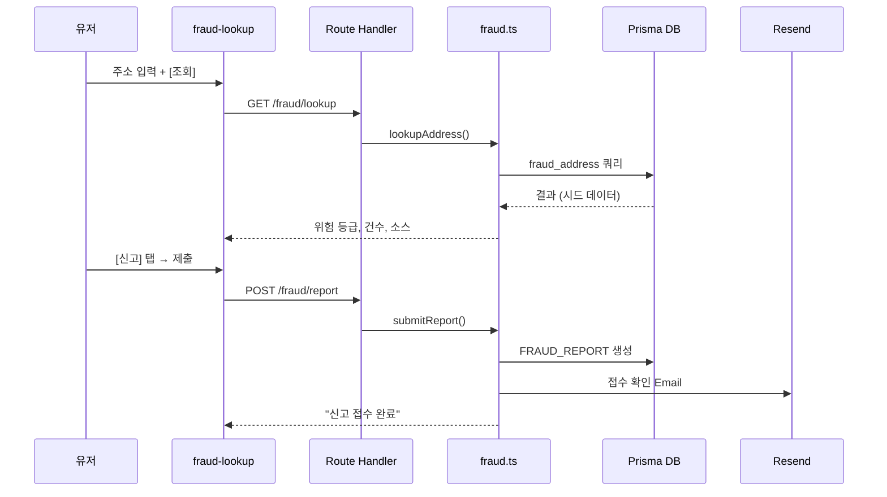
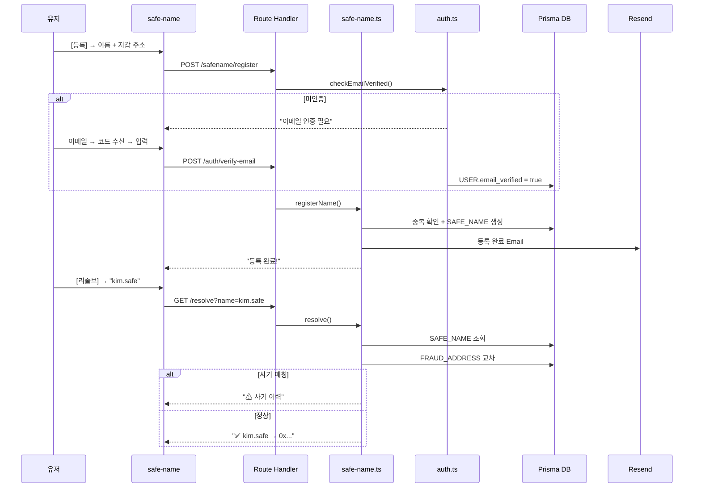
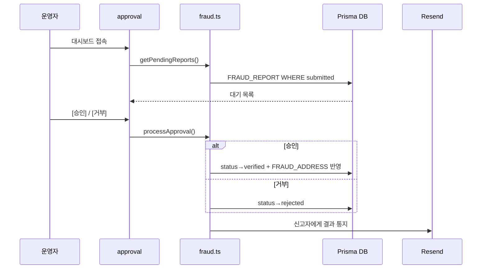
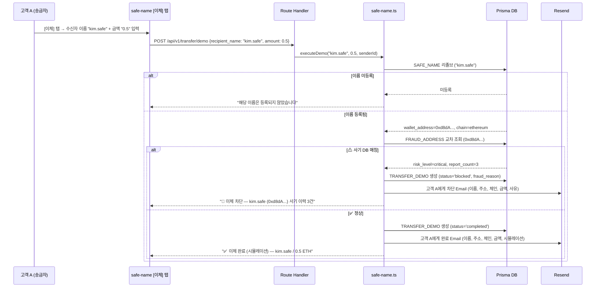
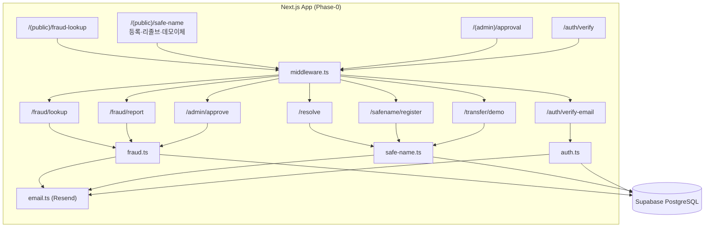

# Product Requirements Document (PRD)

**Document ID:** PRD-003  
**Version:** 0.3  
**Date:** 2026-05-14  
**Base Document:** SRS-001 v0.5 (2026-05-09)  
**변경 이력:**
- v0.1~v0.2: 초기 PRD (REF-01) 및 품질 리뷰 (REF-02) 반영
- **v0.3: SRS v0.5 기반 전면 재작업 — Phase 기반 점진적 구현 전략 반영, 전체 요구사항 4개 Phase 계층화, Phase-0 Actionable MVP 정의, 데모 이체 시뮬레이션 추가, 기술 스택·데이터 모델·API·비용·검증 계획 전체 통합**

---

## 1. 제품 개요 (Product Overview)

### 1.1 제품명

**온체인 사기 방지 플랫폼 (On-Chain Fraud Shield Platform)**

### 1.2 한 줄 비전

> *"수만 건의 오송금 민원과 오탐지를 해결하고, 사람이 읽을 수 있는 이름 기반 안전 거래와 실시간 사기 주소 필터링, 그리고 에러 시 100% 현금 보상을 보장하는 온체인 사기 방지 플랫폼"*

### 1.3 핵심 이체 원칙 (Phase-2 이후 적용)

고객은 Safe-Name Credential(이름↔주소 매핑)을 기반으로 **"이름"과 "금액"만 입력**하여 이체한다. 시스템은 credential을 자동 리졸브하여 사기 주소를 검증하고, 체인·자산을 자동 결정하며, 사기 주소 시 강제 차단(Hard Block)하고 양측에 통지한다.

### 1.4 해결 대상 문제

| Pain ID | 문제 요약 | 실패 KPI (현 상태) | Phase-0 대응 |
|---|---|---|---|
| CORE-1 | 과도한 오탐지로 VASP VIP 정상 출금 차단 및 CS 마비 | 오탐지 CS 처리 지연율 ≥ 80% | Phase-1 |
| CORE-2 | 사람이 인식 불가능한 온체인 주소 구조 — 오송금·피싱 취약 | 주소 기반 오송금 민원 월 15,000~30,000건 | **✅ Phase-0** |
| CORE-3 | 퍼블릭 SaaS 망 의존으로 TradFi 인가 탈락 위기 | TradFi 망분리 심사 탈락률 100% | Phase-3 |
| CJM-1 | 구제/보상 수단이 없는 100% 면책 조항 | 스캠 피해 보상률 0% | Phase-3 |
| CJM-2 | 사기 주소 신고 접점 부재 | 신고 플랫폼 접근율 ≤ 5% | **✅ Phase-0** |
| EXT-1 | 지속되는 해킹 공포 / 무보증 트라우마 | 서비스 잔존율 ≤ 10% | Phase-3 |
| EXT-2 | 기관의 외부 사기정보 수집 역량 부재 | 자체 DB 커버리지 ≤ 30% | **✅ Phase-0** |

---

## 2. Phase 로드맵 (Phase Roadmap)

### 2.1 Phase 정의

| Phase | 명칭 | 기간 | 핵심 목표 | 월 비용 |
|---|---|---|---|---|
| **Phase-0** | **Actionable MVP** | **2~4주** | **사기 주소 조회·신고 + Safe-Name 등록·리졸브 + 운영자 승인 + 데모 이체 시뮬레이션** | **$0~$21** |
| Phase-1 | Extended MVP | 4~6주 | 핫라인, 이의 신청, DNS 비용 모델, 멀티채널 알림, Fraud Agent | ~$71 |
| Phase-2 | Full MVP | 6~8주 | Zero-FP API, NRM 외부 네이밍, KYC Tier, Pre-Transfer | ~$300~$500 |
| Phase-3 | Production Ready | 8~12주 | Warranty 온체인, 일회용 주소, LLM 통합 | ~$500~$1,000 |

### 2.2 Phase-0 기술 규모

| 항목 | Phase-0 | 전체(North Star) | 축소율 |
|---|---|---|---|
| Functional Requirements | 7건(19 REQ) | 71건 | 90% |
| Non-Functional Requirements | 10건 | 59건 | 83% |
| Prisma 모델 | 6종 | 21종 | 71% |
| API Route Handlers | 7개 | 25개 | 72% |
| Service Modules | 3개 | 16개 | 81% |
| 프론트엔드 페이지 | 4개 | 10개 | 60% |
| 외부 연동 | 3종 | 20종 | 85% |

### 2.3 Phase-0 설계 원칙

| # | 원칙 | 설명 |
|---|---|---|
| P1 | **항상 Simulation** | `if (simulationMode)` 분기 금지. 모든 코드가 시뮬레이션 전제 |
| P2 | **외부 연동 최소화** | Mock 모듈 구현 금지. 시드 데이터(정적)로 대체 |
| P3 | **단일 인증** | Admin 비밀번호 + 이메일 인증만. JWT/RBAC 없음 |
| P4 | **단일 알림** | Email(Resend) 단일. Slack/KakaoTalk/SMS는 Phase-1+ |
| P5 | **CRUD 중심** | Strategy/Adapter 패턴 없음. 직선적 CRUD |

---

## 3. 타겟 사용자 및 이해관계자 (Stakeholders)

### 3.1 Tier-1: 고객

| 역할 | 페르소나 | 책임 | Phase |
|---|---|---|---|
| 일반 유저 (C2) | 이지은 — 송금 입문자 | 사기 조회, Safe-Name 등록·리졸브, 신고 | **Phase-0** |
| 크립토 포비아 (E1) | 오재민 — 스캠 피해자 | Warranty 구독, 클레임 | Phase-3 |

### 3.2 Tier-2: 이용기관

| 역할 | 페르소나 | 책임 | Phase |
|---|---|---|---|
| VASP CISO (C1) | 김철수 — 거래소 보안책임자 | Zero-FP API, 핫라인, Fraud Agent | Phase-1/2 |
| TradFi IT팀장 (C3) | 최수영 — STO 인프라팀 | On-Premise ZK | Phase-3 |

### 3.3 Tier-3: 운영기관

| 역할 | 페르소나 | 책임 | Phase |
|---|---|---|---|
| 운영자 (O1) | 박운영 | 시스템 관리, SLA. **Phase-0: 신고 승인** | **Phase-0** |
| 컴플라이언스 (O2) | 한규정 | 이의 심사, 오등록 판정 | Phase-1 |
| Data QA (O3) | 정데이터 | DB 커버리지·품질 | Phase-1 |

### 3.4 배제 타겟

N1 은행, N2 맥시멀리스트 — MVP 리소스 투입 전면 금지.

---

## 4. 제품 범위 (Product Scope)

### 4.1 Phase-0 In-Scope (즉시 구현)

| # | 기능 | 사용자 가치 | 복잡도 |
|---|---|---|---|
| **P0-1** | **사기 주소 조회** | 즉각적 안전 확인 (CJM-2) | 낮음 |
| **P0-2** | **사기 주소 신고** | 신고 채널 확보 (CJM-2) | 낮음 |
| **P0-3** | **Safe-Name 등록** | 이름 기반 주소 (CORE-2) | 중간 |
| **P0-4** | **Safe-Name 리졸브** | 안전 주소 변환 (CORE-2) | 중간 |
| **P0-5** | **운영자 승인 대시보드** | 데이터 품질 관리 (EXT-2) | 낮음 |
| **P0-6** | **데모 이체 시뮬레이션** — 이름+금액 입력 → 사기 검증 → 이체 완료/차단 → Email 통지. 실제 온체인 이체 없음(DB 상태 전환) | 핵심 UX 전체 플로우 시연 (CORE-2, CJM-2) | 낮음 |

### 4.2 Phase-1~3 In-Scope

| Phase | # | 범위 |
|---|---|---|
| Phase-1 | IS-2 | 핫라인 SLA 대시보드 |
| Phase-1 | IS-7 | 이의 신청·심사·해제 |
| Phase-1 | IS-4+ | DNS식 비용 모델 + 생명주기 |
| Phase-1 | IS-10 | 통합 알림 게이트웨이 (멀티채널) |
| Phase-1 | IS-6B | Fraud Agent + 승인 워크플로우 |
| Phase-2 | IS-1 | Zero-FP API 엔진 |
| Phase-2 | IS-8 | NRM (ENS, Unstoppable, SpaceID, Bonfida) |
| Phase-2 | IS-4D | KYC Tier + Pre-Transfer + Auto-Select |
| Phase-2 | IS-11 | 관리 콘솔 5종 |
| Phase-2 | IS-12 | Simulation↔Production 모드 전환 |
| Phase-3 | IS-5 | Warranty (오프체인→온체인) |
| Phase-3 | IS-4F | 일회용 주소 (HD Wallet + 포워딩) |
| Phase-3 | IS-LLM | LLM 통합 (Vercel AI SDK + Gemini) |

### 4.3 Out-of-Scope

| # | 배제 항목 | 사유 |
|---|---|---|
| OS-1 | 거래소 매칭 엔진 수정 | VASP 비개입 원칙 |
| OS-2 | DApp 스마트 컨트랙트 보안 감사 | 범위 초과 |
| OS-3 | 개인지갑 앱 출시 | B2B 집중 |
| OS-4 | AI 투자 추천 | 데이터 편향 위험 |
| OS-5 | 커뮤니티/리뷰 게시판 | 어뷰징 위험 |
| OS-6 | 전체 L1/L2 체인 커버리지 | MVP 초과 |
| OS-7 | 금융결제원 금융공동망 전문 | 향후 검토 |
| OS-8 | 금융결제원 OPEN API·ISO 20022 | 향후 별도 |
| OS-9 | 마이크로서비스, 별도 백엔드 | 단일 풀스택 정책 |
| OS-10 | 스마트 컨트랙트 실배포 (NFT, 보증풀) | Phase-3에서 추진 |
| OS-11 | HD Wallet + Relayer 상시 프로세스 | Serverless 비호환 |

---

## 5. 기능 요구사항 (Functional Requirements)

### 5.1 Phase-0 기능 요구사항 (즉시 구현 — 7건 19 REQ)

#### 5.1.1 P0-F1. 사기 주소 조회

| ID | 요구사항 | Priority | Acceptance Criteria |
|---|---|---|---|
| REQ-P0-001 | 주소+체인 입력 → 사기 DB 매칭·위험 등급·건수 조회 | Must | ≤ 2초(p95), 정확도 100% |
| REQ-P0-002 | 조회 결과에 데이터 출처 표시 | Must | 출처 정확도 100% |

#### 5.1.2 P0-F2. 사기 주소 신고

| ID | 요구사항 | Priority | Acceptance Criteria |
|---|---|---|---|
| REQ-P0-003 | 이메일 인증 유저가 주소·체인·피해내역(10자+)·증빙 URL 제출 → 접수 ID 반환 | Must | ≤ 3초 |
| REQ-P0-004 | 동일 주소 중복 신고 시 건수 누적 + 안내 | Must | 중복 감지 100% |
| REQ-P0-005 | 접수 시 Email 확인 발송 | Must | 성공률 ≥ 95% |

#### 5.1.3 P0-F3. Safe-Name 등록

| ID | 요구사항 | Priority | Acceptance Criteria |
|---|---|---|---|
| REQ-P0-006 | 이메일 인증 유저가 이름(.safe)+지갑주소+체인 → 오프체인 등록 | Must | ≤ 3초, 중복 거부 |
| REQ-P0-007 | 이름: 영소문자·숫자·하이픈, 3~20자, 중복·예약어 거부 | Must | 검사 100% |

#### 5.1.4 P0-F4. Safe-Name 리졸브 + 사기 DB 교차

| ID | 요구사항 | Priority | Acceptance Criteria |
|---|---|---|---|
| REQ-P0-008 | Safe-Name 입력 → 매핑 주소 반환 | Must | ≤ 500ms(p95) |
| REQ-P0-009 | 리졸브 주소를 사기 DB 자동 교차 + 결과 표시 | Must | 정확도 100% |
| REQ-P0-010 | 미등록·만료 이름 안내 메시지 | Must | 안내 100% |

#### 5.1.5 P0-F5. 운영자 신고 승인

| ID | 요구사항 | Priority | Acceptance Criteria |
|---|---|---|---|
| REQ-P0-011 | Admin 인증 운영자가 대기 신고 목록 조회 | Must | 로드 ≤ 3초 |
| REQ-P0-012 | 건별 승인/거부. 승인 시 FRAUD_ADDRESS 자동 반영 | Must | 반영 100% |
| REQ-P0-013 | 결과 Email 통지 | Must | 성공률 ≥ 95% |

#### 5.1.6 P0-F6. 이메일 인증

| ID | 요구사항 | Priority | Acceptance Criteria |
|---|---|---|---|
| REQ-P0-014 | 이메일 → 6자리 코드 발송. 유효 10분 | Must | 발송 ≤ 5초 |
| REQ-P0-015 | 코드 확인 → USER 생성/갱신 + 인증 완료 | Must | DB 반영 100% |

#### 5.1.7 P0-F7. 데모 이체 시뮬레이션 (v0.5 신규)

| ID | 요구사항 | Priority | Acceptance Criteria |
|---|---|---|---|
| REQ-P0-016 | 이메일 인증된 고객 A가 수신자 Safe-Name과 송금액(숫자)을 입력하면, 시스템이 Safe-Name을 자동 리졸브(주소+체인)하고 사기 DB를 교차 검증한 뒤, 검증 결과에 따라 이체 완료 또는 차단 상태의 TRANSFER_DEMO 레코드를 생성해야 한다. 실제 온체인 이체는 수행하지 않는다(DB 상태 전환만) | Must | 전체 플로우 응답 ≤ 3초. 리졸브+사기검증+DB저장 정확도 100% |
| REQ-P0-017 | 사기 DB에 등록된 주소로 리졸브된 경우, 이체를 즉시 중단(status='blocked')하고 사유(위험 등급, 신고 건수)를 화면에 표시해야 한다 | Must | 차단 정확도 100%. 사유 표시 정확도 100% |
| REQ-P0-018 | 사기 DB 미등록(정상) 주소로 리졸브된 경우, 이체 완료(status='completed') 레코드를 생성하고 "이체 완료 (시뮬레이션)" 결과를 화면에 표시해야 한다 | Must | 상태 전환 정확도 100% |
| REQ-P0-019 | 이체 완료/차단 결과를 고객 A에게 Email로 통지해야 한다. Email에는 수신자 이름, 리졸브된 주소, 체인, 금액, 결과(완료/차단), 사유(차단 시)를 포함한다 | Must | Email 발송 성공률 ≥ 95%. 내용 정확도 100% |

### 5.2 Phase-1 기능 요구사항

| ID | 요구사항 | Priority | Acceptance Criteria |
|---|---|---|---|
| REQ-FUNC-006 | CS 접수 시 CISO 선호 채널 알림 발송 | Must | ≤ 2초 |
| REQ-FUNC-007 | CISO 서명 시 거래 락 해제 | Must | ≤ 1초 |
| REQ-FUNC-008 | 8분 미처리 → PagerDuty + 긴급 채널 | Must | 경보 누락 0% |
| REQ-FUNC-032 | 주소 소유자 이의 신청 + 소유권 증명 | Must | ≤ 3초 |
| REQ-FUNC-033 | 48시간 심사 완료 + 결과 통지 | Must | SLA ≥ 95% |
| REQ-FUNC-034 | 이의 인용 시 즉시 해제 + 신고자 통지 | Should | 정확도 ≥ 98% |
| REQ-FUNC-037 | 오프체인 등록 + DNS 연간 등록비 | Must | ≤ 3초 |
| REQ-FUNC-038 | 배치 등록 | Should | 50건 ≤ 30초 |
| REQ-FUNC-043 | DNS 생명주기 상태 전환 (Cron) | Must | 정확도 100% |
| REQ-FUNC-044 | DNS 비용 모델 ($5/년, 프리미엄 $50/년) | Must | 정확도 100% |
| REQ-FUNC-045 | 일 1회 Merkle Root L2 앵커링 (Cron+ethers.js) | Must | 가스비 ≤ $5 |
| REQ-FUNC-024 | 외부 소스 수집 + Staging + 승인 (Cron) | Must | 수집 주기 준수 |
| REQ-FUNC-025~027 | Agent 대시보드, 장애 처리 | Should | — |
| REQ-FUNC-031 | 소스 정책 변경 감지 + 자동 전환 | Must | ≤ 30일 |
| REQ-FUNC-051~052 | Staging 품질 검증 + 승인 대기열 | Must | 정확도 100% |
| REQ-FUNC-046 | 알림 채널 관리 (Slack+Email+KakaoTalk+SMS) | Must | 활성화 ≤ 30초 |
| REQ-FUNC-047 | Notification Preference 설정 | Must | 저장 100% |

### 5.3 Phase-2 기능 요구사항

| ID | 요구사항 | Priority | Acceptance Criteria |
|---|---|---|---|
| REQ-FUNC-001 | VASP 검증 요청 → Risk Score 응답 | Must | p95 ≤ 500ms |
| REQ-FUNC-002 | 오탐지율 ≤ 0.01% | Must | — |
| REQ-FUNC-003 | 사기 주소 5분 내 반영 | Must | — |
| REQ-FUNC-004 | RPC 타임아웃 시 캐시 바이패스 | Must | — |
| REQ-FUNC-005 | 미지원 체인 안내 + 지원 요청 | Must | — |
| REQ-FUNC-035 | NRM Unified Resolve (Strategy 패턴) | Must | p95 ≤ 2,000ms |
| REQ-FUNC-036 | 외부 이름 Import | Should | — |
| REQ-FUNC-041 | NRM 어댑터 DB 등록 | Must | 활성화 ≤ 30초 |
| REQ-FUNC-042 | 어댑터 Health Check (Cron 5분) | Should | — |
| REQ-FUNC-053~061 | KYC Tier 4단계, Pre-Transfer, Compatibility, Verified 배지 | Must/Should | 정확도 100% |
| REQ-FUNC-062 | 이체 결과 양측 통지 | Must | ≤ 5초 |
| REQ-FUNC-063 | Chain-Asset Auto-Select | Must | 정확도 100% |
| REQ-FUNC-064 | Hard Block 차단 통지 | Must | 정확도 100% |
| REQ-FUNC-048 | 관리 콘솔 5종 (라우트 그룹 + RBAC) | Must | 로드 ≤ 3초 |
| REQ-FUNC-049 | Simulation↔Production 전환 | Must | ≤ 5분 |
| REQ-FUNC-050 | 시드 데이터 (Prisma seed) | Must | ≤ 30초 |

### 5.4 Phase-3 기능 요구사항

| ID | 요구사항 | Priority | Acceptance Criteria |
|---|---|---|---|
| REQ-FUNC-018 | Warranty 팝업 (DB → 컨트랙트) | Must | ≤ 500ms |
| REQ-FUNC-019 | 보험 증서 (DB → NFT 민팅) | Must | 실패율 < 0.1% |
| REQ-FUNC-020 | 보상금 릴리즈 (DB → 컨트랙트 자동) | Must | 정확도 100% |
| REQ-FUNC-021~023 | 잔고 부족 중단, 증빙 미충족, 수동 폴백 | Must | — |
| REQ-FUNC-065 | 일회용 주소 (UUID → HD Wallet BIP-44) | Must | ≤ 300ms, 고유 100% |
| REQ-FUNC-066 | 포워딩 (DB → Relayer) | Must | 성공률 ≥ 99.9% |
| REQ-FUNC-067~069 | 생명주기, UX 투명, GC | Must/Should | — |
| REQ-FUNC-028~030 | On-Premise ZK 모듈 | Should | — |
| REQ-FUNC-070 | LLM 신고 자동 분류 | Could | 정확도 ≥ 80% |
| REQ-FUNC-071 | AI 어시스턴트 (OC-1) | Could | 응답 ≤ 10초 |

---

## 6. 비기능 요구사항 (Non-Functional Requirements)

### 6.1 Phase-0 비기능 요구사항 (10건)

| ID | 카테고리 | 요구사항 | 기준 |
|---|---|---|---|
| REQ-P0-NF-001 | 성능 | 사기 조회 응답 | p95 ≤ 2,000ms |
| REQ-P0-NF-002 | 성능 | 리졸브 응답 | p95 ≤ 500ms |
| REQ-P0-NF-003 | 성능 | 등록 응답 | p95 ≤ 3,000ms |
| REQ-P0-NF-004 | 신뢰성 | 가용성 | ≥ 99.0% |
| REQ-P0-NF-005 | 신뢰성 | 시드 정합성 | 100건 정확도 100% |
| REQ-P0-NF-006 | 보안 | HTTPS | TLS 1.2+ |
| REQ-P0-NF-007 | 보안 | Admin 인증 | 미인증 차단 100% |
| REQ-P0-NF-008 | 비용 | 월 인프라 | ≤ $21 |
| REQ-P0-NF-009 | 확장성 | 시드 수용 | 100+20+500건 |
| REQ-P0-NF-010 | 유지보수 | 로그 | Vercel Logs 추적 가능 |

### 6.2 Phase-1~3 비기능 요구사항

#### 성능

| ID | 요구사항 | 기준 | Phase |
|---|---|---|---|
| REQ-NF-001 | Zero-FP 응답 | Sim p95≤500ms, Prod p95≤300ms | 2 |
| REQ-NF-004 | Warranty 팝업 렌더링 | p95 ≤ 500ms | 3 |
| REQ-NF-005 | 알림 발송 | p95 ≤ 5,000ms | 1 |
| REQ-NF-006 | Fraud Agent 로드 | p95 ≤ 3,000ms | 1 |
| REQ-NF-007 | Zero-FP TPS | MVP 100, Prod 1,000 | 2 |
| REQ-NF-008 | B2C 동시접속 | 100(피크200) | 1 |
| REQ-NF-009 | 부하 테스트 | 출시전+분기1회 | 1 |

#### 신뢰성

| ID | 요구사항 | 기준 | Phase |
|---|---|---|---|
| REQ-NF-010 | 가용성 | MVP≥99.9%, Prod≥99.95% | 1 |
| REQ-NF-011 | 오탐지율(FP Rate) | ≤ 0.01% (Zero-FP API) | 2 |
| REQ-NF-012 | 핫라인 SLA — 오탐지 CS 처리 시간 | ≤ 10분 (p95). 8분 미처리 시 PagerDuty 자동 경보 | 1 |
| REQ-NF-013 | Warranty 보상 SLA — 클레임 접수→보상 완료 | ≤ 24시간 (정상 케이스) | 3 |
| REQ-NF-014 | 사기 DB 정합성 — 외부 소스와 내부 DB 불일치율 | ≤ 0.1% | 1 |
| REQ-NF-015 | 사기 주소 신고 처리 SLA — 신고 접수→검증 완료 | ≤ 24시간 (1차 검증) | 1 |
| REQ-NF-016 | 체인·자산 레지스트리 정합성 — 월 1회 검증 | 불일치 0건 | 2 |
| REQ-NF-017 | 백업 | Supabase Pro 일1회, RPO≤24h | 1 |
| REQ-NF-018 | DB 갱신 반영 | ≤ 5분 | 1 |

#### 보안

| ID | 요구사항 | 기준 | Phase |
|---|---|---|---|
| REQ-NF-019 | 로직 은닉 | 클라이언트 노출 0% | 2 |
| REQ-NF-021 | 사기 주소 신고 익명화 — 신고자 개인정보가 피신고자에게 노출되지 않아야 함 | 노출 0건 | 1 |
| REQ-NF-022 | VASP API 인증 — API Key 기반 인증 + 요청별 서명 검증 | 미인증 접근 차단 100% | 2 |

#### 비용·투명성·확장성·유지보수

| ID | 요구사항 | 기준 | Phase |
|---|---|---|---|
| REQ-NF-023 | RPC 비용 | Sim $0, Prod≤$500/월 | 2 |
| REQ-NF-024 | 인프라 비용 | P0≤$21, P1≤$100, Prod≤$500 | 0~ |
| REQ-NF-025 | 보증풀 투명성 | MVP:대시보드, Prod:온체인 | 3 |
| REQ-NF-027 | 수평 확장 | Vercel 자동 스케일 | 1 |
| REQ-NF-028 | 사기DB 용량 | 1M건+2초 조회 | 1 |
| REQ-NF-029 | 로그 | Vercel+Supabase+AUDIT_LOG | 1 |
| REQ-NF-030 | 운영 대시보드 | OC-5 자체 (shadcn) | 2 |

#### 추가 NFR (Phase-1~3)

| ID | 요구사항 | Phase |
|---|---|---|
| REQ-NF-037 | Safe-Name 등록 p95≤3,000ms | 0(P0-NF-003) |
| REQ-NF-039 | NRM p95≤2,000ms | 2 |
| REQ-NF-040 | 알림 성공률 ≥99.5% | 1 |
| REQ-NF-041 | 모드 전환 ≤5분, 중단0초 | 2 |
| REQ-NF-042 | 앵커링 가스비 L2≤$5 | 1 |
| REQ-NF-043~044 | Pre-Transfer p95≤1,000ms, 차단100% | 2 |
| REQ-NF-045~047 | KYC 검증 시간/정확도 | 2 |
| REQ-NF-048 | Auto-Select p95≤500ms | 2 |
| REQ-NF-049~052 | 양측 통지, Hard Block, 미지원체인 | 2~3 |
| REQ-NF-053 | 일회용 주소 p95≤300ms | 3 |
| REQ-NF-054~056 | 포워딩 시간/성공률/가스비 | 3 |
| REQ-NF-057 | 주소 고유성 0중복 | 3 |
| REQ-NF-058~059 | KMS 감사/Zero-Copy | 3 |

---

## 7. 사용자 플로우 및 인터랙션 (User Flows & Interactions)

### 7.1 Phase-0 페이지 구성

| # | 라우트 | 기능 | 복잡도 |
|---|---|---|---|
| 1 | `/(public)/fraud-lookup` | 사기 주소 조회 + 신고 | 낮음 |
| 2 | `/(public)/safe-name` | 이름 등록 + 리졸브 + **데모 이체** (탭 전환) | 중간 |
| 3 | `/(admin)/approval` | 신고 승인 대시보드 | 낮음 |
| 4 | `/auth/verify` | 이메일 인증 | 낮음 |

### 7.2 Phase-1~3 추가 페이지

| Phase | 라우트 | 기능 |
|---|---|---|
| 1 | `/(dashboard)/hotline` | 핫라인 SLA |
| 1 | `/(dashboard)/fraud-agent` | Fraud Agent |
| 1 | `/(admin)/dispute` | 이의 심사 |
| 2 | `/(admin)/oc-1`~`oc-5` | 관리 콘솔 5종 |
| 3 | `/(public)/warranty` | Warranty 위젯 |

### 7.3 Phase-0 인터랙션 시퀀스

#### 7.3.1 사기 주소 조회 + 신고



#### 7.3.2 Safe-Name 등록 + 리졸브



#### 7.3.3 운영자 신고 승인



#### 7.3.4 데모 이체 시뮬레이션 (이름+금액 → 검증 → 완료/차단 → 통지)



### 7.4 Phase-0 컴포넌트 다이어그램



---

## 8. 기술 아키텍처 (Technical Architecture)

### 8.1 기술 스택 제약

| ID | 제약 | Phase | 비고 |
|---|---|---|---|
| C-TEC-001 | Next.js App Router 단일 풀스택 | Phase-0~ | — |
| C-TEC-002 | Server Actions / Route Handlers | Phase-0~ | — |
| C-TEC-003 | Prisma + SQLite(로컬) / Supabase(배포) | Phase-0~ | Phase-0: Free(500MB) |
| C-TEC-004 | Tailwind CSS + shadcn/ui | Phase-0~ | — |
| C-TEC-005 | Vercel AI SDK | Phase-3 | Phase-0 제외 |
| C-TEC-006 | Google Gemini API | Phase-3 | Phase-0 제외 |
| C-TEC-007 | Vercel 배포 (Git Push) | Phase-0~ | Phase-0: Hobby/Pro |
| C-TEC-008 | Serverless Timeout 60초 | Phase-1~ | Phase-0 Cron 미사용 |
| C-TEC-009 | Cron Jobs 60초 제한 | Phase-1~ | Phase-0 Cron 미사용 |
| C-TEC-010 | SQLite→PostgreSQL 마이그레이션 | Phase-1~ | — |

### 8.2 Phase-0 전용 제약

| ID | 제약 | 유형 |
|---|---|---|
| C-P0-001 | 항상 Simulation. if 분기 금지 | 정책 |
| C-P0-002 | Mock 모듈 금지. 시드 데이터만 | 정책 |
| C-P0-003 | Admin PW + 이메일 인증만. JWT/RBAC 없음 | 정책 |
| C-P0-004 | Email(Resend Free) 단일 채널 | 정책 |
| C-P0-005 | KYC = 이메일 인증. 외부 KYC 없음 | 정책 |
| C-P0-006 | ethers.js 미사용. 블록체인 연동 없음 | 정책 |

### 8.3 외부 시스템 연동

| 시스템 | 유형 | 역할 | 비용 | Phase |
|---|---|---|---|---|
| **Vercel** | 배포 | 호스팅, Edge, Serverless, Cron | $0~$20/월 | **Phase-0** |
| **Supabase** | DBaaS | PostgreSQL 호스팅 | $0~$25/월 | **Phase-0** |
| **Resend** | Email API | 알림, 인증 | $0~$20/월 | **Phase-0** |
| Slack API | Webhook | 기관 알림 | 무상 | Phase-1 |
| PagerDuty | SaaS | SLA 에스컬레이션 | $0~$21/월 | Phase-1 |
| Etherscan Labels | REST | 주소 레이블 (무상 1순위) | 무상 | Phase-1 |
| MistTrack | REST | 자금 추적 (무상 2순위) | 무상 | Phase-1 |
| ScamSniffer | REST | 피싱 주소 (무상 3순위) | 무상 | Phase-1 |
| OFAC SDN | REST | 제재 목록 | 무상 | Phase-1 |
| KakaoTalk 알림톡 | REST | 한국 알림 | 건당 ₩8~15 | Phase-1+ |
| SMS Gateway | REST | 긴급 폴백 | 건당 ₩20~50 | Phase-1+ |
| ENS | Contract/Subgraph | .eth 리졸브 | L1 가스비 | Phase-2 |
| Unstoppable Domains | REST | .crypto 리졸브 | 무상 | Phase-2 |
| SpaceID | REST/Contract | .bnb 리졸브 | 무상 | Phase-2 |
| Bonfida | REST | .sol 리졸브 | 무상 | Phase-2 |
| 외부 RPC (Alchemy) | REST/RPC | 블록 데이터 | $49~$199/월 | Phase-2 |
| KYC Provider | REST | 신원 검증 | 건당 $1~5 | Phase-2 |
| Chainalysis | REST | 주소 위험 등급 | 수천$/월 | Phase-2+ |
| Gemini API | REST | LLM 추론 | 종량제 | Phase-3 |
| Blockchain | P2P | 앵커링, 컨트랙트 | 가스비 | Phase-2+ |

### 8.4 API 엔드포인트 목록

#### Phase-0 (7개)

| # | Endpoint | Method | 인증 | Rate Limit |
|---|---|---|---|---|
| P0-A1 | `/api/v1/fraud/lookup` | GET | Public | IP 100/min |
| P0-A2 | `/api/v1/fraud/report` | POST | Email인증 | 유저 10/day |
| P0-A3 | `/api/v1/resolve` | GET | Public | IP 200/min |
| P0-A4 | `/api/v1/safename/register` | POST | Email인증 | 유저 5/day |
| P0-A5 | `/api/v1/admin/approve` | POST | Admin PW | 50/day |
| P0-A6 | `/api/v1/auth/verify-email` | POST | Public | IP 10/min |
| **P0-A7** | **`/api/v1/transfer/demo`** | **POST** | **Email인증** | **유저 20/day** |

#### Phase-1~3 추가 (19개)

| # | Endpoint | Method | Phase |
|---|---|---|---|
| A1 | `/api/v1/simulate` | POST | 2 |
| A2 | `/api/v1/override` | POST | 1 |
| A4-1 | `/api/v1/fraud/dispute` | POST | 1 |
| A4-2 | `/api/v1/fraud/dispute/{id}` | GET | 1 |
| A5-1 | `/api/v1/resolve/unified` | GET | 2 |
| A6-1 | `/api/v1/safename/register/batch` | POST | 1 |
| A6-2 | `/api/v1/safename/import` | POST | 2 |
| A6-3 | `/api/v1/safename/renew` | POST | 1 |
| A7 | `/api/v1/warranty/mint` | POST | 3 |
| A8 | `/api/v1/warranty/claim` | POST | 3 |
| A9 | `/api/v1/agent/intelligence` | GET | 1 |
| A10 | `/api/v1/hotline/tickets` | GET/POST | 1 |
| A14 | `/api/v1/notification/preference` | GET/PUT | 1 |
| A15 | `/api/v1/admin/operations` | POST | 2 |
| A16 | `/api/v1/admin/nrm/adapters` | CRUD | 2 |
| A17 | `/api/v1/kyc/verify` | POST | 2 |
| A19 | `/api/v1/transfer/verify` | POST | 2 |
| A20 | `/api/v1/chain-asset/registry` | GET | 2 |
| A24 | `/api/v1/disposable/forwarding-status` | GET | 3 |

### 8.5 Phase-0 프로젝트 구조

```
next-fraud-shield/
├── app/
│   ├── (public)/
│   │   ├── fraud-lookup/page.tsx
│   │   └── safe-name/page.tsx        ← 등록 + 리졸브 + 데모 이체 (탭)
│   ├── (admin)/approval/page.tsx
│   ├── auth/verify/page.tsx
│   ├── api/v1/
│   │   ├── fraud/lookup/route.ts
│   │   ├── fraud/report/route.ts
│   │   ├── resolve/route.ts
│   │   ├── safename/register/route.ts
│   │   ├── transfer/demo/route.ts    ← 데모 이체 시뮬레이션
│   │   ├── admin/approve/route.ts
│   │   └── auth/verify-email/route.ts
│   ├── layout.tsx
│   └── page.tsx
├── lib/
│   ├── services/
│   │   ├── fraud.ts
│   │   ├── safe-name.ts              ← executeDemo() 함수 포함
│   │   └── auth.ts
│   └── email.ts
├── prisma/
│   ├── schema.prisma                 ← 6 모델 (USER, SAFE_NAME, FRAUD_ADDRESS, FRAUD_REPORT, OPERATOR, TRANSFER_DEMO)
│   └── seed.ts
├── middleware.ts
├── .env.local
├── package.json
└── tailwind.config.ts
```

---

## 9. 데이터 모델 (Data Model)

### 9.1 Prisma 호환 규칙

| 항목 | SQLite | PostgreSQL | 대응 |
|---|---|---|---|
| JSON | String | 네이티브 | String+parse |
| Enum | String+앱검증 | 네이티브 | String |
| DateTime | TEXT | TIMESTAMPTZ | Prisma 변환 |
| PK | @default(uuid()) | 동일 | 동일 |

### 9.2 Phase-0 엔터티 (6종)

#### USER

| 필드 | 타입 | 제약 | 설명 |
|---|---|---|---|
| user_id | String | @id @default(uuid()) | PK |
| email | String | @@unique, NOT NULL | 이메일 |
| email_verified | Boolean | DEFAULT false | 인증 여부 |
| verification_code | String | NULLABLE | 6자리 코드 |
| verification_expires_at | DateTime | NULLABLE | 코드 만료 |
| false_report_count | Int | DEFAULT 0 | 허위 신고 수 |
| report_restriction_until | DateTime | NULLABLE | 제한 해제일 |
| created_at | DateTime | @default(now()) | 가입일 |

#### SAFE_NAME

| 필드 | 타입 | 제약 | 설명 |
|---|---|---|---|
| name_id | String | @id @default(uuid()) | PK |
| human_name | String | @@unique, NOT NULL | 이름 |
| chain | String | NOT NULL | 체인 |
| wallet_address | String | NOT NULL | 지갑 주소 |
| owner_id | String | FK→USER | 소유자 |
| status | String | DEFAULT 'active' | 상태 |
| registered_at | DateTime | @default(now()) | 등록일 |

**Phase-1+ 확장 필드 (SAFE_NAME):**

| 필드 | 타입 | 제약 | 설명 | Phase |
|---|---|---|---|---|
| expires_at | DateTime | NOT NULL | 만료 일시 | Phase-1 |
| last_renewed_at | DateTime | NULLABLE | 최종 갱신 일시 | Phase-1 |
| name_tier | String | NOT NULL, DEFAULT 'standard' | 이름 등급 (standard, premium) | Phase-1 |
| annual_fee_usd | Float | NOT NULL | 연간 등록비 (USD) | Phase-1 |
| external_name_source | String | NULLABLE | 외부 네이밍 소스 (ens, unstoppable 등) | Phase-2 |
| external_name | String | NULLABLE | Import된 외부 이름 | Phase-2 |
| registration_method | String | NOT NULL, DEFAULT 'offchain' | 등록 방식 (offchain, batch, import) | Phase-1 |
| kyc_tier | String | NOT NULL, DEFAULT 'tier_0' | KYC 검증 등급 (tier_0~3) | Phase-2 |
| kyc_verified_at | DateTime | NULLABLE | KYC 검증 완료 일시 | Phase-2 |
| kyc_provider | String | NULLABLE | KYC 검증 기관 | Phase-2 |
| kyc_expiry_at | DateTime | NULLABLE | KYC 만료 일시 (1년) | Phase-2 |
| verified_badge | Boolean | NOT NULL, DEFAULT false | Verified 배지 (Tier-2+) | Phase-2 |
| supported_chains | String | NOT NULL | 수신 가능 체인 (JSON String) | Phase-2 |
| supported_assets | String | NOT NULL | 수신 가능 자산 (JSON String) | Phase-2 |
| anchor_merkle_root | String | NULLABLE | 온체인 앵커링 Merkle Root | Phase-1 |
| anchor_tx_hash | String | NULLABLE | 온체인 앵커링 TX 해시 | Phase-1 |
| anchor_timestamp | DateTime | NULLABLE | 앵커링 일시 | Phase-1 |

#### FRAUD_ADDRESS

| 필드 | 타입 | 제약 | 설명 |
|---|---|---|---|
| fraud_id | String | @id @default(uuid()) | PK |
| chain | String | NOT NULL | 체인 |
| address | String | NOT NULL, @@index | 주소 |
| risk_level | String | NOT NULL | 등급 |
| report_count | Int | DEFAULT 0 | 신고 수 |
| source_type | String | NOT NULL | 소스 |
| first_reported_at | DateTime | NOT NULL | 최초 신고 |
| status | String | DEFAULT 'verified' | 상태 |
| created_at | DateTime | @default(now()) | 생성일 |

**Phase-1+ 확장 필드 (FRAUD_ADDRESS):**

| 필드 | 타입 | 제약 | 설명 | Phase |
|---|---|---|---|---|
| source_detail | String | NULLABLE | 소스 상세 정보 | Phase-1 |
| last_verified_at | DateTime | NULLABLE | 최종 검증 일시 | Phase-1 |
| approved_by | String | FK → OPERATOR, NULLABLE | DB 등록 승인자 | Phase-1 |
| approval_source | String | NULLABLE | 승인 방식 (auto_approved, manually_approved) | Phase-1 |

#### FRAUD_REPORT

| 필드 | 타입 | 제약 | 설명 |
|---|---|---|---|
| report_id | String | @id @default(uuid()) | PK |
| reporter_id | String | FK→USER | 신고자 |
| reported_address | String | NOT NULL | 대상 주소 |
| chain | String | NOT NULL | 체인 |
| description | String | NOT NULL | 피해 내역 |
| evidence_url | String | NULLABLE | 증빙 |
| status | String | DEFAULT 'submitted' | 상태 |
| reviewer_notes | String | NULLABLE | 운영자 코멘트 |
| reported_at | DateTime | @default(now()) | 신고일 |
| reviewed_at | DateTime | NULLABLE | 심사일 |

#### OPERATOR

| 필드 | 타입 | 제약 | 설명 |
|---|---|---|---|
| operator_id | String | @id @default(uuid()) | PK |
| name | String | NOT NULL | 이름 |
| email | String | @@unique | 이메일 |
| role | String | DEFAULT 'admin' | 역할 |
| created_at | DateTime | @default(now()) | 등록일 |

#### TRANSFER_DEMO (v0.5 신규 — 데모 이체 시뮬레이션)

| 필드 | 타입 | 제약 | 설명 |
|---|---|---|---|
| transfer_id | String | @id @default(uuid()) | 데모 이체 고유 ID |
| sender_id | String | FK → USER, NOT NULL | 송금자 |
| recipient_name | String | NOT NULL | 수신자 Safe-Name (입력값) |
| resolved_address | String | NULLABLE | 리졸브된 온체인 주소 (미등록 시 null) |
| chain | String | NULLABLE | 리졸브된 체인 |
| amount | Float | NOT NULL | 송금액 |
| fraud_status | String | NOT NULL | 사기 검증 결과 (clean, flagged) |
| fraud_detail | String | NULLABLE | 사기 상세 (risk_level, report_count 등 JSON String) |
| transfer_status | String | NOT NULL | 이체 결과 (completed, blocked, name_not_found) |
| notified_at | DateTime | NULLABLE | Email 통지 일시 |
| created_at | DateTime | NOT NULL, @default(now()) | 이체 요청 일시 |

> **Phase-2에서 이 테이블은 TRANSFER_VERIFICATION_LOG로 대체된다.** Phase-0의 TRANSFER_DEMO는 실제 온체인 이체 없이 UX 시연용으로만 사용되며, Phase-2 전환 시 마이그레이션 또는 병행 운영한다.

### 9.3 Phase-1 추가 엔터티 (6종)

#### FRAUD_DISPUTE [Phase-1]

| 필드 | 타입 | 제약 | 설명 |
|---|---|---|---|
| dispute_id | String | @id @default(uuid()) | 이의 신청 고유 ID |
| disputed_address | String | NOT NULL, @@index | 이의 대상 주소 |
| chain | String | NOT NULL | 체인 식별자 |
| disputant_id | String | FK → USER | 이의 신청자 |
| related_fraud_id | String | FK → FRAUD_ADDRESS | 연관 사기 주소 레코드 |
| related_report_id | String | FK → FRAUD_REPORT, NULLABLE | 연관 원 신고 레코드 |
| dispute_reason | String | NOT NULL, MIN 20자 | 이의 사유 상세 |
| evidence_hash | String | NOT NULL | 반박 증빙 해시 |
| owner_signature | String | NOT NULL | 주소 소유권 증명 서명 |
| status | String | NOT NULL | 상태 (submitted, reviewing, approved, rejected) |
| reviewer_notes | String | NULLABLE | 심사자 코멘트 |
| reviewer_id | String | FK → OPERATOR, NULLABLE | 심사 운영자 |
| submitted_at | DateTime | NOT NULL | 제출 일시 |
| reviewed_at | DateTime | NULLABLE | 심사 완료 일시 |
| next_dispute_eligible_at | DateTime | NULLABLE | 재이의 가능 일시 |

#### FRAUD_STAGING [Phase-1]

| 필드 | 타입 | 제약 | 설명 |
|---|---|---|---|
| staging_id | String | @id @default(uuid()) | 스테이징 고유 ID |
| chain | String | NOT NULL | 체인 식별자 |
| address | String | NOT NULL, @@index | 사기 의심 주소 |
| risk_level_suggested | String | NOT NULL | 추천 위험 등급 |
| source_type | String | NOT NULL | 수집 소스 |
| source_detail | String | NULLABLE | 소스 상세 |
| cross_source_count | Int | NOT NULL, DEFAULT 1 | 교차 확인 소스 수 |
| cross_source_list | String | NULLABLE | 교차 소스 목록 (JSON String) |
| quality_check_status | String | NOT NULL, DEFAULT 'pending' | 품질 검증 상태 |
| approval_status | String | NOT NULL, DEFAULT 'pending_approval' | 승인 상태 |
| approved_by | String | FK → OPERATOR, NULLABLE | 승인자 |
| approved_at | DateTime | NULLABLE | 승인 일시 |
| reject_reason | String | NULLABLE | 거부 사유 |
| collected_at | DateTime | NOT NULL | 수집 일시 |
| created_at | DateTime | NOT NULL | 적재 일시 |

#### HOTLINE_TICKET [Phase-1]

| 필드 | 타입 | 제약 | 설명 |
|---|---|---|---|
| ticket_id | String | @id @default(uuid()) | 티켓 고유 ID |
| vasp_id | String | FK → VASP | 요청 VASP |
| tx_hash | String | NOT NULL | 트랜잭션 해시 |
| description | String | NOT NULL | 이의 내용 |
| status | String | NOT NULL | 상태 (open, in_progress, resolved, escalated) |
| priority | String | NOT NULL | 우선순위 (normal, high, critical) |
| created_at | DateTime | NOT NULL | 접수 일시 |
| resolved_at | DateTime | NULLABLE | 해결 일시 |

#### NAMING_ADAPTER [Phase-1]

| 필드 | 타입 | 제약 | 설명 |
|---|---|---|---|
| adapter_id | String | @id @default(uuid()) | 어댑터 고유 ID |
| adapter_name | String | NOT NULL | 표시명 (예: "ENS Adapter") |
| tld_pattern | String | @@unique, NOT NULL | TLD 패턴 (예: ".eth") |
| chain_id | String | NOT NULL | 연동 체인 |
| resolve_endpoint | String | NOT NULL | 리졸브 API URL |
| resolve_method | String | NOT NULL | 방식 (rest_api, subgraph, smart_contract) |
| health_check_url | String | NOT NULL | Health Check URL |
| status | String | NOT NULL, DEFAULT 'active' | 상태 (active, degraded, inactive) |
| last_health_check_at | DateTime | NULLABLE | 최종 Health Check |
| consecutive_failures | Int | NOT NULL, DEFAULT 0 | 연속 실패 횟수 |
| created_at | DateTime | NOT NULL | 등록 일시 |
| updated_at | DateTime | NOT NULL | 수정 일시 |

#### NOTIFICATION_PREFERENCE [Phase-1]

| 필드 | 타입 | 제약 | 설명 |
|---|---|---|---|
| pref_id | String | @id @default(uuid()) | 선호도 고유 ID |
| entity_id | String | NOT NULL | 유저/기관 ID |
| entity_type | String | NOT NULL | 엔터티 유형 (user, vasp, operator) |
| alert_type | String | NOT NULL | 알림 유형 (urgent, normal, marketing) |
| channel_type | String | NOT NULL | 채널 유형 (slack, email, kakao, sms, push) |
| channel_config | String | NOT NULL | 채널 설정 (JSON String) |
| is_enabled | Boolean | NOT NULL, DEFAULT true | 활성화 여부 |
| created_at | DateTime | NOT NULL | 설정 일시 |
| updated_at | DateTime | NOT NULL | 수정 일시 |

#### FRAUD_INTELLIGENCE_SOURCE [Phase-1]

| 필드 | 타입 | 제약 | 설명 |
|---|---|---|---|
| source_id | String | @id @default(uuid()) | 소스 고유 ID |
| source_name | String | NOT NULL | 소스명 (Etherscan, MistTrack 등) |
| source_type | String | NOT NULL | 소스 유형 (free, paid, public) |
| api_endpoint | String | NOT NULL | API 엔드포인트 |
| api_key_env_var | String | NULLABLE | API 키 환경 변수명 |
| collection_schedule | String | NOT NULL | 수집 주기 (cron 표현식) |
| status | String | NOT NULL, DEFAULT 'active' | 상태 (active, inactive, error) |
| last_sync_at | DateTime | NULLABLE | 최종 동기화 일시 |
| last_error | String | NULLABLE | 최종 에러 메시지 |
| created_at | DateTime | NOT NULL | 등록 일시 |

### 9.4 Phase-2 추가 엔터티 (6종)

#### VASP [Phase-2]

| 필드 | 타입 | 제약 | 설명 |
|---|---|---|---|
| vasp_id | String | @id @default(uuid()) | VASP 고유 ID |
| company_name | String | NOT NULL | 회사명 |
| api_key | String | @@unique, NOT NULL | API 인증 키 |
| plan_type | String | NOT NULL | 요금제 유형 (Freemium, Enterprise) |

#### TX_SIMULATION_REQUEST [Phase-2]

| 필드 | 타입 | 제약 | 설명 |
|---|---|---|---|
| request_id | String | @id @default(uuid()) | 요청 고유 ID |
| vasp_id | String | FK → VASP | 요청 VASP |
| tx_hash | String | NOT NULL | 트랜잭션 해시 |
| sender_address | String | NOT NULL | 송신자 주소 |
| target_contract | String | NOT NULL | 대상 컨트랙트/주소 |
| value | Float | NOT NULL | 거래 금액 |
| req_timestamp | DateTime | NOT NULL | 요청 시각 |
| simulation_mode | Boolean | NOT NULL, DEFAULT false | Simulation Mode 여부 |

#### RISK_RESULT [Phase-2]

| 필드 | 타입 | 제약 | 설명 |
|---|---|---|---|
| result_id | String | @id @default(uuid()) | 결과 고유 ID |
| request_id | String | FK → TX_SIMULATION_REQUEST | 연결 요청 |
| is_safe | Boolean | NOT NULL | 안전 여부 |
| confidence_score | Int | NOT NULL, 0~100 | 신뢰도 점수 |
| threat_type | String | NULLABLE | 위협 유형 |
| latency_ms | Int | NOT NULL | 처리 소요 시간 (ms) |
| fraud_db_matched | Boolean | NOT NULL | 사기 DB 매칭 여부 |

#### KYC_VERIFICATION_LOG [Phase-2]

| 필드 | 타입 | 제약 | 설명 |
|---|---|---|---|
| verification_id | String | @id @default(uuid()) | 검증 레코드 ID |
| user_id | String | FK → USER, NOT NULL | 검증 대상 |
| name_id | String | FK → SAFE_NAME, NULLABLE | 연관 Safe-Name |
| tier_requested | String | NOT NULL | 요청 등급 (tier_1~3) |
| tier_granted | String | NULLABLE | 부여 등급 |
| provider | String | NOT NULL | 검증 기관 |
| status | String | NOT NULL, DEFAULT 'pending' | 상태 (pending, in_progress, approved, rejected, expired) |
| evidence_hash | String | NULLABLE | 증빙 해시 |
| rejection_reason | String | NULLABLE | 거부 사유 |
| verified_at | DateTime | NULLABLE | 검증 완료 |
| expires_at | DateTime | NULLABLE | 만료 (1년) |
| simulation_mode | Boolean | NOT NULL, DEFAULT false | Simulation 여부 |
| created_at | DateTime | NOT NULL | 요청 일시 |

#### CHAIN_ASSET_REGISTRY [Phase-2]

| 필드 | 타입 | 제약 | 설명 |
|---|---|---|---|
| registry_id | String | @id @default(uuid()) | 레코드 ID |
| chain_id | String | NOT NULL | 체인 식별자 |
| chain_name | String | NOT NULL | 체인 표시명 |
| asset_symbol | String | NOT NULL | 자산 심볼 (ETH, USDC 등) |
| asset_contract | String | NULLABLE | 토큰 컨트랙트 (네이티브=NULL) |
| asset_type | String | NOT NULL | 자산 유형 (native, erc20 등) |
| is_supported | Boolean | NOT NULL, DEFAULT true | 플랫폼 지원 여부 |
| is_default | Boolean | NOT NULL, DEFAULT false | 기본 선택 여부 |
| added_at | DateTime | NOT NULL | 등록 일시 |
| updated_at | DateTime | NOT NULL | 수정 일시 |

#### TRANSFER_VERIFICATION_LOG [Phase-2]

| 필드 | 타입 | 제약 | 설명 |
|---|---|---|---|
| log_id | String | @id @default(uuid()) | 검증 로그 ID |
| sender_name_id | String | FK → SAFE_NAME, NULLABLE | 송금자 Safe-Name |
| recipient_name_id | String | FK → SAFE_NAME | 수신자 Safe-Name |
| sender_kyc_tier | String | NOT NULL | 송금자 KYC 등급 |
| recipient_kyc_tier | String | NOT NULL | 수신자 KYC 등급 |
| asset_symbol | String | NOT NULL | 송금 자산 |
| chain_id | String | NOT NULL | 송금 체인 |
| amount | Float | NOT NULL | 금액 |
| chain_compatible | Boolean | NOT NULL | 체인 호환 결과 |
| asset_compatible | Boolean | NOT NULL | 자산 호환 결과 |
| fraud_db_status | String | NOT NULL | 사기 DB 상태 (clean, flagged, blocked) |
| enhanced_verification_required | Boolean | NOT NULL, DEFAULT false | Enhanced Verification 여부 |
| verification_result | String | NOT NULL | 최종 결과 |
| hard_blocked | Boolean | NOT NULL, DEFAULT false | 강제 차단 여부 |
| auto_selected_chain | String | NULLABLE | 자동 결정 체인 |
| auto_selected_asset | String | NULLABLE | 자동 결정 자산 |
| sender_notified_at | DateTime | NULLABLE | 송금자 통지 일시 |
| recipient_notified_at | DateTime | NULLABLE | 수신자 통지 일시 |
| disposable_address_id | String | FK → DISPOSABLE_ADDRESS, NULLABLE | 일회용 주소 ID |
| created_at | DateTime | NOT NULL | 검증 일시 |

### 9.5 Phase-3 추가 엔터티 (4종)

#### WARRANTY_POLICY [Phase-3]

| 필드 | 타입 | 제약 | 설명 |
|---|---|---|---|
| policy_id | String | @id @default(uuid()) | 보증 정책 ID |
| user_id | String | FK → USER | 가입자 |
| coverage_usd | Float | NOT NULL | 보장 금액 (USD) |
| premium_usd | Float | NOT NULL | 월 보험료 (USD) |
| nft_token_id | String | NULLABLE | NFT 토큰 ID (Production) |
| nft_contract_address | String | NULLABLE | NFT 컨트랙트 주소 |
| status | String | NOT NULL | 상태 (active, claimed, expired, cancelled) |
| started_at | DateTime | NOT NULL | 가입 일시 |
| expires_at | DateTime | NOT NULL | 만료 일시 |

#### WARRANTY_CLAIM [Phase-3]

| 필드 | 타입 | 제약 | 설명 |
|---|---|---|---|
| claim_id | String | @id @default(uuid()) | 클레임 ID |
| policy_id | String | FK → WARRANTY_POLICY | 연관 정책 |
| evidence_hash | String | NOT NULL | 증빙 해시 |
| claim_amount_usd | Float | NOT NULL | 청구 금액 |
| status | String | NOT NULL | 상태 (submitted, reviewing, approved, rejected, paid) |
| payout_tx_hash | String | NULLABLE | 보상 TX 해시 (Production) |
| submitted_at | DateTime | NOT NULL | 제출 일시 |
| resolved_at | DateTime | NULLABLE | 처리 완료 일시 |

#### DISPOSABLE_ADDRESS [Phase-3]

| 필드 | 타입 | 제약 | 설명 |
|---|---|---|---|
| disposable_id | String | @id @default(uuid()) | 일회용 주소 ID |
| recipient_name_id | String | FK → SAFE_NAME, NOT NULL | 수신자 Safe-Name |
| chain_id | String | NOT NULL | 체인 |
| asset_symbol | String | NOT NULL | 자산 |
| disposable_address | String | @@unique, NOT NULL | MVP: UUID Mock / Production: HD Wallet |
| permanent_address | String | NOT NULL | 수신자 영구 주소 |
| derivation_path | String | NULLABLE | HD Wallet BIP-44 경로 (MVP: null) |
| derivation_index | Int | NULLABLE | 파생 인덱스 (MVP: null) |
| status | String | NOT NULL, DEFAULT 'generated' | 상태 (generated, active, used, expired, expired_with_balance) |
| transfer_log_id | String | FK → TRANSFER_VERIFICATION_LOG, NULLABLE | 연관 이체 로그 |
| incoming_tx_hash | String | NULLABLE | 입금 TX |
| incoming_amount | Float | NULLABLE | 입금 금액 |
| incoming_at | DateTime | NULLABLE | 입금 확인 |
| forwarding_tx_hash | String | NULLABLE | 포워딩 TX |
| forwarding_gas_cost | Float | NULLABLE | 가스비 (USD) |
| forwarding_status | String | NULLABLE, DEFAULT 'pending' | 포워딩 상태 |
| forwarding_retry_count | Int | NOT NULL, DEFAULT 0 | 재시도 횟수 |
| forwarded_at | DateTime | NULLABLE | 포워딩 완료 |
| expires_at | DateTime | NOT NULL | 만료 (생성+24h) |
| simulation_mode | Boolean | NOT NULL, DEFAULT true | Simulation 여부 |
| created_at | DateTime | NOT NULL | 생성 일시 |
| updated_at | DateTime | NOT NULL | 상태 변경 일시 |

#### SIMULATION_CONFIG [Phase-3]

| 필드 | 타입 | 제약 | 설명 |
|---|---|---|---|
| config_id | String | @id @default(uuid()) | 설정 ID |
| current_mode | String | NOT NULL, DEFAULT 'simulation' | 모드 (simulation, production) |
| testnet_chain_ids | String | NOT NULL | 테스트넷 매핑 (JSON String) |
| mock_rpc_endpoint | String | NULLABLE | Mock RPC (MVP: null) |
| seed_data_version | String | NOT NULL | 시드 데이터 버전 |
| last_mode_change_at | DateTime | NULLABLE | 모드 전환 일시 |
| last_mode_change_by | String | NULLABLE | 전환 수행자 |
| production_checklist | String | NULLABLE | 전환 체크리스트 (JSON String) |
| vercel_env_synced | Boolean | NOT NULL, DEFAULT false | Vercel 환경변수 동기화 여부 |
| db_migration_status | String | NULLABLE | SQLite→PostgreSQL 마이그레이션 상태 |

### 9.6 엔터티 관계 (Entity Relationships)

**Phase-0:**
```
USER 1--* FRAUD_REPORT
USER 1--* SAFE_NAME
USER 1--* TRANSFER_DEMO (송금자)
FRAUD_REPORT *--1 FRAUD_ADDRESS (승인 시)
OPERATOR 1--* FRAUD_REPORT (심사)
TRANSFER_DEMO *--1 SAFE_NAME (리졸브 대상)
TRANSFER_DEMO *--0..1 FRAUD_ADDRESS (사기 검증 참조)
```

**Phase-1~3 추가:**
```
VASP 1--* TX_SIMULATION_REQUEST (Phase-2)
TX_SIMULATION_REQUEST 1--1 RISK_RESULT (Phase-2)
USER 1--* FRAUD_DISPUTE (Phase-1)
USER 1--* WARRANTY_POLICY (Phase-3)
SAFE_NAME 1--* TRANSFER_VERIFICATION_LOG (Phase-2)
SAFE_NAME 1--* DISPOSABLE_ADDRESS (Phase-3)
SAFE_NAME 1--* KYC_VERIFICATION_LOG (Phase-2)
WARRANTY_POLICY 1--* WARRANTY_CLAIM (Phase-3)
FRAUD_STAGING *--1 FRAUD_ADDRESS (Phase-1)
OPERATOR 1--* FRAUD_STAGING (Phase-1)
```

### 9.7 시드 데이터 (Phase-0)

| 엔터티 | 건수 | 설명 |
|---|---|---|
| FRAUD_ADDRESS | 100건 | 다양한 chain/risk_level, source_type='seed' |
| SAFE_NAME | 20건 | 테스트용 |
| USER | 5건 | email_verified=true |
| OPERATOR | 1건 | Admin |

---

## 10. 비즈니스·운영 제약 (Business & Operational Constraints)

| ID | 제약 | Phase | 유형 |
|---|---|---|---|
| CON-1 | 캐싱이 트래픽 90%+ 커버 | Phase-1~ | 가정 |
| CON-2 | 크립토 포비아 WTP 결제 전환 | Phase-3 | 가정 |
| CON-3 | 커뮤니티 신고 월 500건+ | Phase-0~ | 가정 |
| CON-4 | Safe-Name 유저 50%+ 이름 기반 송금 | Phase-2~ | 가정 |
| CON-5 | 외부 소스 API ≤ 15분 갱신 | Phase-1~ | 가정 |
| CON-6 | 보험사 제휴 MOU 런칭 전 | Phase-3 | 의존성 |
| CON-7 | Chainalysis/OFAC 정책 6개월 유지. 변경 시 30일 전환 | Phase-1~ | 의존성 |
| CON-8 | RPC 강세장 비용 폭증. Phase-0: $0 | Phase-2~ | 리스크 |
| CON-9 | 보증풀 유사수신 위험 | Phase-3 | 리스크 |
| CON-10 | 오등록 이의 48h 심사. 반복 오신고 90일 제한 | Phase-1~ | 리스크 |
| CON-11 | Safe-Name 스쿼팅/피싱 | Phase-1~ | 리스크 |
| CON-12 | 핫라인 SLA 위약금 | Phase-1~ | 리스크 |
| CON-13 | 소스 정책 변경. 무상 우선 전환 | Phase-1~ | 리스크 |
| CON-14 | 무상 소스 우선 채택 원칙 | Phase-1~ | 정책 |
| CON-15 | 비용: P0 $21, P1 $100, Prod $500 이하 | Phase-0~ | 가정 |
| CON-16 | MVP Simulation Mode. Phase-0: 시드만 | Phase-0~ | 정책 |
| CON-17 | NRM 어댑터 DB 설정 무중단 전환 | Phase-2~ | 가정 |
| CON-19 | KYC API Tier-1 ≤ 60초. Phase-0: 이메일 | Phase-2~ | 의존성 |
| CON-20 | KYC 필수 등록 전환율 영향 10% 이내 | Phase-2~ | 가정 |
| CON-21 | CHAIN_ASSET_REGISTRY 월 1회 검증 | Phase-2~ | 정책 |
| CON-22 | 포워딩 가스비 L2 $0.01. Phase-0: 해당 없음 | Phase-3 | 가정 |
| CON-23 | HD Wallet Seed KMS. Phase-0: 해당 없음 | Phase-3 | 정책 |
| CON-24 | 일회용 주소 만료 24h. Phase-0: 해당 없음 | Phase-3 | 정책 |

---

## 11. 월 운영 비용 (Monthly Cost)

| Phase | 서비스 | 월 비용 |
|---|---|---|
| **Phase-0** | Vercel+Supabase Free+Resend Free | **$0~$21** |
| Phase-1 | +Supabase Pro+Resend Pro+Slack | ~$71 |
| Phase-2 | +KYC+RPC+ENS | ~$300~$500 |
| Phase-3 | +Blockchain+Gemini+PagerDuty | ~$500~$1,000 |

---

## 12. 추적 매트릭스 (Traceability Matrix)

### 12.1 Phase-0

| 기능 | REQ ID | TC ID | Priority |
|---|---|---|---|
| 사기 조회 | P0-001~002 | TC-P0-001~002 | Must |
| 사기 신고 | P0-003~005 | TC-P0-003~005 | Must |
| Safe-Name 등록 | P0-006~007 | TC-P0-006~007 | Must |
| Safe-Name 리졸브 | P0-008~010 | TC-P0-008~010 | Must |
| 운영자 승인 | P0-011~013 | TC-P0-011~013 | Must |
| 이메일 인증 | P0-014~015 | TC-P0-014~015 | Must |
| **데모 이체** | **P0-016~019** | **TC-P0-016~019** | **Must** |
| Phase-0 NFR | P0-NF-001~010 | TC-P0-NF-001~010 | Must |

### 12.2 Phase-1~3

| Story | REQ ID | TC ID | Phase |
|---|---|---|---|
| Hotline | FUNC-006~008 | TC-006~008 | 1 |
| Dispute | FUNC-032~034 | TC-032~034 | 1 |
| DNS Registry | FUNC-037~038, 043~045 | TC-037~045 | 1 |
| Fraud Agent | FUNC-024~027, 031, 051~052 | TC-024~052 | 1 |
| Notification GW | FUNC-046~047 | TC-046~047 | 1 |
| Zero-FP | FUNC-001~005 | TC-001~005 | 2 |
| NRM | FUNC-035~036, 041~042 | TC-035~042 | 2 |
| KYC/Transfer | FUNC-053~064 | TC-053~064 | 2 |
| Admin Console | FUNC-048 | TC-048 | 2 |
| Simulation | FUNC-049~050 | TC-049~050 | 2 |
| Warranty | FUNC-018~023 | TC-018~023 | 3 |
| Disposable | FUNC-065~069 | TC-065~069 | 3 |
| ZK | FUNC-028~030 | TC-028~030 | 3 |
| LLM | FUNC-070~071 | TC-070~071 | 3 |
| NFR | NF-001~059 | TC-NF-001~059 | 1~3 |

---

## 13. 검증 계획 (Validation Plan)

### 13.1 Phase-0 (4건)

| # | 가설 | KPI | 성공 기준 |
|---|---|---|---|
| H-P0-1 | 사기 조회→송금 중단 의사결정 도움 | 중단율, 만족도 | ≥80%, ≥4.0/5 |
| H-P0-2 | Safe-Name 유저가 리졸브 실사용 | 사용률 | ≥50% |
| H-P0-3 | 신고+승인이 DB 품질 향상 | 주간 신고, 승인율 | ≥20건, ≥60% |
| **H-P0-4** | **데모 이체 시뮬레이션이 "이름+금액→검증→완료/차단" 핵심 UX를 제3자에게 효과적으로 전달** | **시연 후 이해도, 제품 가치 인식도** | **이해도 ≥ 90%, 가치 인식 ≥ 4.0/5** |

### 13.2 Phase-1~3 (19건)

| # | 가설 | Phase |
|---|---|---|
| H1 | Zero-FP 엔진→오탐지 CS 급감 | 2 |
| H2 | Warranty 구독→활성도 월등 | 3 |
| H6 | 이의 신청→오등록 신속 복구 | 1 |
| H7 | 오프체인+DNS 비용→전환율 향상 | 1 |
| H8 | 무상 소스 전환 시 커버리지 유지 | 1 |
| H9 | NRM Adapter→추가 시간 단축 | 2 |
| H10 | 멀티채널→확인율 향상 | 1 |
| H11 | Sim→Prod 전환 후 동일 동작 | 2 |
| H12 | KYC 필수→사기 등록 감소 | 2 |
| H13 | Pre-Transfer→오송금·사기 감소 | 2 |
| H14 | Compatibility Gate→비호환 차단 | 2 |
| H15 | "이름+금액" UI→이체 완료율 향상 | 2 |
| H16 | Hard Block→사기 추가 감소 | 3 |
| H17 | 양측 통지→신뢰도 향상 | 2 |
| H18 | 일회용 주소→추적 방지 | 3 |
| H19 | 일회용+포워딩→UX 미저해 | 3 |
| H20 | 포워딩 L2→가스비 $0.01 이하 | 3 |
| H21 | Next.js 전환 후 전 기능 동작 | 2 |
| H22 | LLM 분류→수동 대비 향상 | 3 |

---

## 14. Phase 전환 기준 (Phase Transition Criteria)

### 14.1 Phase-0 → Phase-1

| # | 조건 | 검증 |
|---|---|---|
| 1 | REQ-P0-001~019 E2E 100% | Playwright |
| 2 | Validation 4건 완료 | 보고서 |
| 3 | 월 비용 $21 이내 | 과금 확인 |
| 4 | 유저 피드백 10건+ | 인터뷰 |

### 14.2 Phase-1 → Phase-2

| # | 조건 | 검증 |
|---|---|---|
| 1 | Phase-1 E2E 통과 | Playwright |
| 2 | VASP 1사 핫라인 시범 | 파일럿 |
| 3 | 무상 소스 2종+ 연동 | 품질 리포트 |
| 4 | 월 비용 $100 이내 | 과금 |

### 14.3 Phase-2 → Phase-3

| # | 조건 | 검증 |
|---|---|---|
| 1 | Zero-FP VASP 1사+ | 파일럿 |
| 2 | KYC 연동+비용 확정 | 비용 분석 |
| 3 | Production 체크리스트 | §6.5 참조 |
| 4 | 보험사 MOU | 법무팀 |

---

## 15. Simulation Mode 전환 체크리스트 (Phase-2 활성)

| # | 항목 | 검증 |
|---|---|---|
| ① | 외부 API 키 확인 | 환경변수+테스트 |
| ② | 메인넷 RPC 연결 | ethers.js 확인 |
| ③ | 보증풀 잔고 | 온체인 조회 |
| ④ | Supabase 연결 | Prisma db push |
| ⑤ | 알림 채널 테스트 | 테스트 발송 |
| ⑥ | 컨트랙트 배포 | 주소 조회 |
| ⑦ | Prisma 마이그레이션 | migrate status |
| ⑧ | Vercel 환경변수 | SIMULATION_MODE=false |
| ⑨ | 도메인·SSL | 바인딩 검증 |
| ⑩ | HD Wallet+KMS | Relayer 가동 |

---

## 16. 용어 정의 (Glossary)

| 용어 | 정의 |
|---|---|
| VASP | Virtual Asset Service Provider |
| CISO | Chief Information Security Officer |
| Zero-FP | Zero False-Positive |
| Safe-Name | Human-Readable 온체인 주소 별칭 |
| Warranty | 시스템 에러 시 최대 $30K 보상 보증 |
| Safe-Name Credential | 이름↔주소 매핑. Phase-2+ 이체 기반 |
| Chain-Asset Auto-Select | 이름+금액 → 최적 체인·자산 자동 결정. Phase-2 |
| Hard Block | 사기 주소 이체 원천 차단. Phase-3 |
| Disposable Address | 거래 단위 일회성 수신 주소. Phase-3 |
| NRM | Name Resolution Middleware. Phase-2 |
| Simulation Mode | 외부 시스템 Mock/시드 대체 모드 |
| KYC Verification Tier | 신원 검증 4단계 (Tier-0~3). Phase-2 |
| Route Handler | Next.js API 엔드포인트 |
| Server Action | Next.js 서버 측 함수 |
| Prisma | TypeScript ORM |
| Vercel AI SDK | LLM 호출 SDK. Phase-3 |
| Phase-0 | 즉시 구현 MVP. 2~4주 |
| North Star | 전체 제품 비전 요구사항 집합 |
| 바이브코딩 | AI로 자연어 지시 → 코드 생성 |

---

## 17. 참조 문서 (References)

| ID | 문서명 | 경로/출처 |
|---|---|---|
| REF-01 | PRD v0.2 | `1__PRD_v0_2.md` |
| REF-02 | PRD v0.2 품질 리뷰 리포트 | `2__PRD_v0_2_품질_리뷰_리포트.md` |
| REF-03 | Value Proposition Sheet V2 | `../3. VPS-Draft/4.Value_Proposition_Sheet_V2(fin).md` |
| REF-04 | Chainalysis Crypto Crime Report | 외부 공개 보고서 |
| REF-05 | OFAC SDN 제재 리스트 | 외부 공개 데이터 |
| REF-06 | ISO/IEC/IEEE 29148:2018 | 국제 표준 |
| REF-09 | ICANN DNS 생명주기 정책 | ICANN 공개 문서 |
| REF-10 | Tech Stack Migration Plan | `4.plans/SRS_v4.1_TechStack_Migration_Plan.md` |
| REF-11 | Next.js Documentation | Next.js 공식 |
| REF-12 | Prisma Documentation | Prisma 공식 |
| REF-13 | Vercel AI SDK Documentation | Vercel AI SDK 공식 |
| REF-14 | MVP 적절성 종합 검토 보고서 | `MVP-개발목표-적절성-종합-검토(난이도-가능성-효율성)-보고서.md` |
| REF-15 | SRS v0.4 (기술 스택 전환 원본) | `4-1_SRS_v0_4_opus46.md` |

---

**— End of Document —**
