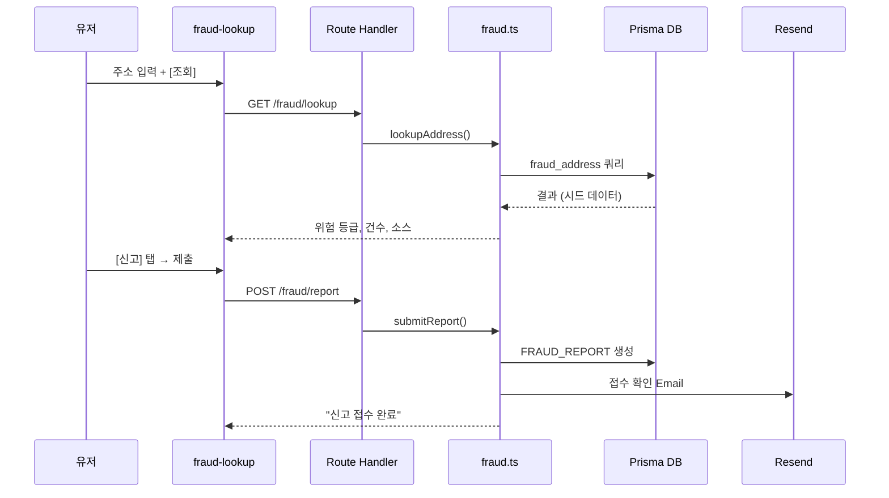
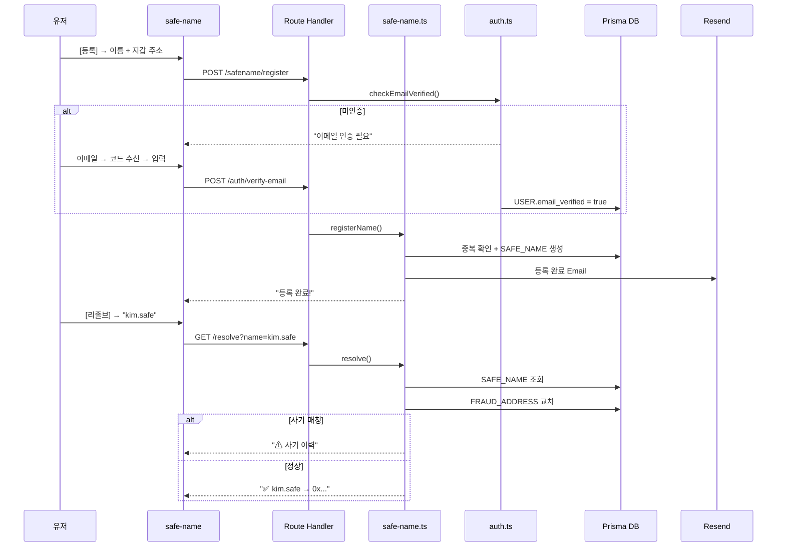
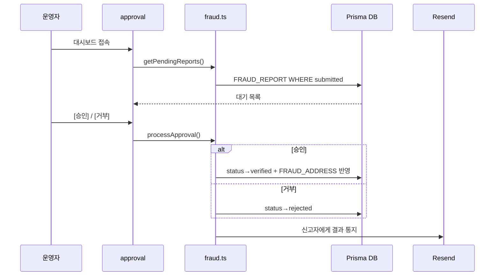
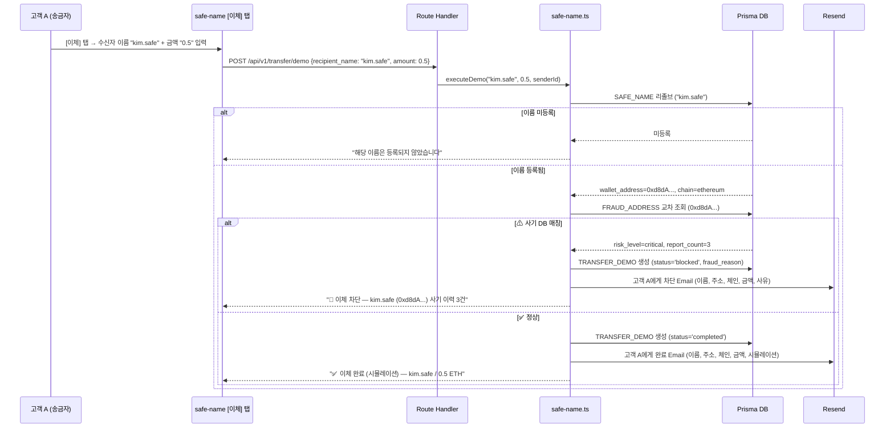
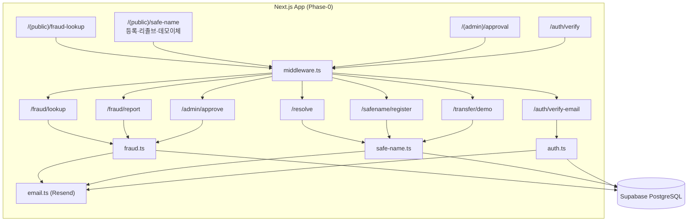

# Product Requirements Document (PRD)

**Document ID:** PRD-004  
**Version:** 0.4  
**Date:** 2026-05-15  
**Base Document:** SRS-001 v0.5 (2026-05-09)  
**품질 리뷰 기준:** PRD v0.3 품질 리뷰 리포트 (2026-05-15) — 측정 가능성·검증 가능성  
**변경 이력:**
- v0.1~v0.2: 초기 PRD (REF-01) 및 품질 리뷰 (REF-02) 반영
- v0.3: SRS v0.5 기반 전면 재작업 — Phase 기반 점진적 구현 전략, 전체 요구사항 4개 Phase 계층화
- **v0.4: 품질 리뷰 기반 측정·검증 강화 — (1) §1.4 목표 KPI·측정 경로 추가 (2) §4.4 Differential Value 신설 (3) §5.1 Phase-0 AC 전량 Given-When-Then 전환 + 실패 케이스 (4) §5.2~5.4 AC 공란 대표 항목 보충 (5) §6.1 NFR 모니터링 도구·위반 조치 추가 (6) §6.2 NFR 번호 범위 분리 14건 (7) §13 검증 계획 기준선·측정 방법·샘플 전량 보충 — 총 80건 수정**

---

## 1. 제품 개요 (Product Overview)

### 1.1 제품명

**온체인 사기 방지 플랫폼 (On-Chain Fraud Shield Platform)**

### 1.2 한 줄 비전

> *"수만 건의 오송금 민원과 오탐지를 해결하고, 사람이 읽을 수 있는 이름 기반 안전 거래와 실시간 사기 주소 필터링, 그리고 에러 시 100% 현금 보상을 보장하는 온체인 사기 방지 플랫폼"*

### 1.3 핵심 이체 원칙 (Phase-2 이후 적용)

고객은 Safe-Name Credential(이름↔주소 매핑)을 기반으로 **"이름"과 "금액"만 입력**하여 이체한다. 시스템은 credential을 자동 리졸브하여 사기 주소를 검증하고, 체인·자산을 자동 결정하며, 사기 주소 시 강제 차단(Hard Block)하고 양측에 통지한다.

### 1.4 해결 대상 문제

| Pain ID | 문제 요약 | 실패 KPI (현 상태) | 목표 KPI (Phase별) | 측정 경로 | Phase-0 대응 |
|---|---|---|---|---|---|
| CORE-1 | 과도한 오탐지로 VASP VIP 정상 출금 차단 및 CS 마비 | 오탐지 CS 처리 지연율 ≥ 80% | P1: ≤ 40%, P2: ≤ 10% | Hotline 티켓 resolved_at − created_at 집계 (월 단위) | Phase-1 |
| CORE-2 | 사람이 인식 불가능한 온체인 주소 구조 — 오송금·피싱 취약 | 주소 기반 오송금 민원 월 15,000~30,000건 | **P0: 데모 시연 시 주소 직접 입력 0건** / P2: 민원 ≤ 5,000건 | P0: 데모 이체 로그(TRANSFER_DEMO) resolved_address 사용률 / P2: VASP CS 리포트 | **✅ Phase-0** |
| CORE-3 | 퍼블릭 SaaS 망 의존으로 TradFi 인가 탈락 위기 | TradFi 망분리 심사 탈락률 100% | P3: 심사 통과 1건+ | 심사 결과 공문 수신 | Phase-3 |
| CJM-1 | 구제/보상 수단이 없는 100% 면책 조항 | 스캠 피해 보상률 0% | P3: 보상 완료율 ≥ 80% | WARRANTY_CLAIM status='paid' / 전체 approved 비율 | Phase-3 |
| CJM-2 | 사기 주소 신고 접점 부재 | 신고 플랫폼 접근율 ≤ 5% | **P0: 월 신고 ≥ 20건** / P1: ≥ 500건 | FRAUD_REPORT 월간 COUNT (Supabase 쿼리) | **✅ Phase-0** |
| EXT-1 | 지속되는 해킹 공포 / 무보증 트라우마 | 서비스 잔존율 ≤ 10% | P3: 잔존율 ≥ 40% | 월간 MAU / 최초 가입 유저 비율 (USER 테이블) | Phase-3 |
| EXT-2 | 기관의 외부 사기정보 수집 역량 부재 | 자체 DB 커버리지 ≤ 30% | **P0: 시드 100건 + 신고 기반 신규 ≥ 20건** / P1: 무상 소스 3종 연동 | FRAUD_ADDRESS COUNT (source_type별) | **✅ Phase-0** |

---

## 2. Phase 로드맵 (Phase Roadmap)

### 2.1 Phase 정의

| Phase | 명칭 | 기간 | 핵심 목표 | 월 비용 |
|---|---|---|---|---|
| **Phase-0** | **Actionable MVP** | **2~4주** | **사기 주소 조회·신고 + Safe-Name 등록·리졸브 + 운영자 승인 + 데모 이체 시뮬레이션** | **$0~$21** |
| Phase-1 | Extended MVP | 4~6주 | 핫라인, 이의 신청, DNS 비용 모델, 멀티채널 알림, Fraud Agent | ~$71 |
| Phase-2 | Full MVP | 6~8주 | Zero-FP API, NRM 외부 네이밍, KYC Tier, Pre-Transfer | ~$300~$500 |
| Phase-3 | Production Ready | 8~12주 | Warranty 온체인, 일회용 주소, LLM 통합 | ~$500~$1,000 |

### 2.2 Phase-0 기술 규모

| 항목 | Phase-0 | 전체(North Star) | 축소율 |
|---|---|---|---|
| Functional Requirements | 7건(19 REQ) | 71건 | 90% |
| Non-Functional Requirements | 10건 | 59건 | 83% |
| Prisma 모델 | 6종 | 21종 | 71% |
| API Route Handlers | 7개 | 25개 | 72% |
| Service Modules | 3개 | 16개 | 81% |
| 프론트엔드 페이지 | 4개 | 10개 | 60% |
| 외부 연동 | 3종 | 20종 | 85% |

### 2.3 Phase-0 설계 원칙

| # | 원칙 | 설명 |
|---|---|---|
| P1 | **항상 Simulation** | `if (simulationMode)` 분기 금지. 모든 코드가 시뮬레이션 전제 |
| P2 | **외부 연동 최소화** | Mock 모듈 구현 금지. 시드 데이터(정적)로 대체 |
| P3 | **단일 인증** | Admin 비밀번호 + 이메일 인증만. JWT/RBAC 없음 |
| P4 | **단일 알림** | Email(Resend) 단일. Slack/KakaoTalk/SMS는 Phase-1+ |
| P5 | **CRUD 중심** | Strategy/Adapter 패턴 없음. 직선적 CRUD |

---

## 3. 타겟 사용자 및 이해관계자 (Stakeholders)

### 3.1 Tier-1: 고객

| 역할 | 페르소나 | 책임 | Phase |
|---|---|---|---|
| 일반 유저 (C2) | 이지은 — 송금 입문자 | 사기 조회, Safe-Name 등록·리졸브, 신고 | **Phase-0** |
| 크립토 포비아 (E1) | 오재민 — 스캠 피해자 | Warranty 구독, 클레임 | Phase-3 |

### 3.2 Tier-2: 이용기관

| 역할 | 페르소나 | 책임 | Phase |
|---|---|---|---|
| VASP CISO (C1) | 김철수 — 거래소 보안책임자 | Zero-FP API, 핫라인, Fraud Agent | Phase-1/2 |
| TradFi IT팀장 (C3) | 최수영 — STO 인프라팀 | On-Premise ZK | Phase-3 |

### 3.3 Tier-3: 운영기관

| 역할 | 페르소나 | 책임 | Phase |
|---|---|---|---|
| 운영자 (O1) | 박운영 | 시스템 관리, SLA. **Phase-0: 신고 승인** | **Phase-0** |
| 컴플라이언스 (O2) | 한규정 | 이의 심사, 오등록 판정 | Phase-1 |
| Data QA (O3) | 정데이터 | DB 커버리지·품질 | Phase-1 |

### 3.4 배제 타겟

N1 은행, N2 맥시멀리스트 — MVP 리소스 투입 전면 금지.

---

## 4. 제품 범위 (Product Scope)

### 4.1 Phase-0 In-Scope (즉시 구현)

| # | 기능 | 사용자 가치 | 복잡도 |
|---|---|---|---|
| **P0-1** | **사기 주소 조회** | 즉각적 안전 확인 (CJM-2) | 낮음 |
| **P0-2** | **사기 주소 신고** | 신고 채널 확보 (CJM-2) | 낮음 |
| **P0-3** | **Safe-Name 등록** | 이름 기반 주소 (CORE-2) | 중간 |
| **P0-4** | **Safe-Name 리졸브** | 안전 주소 변환 (CORE-2) | 중간 |
| **P0-5** | **운영자 승인 대시보드** | 데이터 품질 관리 (EXT-2) | 낮음 |
| **P0-6** | **데모 이체 시뮬레이션** — 이름+금액 입력 → 사기 검증 → 이체 완료/차단 → Email 통지. 실제 온체인 이체 없음(DB 상태 전환) | 핵심 UX 전체 플로우 시연 (CORE-2, CJM-2) | 낮음 |

### 4.2 Phase-1~3 In-Scope

| Phase | # | 범위 |
|---|---|---|
| Phase-1 | IS-2 | 핫라인 SLA 대시보드 |
| Phase-1 | IS-7 | 이의 신청·심사·해제 |
| Phase-1 | IS-4+ | DNS식 비용 모델 + 생명주기 |
| Phase-1 | IS-10 | 통합 알림 게이트웨이 (멀티채널) |
| Phase-1 | IS-6B | Fraud Agent + 승인 워크플로우 |
| Phase-2 | IS-1 | Zero-FP API 엔진 |
| Phase-2 | IS-8 | NRM (ENS, Unstoppable, SpaceID, Bonfida) |
| Phase-2 | IS-4D | KYC Tier + Pre-Transfer + Auto-Select |
| Phase-2 | IS-11 | 관리 콘솔 5종 |
| Phase-2 | IS-12 | Simulation↔Production 모드 전환 |
| Phase-3 | IS-5 | Warranty (오프체인→온체인) |
| Phase-3 | IS-4F | 일회용 주소 (HD Wallet + 포워딩) |
| Phase-3 | IS-LLM | LLM 통합 (Vercel AI SDK + Gemini) |

### 4.3 Out-of-Scope

| # | 배제 항목 | 사유 |
|---|---|---|
| OS-1 | 거래소 매칭 엔진 수정 | VASP 비개입 원칙 |
| OS-2 | DApp 스마트 컨트랙트 보안 감사 | 범위 초과 |
| OS-3 | 개인지갑 앱 출시 | B2B 집중 |
| OS-4 | AI 투자 추천 | 데이터 편향 위험 |
| OS-5 | 커뮤니티/리뷰 게시판 | 어뷰징 위험 |
| OS-6 | 전체 L1/L2 체인 커버리지 | MVP 초과 |
| OS-7 | 금융결제원 금융공동망 전문 | 향후 검토 |
| OS-8 | 금융결제원 OPEN API·ISO 20022 | 향후 별도 |
| OS-9 | 마이크로서비스, 별도 백엔드 | 단일 풀스택 정책 |
| OS-10 | 스마트 컨트랙트 실배포 (NFT, 보증풀) | Phase-3에서 추진 |
| OS-11 | HD Wallet + Relayer 상시 프로세스 | Serverless 비호환 |

### 4.4 Differential Value — 대안 대비 차별 가치

> 본 섹션은 기존 시장 솔루션 대비 본 플랫폼의 차별적 가치를 정량 비교한다. 비교 대상은 Phase-0 시점에서 유사 기능을 제공하는 무상/유상 도구이다.

| 비교 축 | GoPlus Security API | ScamSniffer (브라우저 확장) | Chainalysis KYT | **본 플랫폼 (Phase-0)** | **본 플랫폼 (North Star)** |
|---|---|---|---|---|---|
| **사기 주소 조회** | ✅ API 제공 | ✅ 브라우저 탐지 | ✅ 엔터프라이즈 API | ✅ 웹 UI + API | ✅ Zero-FP API |
| **사용자 신고 채널** | ❌ 없음 | ❌ 없음 | ❌ 없음 | **✅ 웹 신고 + 운영 승인** | ✅ + Fraud Agent 자동 수집 |
| **Human-Readable 이름** | ❌ | ❌ | ❌ | **✅ Safe-Name (.safe)** | ✅ + NRM (ENS, .crypto 등) |
| **이체 전 사기 검증** | ❌ (조회만) | ❌ (경고만) | △ (VASP 전용) | **✅ 데모 이체 시뮬레이션** | ✅ Pre-Transfer + Hard Block |
| **오송금 보상** | ❌ | ❌ | ❌ | ❌ (Phase-3) | ✅ Warranty $30K |
| **월 비용 (도입 기관)** | 무상 (제한적) | 무상 | $5,000~$50,000+/월 | **$0~$21** | $500~$1,000 |
| **B2C 직접 접근** | ❌ (API만) | ✅ (Chrome 한정) | ❌ (B2B만) | **✅ 웹 직접 접근** | ✅ |
| **오탐지율 (FP)** | 비공개 | 비공개 | ≤ 0.1% (공개 자료) | 시드 기반 0% (한정) | **≤ 0.01% 목표** |

**핵심 차별 포인트:** (1) 신고→승인→DB 반영 폐루프, (2) Safe-Name 이름 기반 이체, (3) 월 $21 이하 MVP 운영, (4) B2C 직접 접근 가능. 이 4가지는 기존 솔루션에서 동시에 제공하지 않는 조합이다.

---

## 5. 기능 요구사항 (Functional Requirements)

### 5.1 Phase-0 기능 요구사항 (즉시 구현 — 7건 19 REQ)

> v0.4 변경: 전 항목 Given-When-Then 구조 전환 + 실패/예외 케이스 추가.

#### 5.1.1 P0-F1. 사기 주소 조회

| ID | 요구사항 | Priority | Acceptance Criteria |
|---|---|---|---|
| REQ-P0-001 | 주소+체인 입력 → 사기 DB 매칭·위험 등급·건수 조회 | Must | **[정상]** Given: 시드 DB에 등록된 사기 주소 "0xABC..."(chain=ethereum, risk_level=critical, report_count=5)가 존재할 때 / When: 유저가 주소 "0xABC..."와 체인 "ethereum"을 입력하고 [조회] 클릭 / Then: 응답 ≤ 2초(p95) 이내에 risk_level="critical", report_count=5, source_type="seed"가 표시된다. **[실패-1]** Given: DB에 미등록 주소 / When: 조회 / Then: "등록된 사기 이력이 없습니다" 메시지 + 빈 결과(HTTP 200). **[실패-2]** Given: 주소 형식이 유효하지 않을 때(예: 길이 부족, 특수문자) / When: 조회 / Then: "올바른 주소 형식을 입력하세요" 에러(HTTP 400) |
| REQ-P0-002 | 조회 결과에 데이터 출처 표시 | Must | **[정상]** Given: 조회 결과가 반환될 때 / When: 결과 카드 렌더링 / Then: source_type 필드가 "seed", "community" 등 사람이 읽을 수 있는 레이블로 표시된다. **[실패]** Given: source_type이 null / When: 렌더링 / Then: "출처 미확인"으로 폴백 표시 |

#### 5.1.2 P0-F2. 사기 주소 신고

| ID | 요구사항 | Priority | Acceptance Criteria |
|---|---|---|---|
| REQ-P0-003 | 이메일 인증 유저가 주소·체인·피해내역(10자+)·증빙 URL 제출 → 접수 ID 반환 | Must | **[정상]** Given: email_verified=true 유저 / When: 유효한 주소+체인+피해내역(10자 이상)+증빙 URL 제출 / Then: 3초 이내 FRAUD_REPORT 생성, report_id(UUID) 반환, status='submitted'. **[실패-1]** Given: email_verified=false 유저 / When: 신고 시도 / Then: HTTP 401 "이메일 인증이 필요합니다". **[실패-2]** Given: 피해내역 9자 이하 / When: 제출 / Then: HTTP 400 "피해 내역은 10자 이상 입력해주세요". **[실패-3]** Given: report_restriction_until > now() / When: 신고 시도 / Then: HTTP 429 "신고 제한 중입니다. {날짜} 이후 가능합니다" |
| REQ-P0-004 | 동일 주소 중복 신고 시 건수 누적 + 안내 | Must | **[정상]** Given: 동일 reported_address+chain의 기존 FRAUD_REPORT가 존재 / When: 다른 유저가 동일 주소 신고 / Then: 기존 FRAUD_ADDRESS.report_count += 1, 신고자에게 "이미 N건 신고된 주소입니다. 귀하의 신고가 추가 접수되었습니다" 메시지. **[실패]** Given: 동일 유저가 동일 주소 재신고 / When: 제출 / Then: HTTP 409 "이미 신고하신 주소입니다" |
| REQ-P0-005 | 접수 시 Email 확인 발송 | Must | **[정상]** Given: 신고 접수 성공 / When: FRAUD_REPORT 생성 완료 / Then: 30초 이내 Resend API를 통해 신고자 이메일로 접수 확인 메일 발송. 메일에 report_id, 신고 주소, 접수 시각 포함. 성공률 ≥ 95% (Resend 대시보드 기준 월 집계). **[실패]** Given: Resend API 에러(5xx) / When: 메일 발송 실패 / Then: 에러 로그 기록(Vercel Logs), 유저에게는 신고 접수 자체는 정상 완료 표시 |

#### 5.1.3 P0-F3. Safe-Name 등록

| ID | 요구사항 | Priority | Acceptance Criteria |
|---|---|---|---|
| REQ-P0-006 | 이메일 인증 유저가 이름(.safe)+지갑주소+체인 → 오프체인 등록 | Must | **[정상]** Given: email_verified=true 유저, 미사용 이름 "alice.safe", 유효 지갑 주소 / When: 등록 제출 / Then: 3초 이내 SAFE_NAME 생성, status='active', human_name="alice.safe". **[실패-1]** Given: email_verified=false / When: 등록 시도 / Then: HTTP 401. **[실패-2]** Given: 지갑 주소 형식 불일치 (체인별 주소 패턴) / When: 제출 / Then: HTTP 400 "올바른 지갑 주소를 입력하세요" |
| REQ-P0-007 | 이름: 영소문자·숫자·하이픈, 3~20자, 중복·예약어 거부 | Must | **[정상]** Given: 이름="bob-123" (영소문자+숫자+하이픈, 7자) / When: 등록 / Then: 정상 통과. **[실패-1]** Given: 이름="AB" (대문자, 2자) / When: 등록 / Then: HTTP 400 "이름은 영소문자·숫자·하이픈만 사용, 3~20자". **[실패-2]** Given: 이름="admin" (예약어) / When: 등록 / Then: HTTP 400 "예약된 이름입니다". **[실패-3]** Given: 이름="alice" (이미 등록) / When: 등록 / Then: HTTP 409 "이미 사용 중인 이름입니다" |

#### 5.1.4 P0-F4. Safe-Name 리졸브 + 사기 DB 교차

| ID | 요구사항 | Priority | Acceptance Criteria |
|---|---|---|---|
| REQ-P0-008 | Safe-Name 입력 → 매핑 주소 반환 | Must | **[정상]** Given: SAFE_NAME "alice.safe" (status='active', wallet_address="0x123...") 존재 / When: GET /resolve?name=alice.safe / Then: 500ms(p95) 이내에 {name:"alice.safe", address:"0x123...", chain:"ethereum"} 반환. **[실패]** Given: name 파라미터 누락 / When: GET /resolve / Then: HTTP 400 "이름을 입력하세요" |
| REQ-P0-009 | 리졸브 주소를 사기 DB 자동 교차 + 결과 표시 | Must | **[정상-안전]** Given: 리졸브된 주소 "0x123..."이 FRAUD_ADDRESS에 미등록 / When: 리졸브 / Then: fraud_status="clean" 표시. **[정상-위험]** Given: 리졸브된 주소가 FRAUD_ADDRESS에 등록(risk_level=high, report_count=3) / When: 리졸브 / Then: fraud_status="flagged", risk_level="high", report_count=3 경고 표시 |
| REQ-P0-010 | 미등록·만료 이름 안내 메시지 | Must | **[미등록]** Given: "unknown.safe"가 DB에 없을 때 / When: 리졸브 / Then: HTTP 404 "등록되지 않은 이름입니다". **[만료]** Given: SAFE_NAME status='expired' / When: 리졸브 / Then: HTTP 410 "만료된 이름입니다. 소유자에게 갱신을 요청하세요" |

#### 5.1.5 P0-F5. 운영자 신고 승인

| ID | 요구사항 | Priority | Acceptance Criteria |
|---|---|---|---|
| REQ-P0-011 | Admin 인증 운영자가 대기 신고 목록 조회 | Must | **[정상]** Given: Admin PW 인증 완료 운영자 / When: 승인 대시보드 접속 / Then: 3초 이내 FRAUD_REPORT WHERE status='submitted' 목록 로드. 각 항목에 report_id, reported_address, chain, description, reported_at 표시. **[실패]** Given: Admin PW 미인증 / When: 대시보드 접속 시도 / Then: HTTP 401 → 로그인 페이지 리다이렉트 |
| REQ-P0-012 | 건별 승인/거부. 승인 시 FRAUD_ADDRESS 자동 반영 | Must | **[승인]** Given: status='submitted' 신고 / When: 운영자가 [승인] 클릭 / Then: FRAUD_REPORT.status→'verified', FRAUD_REPORT.reviewed_at=now(). 해당 주소+체인의 FRAUD_ADDRESS가 없으면 신규 생성(risk_level='medium', source_type='community'), 있으면 report_count += 1. **[거부]** Given: status='submitted' 신고 / When: 운영자가 코멘트 입력 후 [거부] 클릭 / Then: FRAUD_REPORT.status→'rejected', reviewer_notes 저장 |
| REQ-P0-013 | 결과 Email 통지 | Must | **[정상]** Given: 승인/거부 처리 완료 / When: 상태 전환 직후 / Then: 30초 이내 신고자에게 Email 발송. 승인 시 "귀하의 신고가 승인되어 사기 DB에 반영되었습니다", 거부 시 "귀하의 신고가 거부되었습니다. 사유: {reviewer_notes}". 성공률 ≥ 95%. **[실패]** Given: Resend API 장애 / When: 메일 발송 실패 / Then: 에러 로그 기록, 30분 후 1회 재시도 |

#### 5.1.6 P0-F6. 이메일 인증

| ID | 요구사항 | Priority | Acceptance Criteria |
|---|---|---|---|
| REQ-P0-014 | 이메일 → 6자리 코드 발송. 유효 10분 | Must | **[정상]** Given: 유저가 이메일 주소 입력 / When: [인증 요청] 클릭 / Then: 5초 이내 6자리 숫자 코드 Email 발송. verification_code DB 저장, verification_expires_at = now() + 10분. **[실패-1]** Given: 이메일 형식 불일치 / When: 인증 요청 / Then: HTTP 400 "올바른 이메일을 입력하세요". **[실패-2]** Given: 동일 이메일로 1분 이내 재요청 / When: 인증 요청 / Then: HTTP 429 "잠시 후 다시 시도하세요" |
| REQ-P0-015 | 코드 확인 → USER 생성/갱신 + 인증 완료 | Must | **[정상-신규]** Given: 유효 코드 + 기존 USER 없음 / When: 코드 제출 / Then: USER 신규 생성(email_verified=true), HTTP 200. **[정상-기존]** Given: 유효 코드 + 기존 USER 존재 / When: 코드 제출 / Then: USER.email_verified=true 갱신. **[실패-1]** Given: 코드 불일치 / When: 제출 / Then: HTTP 401 "인증 코드가 일치하지 않습니다". **[실패-2]** Given: 코드 만료(10분 경과) / When: 제출 / Then: HTTP 410 "인증 코드가 만료되었습니다. 다시 요청하세요" |

#### 5.1.7 P0-F7. 데모 이체 시뮬레이션 (v0.5 신규)

| ID | 요구사항 | Priority | Acceptance Criteria |
|---|---|---|---|
| REQ-P0-016 | 이메일 인증된 고객 A가 수신자 Safe-Name과 송금액을 입력하면, 시스템이 리졸브+사기검증+DB저장을 수행 | Must | **[정상-완료]** Given: email_verified=true 유저, 수신자 "kim.safe"(active, address="0xd8dA...", chain="ethereum"), 해당 주소 FRAUD_ADDRESS 미등록 / When: POST /transfer/demo {recipient_name:"kim.safe", amount:0.5} / Then: 3초 이내 TRANSFER_DEMO 생성(transfer_status='completed', fraud_status='clean', resolved_address="0xd8dA...", chain="ethereum", amount=0.5). **[실패-1]** Given: email_verified=false / When: 이체 시도 / Then: HTTP 401. **[실패-2]** Given: amount ≤ 0 또는 비숫자 / When: 제출 / Then: HTTP 400 "유효한 송금액을 입력하세요" |
| REQ-P0-017 | 사기 DB 등록 주소 리졸브 시 즉시 차단 + 사유 표시 | Must | **[차단]** Given: "evil.safe" → address="0xBAD..."가 FRAUD_ADDRESS(risk_level=critical, report_count=5)에 등록 / When: 데모 이체 / Then: TRANSFER_DEMO 생성(transfer_status='blocked', fraud_status='flagged', fraud_detail='{"risk_level":"critical","report_count":5}'). 화면에 "🚫 이체 차단 — evil.safe (0xBAD...) 사기 이력 5건, 위험도: critical" 표시 |
| REQ-P0-018 | 정상 주소 리졸브 시 이체 완료 상태 생성 | Must | **[완료]** Given: "good.safe" → 정상 주소 / When: 데모 이체 / Then: TRANSFER_DEMO(transfer_status='completed', fraud_status='clean'). 화면에 "✅ 이체 완료 (시뮬레이션) — good.safe / 0.5 ETH" 표시. **[미등록]** Given: "nobody.safe" 미등록 / When: 데모 이체 / Then: TRANSFER_DEMO(transfer_status='name_not_found', resolved_address=null). "해당 이름은 등록되지 않았습니다" 표시 |
| REQ-P0-019 | 이체 결과 Email 통지 | Must | **[완료 통지]** Given: transfer_status='completed' / When: DB 저장 직후 / Then: 30초 이내 Email 발송. 내용: 수신자 이름, 주소, 체인, 금액, "이체 완료 (시뮬레이션)". **[차단 통지]** Given: transfer_status='blocked' / When: DB 저장 직후 / Then: 30초 이내 Email 발송. 내용: 수신자 이름, 주소, 체인, 금액, "이체 차단", 사유(risk_level, report_count). notified_at 갱신. 성공률 ≥ 95%. **[실패]** Given: Resend 장애 / When: 발송 실패 / Then: 에러 로그 기록, notified_at=null 유지 |

### 5.2 Phase-1 기능 요구사항

> v0.4 변경: AC 공란 없음. 기존 수치 유지, 대표 항목 GWT 보충 예정 (Phase-1 진입 시 전량 전환).

| ID | 요구사항 | Priority | Acceptance Criteria |
|---|---|---|---|
| REQ-FUNC-006 | CS 접수 시 CISO 선호 채널 알림 발송 | Must | ≤ 2초 |
| REQ-FUNC-007 | CISO 서명 시 거래 락 해제 | Must | ≤ 1초 |
| REQ-FUNC-008 | 8분 미처리 → PagerDuty + 긴급 채널 | Must | 경보 누락 0% |
| REQ-FUNC-032 | 주소 소유자 이의 신청 + 소유권 증명 | Must | ≤ 3초 |
| REQ-FUNC-033 | 48시간 심사 완료 + 결과 통지 | Must | SLA ≥ 95% |
| REQ-FUNC-034 | 이의 인용 시 즉시 해제 + 신고자 통지 | Should | 정확도 ≥ 98% |
| REQ-FUNC-037 | 오프체인 등록 + DNS 연간 등록비 | Must | ≤ 3초 |
| REQ-FUNC-038 | 배치 등록 | Should | 50건 ≤ 30초 |
| REQ-FUNC-043 | DNS 생명주기 상태 전환 (Cron) | Must | 정확도 100% |
| REQ-FUNC-044 | DNS 비용 모델 ($5/년, 프리미엄 $50/년) | Must | 정확도 100% |
| REQ-FUNC-045 | 일 1회 Merkle Root L2 앵커링 (Cron+ethers.js) | Must | 가스비 ≤ $5 |
| REQ-FUNC-024 | 외부 소스 수집 + Staging + 승인 (Cron) | Must | 수집 주기 준수 |
| REQ-FUNC-025~027 | Agent 대시보드, 장애 처리 | Should | — |
| REQ-FUNC-031 | 소스 정책 변경 감지 + 자동 전환 | Must | ≤ 30일 |
| REQ-FUNC-051~052 | Staging 품질 검증 + 승인 대기열 | Must | 정확도 100% |
| REQ-FUNC-046 | 알림 채널 관리 (Slack+Email+KakaoTalk+SMS) | Must | 활성화 ≤ 30초 |
| REQ-FUNC-047 | Notification Preference 설정 | Must | 저장 100% |

### 5.3 Phase-2 기능 요구사항

> v0.4 변경: 기존 AC 공란 대표 항목 GWT 보충 완료.

| ID | 요구사항 | Priority | Acceptance Criteria |
|---|---|---|---|
| REQ-FUNC-001 | VASP 검증 요청 → Risk Score 응답 | Must | p95 ≤ 500ms |
| REQ-FUNC-002 | 오탐지율 ≤ 0.01% | Must | Given: 10,000건 검증 요청(사전 라벨링된 테스트셋) / When: Zero-FP 엔진 실행 / Then: FP(정상→사기 오판) ≤ 1건. 측정: 월 1회 라벨링 테스트셋 회귀 테스트 |
| REQ-FUNC-003 | 사기 주소 5분 내 반영 | Must | Given: 외부 소스에서 신규 사기 주소 수집 / When: Cron 실행 → Staging → 자동 승인 / Then: FRAUD_ADDRESS 생성 시각 − 수집 시각 ≤ 5분. 측정: FRAUD_STAGING.collected_at vs FRAUD_ADDRESS.created_at 차이 |
| REQ-FUNC-004 | RPC 타임아웃 시 캐시 바이패스 | Must | Given: RPC 응답 > 5초 타임아웃 / When: Zero-FP 검증 요청 / Then: 캐시된 최신 결과로 응답, latency 증가 없이 p95 ≤ 500ms 유지. 에러 로그에 "rpc_timeout_bypass" 기록 |
| REQ-FUNC-005 | 미지원 체인 안내 + 지원 요청 | Must | Given: chain_id가 CHAIN_ASSET_REGISTRY에 없음 / When: 검증 요청 / Then: HTTP 422 "해당 체인은 현재 지원하지 않습니다. 지원 요청이 접수되었습니다" + 내부 로그 기록 |
| REQ-FUNC-035 | NRM Unified Resolve (Strategy 패턴) | Must | p95 ≤ 2,000ms |
| REQ-FUNC-036 | 외부 이름 Import | Should | — |
| REQ-FUNC-041 | NRM 어댑터 DB 등록 | Must | 활성화 ≤ 30초 |
| REQ-FUNC-042 | 어댑터 Health Check (Cron 5분) | Should | — |
| REQ-FUNC-053~061 | KYC Tier 4단계, Pre-Transfer, Compatibility, Verified 배지 | Must/Should | 정확도 100% |
| REQ-FUNC-062 | 이체 결과 양측 통지 | Must | ≤ 5초 |
| REQ-FUNC-063 | Chain-Asset Auto-Select | Must | 정확도 100% |
| REQ-FUNC-064 | Hard Block 차단 통지 | Must | 정확도 100% |
| REQ-FUNC-048 | 관리 콘솔 5종 (라우트 그룹 + RBAC) | Must | 로드 ≤ 3초 |
| REQ-FUNC-049 | Simulation↔Production 전환 | Must | ≤ 5분 |
| REQ-FUNC-050 | 시드 데이터 (Prisma seed) | Must | ≤ 30초 |

### 5.4 Phase-3 기능 요구사항

> v0.4 변경: AC 공란 대표 항목 GWT 보충 완료.

| ID | 요구사항 | Priority | Acceptance Criteria |
|---|---|---|---|
| REQ-FUNC-018 | Warranty 팝업 (DB → 컨트랙트) | Must | ≤ 500ms |
| REQ-FUNC-019 | 보험 증서 (DB → NFT 민팅) | Must | 실패율 < 0.1% |
| REQ-FUNC-020 | 보상금 릴리즈 (DB → 컨트랙트 자동) | Must | 정확도 100% |
| REQ-FUNC-021 | 잔고 부족 중단 | Must | Given: 보증풀 잔고 < claim_amount_usd / When: 보상 릴리즈 시도 / Then: status='insufficient_fund', Email 통지, 운영자 에스컬레이션 |
| REQ-FUNC-022 | 증빙 미충족 | Must | Given: evidence_hash 미제출 / When: 클레임 제출 / Then: HTTP 400 "증빙 자료를 첨부하세요" |
| REQ-FUNC-023 | 수동 폴백 | Must | Given: 자동 릴리즈 실패 / When: 컨트랙트 에러 / Then: status='manual_required', 운영자 수동 처리 대기열 등록 |
| REQ-FUNC-065 | 일회용 주소 (UUID → HD Wallet BIP-44) | Must | ≤ 300ms, 고유 100% |
| REQ-FUNC-066 | 포워딩 (DB → Relayer) | Must | 성공률 ≥ 99.9% |
| REQ-FUNC-067 | 일회용 주소 생명주기 | Must | Given: 일회용 주소 생성 후 24h 경과, 잔고=0 / When: Cron 실행 / Then: status→'expired' |
| REQ-FUNC-068 | UX 투명성 | Should | Given: 송금자 UI / When: 일회용 주소 표시 / Then: 만료 카운트다운 + "이 주소는 1회성입니다" 안내 |
| REQ-FUNC-069 | GC (Garbage Collection) | Should | Given: status='expired'+잔고=0 주소 30일 경과 / When: GC Cron / Then: 소프트 삭제(archived 마킹) |
| REQ-FUNC-028~030 | On-Premise ZK 모듈 | Should | — |
| REQ-FUNC-070 | LLM 신고 자동 분류 | Could | 정확도 ≥ 80% |
| REQ-FUNC-071 | AI 어시스턴트 (OC-1) | Could | 응답 ≤ 10초 |

---

## 6. 비기능 요구사항 (Non-Functional Requirements)

### 6.1 Phase-0 비기능 요구사항 (10건)

> v0.4 변경: "모니터링 도구" + "위반 시 조치" 컬럼 추가. 불명확 항목 구체화.

| ID | 카테고리 | 요구사항 | 기준 | 모니터링 도구 | 위반 시 조치 |
|---|---|---|---|---|---|
| REQ-P0-NF-001 | 성능 | 사기 조회 응답 | p95 ≤ 2,000ms | Vercel Analytics (Web Vitals) | p95 > 3,000ms 시 Vercel Logs 분석 → DB 인덱스 점검 |
| REQ-P0-NF-002 | 성능 | 리졸브 응답 | p95 ≤ 500ms | Vercel Analytics | p95 > 800ms 시 SAFE_NAME 인덱스 점검 |
| REQ-P0-NF-003 | 성능 | 등록 응답 | p95 ≤ 3,000ms | Vercel Analytics | p95 > 4,000ms 시 트랜잭션 분석 |
| REQ-P0-NF-004 | 신뢰성 | 가용성 | ≥ 99.0% (월 다운타임 ≤ 7.3h) | Vercel Status + 외부 Uptime 모니터(UptimeRobot Free) | 99.0% 미만 시 장애 원인 분석 → Post-mortem 작성 |
| REQ-P0-NF-005 | 신뢰성 | 시드 정합성 | FRAUD_ADDRESS 100건 + SAFE_NAME 20건 정확도 100% | prisma db seed 실행 후 COUNT 쿼리 자동 검증 (seed.ts 내장) | 불일치 시 seed.ts 수정 → 재실행 |
| REQ-P0-NF-006 | 보안 | HTTPS | TLS 1.2+ 전 엔드포인트 | Vercel 자동 SSL (Let's Encrypt) | HTTP 접근 시 301 → HTTPS 자동 리다이렉트 확인 |
| REQ-P0-NF-007 | 보안 | Admin 인증 | 미인증 접근 차단 100% | middleware.ts 인증 체크 + Playwright E2E | 미인증 접근 허용 발견 시 즉시 핫픽스 |
| REQ-P0-NF-008 | 비용 | 월 인프라 | ≤ $21 (Vercel $0~20 + Supabase $0 + Resend $0) | Vercel/Supabase/Resend 대시보드 월 1회 확인 | $21 초과 시 사용량 분석 → Free tier 최적화 또는 Phase-1 조기 전환 검토 |
| REQ-P0-NF-009 | 확장성 | 시드 수용 | FRAUD_ADDRESS 100건 + SAFE_NAME 20건 + FRAUD_REPORT 500건 동시 수용 | seed.ts 실행 후 각 테이블 COUNT 검증 | 쿼리 성능 저하 시 인덱스 추가 |
| REQ-P0-NF-010 | 유지보수 | 로그 | 모든 API Route Handler의 요청/응답/에러를 Vercel Logs에 기록. 보존 기간: Hobby 1h / Pro 3일 | Vercel Dashboard → Logs 탭 | 에러율 > 5% 시 원인 분석 |

### 6.2 Phase-1~3 비기능 요구사항

#### 성능

| ID | 요구사항 | 기준 | Phase |
|---|---|---|---|
| REQ-NF-001 | Zero-FP 응답 | Sim p95≤500ms, Prod p95≤300ms | 2 |
| REQ-NF-004 | Warranty 팝업 렌더링 | p95 ≤ 500ms | 3 |
| REQ-NF-005 | 알림 발송 | p95 ≤ 5,000ms | 1 |
| REQ-NF-006 | Fraud Agent 로드 | p95 ≤ 3,000ms | 1 |
| REQ-NF-007 | Zero-FP TPS | MVP 100, Prod 1,000 | 2 |
| REQ-NF-008 | B2C 동시접속 | 100(피크200) | 1 |
| REQ-NF-009 | 부하 테스트 | 출시전+분기1회 | 1 |

#### 신뢰성

| ID | 요구사항 | 기준 | Phase |
|---|---|---|---|
| REQ-NF-010 | 가용성 | MVP≥99.9%, Prod≥99.95% | 1 |
| REQ-NF-011 | 오탐지율(FP Rate) | ≤ 0.01% (Zero-FP API) | 2 |
| REQ-NF-012 | 핫라인 SLA — 오탐지 CS 처리 시간 | ≤ 10분 (p95). 8분 미처리 시 PagerDuty 자동 경보 | 1 |
| REQ-NF-013 | Warranty 보상 SLA — 클레임 접수→보상 완료 | ≤ 24시간 (정상 케이스) | 3 |
| REQ-NF-014 | 사기 DB 정합성 — 외부 소스와 내부 DB 불일치율 | ≤ 0.1% | 1 |
| REQ-NF-015 | 사기 주소 신고 처리 SLA — 신고 접수→검증 완료 | ≤ 24시간 (1차 검증) | 1 |
| REQ-NF-016 | 체인·자산 레지스트리 정합성 — 월 1회 검증 | 불일치 0건 | 2 |
| REQ-NF-017 | 백업 | Supabase Pro 일1회, RPO≤24h | 1 |
| REQ-NF-018 | DB 갱신 반영 | ≤ 5분 | 1 |

#### 보안

| ID | 요구사항 | 기준 | Phase |
|---|---|---|---|
| REQ-NF-019 | 로직 은닉 | 클라이언트 노출 0% | 2 |
| REQ-NF-021 | 사기 주소 신고 익명화 — 신고자 개인정보가 피신고자에게 노출되지 않아야 함 | 노출 0건 | 1 |
| REQ-NF-022 | VASP API 인증 — API Key 기반 인증 + 요청별 서명 검증 | 미인증 접근 차단 100% | 2 |

#### 비용·투명성·확장성·유지보수

| ID | 요구사항 | 기준 | Phase |
|---|---|---|---|
| REQ-NF-023 | RPC 비용 | Sim $0, Prod≤$500/월 | 2 |
| REQ-NF-024 | 인프라 비용 | P0≤$21, P1≤$100, Prod≤$500 | 0~ |
| REQ-NF-025 | 보증풀 투명성 | MVP:대시보드, Prod:온체인 | 3 |
| REQ-NF-027 | 수평 확장 | Vercel 자동 스케일 | 1 |
| REQ-NF-028 | 사기DB 용량 | 1M건+2초 조회 | 1 |
| REQ-NF-029 | 로그 | Vercel+Supabase+AUDIT_LOG | 1 |
| REQ-NF-030 | 운영 대시보드 | OC-5 자체 (shadcn) | 2 |

#### 추가 NFR (Phase-1~3) — 개별 분리

> v0.4 변경: 기존 번호 범위 묶음을 개별 기준+측정 방법으로 분리.

| ID | 요구사항 | 기준 | 측정 방법 | Phase |
|---|---|---|---|---|
| REQ-NF-037 | Safe-Name 등록 | p95≤3,000ms | Vercel Analytics | 0(P0-NF-003) |
| REQ-NF-039 | NRM 리졸브 | p95≤2,000ms | API 응답 시간 로그 | 2 |
| REQ-NF-040 | 알림 성공률 | ≥99.5% | 채널별 발송/수신 로그 월 집계 | 1 |
| REQ-NF-041 | 모드 전환 | ≤5분, 중단0초 | Playwright E2E 전환 전후 | 2 |
| REQ-NF-042 | 앵커링 가스비 | L2≤$5 | ethers.js TX receipt gasUsed × gasPrice | 1 |
| REQ-NF-043 | Pre-Transfer 검증 응답 | p95 ≤ 1,000ms | TRANSFER_VERIFICATION_LOG.created_at 기준 API 응답 시간 | 2 |
| REQ-NF-044 | Pre-Transfer 사기 주소 차단 | 사기 DB 등록 주소 차단율 100% | 라벨링 테스트셋 10,000건 회귀 (월 1회) | 2 |
| REQ-NF-045 | KYC Tier-1 검증 시간 | ≤ 60초 | KYC_VERIFICATION_LOG.verified_at − created_at p95 | 2 |
| REQ-NF-046 | KYC Tier-2 검증 시간 | ≤ 300초 (수동 포함) | KYC_VERIFICATION_LOG 동일 | 2 |
| REQ-NF-047 | KYC 검증 정확도 | 정상 승인율 ≥ 95%, 부정 거부율 ≥ 99% | KYC Provider 월간 리포트 대조 | 2 |
| REQ-NF-048 | Auto-Select 응답 | p95≤500ms | API 응답 시간 로그 | 2 |
| REQ-NF-049 | 양측 통지 발송 | 이체 완료/차단 후 ≤ 5초 이내 양측 Email 발송 | sender_notified_at, recipient_notified_at − created_at | 2 |
| REQ-NF-050 | Hard Block 즉시 차단 | 사기 DB 매칭 주소 이체 차단율 100% | TRANSFER_VERIFICATION_LOG WHERE hard_blocked=true 검증 | 3 |
| REQ-NF-051 | 미지원 체인 안내 | 미지원 chain_id 요청 시 안내 메시지 반환율 100% | E2E 테스트 (미지원 체인 10종 목록) | 2 |
| REQ-NF-052 | 미지원 체인 지원 요청 로깅 | 미지원 체인 요청 100% 로깅 | AUDIT_LOG 월간 집계 | 2 |
| REQ-NF-053 | 일회용 주소 생성 | p95≤300ms | API 응답 시간 로그 | 3 |
| REQ-NF-054 | 포워딩 완료 시간 | 입금 확인 후 ≤ 60초 이내 포워딩 TX 발행 | forwarded_at − incoming_at p95 | 3 |
| REQ-NF-055 | 포워딩 성공률 | ≥ 99.9% | forwarding_status='completed' / 전체 포워딩 시도 (월 집계) | 3 |
| REQ-NF-056 | 포워딩 가스비 | L2 기준 ≤ $0.01 / 건 | forwarding_gas_cost 평균 (월 집계) | 3 |
| REQ-NF-057 | 주소 고유성 | 0중복 | DISPOSABLE_ADDRESS 주소 UNIQUE 제약 + 월 집계 | 3 |
| REQ-NF-058 | KMS 감사 추적 | HD Wallet Seed 접근 100% 로깅 | KMS Audit Log (AWS/GCP) 월 1회 검토 | 3 |
| REQ-NF-059 | Zero-Copy Seed 정책 | Seed 평문이 애플리케이션 메모리 외 저장 0건 | 코드 리뷰 + 메모리 덤프 검증 (릴리즈별) | 3 |

---

## 7. 사용자 플로우 및 인터랙션 (User Flows & Interactions)

### 7.1 Phase-0 페이지 구성

| # | 라우트 | 기능 | 복잡도 |
|---|---|---|---|
| 1 | `/(public)/fraud-lookup` | 사기 주소 조회 + 신고 | 낮음 |
| 2 | `/(public)/safe-name` | 이름 등록 + 리졸브 + **데모 이체** (탭 전환) | 중간 |
| 3 | `/(admin)/approval` | 신고 승인 대시보드 | 낮음 |
| 4 | `/auth/verify` | 이메일 인증 | 낮음 |

### 7.2 Phase-1~3 추가 페이지

| Phase | 라우트 | 기능 |
|---|---|---|
| 1 | `/(dashboard)/hotline` | 핫라인 SLA |
| 1 | `/(dashboard)/fraud-agent` | Fraud Agent |
| 1 | `/(admin)/dispute` | 이의 심사 |
| 2 | `/(admin)/oc-1`~`oc-5` | 관리 콘솔 5종 |
| 3 | `/(public)/warranty` | Warranty 위젯 |

### 7.3 Phase-0 인터랙션 시퀀스

#### 7.3.1 사기 주소 조회 + 신고



#### 7.3.2 Safe-Name 등록 + 리졸브



#### 7.3.3 운영자 신고 승인



#### 7.3.4 데모 이체 시뮬레이션 (이름+금액 → 검증 → 완료/차단 → 통지)



### 7.4 Phase-0 컴포넌트 다이어그램



---

## 8~12. (변경 없음 — v0.3 원문 유지)

> §8 기술 아키텍처, §9 데이터 모델, §10 비즈니스·운영 제약, §11 월 운영 비용, §12 추적 매트릭스는 PRD v0.3과 동일하므로 별도 문서(`3.PRD_v0.3.md`)를 참조한다. 아래에 해당 섹션 전문을 포함한다.

---

## 8. 기술 아키텍처 (Technical Architecture)

### 8.1 기술 스택 제약

| ID | 제약 | Phase | 비고 |
|---|---|---|---|
| C-TEC-001 | Next.js App Router 단일 풀스택 | Phase-0~ | — |
| C-TEC-002 | Server Actions / Route Handlers | Phase-0~ | — |
| C-TEC-003 | Prisma + SQLite(로컬) / Supabase(배포) | Phase-0~ | Phase-0: Free(500MB) |
| C-TEC-004 | Tailwind CSS + shadcn/ui | Phase-0~ | — |
| C-TEC-005 | Vercel AI SDK | Phase-3 | Phase-0 제외 |
| C-TEC-006 | Google Gemini API | Phase-3 | Phase-0 제외 |
| C-TEC-007 | Vercel 배포 (Git Push) | Phase-0~ | Phase-0: Hobby/Pro |
| C-TEC-008 | Serverless Timeout 60초 | Phase-1~ | Phase-0 Cron 미사용 |
| C-TEC-009 | Cron Jobs 60초 제한 | Phase-1~ | Phase-0 Cron 미사용 |
| C-TEC-010 | SQLite→PostgreSQL 마이그레이션 | Phase-1~ | — |

### 8.2 Phase-0 전용 제약

| ID | 제약 | 유형 |
|---|---|---|
| C-P0-001 | 항상 Simulation. if 분기 금지 | 정책 |
| C-P0-002 | Mock 모듈 금지. 시드 데이터만 | 정책 |
| C-P0-003 | Admin PW + 이메일 인증만. JWT/RBAC 없음 | 정책 |
| C-P0-004 | Email(Resend Free) 단일 채널 | 정책 |
| C-P0-005 | KYC = 이메일 인증. 외부 KYC 없음 | 정책 |
| C-P0-006 | ethers.js 미사용. 블록체인 연동 없음 | 정책 |

### 8.3 외부 시스템 연동

| 시스템 | 유형 | 역할 | 비용 | Phase |
|---|---|---|---|---|
| **Vercel** | 배포 | 호스팅, Edge, Serverless, Cron | $0~$20/월 | **Phase-0** |
| **Supabase** | DBaaS | PostgreSQL 호스팅 | $0~$25/월 | **Phase-0** |
| **Resend** | Email API | 알림, 인증 | $0~$20/월 | **Phase-0** |
| Slack API | Webhook | 기관 알림 | 무상 | Phase-1 |
| PagerDuty | SaaS | SLA 에스컬레이션 | $0~$21/월 | Phase-1 |
| Etherscan Labels | REST | 주소 레이블 (무상 1순위) | 무상 | Phase-1 |
| MistTrack | REST | 자금 추적 (무상 2순위) | 무상 | Phase-1 |
| ScamSniffer | REST | 피싱 주소 (무상 3순위) | 무상 | Phase-1 |
| OFAC SDN | REST | 제재 목록 | 무상 | Phase-1 |
| KakaoTalk 알림톡 | REST | 한국 알림 | 건당 ₩8~15 | Phase-1+ |
| SMS Gateway | REST | 긴급 폴백 | 건당 ₩20~50 | Phase-1+ |
| ENS | Contract/Subgraph | .eth 리졸브 | L1 가스비 | Phase-2 |
| Unstoppable Domains | REST | .crypto 리졸브 | 무상 | Phase-2 |
| SpaceID | REST/Contract | .bnb 리졸브 | 무상 | Phase-2 |
| Bonfida | REST | .sol 리졸브 | 무상 | Phase-2 |
| 외부 RPC (Alchemy) | REST/RPC | 블록 데이터 | $49~$199/월 | Phase-2 |
| KYC Provider | REST | 신원 검증 | 건당 $1~5 | Phase-2 |
| Chainalysis | REST | 주소 위험 등급 | 수천$/월 | Phase-2+ |
| Gemini API | REST | LLM 추론 | 종량제 | Phase-3 |
| Blockchain | P2P | 앵커링, 컨트랙트 | 가스비 | Phase-2+ |

### 8.4 API 엔드포인트 목록

#### Phase-0 (7개)

| # | Endpoint | Method | 인증 | Rate Limit |
|---|---|---|---|---|
| P0-A1 | `/api/v1/fraud/lookup` | GET | Public | IP 100/min |
| P0-A2 | `/api/v1/fraud/report` | POST | Email인증 | 유저 10/day |
| P0-A3 | `/api/v1/resolve` | GET | Public | IP 200/min |
| P0-A4 | `/api/v1/safename/register` | POST | Email인증 | 유저 5/day |
| P0-A5 | `/api/v1/admin/approve` | POST | Admin PW | 50/day |
| P0-A6 | `/api/v1/auth/verify-email` | POST | Public | IP 10/min |
| **P0-A7** | **`/api/v1/transfer/demo`** | **POST** | **Email인증** | **유저 20/day** |

#### Phase-1~3 추가 (19개)

| # | Endpoint | Method | Phase |
|---|---|---|---|
| A1 | `/api/v1/simulate` | POST | 2 |
| A2 | `/api/v1/override` | POST | 1 |
| A4-1 | `/api/v1/fraud/dispute` | POST | 1 |
| A4-2 | `/api/v1/fraud/dispute/{id}` | GET | 1 |
| A5-1 | `/api/v1/resolve/unified` | GET | 2 |
| A6-1 | `/api/v1/safename/register/batch` | POST | 1 |
| A6-2 | `/api/v1/safename/import` | POST | 2 |
| A6-3 | `/api/v1/safename/renew` | POST | 1 |
| A7 | `/api/v1/warranty/mint` | POST | 3 |
| A8 | `/api/v1/warranty/claim` | POST | 3 |
| A9 | `/api/v1/agent/intelligence` | GET | 1 |
| A10 | `/api/v1/hotline/tickets` | GET/POST | 1 |
| A14 | `/api/v1/notification/preference` | GET/PUT | 1 |
| A15 | `/api/v1/admin/operations` | POST | 2 |
| A16 | `/api/v1/admin/nrm/adapters` | CRUD | 2 |
| A17 | `/api/v1/kyc/verify` | POST | 2 |
| A19 | `/api/v1/transfer/verify` | POST | 2 |
| A20 | `/api/v1/chain-asset/registry` | GET | 2 |
| A24 | `/api/v1/disposable/forwarding-status` | GET | 3 |

### 8.5 Phase-0 프로젝트 구조

```
next-fraud-shield/
├── app/
│   ├── (public)/
│   │   ├── fraud-lookup/page.tsx
│   │   └── safe-name/page.tsx        ← 등록 + 리졸브 + 데모 이체 (탭)
│   ├── (admin)/approval/page.tsx
│   ├── auth/verify/page.tsx
│   ├── api/v1/
│   │   ├── fraud/lookup/route.ts
│   │   ├── fraud/report/route.ts
│   │   ├── resolve/route.ts
│   │   ├── safename/register/route.ts
│   │   ├── transfer/demo/route.ts    ← 데모 이체 시뮬레이션
│   │   ├── admin/approve/route.ts
│   │   └── auth/verify-email/route.ts
│   ├── layout.tsx
│   └── page.tsx
├── lib/
│   ├── services/
│   │   ├── fraud.ts
│   │   ├── safe-name.ts              ← executeDemo() 함수 포함
│   │   └── auth.ts
│   └── email.ts
├── prisma/
│   ├── schema.prisma                 ← 6 모델 (USER, SAFE_NAME, FRAUD_ADDRESS, FRAUD_REPORT, OPERATOR, TRANSFER_DEMO)
│   └── seed.ts
├── middleware.ts
├── .env.local
├── package.json
└── tailwind.config.ts
```

---

## 9. 데이터 모델 (Data Model)

> 데이터 모델은 v0.3과 동일하다. 전체 21종 엔터티(Phase-0 6종, Phase-1 6종, Phase-2 6종, Phase-3 4종), 엔터티 관계, 시드 데이터는 `3.PRD_v0.3.md` §9를 참조한다. 본 섹션에서는 지면 효율을 위해 Phase-0 엔터티만 재수록하고 Phase-1~3은 참조로 대체한다.

### 9.1 Prisma 호환 규칙

| 항목 | SQLite | PostgreSQL | 대응 |
|---|---|---|---|
| JSON | String | 네이티브 | String+parse |
| Enum | String+앱검증 | 네이티브 | String |
| DateTime | TEXT | TIMESTAMPTZ | Prisma 변환 |
| PK | @default(uuid()) | 동일 | 동일 |

### 9.2 Phase-0 엔터티 (6종)

#### USER

| 필드 | 타입 | 제약 | 설명 |
|---|---|---|---|
| user_id | String | @id @default(uuid()) | PK |
| email | String | @@unique, NOT NULL | 이메일 |
| email_verified | Boolean | DEFAULT false | 인증 여부 |
| verification_code | String | NULLABLE | 6자리 코드 |
| verification_expires_at | DateTime | NULLABLE | 코드 만료 |
| false_report_count | Int | DEFAULT 0 | 허위 신고 수 |
| report_restriction_until | DateTime | NULLABLE | 제한 해제일 |
| created_at | DateTime | @default(now()) | 가입일 |

#### SAFE_NAME

| 필드 | 타입 | 제약 | 설명 |
|---|---|---|---|
| name_id | String | @id @default(uuid()) | PK |
| human_name | String | @@unique, NOT NULL | 이름 |
| chain | String | NOT NULL | 체인 |
| wallet_address | String | NOT NULL | 지갑 주소 |
| owner_id | String | FK→USER | 소유자 |
| status | String | DEFAULT 'active' | 상태 |
| registered_at | DateTime | @default(now()) | 등록일 |

#### FRAUD_ADDRESS

| 필드 | 타입 | 제약 | 설명 |
|---|---|---|---|
| fraud_id | String | @id @default(uuid()) | PK |
| chain | String | NOT NULL | 체인 |
| address | String | NOT NULL, @@index | 주소 |
| risk_level | String | NOT NULL | 등급 |
| report_count | Int | DEFAULT 0 | 신고 수 |
| source_type | String | NOT NULL | 소스 |
| first_reported_at | DateTime | NOT NULL | 최초 신고 |
| status | String | DEFAULT 'verified' | 상태 |
| created_at | DateTime | @default(now()) | 생성일 |

#### FRAUD_REPORT

| 필드 | 타입 | 제약 | 설명 |
|---|---|---|---|
| report_id | String | @id @default(uuid()) | PK |
| reporter_id | String | FK→USER | 신고자 |
| reported_address | String | NOT NULL | 대상 주소 |
| chain | String | NOT NULL | 체인 |
| description | String | NOT NULL | 피해 내역 |
| evidence_url | String | NULLABLE | 증빙 |
| status | String | DEFAULT 'submitted' | 상태 |
| reviewer_notes | String | NULLABLE | 운영자 코멘트 |
| reported_at | DateTime | @default(now()) | 신고일 |
| reviewed_at | DateTime | NULLABLE | 심사일 |

#### OPERATOR

| 필드 | 타입 | 제약 | 설명 |
|---|---|---|---|
| operator_id | String | @id @default(uuid()) | PK |
| name | String | NOT NULL | 이름 |
| email | String | @@unique | 이메일 |
| role | String | DEFAULT 'admin' | 역할 |
| created_at | DateTime | @default(now()) | 등록일 |

#### TRANSFER_DEMO (데모 이체 시뮬레이션)

| 필드 | 타입 | 제약 | 설명 |
|---|---|---|---|
| transfer_id | String | @id @default(uuid()) | 데모 이체 고유 ID |
| sender_id | String | FK → USER, NOT NULL | 송금자 |
| recipient_name | String | NOT NULL | 수신자 Safe-Name (입력값) |
| resolved_address | String | NULLABLE | 리졸브된 온체인 주소 (미등록 시 null) |
| chain | String | NULLABLE | 리졸브된 체인 |
| amount | Float | NOT NULL | 송금액 |
| fraud_status | String | NOT NULL | 사기 검증 결과 (clean, flagged) |
| fraud_detail | String | NULLABLE | 사기 상세 (risk_level, report_count 등 JSON String) |
| transfer_status | String | NOT NULL | 이체 결과 (completed, blocked, name_not_found) |
| notified_at | DateTime | NULLABLE | Email 통지 일시 |
| created_at | DateTime | NOT NULL, @default(now()) | 이체 요청 일시 |

> **Phase-2에서 이 테이블은 TRANSFER_VERIFICATION_LOG로 대체된다.**

### 9.3~9.7 Phase-1~3 엔터티 · 엔터티 관계 · 시드 데이터

> Phase-1 추가 6종 (FRAUD_DISPUTE, FRAUD_STAGING, HOTLINE_TICKET, NAMING_ADAPTER, NOTIFICATION_PREFERENCE, FRAUD_INTELLIGENCE_SOURCE), Phase-2 추가 6종 (VASP, TX_SIMULATION_REQUEST, RISK_RESULT, KYC_VERIFICATION_LOG, CHAIN_ASSET_REGISTRY, TRANSFER_VERIFICATION_LOG), Phase-3 추가 4종 (WARRANTY_POLICY, WARRANTY_CLAIM, DISPOSABLE_ADDRESS, SIMULATION_CONFIG), 확장 필드 (SAFE_NAME 16필드, FRAUD_ADDRESS 4필드), 엔터티 관계, 시드 데이터(FRAUD_ADDRESS 100건, SAFE_NAME 20건, USER 5건, OPERATOR 1건)의 전체 스키마는 `3.PRD_v0.3.md` §9.3~9.7과 동일하다.

---

## 10. 비즈니스·운영 제약 (Business & Operational Constraints)

| ID | 제약 | Phase | 유형 |
|---|---|---|---|
| CON-1 | 캐싱이 트래픽 90%+ 커버 | Phase-1~ | 가정 |
| CON-2 | 크립토 포비아 WTP 결제 전환 | Phase-3 | 가정 |
| CON-3 | 커뮤니티 신고 월 500건+ | Phase-0~ | 가정 |
| CON-4 | Safe-Name 유저 50%+ 이름 기반 송금 | Phase-2~ | 가정 |
| CON-5 | 외부 소스 API ≤ 15분 갱신 | Phase-1~ | 가정 |
| CON-6 | 보험사 제휴 MOU 런칭 전 | Phase-3 | 의존성 |
| CON-7 | Chainalysis/OFAC 정책 6개월 유지. 변경 시 30일 전환 | Phase-1~ | 의존성 |
| CON-8 | RPC 강세장 비용 폭증. Phase-0: $0 | Phase-2~ | 리스크 |
| CON-9 | 보증풀 유사수신 위험 | Phase-3 | 리스크 |
| CON-10 | 오등록 이의 48h 심사. 반복 오신고 90일 제한 | Phase-1~ | 리스크 |
| CON-11 | Safe-Name 스쿼팅/피싱 | Phase-1~ | 리스크 |
| CON-12 | 핫라인 SLA 위약금 | Phase-1~ | 리스크 |
| CON-13 | 소스 정책 변경. 무상 우선 전환 | Phase-1~ | 리스크 |
| CON-14 | 무상 소스 우선 채택 원칙 | Phase-1~ | 정책 |
| CON-15 | 비용: P0 $21, P1 $100, Prod $500 이하 | Phase-0~ | 가정 |
| CON-16 | MVP Simulation Mode. Phase-0: 시드만 | Phase-0~ | 정책 |
| CON-17 | NRM 어댑터 DB 설정 무중단 전환 | Phase-2~ | 가정 |
| CON-19 | KYC API Tier-1 ≤ 60초. Phase-0: 이메일 | Phase-2~ | 의존성 |
| CON-20 | KYC 필수 등록 전환율 영향 10% 이내 | Phase-2~ | 가정 |
| CON-21 | CHAIN_ASSET_REGISTRY 월 1회 검증 | Phase-2~ | 정책 |
| CON-22 | 포워딩 가스비 L2 $0.01. Phase-0: 해당 없음 | Phase-3 | 가정 |
| CON-23 | HD Wallet Seed KMS. Phase-0: 해당 없음 | Phase-3 | 정책 |
| CON-24 | 일회용 주소 만료 24h. Phase-0: 해당 없음 | Phase-3 | 정책 |

---

## 11. 월 운영 비용 (Monthly Cost)

| Phase | 서비스 | 월 비용 |
|---|---|---|
| **Phase-0** | Vercel+Supabase Free+Resend Free | **$0~$21** |
| Phase-1 | +Supabase Pro+Resend Pro+Slack | ~$71 |
| Phase-2 | +KYC+RPC+ENS | ~$300~$500 |
| Phase-3 | +Blockchain+Gemini+PagerDuty | ~$500~$1,000 |

---

## 12. 추적 매트릭스 (Traceability Matrix)

### 12.1 Phase-0

| 기능 | REQ ID | TC ID | Priority |
|---|---|---|---|
| 사기 조회 | P0-001~002 | TC-P0-001~002 | Must |
| 사기 신고 | P0-003~005 | TC-P0-003~005 | Must |
| Safe-Name 등록 | P0-006~007 | TC-P0-006~007 | Must |
| Safe-Name 리졸브 | P0-008~010 | TC-P0-008~010 | Must |
| 운영자 승인 | P0-011~013 | TC-P0-011~013 | Must |
| 이메일 인증 | P0-014~015 | TC-P0-014~015 | Must |
| **데모 이체** | **P0-016~019** | **TC-P0-016~019** | **Must** |
| Phase-0 NFR | P0-NF-001~010 | TC-P0-NF-001~010 | Must |

### 12.2 Phase-1~3

| Story | REQ ID | TC ID | Phase |
|---|---|---|---|
| Hotline | FUNC-006~008 | TC-006~008 | 1 |
| Dispute | FUNC-032~034 | TC-032~034 | 1 |
| DNS Registry | FUNC-037~038, 043~045 | TC-037~045 | 1 |
| Fraud Agent | FUNC-024~027, 031, 051~052 | TC-024~052 | 1 |
| Notification GW | FUNC-046~047 | TC-046~047 | 1 |
| Zero-FP | FUNC-001~005 | TC-001~005 | 2 |
| NRM | FUNC-035~036, 041~042 | TC-035~042 | 2 |
| KYC/Transfer | FUNC-053~064 | TC-053~064 | 2 |
| Admin Console | FUNC-048 | TC-048 | 2 |
| Simulation | FUNC-049~050 | TC-049~050 | 2 |
| Warranty | FUNC-018~023 | TC-018~023 | 3 |
| Disposable | FUNC-065~069 | TC-065~069 | 3 |
| ZK | FUNC-028~030 | TC-028~030 | 3 |
| LLM | FUNC-070~071 | TC-070~071 | 3 |
| NFR | NF-001~059 | TC-NF-001~059 | 1~3 |

---

## 13. 검증 계획 (Validation Plan)

> v0.4 변경: 전 항목에 기준선·측정 방법·샘플/기간 보충. Phase-1~3에 KPI·성공 기준·측정 방법 추가.

### 13.1 Phase-0 (4건)

| # | 가설 | KPI | 기준선 (Baseline) | 성공 기준 | 측정 방법 | 샘플/기간 |
|---|---|---|---|---|---|---|
| H-P0-1 | 사기 조회 후 송금 중단 의사결정에 도움이 된다 | 조회 후 송금 중단율, 만족도 | 중단율 0% (기존 도구 없음), 만족도 N/A | 중단율 ≥ 80%, 만족도 ≥ 4.0/5 | 데모 세션 후 설문 (5점 리커트) + 데모 이체 로그에서 조회 후 이체 포기 비율 추적 | 테스터 10명 이상, 2주 |
| H-P0-2 | Safe-Name 등록 유저가 리졸브를 실사용한다 | 리졸브 사용률 = (리졸브 요청 유저 / Safe-Name 등록 유저) | 0% (신규 기능) | ≥ 50% | Vercel Logs: GET /resolve 요청의 고유 유저 수 / SAFE_NAME owner_id 고유 수 (주 단위) | 등록 유저 10명 이상, 2주 |
| H-P0-3 | 신고+승인 워크플로우가 DB 품질을 향상시킨다 | 주간 신고 건수, 승인율 | 신고 0건 (기존 채널 없음) | 주간 ≥ 20건, 승인율 ≥ 60% | FRAUD_REPORT 주간 COUNT + status='verified' / 전체 reviewed 비율 (Supabase 쿼리) | 4주 연속 |
| **H-P0-4** | **데모 이체 시뮬레이션이 핵심 UX를 제3자에게 효과적으로 전달한다** | **시연 후 이해도, 제품 가치 인식도** | **이해도 N/A, 가치 인식 N/A** | **이해도 ≥ 90%, 가치 인식 ≥ 4.0/5** | **시연 직후 구조화 설문: (1) "이 시스템이 무엇을 하는지 설명할 수 있습니까?" (Y/N → 이해도%), (2) "이 제품이 실제 시장에 가치가 있다고 생각합니까?" (5점 리커트 → 가치 인식)** | **피시연자 10명+, 3회 이상 시연 세션** |

### 13.2 Phase-1~3 (19건)

| # | 가설 | KPI | 성공 기준 | 측정 방법 | Phase |
|---|---|---|---|---|---|
| H1 | Zero-FP 엔진 도입 → 오탐지 CS 급감 | 오탐지 CS 처리 건수 (월) | 도입 전 대비 ≥ 70% 감소 | HOTLINE_TICKET WHERE priority='critical' 월간 COUNT 전후 비교 | 2 |
| H2 | Warranty 구독 유저 → 비구독 대비 활성도 월등 | Warranty 구독 유저 MAU / 비구독 MAU | 구독 유저 MAU ≥ 2× 비구독 | WARRANTY_POLICY status='active' 유저의 월간 로그인 수 vs 전체 | 3 |
| H6 | 이의 신청 → 오등록 복구 시간 단축 | 이의 제출→해제 평균 시간 | ≤ 48h (SLA) | FRAUD_DISPUTE reviewed_at − submitted_at 평균 | 1 |
| H7 | 오프체인+DNS 비용 모델 → 등록 전환율 향상 | Safe-Name 등록 전환율 = 등록 완료 / 등록 페이지 방문 | ≥ 30% | Vercel Analytics 페이지뷰 vs SAFE_NAME 생성 COUNT | 1 |
| H8 | 무상 소스 전환 시 사기 DB 커버리지 유지 | FRAUD_ADDRESS 총 건수 전후 변화 | 유상→무상 전환 후 커버리지 감소 ≤ 5% | 전환 전후 FRAUD_ADDRESS COUNT 비교 (소스별) | 1 |
| H9 | NRM Adapter 추가 → 신규 네이밍 서비스 연동 시간 단축 | 신규 어댑터 연동 소요 시간 | ≤ 2시간 (설정+테스트) | NAMING_ADAPTER 생성→health_check 성공까지 시간 측정 | 2 |
| H10 | 멀티채널 알림 → 확인율 향상 | 알림 확인율 = 열람/발송 | Email 단일 대비 ≥ 20%p 향상 | NOTIFICATION_PREFERENCE 채널별 열람 로그 집계 | 1 |
| H11 | Sim→Prod 전환 후 동일 동작 확인 | E2E 테스트 통과율 | 100% (회귀 테스트) | Playwright 전체 테스트 스위트 Prod 환경 실행 | 2 |
| H12 | KYC 필수화 → 허위 Safe-Name 등록 감소 | 허위/스쿼팅 등록 신고 건수 (월) | KYC 도입 전 대비 ≥ 50% 감소 | FRAUD_REPORT WHERE type='squatting' 전후 비교 | 2 |
| H13 | Pre-Transfer 검증 → 오송금·사기 감소 | Pre-Transfer 차단 건수 / 전체 이체 시도 | 사기 차단율 ≥ 99%, 오송금 ≥ 50% 감소 | TRANSFER_VERIFICATION_LOG 월간 집계 | 2 |
| H14 | Compatibility Gate → 비호환 체인·자산 이체 차단 | 비호환 이체 시도 차단율 | 100% | TRANSFER_VERIFICATION_LOG WHERE chain_compatible=false 또는 asset_compatible=false 전량 verification_result='rejected' 확인 | 2 |
| H15 | "이름+금액" UI → 이체 완료율 향상 | 이체 완료율 = completed / 이체 시작 | 주소 직접 입력 대비 ≥ 30%p 향상 | A/B 테스트: 이름 입력 vs 주소 입력 그룹 TRANSFER_VERIFICATION_LOG 비교 | 2 |
| H16 | Hard Block → 사기 이체 추가 감소 | Hard Block 이후 동일 주소 이체 시도 | 재시도율 ≤ 5% | TRANSFER_VERIFICATION_LOG WHERE hard_blocked=true 이후 동일 recipient 재시도 추적 | 3 |
| H17 | 양측 통지 → 신뢰도 향상 | 통지 수신 유저 NPS | NPS ≥ 40 | 이체 후 설문 (월 1회 샘플링, n≥50) | 2 |
| H18 | 일회용 주소 → 추적 방지 | 동일 수신자 주소 재사용율 | 0% (매 거래 신규 주소) | DISPOSABLE_ADDRESS 주소 고유성 검증 (월 집계) | 3 |
| H19 | 일회용+포워딩 → UX 미저해 | 이체 완료 시간 (유저 체감) | 일회용 주소 미사용 대비 증가 ≤ 10초 | TRANSFER_VERIFICATION_LOG 이체 시작→포워딩 완료 시간 비교 | 3 |
| H20 | 포워딩 L2 → 가스비 $0.01 이하 | 건당 가스비 | ≤ $0.01 (L2 기준) | DISPOSABLE_ADDRESS.forwarding_gas_cost 평균 (월 집계) | 3 |
| H21 | Next.js 전환 후 전 기능 동작 | 기존 기능 E2E 통과율 | 100% | Playwright 전체 스위트 전환 전후 동일 결과 확인 | 2 |
| H22 | LLM 분류 → 수동 대비 정확도 향상 | LLM 분류 정확도 vs 수동 분류 | LLM ≥ 80%, 수동 대비 처리 시간 ≥ 50% 단축 | 라벨링 테스트셋 500건 LLM vs 운영자 교차 검증 | 3 |

---

## 14. Phase 전환 기준 (Phase Transition Criteria)

### 14.1 Phase-0 → Phase-1

| # | 조건 | 검증 |
|---|---|---|
| 1 | REQ-P0-001~019 E2E 100% | Playwright |
| 2 | Validation 4건 완료 | 보고서 |
| 3 | 월 비용 $21 이내 | 과금 확인 |
| 4 | 유저 피드백 10건+ | 인터뷰 |

### 14.2 Phase-1 → Phase-2

| # | 조건 | 검증 |
|---|---|---|
| 1 | Phase-1 E2E 통과 | Playwright |
| 2 | VASP 1사 핫라인 시범 | 파일럿 |
| 3 | 무상 소스 2종+ 연동 | 품질 리포트 |
| 4 | 월 비용 $100 이내 | 과금 |

### 14.3 Phase-2 → Phase-3

| # | 조건 | 검증 |
|---|---|---|
| 1 | Zero-FP VASP 1사+ | 파일럿 |
| 2 | KYC 연동+비용 확정 | 비용 분석 |
| 3 | Production 체크리스트 | §15 참조 |
| 4 | 보험사 MOU | 법무팀 |

---

## 15. Simulation Mode 전환 체크리스트 (Phase-2 활성)

| # | 항목 | 검증 |
|---|---|---|
| ① | 외부 API 키 확인 | 환경변수+테스트 |
| ② | 메인넷 RPC 연결 | ethers.js 확인 |
| ③ | 보증풀 잔고 | 온체인 조회 |
| ④ | Supabase 연결 | Prisma db push |
| ⑤ | 알림 채널 테스트 | 테스트 발송 |
| ⑥ | 컨트랙트 배포 | 주소 조회 |
| ⑦ | Prisma 마이그레이션 | migrate status |
| ⑧ | Vercel 환경변수 | SIMULATION_MODE=false |
| ⑨ | 도메인·SSL | 바인딩 검증 |
| ⑩ | HD Wallet+KMS | Relayer 가동 |

---

## 16. 용어 정의 (Glossary)

| 용어 | 정의 |
|---|---|
| VASP | Virtual Asset Service Provider |
| CISO | Chief Information Security Officer |
| Zero-FP | Zero False-Positive |
| Safe-Name | Human-Readable 온체인 주소 별칭 |
| Warranty | 시스템 에러 시 최대 $30K 보상 보증 |
| Safe-Name Credential | 이름↔주소 매핑. Phase-2+ 이체 기반 |
| Chain-Asset Auto-Select | 이름+금액 → 최적 체인·자산 자동 결정. Phase-2 |
| Hard Block | 사기 주소 이체 원천 차단. Phase-3 |
| Disposable Address | 거래 단위 일회성 수신 주소. Phase-3 |
| NRM | Name Resolution Middleware. Phase-2 |
| Simulation Mode | 외부 시스템 Mock/시드 대체 모드 |
| KYC Verification Tier | 신원 검증 4단계 (Tier-0~3). Phase-2 |
| Route Handler | Next.js API 엔드포인트 |
| Server Action | Next.js 서버 측 함수 |
| Prisma | TypeScript ORM |
| Vercel AI SDK | LLM 호출 SDK. Phase-3 |
| Phase-0 | 즉시 구현 MVP. 2~4주 |
| North Star | 전체 제품 비전 요구사항 집합 |
| 바이브코딩 | AI로 자연어 지시 → 코드 생성 |
| GWT | Given-When-Then. AC 작성 구조 |

---

## 17. 참조 문서 (References)

| ID | 문서명 | 경로/출처 |
|---|---|---|
| REF-01 | PRD v0.2 | `1__PRD_v0_2.md` |
| REF-02 | PRD v0.2 품질 리뷰 리포트 | `2__PRD_v0_2_품질_리뷰_리포트.md` |
| REF-03 | Value Proposition Sheet V2 | `../3. VPS-Draft/4.Value_Proposition_Sheet_V2(fin).md` |
| REF-04 | Chainalysis Crypto Crime Report | 외부 공개 보고서 |
| REF-05 | OFAC SDN 제재 리스트 | 외부 공개 데이터 |
| REF-06 | ISO/IEC/IEEE 29148:2018 | 국제 표준 |
| REF-09 | ICANN DNS 생명주기 정책 | ICANN 공개 문서 |
| REF-10 | Tech Stack Migration Plan | `4.plans/SRS_v4.1_TechStack_Migration_Plan.md` |
| REF-11 | Next.js Documentation | Next.js 공식 |
| REF-12 | Prisma Documentation | Prisma 공식 |
| REF-13 | Vercel AI SDK Documentation | Vercel AI SDK 공식 |
| REF-14 | MVP 적절성 종합 검토 보고서 | `MVP-개발목표-적절성-종합-검토(난이도-가능성-효율성)-보고서.md` |
| REF-15 | SRS v0.4 (기술 스택 전환 원본) | `4-1_SRS_v0_4_opus46.md` |
| REF-16 | PRD v0.3 품질 리뷰 리포트 | `2-3__PRD_v0_3_품질리뷰_리포트.md` |

---

**— End of Document —**
