# Software Requirements Specification (SRS)

**Document ID:** SRS-001
**Revision:** 0.3.1 (Supplement)
**Date:** 2026-05-01
**Standard:** ISO/IEC/IEEE 29148:2018
**변경 이력:**
- v0.1 검토 결과 P0·P1 결함 6건 반영 (UseCase·ERD·Class·Component Diagram 추가, Traceability Matrix 보완, 엔터티 스키마 보완, §3.3 API Overview 동기화)
- **v0.3.1 보완: CR-1 외부 소스 정책 변경 우회 조치, CR-2 사기 주소 오등록 대응 전략, CR-3 네이밍 서비스 연계·가스비 완화·금융공동망/ISO 20022 지원 (REQ-FUNC-031~040, REQ-NF-037~038, CON-14~15, FRAUD_DISPUTE 엔터티 신설)**

---

## 1. Introduction

### 1.1 Purpose

본 SRS는 **온체인 사기 방지 플랫폼(On-Chain Fraud Shield Platform)**의 소프트웨어 요구사항을 정의한다. 본 문서는 PRD v0.2(REF-01) 및 PRD v0.2 품질 리뷰 리포트(REF-02)를 유일한 비즈니스·기능 요구의 원천(Source of Truth)으로 사용하며, ISO/IEC/IEEE 29148:2018 표준에 따라 작성되었다.

**해결 대상 문제:**
온체인 금융시장은 공급 과잉·정보 혼돈 상태에 있으며, 다음의 핵심 문제를 해결한다.

| Pain ID | 문제 요약 | 실패 KPI (현 상태) |
|---|---|---|
| CORE-1 | 과도한 오탐지로 VASP의 VIP 정상 출금 차단 및 CS 마비 | 오탐지 CS 처리 지연율(10분 초과) >= 80% |
| CORE-2 | 사람이 인식 불가능한 온체인 주소 구조 — 오송금·피싱 취약 | 주소 기반 오송금 민원 월 15,000~30,000건, 주소 변별 시도 포기율 >= 70% |
| CORE-3 | 퍼블릭 SaaS 망 의존으로 TradFi 인가 탈락 위기 | TradFi 내부 망분리 심사 탈락률 100%, 연 다운타임 >= 10h |
| CJM-1 | 구제/보상 수단이 없는 100% 면책 조항 | 스캠 피해 보상률 0% |
| CJM-2 | 사기 주소 신고 접점 부재 | 사기 주소 신고 가능 플랫폼 접근율 <= 5% |
| EXT-1 | 지속되는 해킹 공포 / 무보증 트라우마 | 스캠 피해 후 서비스 잔존율 <= 10% |
| EXT-2 | 기관의 외부 사기정보 수집 역량 부재 | 기관 자체 사기 DB 커버리지 <= 30% |

**한 줄 비전:** *"수만 건의 오송금 민원과 오탐지를 해결하고, 사람이 읽을 수 있는 이름 기반 안전 거래와 실시간 사기 주소 필터링, 그리고 에러 시 100% 현금 보상을 보장하는 0.1초 온체인 사기 방지 플랫폼"*

### 1.2 Scope (In-Scope / Out-of-Scope)

#### In-Scope (MVP)

| # | 범위 |
|---|---|
| IS-1 | 중앙화 백엔드 검증 API 엔진 (Zero-FP + 사기 DB 연동 기반) |
| IS-2 | VASP 보안 담당자용 Web 핫라인 대시보드 |
| IS-3 | 사기 주소 신고 및 사전 조회 플랫폼 (B2C 웹 기반) |
| IS-4 | Human-Readable Name 등록·리졸브·송금 (Safe-Name Service) |
| IS-5 | B2C 보증 스마트 컨트랙트 및 프론트엔드 위젯 팝업 |
| IS-6 | 상위 3~5개 메이저 체인(Ethereum, Polygon, Arbitrum 등) 지원 |
| **IS-7** | **사기 주소 오등록(False Report) 이의 신청·심사·해제 프로세스 (v0.3.1 추가)** |
| **IS-8** | **외부 네이밍 서비스(ENS, Unstoppable Domains) 교차 리졸브 및 Safe-Name 연계 (v0.3.1 추가)** |
| **IS-9** | **금융결제원 금융공동망·ISO 20022 게이트웨이 (v0.3.1 추가)** |

#### Out-of-Scope (명시적 배제)

| # | 배제 항목 | 사유 |
|---|---|---|
| OS-1 | 거래소 매칭 엔진(Matching Engine) 수정 및 침투 | VASP 내부 시스템 비개입 원칙 |
| OS-2 | 개별 DApp 내부 스마트 컨트랙트 코드 직접 보안 감사 | 범위 초과 |
| OS-3 | 개인지갑 App 스토어 출시 | B2B 인프라 공급에 리소스 집중 |
| OS-4 | AI 개인화 투자 추천 | 기술 부채, 데이터 편향 위험 |
| OS-5 | 커뮤니티/리뷰 게시판 | 어뷰징/포지셔닝 훼손 |
| OS-6 | 전체 L1/L2 체인 커버리지 (수백 개) | MVP 범위 초과 |

#### Constraints (제약사항)

| ID | 제약/가정 | 유형 | 검증 방안 | 시한 |
|---|---|---|---|---|
| CON-1 | 자체 Caching 아키텍처가 트래픽의 90% 이상 중복 요청을 커버할 수 있다 | 가정 | PoC 환경 대량 TX 인젝션 테스트 (Hit Rate 측정) | MVP 착수 전 |
| CON-2 | 크립토 포비아 유저층의 WTP(월 1~2만 원)가 실제 결제로 이어진다 | 가정 | B2C 클로즈드 베타 구독 전환율 실측 | 출시 후 1개월 |
| CON-3 | 커뮤니티 사기 주소 신고가 월 500건 이상 유입된다 | 가정 | MVP 출시 후 3개월간 신고 건수 추이 모니터링 | 출시 후 3개월 |
| CON-4 | Safe-Name 등록 유저의 50% 이상이 이름 기반 송금을 실제 사용한다 | 가정 | Closed Beta 내 이름 기반 송금 비율 실측 | 출시 후 3개월 |
| CON-5 | 외부 사기 정보 소스(Chainalysis, OFAC 등) API 응답 속도가 <= 15분 갱신에 부합한다 | 가정 | API 부하 테스트 + 캐시 전략 설계 | MVP 착수 전 |
| CON-6 | 메이저 보험사와의 제휴 계약(B2B 보험 기금 헷징)이 런칭 전 성사된다 | 의존성 | 법무/사업팀 제휴 MOU 체결 | MVP 기획 중 |
| CON-7 | Chainalysis/OFAC API의 외부 개발자 접근 허용 정책이 최소 6개월 유지된다. **▶ (v0.3.1 보강) 정책 변경 감지 시 30일 이내 대체 소스 전환을 완료한다. 월 1회 API 파트너 문서·변경 로그 자동 모니터링을 수행하며, 변경 감지 시 Slack `#fraud-source-alert` 즉시 알림** | 의존성 | API 파트너 문서 변경 모니터링 + 월 1회 자동 스캔 | 지속 |
| CON-8 | 외부 인프라(RPC) 강세장 트래픽 폭주 시 비용 기하급수 증가 위험 (Risk Score 20, Critical) | 리스크 | 초격차 Caching Layer + 노드 제공자 고정비 상한선 계약 | MVP 착수 전 |
| CON-9 | 스마트 컨트랙트 보증풀의 유사수신·보험업법 위반 간주 가능성 (Risk Score 15, Critical) | 리스크 | 대형 손해보험사 B2B 제휴 + 법무법인 자문 | MVP 기획 중 |
| CON-10 | 사기 주소 오등록(False Report) — 악의적 신고로 무고한 주소 블랙리스트 등록 (Risk Score 15, Critical). **▶ (v0.3.1 보강) 오등록 발생 시 피해 주소 소유자의 이의 신청을 접수하고 48시간 이내 심사·해제를 완료한다. 반복 오신고자(3회 이상)는 신고 기능 90일 제한한다** | 리스크 | 검증 파이프라인 PoC + 다단계 검증 병행 + 이의 신청·심사 프로세스, 오등록률 0.5% 이하 | MVP 착수 전 |
| CON-11 | Safe-Name 스쿼팅/피싱 — 유명 이름 선점 악용 (Risk Score 16, Critical) | 리스크 | 유사도 필터 + 트레이드마크 DB 교차 검증, UDRP 유사 분쟁 해결 프로세스 | MVP 기획 중 |
| CON-12 | 핫라인 SLA 초과 위약금 페널티 (Risk Score 12, High) | 리스크 | Slack 봇 에스컬레이션(PagerDuty) 자동화 + 1차 AI 승인 룰셋 | MVP 개발 중 |
| CON-13 | 외부 사기 정보 소스 API 정책 변경 (Risk Score 8, High). **▶ (v0.3.1 보강) 복수 외부 소스 병렬 확보 + 자체 커뮤니티 신고 DB 1차 소스 육성. 대체 소스 전환 우선순위: ① Etherscan Labels API(무상) ② MistTrack Open API(무상 티어) ③ ScamSniffer API(무상) ④ 자체 커뮤니티 신고 DB ⑤ Chainalysis(유료) ⑥ OFAC SDN(공공)** | 리스크 | 복수 외부 소스 병렬 확보 + 무상 소스 우선 전환 정책 + 자체 커뮤니티 신고 DB 1차 소스 육성 | 지속 |
| **CON-14** | **(v0.3.1 신규) 무상 소스 전환 정책 원칙 — 유료 외부 사기 정보 소스가 정책 변경·가격 인상·접근 차단 시, 동등 커버리지의 무상 외부 소스를 최우선 대체 후보로 채택한다. 무상 소스로 커버리지 80% 이상 확보가 불가능한 경우에만 유료 소스 재계약을 검토한다** | 정책 | 분기 1회 소스별 커버리지·품질 비교 리포트 (Data QA팀) | 지속 |
| **CON-15** | **(v0.3.1 신규) Safe-Name 메타 트랜잭션 릴레이어(Relayer) 운영 비용이 월 $2,000 이내로 통제 가능하다. 유저당 일일 무료 메타 TX 한도 5건, 초과 시 유저 가스비 직접 부담** | 가정 | PoC 환경 릴레이어 비용 시뮬레이션 (1,000 유저 × 30일) | MVP 착수 전 |

### 1.3 Definitions, Acronyms, Abbreviations

| 용어 | 정의 |
|---|---|
| VASP | Virtual Asset Service Provider — 가상자산 사업자(거래소 등) |
| CISO | Chief Information Security Officer — 최고 정보보안 책임자 |
| Zero-FP | Zero False-Positive — 오탐지 제로 목표 |
| Safe-Name | Human-Readable Name 기반 온체인 주소 별칭 서비스 |
| Warranty | 시스템 에러 발생 시 최대 $30,000 현금 보상 보증 스마트 컨트랙트 |
| FP Rate | False Positive Rate — 오탐지율 (정상 거래를 위협으로 잘못 판별한 비율) |
| Risk Score | 트랜잭션 또는 주소의 위험도 점수 |
| TPS | Transactions Per Second — 초당 트랜잭션 처리 수 |
| SLA | Service Level Agreement — 서비스 수준 협약 |
| RPO | Recovery Point Objective — 복구 시점 목표 |
| RTO | Recovery Time Objective — 복구 시간 목표 |
| ZK | Zero-Knowledge (Proof) — 영지식 증명 |
| AOS | Adjusted Opportunity Score — 시장 기회 보정 점수 |
| DOS | Discovered Opportunity Score — 발굴된 기회 점수 |
| JTBD | Jobs to be Done — 고객이 완수하고자 하는 과업 |
| MoSCoW | Must / Should / Could / Won't — 우선순위 분류 프레임워크 |
| Persona | 핵심 이용자 유형의 대표적 인물상 |
| Caching Layer | 외부 RPC 호출 비용 절감 및 응답 속도 향상을 위한 자체 캐싱 계층 |
| Invisible UI | 클라이언트 앱 설치 없이 백그라운드로 렌더링되는 팝업 UI |
| OFAC | Office of Foreign Assets Control — 미국 재무부 해외자산통제국 |
| SDN | Specially Designated Nationals (OFAC 제재 리스트) |
| NFT | Non-Fungible Token — 대체 불가능 토큰 |
| Air-gap | 외부 네트워크와 물리적으로 완전 분리된 폐쇄망 구조 |
| TradFi | Traditional Finance — 전통 금융 |
| STO | Security Token Offering — 증권형 토큰 |
| On-Premise | 고객 내부 인프라에 직접 설치·운영하는 방식 |
| k-anonymity | 개인 식별 방지를 위한 익명화 기법 (동일 속성을 가진 레코드가 최소 k개) |
| **ENS** | **Ethereum Name Service — 이더리움 네이밍 서비스 (.eth 도메인) (v0.3.1 추가)** |
| **Meta-Transaction** | **유저 대신 릴레이어가 가스비를 대납하여 트랜잭션을 제출하는 방식 (Gasless Relay) (v0.3.1 추가)** |
| **ISO 20022** | **금융 메시지 국제 표준 — XML/JSON 기반 금융 메시징 규격 (pacs, pain 등) (v0.3.1 추가)** |
| **금융결제원** | **한국금융결제원(KFTC) — 금융공동망(계좌이체, 자금이체 등)을 운영하는 금융 인프라 기관 (v0.3.1 추가)** |
| **금융공동망** | **금융결제원이 운영하는 금융기관 간 실시간 자금이체·조회 네트워크 (전문(電文) 기반) (v0.3.1 추가)** |
| **False Report** | **사기 주소 오등록 — 악의적 또는 실수에 의해 정상 주소가 사기 주소로 잘못 신고·등록되는 상황 (v0.3.1 추가)** |
| **Dispute (이의 신청)** | **사기 주소로 오등록된 주소의 소유자가 등록 해제를 요청하는 공식 절차 (v0.3.1 추가)** |

### 1.4 References

| ID | 문서명 | 경로/출처 |
|---|---|---|
| REF-01 | PRD v0.2 — 온체인 사기 방지 플랫폼 | `1__PRD_v0_2.md` |
| REF-02 | PRD v0.2 품질 리뷰 리포트 | `2__PRD_v0_2_품질_리뷰_리포트.md` |
| REF-03 | Value Proposition Sheet V2 (fin) | `../3. VPS-Draft/4.Value_Proposition_Sheet_V2(fin).md` |
| REF-04 | Chainalysis Crypto Crime Report (2023) | 외부 공개 보고서 |
| REF-05 | OFAC SDN 제재 리스트 | 외부 공개 데이터 |
| REF-06 | ISO/IEC/IEEE 29148:2018 | 국제 표준 |
| **REF-07** | **ISO 20022 Financial Messaging Standard (pacs.008/pacs.002) (v0.3.1 추가)** | **외부 국제 표준** |
| **REF-08** | **금융결제원 금융공동망 전문 규격 (v0.3.1 추가)** | **금융결제원 기술 문서** |

---

## 2. Stakeholders

| 역할(Role) | 대표 페르소나 | 책임(Responsibility) | 관심사(Interest) |
|---|---|---|---|
| VASP CISO | C1 김철수 — 대형 거래소 보안책임자 | 트랜잭션 위험 판별 API 연동, 오탐지 핫라인 운영, 사기 정보 수집 Agent 활용 | 0.1초 제로 오탐지, 10분 락 해제 SLA, 멀티소스 사기 DB Agent |
| 일반 유저 | C2 이지은 — 온체인 송금 입문자 | 사기 주소 사전 조회, Safe-Name 기반 송금, 사기 주소 신고, **사기 주소 오등록 이의 신청 (v0.3.1)** | 사람이 인식 가능한 이름 기반 송금, 사기 주소 사전 확인, **오등록 시 신속 해제 (v0.3.1)** |
| TradFi IT팀장 | C3 최수영 — STO 증권사 인프라팀 | On-Premise ZK 모듈 도입, 망분리 규제 준수, **금융공동망·ISO 20022 연계 (v0.3.1)** | 100% 망분리 가능 On-Premise 모듈, **기존 금융 메시징 호환 (v0.3.1)** |
| 크립토 포비아 | E1 오재민 — 스캠 자금 유실 피해자 | Warranty 보증 구독, 사기 주소 신고, 보상 클레임 | 에러 입증 시 100% 현금 보상 보증, 사기 주소 신고 채널 |
| 배제 타겟 | N1 은행, N2 맥시멀리스트 | — | MVP 리소스 투입 전면 금지 |

---

## 3. System Context and Interfaces

### 3.1 External Systems

| 시스템 | 유형 | 역할 | 제약 사항 |
|---|---|---|---|
| 외부 RPC 노드 (Alchemy, Infura 등) | 외부 REST/RPC | 블록 데이터, TX 내역 → 시뮬레이션용 체인 데이터 제공 | Rate Limit 초과 시 과금 폭탄 위험 (캐싱 필수), 월 $5,000 상한 |
| Chainalysis API | 외부 REST | 주소 위험 등급, 관련 사건 정보 제공 | Rate Limit TBD (PoC에서 확인), 유료 구독 |
| OFAC SDN 리스트 | 외부 REST | 제재 대상 주소/엔터티 목록 제공 | 정책 변경 모니터링 필요 |
| **Etherscan Labels API (v0.3.1 추가)** | **외부 REST (무상)** | **주소 레이블(사기, 피싱, 해킹 등) 데이터 제공 — 무상 대체 소스 1순위** | **Rate Limit: 5 req/sec (무상), 커버리지 Ethereum 메인넷 중심** |
| **MistTrack Open API (v0.3.1 추가)** | **외부 REST (무상 티어)** | **온체인 자금 추적·사기 주소 데이터 제공 — 무상 대체 소스 2순위** | **무상 티어 일일 호출 한도 존재, 멀티체인 지원** |
| **ScamSniffer API (v0.3.1 추가)** | **외부 REST (무상)** | **피싱 사이트·사기 컨트랙트 주소 데이터 제공 — 무상 대체 소스 3순위** | **피싱/스캠 특화, 커버리지 범위 제한적** |
| **ENS (Ethereum Name Service) (v0.3.1 추가)** | **외부 스마트 컨트랙트 / Subgraph API** | **.eth 이름 ↔ 주소 리졸브 — Safe-Name 교차 리졸브 연계** | **Ethereum L1 가스비 의존, 리졸브 API 변경 가능성** |
| **Unstoppable Domains API (v0.3.1 추가)** | **외부 REST** | **.crypto, .wallet 등 도메인 ↔ 주소 리졸브 — Safe-Name 교차 리졸브 연계** | **API 정책 변경 가능성, Polygon 기반** |
| **금융결제원 금융공동망 (v0.3.1 추가)** | **외부 전문(電文) 인터페이스** | **실시간 자금이체·수신자 확인 전문 송수신 — Safe-Name ↔ 금융공동망 게이트웨이** | **인허가·심사 필요, 전문 규격 준수 필수, 금결원 기술 협의 선행** |
| Slack API | 외부 Webhook | 핫라인 알림 발송, 내부 경보 채널 연동 | Webhook 응답 시간 의존 |
| PagerDuty | 외부 SaaS | SLA 초과 경보, 에스컬레이션 자동 발동 | 외부 SaaS 가용성 의존 |
| Blockchain Networks (Ethereum, Polygon, Arbitrum 등) | 외부 P2P | Safe-Name 레지스트리 컨트랙트, Warranty 스마트 컨트랙트 배포·실행 | 가스비 변동, 네트워크 혼잡 |

### 3.2 Client Applications

| 클라이언트 | 대상 사용자 | 기능 |
|---|---|---|
| VASP 연동 SDK/API | C1 (VASP CISO) | Zero-FP Simulate API 호출, 사기 DB 연동, 핫라인 티켓 관리 |
| B2B 핫라인 대시보드 (Web) | C1 (VASP CISO) | 오탐지 알림 수신, 락 해제 승인, SLA 모니터링 |
| 사기 주소 신고·조회 플랫폼 (Web) | C2, E1 (일반 유저, 포비아) | 사기 주소 신고 제출, 사기 여부 사전 조회, 출처 확인, **오등록 이의 신청 (v0.3.1)** |
| Safe-Name 서비스 (Web/API) | C2 (일반 유저) | 이름 등록, 이름 기반 송금, 주소 리졸브, **외부 네이밍 교차 리졸브 (v0.3.1)** |
| Warranty 위젯 (Invisible UI 팝업) | E1 (크립토 포비아) | 보증 팝업 노출, 구독 결제, 보증서 NFT 수령, 클레임 제출 |
| Fraud Intelligence Agent 대시보드 (Web) | C1 (VASP CISO) | 멀티소스 사기 정보 통합 조회, 위험 등급 필터링, 소스 장애 상태 확인 |
| **금융공동망·ISO 20022 게이트웨이 (API) (v0.3.1 추가)** | **C3 (TradFi IT팀장)** | **Safe-Name 리졸브 결과를 금융공동망 전문·ISO 20022 메시지로 변환·응답** |

### 3.2.1 UseCase Diagram

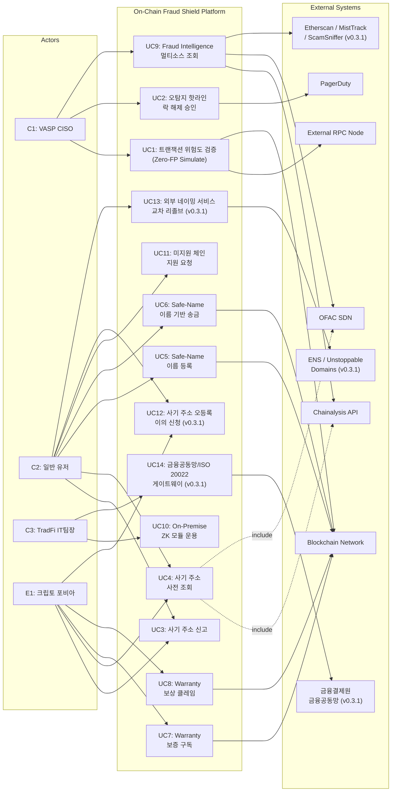

### 3.2.2 Component Diagram

```mermaid
graph TB
    subgraph "Client Layer"
        CL1["VASP SDK / API Client"]
        CL2["Hotline Dashboard<br/>(Web)"]
        CL3["사기 신고·조회<br/>플랫폼 (Web)"]
        CL4["Safe-Name Service<br/>(Web/API)"]
        CL5["Warranty Widget<br/>(Invisible UI)"]
        CL6["Fraud Agent<br/>Dashboard (Web)"]
        CL7["금융공동망/ISO 20022<br/>Gateway Client (v0.3.1)"]
    end

    subgraph "API Gateway Layer"
        GW["API Gateway<br/>(인증·Rate Limit·라우팅)"]
    end

    subgraph "Core Service Layer"
        SVC1["Zero-FP<br/>Simulation Engine"]
        SVC2["Hotline<br/>Management Service"]
        SVC3["Fraud Report<br/>& Lookup Service"]
        SVC4["Safe-Name<br/>Registry Service"]
        SVC5["Warranty<br/>Management Service"]
        SVC6["Fraud Intelligence<br/>Agent Service"]
        SVC7["Notification<br/>Service"]
        SVC8["Dispute<br/>Management Service (v0.3.1)"]
        SVC9["External Naming<br/>Resolver Service (v0.3.1)"]
        SVC10["Financial Gateway<br/>Service (v0.3.1)"]
        SVC11["Meta-Transaction<br/>Relayer Service (v0.3.1)"]
    end

    subgraph "Data Layer"
        DB1[("Primary DB<br/>(PostgreSQL)")]
        DB2[("Fraud Address DB<br/>(Indexed)")]
        CACHE["Caching Layer<br/>(Redis)"]
    end

    subgraph "Blockchain Layer"
        SC1["Safe-Name<br/>Registry Contract"]
        SC2["Warranty<br/>Smart Contract"]
        SC3["NFT Minting<br/>Contract"]
    end

    subgraph "External Integration Layer"
        EXT1["Chainalysis API"]
        EXT2["OFAC SDN API"]
        EXT3["External RPC Nodes<br/>(Alchemy, Infura)"]
        EXT4["Slack API"]
        EXT5["PagerDuty"]
        EXT6["Payment Gateway"]
        EXT7["Etherscan / MistTrack<br/>/ ScamSniffer (v0.3.1)"]
        EXT8["ENS / Unstoppable<br/>Domains (v0.3.1)"]
        EXT9["금융결제원<br/>금융공동망 (v0.3.1)"]
    end

    CL1 --> GW
    CL2 --> GW
    CL3 --> GW
    CL4 --> GW
    CL5 --> GW
    CL6 --> GW
    CL7 --> GW

    GW --> SVC1
    GW --> SVC2
    GW --> SVC3
    GW --> SVC4
    GW --> SVC5
    GW --> SVC6
    GW --> SVC8
    GW --> SVC9
    GW --> SVC10

    SVC1 --> CACHE
    SVC1 --> DB2
    SVC1 --> EXT3
    SVC2 --> DB1
    SVC2 --> SVC7
    SVC3 --> DB1
    SVC3 --> DB2
    SVC3 --> SVC7
    SVC4 --> DB1
    SVC4 --> SC1
    SVC4 --> SVC11
    SVC5 --> DB1
    SVC5 --> SC2
    SVC5 --> SC3
    SVC5 --> EXT6
    SVC6 --> DB2
    SVC6 --> EXT1
    SVC6 --> EXT2
    SVC6 --> EXT7
    SVC8 --> DB1
    SVC8 --> DB2
    SVC8 --> SVC7
    SVC9 --> EXT8
    SVC9 --> SVC3
    SVC10 --> SVC4
    SVC10 --> EXT9
    SVC11 --> SC1

    SVC7 --> EXT4
    SVC7 --> EXT5
```

### 3.3 API Overview

| API | 유형 | 입력 | 출력 | 주요 제약 |
|---|---|---|---|---|
| **Zero-FP Simulate API** | 내부 REST | `TxSimulationRequest` (Raw TX, sender, target, value) | `RiskAssessmentResult` (is_safe, confidence_score, threat_type, fraud_db_matched) | VASP당 10,000 req/sec, Timeout: 100ms |
| **SLA Hotline Override API** | 내부 REST | `tx_hash`, `admin_signature` | Status 200 (성공 여부) | VASP 관리자 멀티시그 사전 인증 필수 |
| **Hotline Ticket API** | 내부 REST | vasp_id, tx_hash, description | ticket_id, status, created_at | VASP당 100 req/min, Timeout: 5,000ms |
| **Fraud Address Lookup API** | 내부 REST | address, chain_id | 사기 이력 (신고 건수, 위험 등급, 소스 목록) | 응답 <= 2초 (p95) |
| **Fraud Report API** | 내부 REST | address, description, evidence_url, chain | 신고 접수 ID, 예상 처리 시간 | 스팸 필터 적용, 동일 주소 중복 신고 제한 |
| **Fraud Dispute API (v0.3.1)** | 내부 REST | address, dispute_reason, evidence_hash, owner_signature | dispute_id, status, estimated_review_time | 주소 소유권 증명 필수, 유저당 3 req/day |
| **Safe-Name Resolve API** | 내부 REST | human_name 또는 address | 매칭된 주소/이름 + 사기 DB 교차 결과 | 응답 <= 500ms, 매칭 정확도 100% |
| **Safe-Name Register API** | 내부 REST | human_name, wallet_address, chain, 온체인 서명 | name_id, tx_receipt, registered_at | 유저당 5 req/day, Timeout: 30,000ms |
| **External Name Resolve API (v0.3.1)** | 내부 REST | external_name (예: "vitalik.eth"), source_type (ens/unstoppable) | 매칭 주소 + 사기 DB 교차 결과 + 원본 소스 | 응답 <= 1,000ms, Adapter Pattern 기반 |
| **Warranty Mint API** | 내부 Web3 | 유저 결제 증빙, wallet_address | NFT Policy 메타데이터 | 스마트 컨트랙트 1:1 연동 |
| **Warranty Claim API** | 내부 REST | policy_id, evidence_hash, claim_description | claim_id, status, estimated_payout_time | 유저당 3 req/claim, Timeout: 30,000ms |
| **Fraud Intelligence Agent API** | 내부 REST | source_filter, risk_level_filter, time_range | 통합 사기 주소 목록, 소스별 상세 | 기관 전용 엔드포인트, API Key 인증 |
| **Chain Support Request API** | 내부 REST | chain_name, contact_email, description | request_id, status | Public, IP당 5 req/day, Timeout: 300ms |
| **Financial Gateway API (v0.3.1)** | 내부 REST | safe_name, amount, message_format (kftc/iso20022) | 금융공동망 전문 또는 ISO 20022 pacs.008 메시지 | 인가 기관 전용, Timeout: 1,000ms |
| **외부 RPC 노드 API** | 외부 REST/RPC | 블록 데이터, TX 내역 | 시뮬레이션용 체인 데이터 | Rate Limit, 월 $5,000 상한 |
| **Chainalysis / OFAC API** | 외부 REST | 주소, 체인 ID | 위험 등급, 제재 여부, 관련 사건 | Rate Limit TBD, 유료 구독 |
| **Etherscan / MistTrack / ScamSniffer API (v0.3.1)** | 외부 REST (무상) | 주소, 체인 ID | 주소 레이블, 사기 여부, 피싱 이력 | 무상 티어 Rate Limit 존재, 커버리지 제한적 |

### 3.4 Interaction Sequences (핵심 시퀀스 다이어그램)

#### 3.4.1 Zero-FP 실시간 트랜잭션 검증 플로우

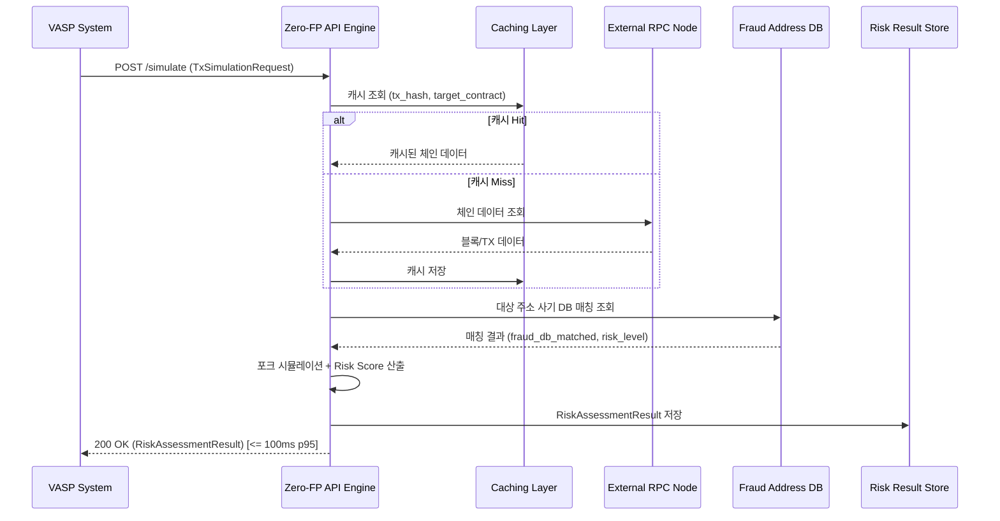

#### 3.4.2 오탐지 핫라인 락 해제 플로우

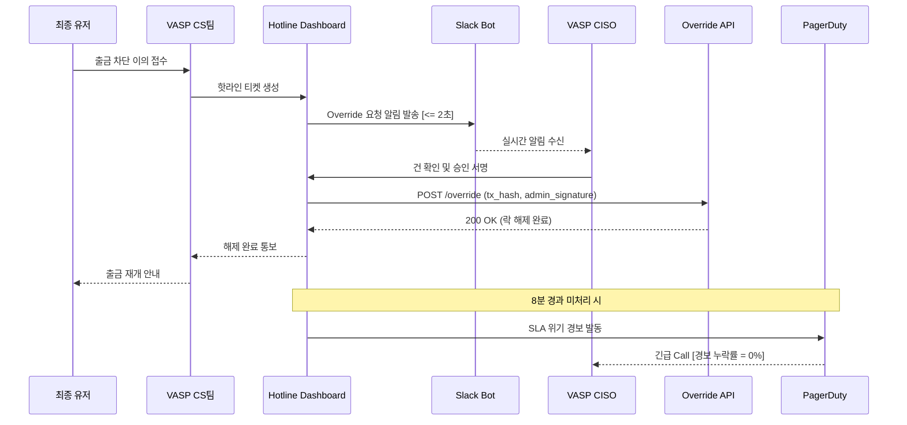

#### 3.4.3 사기 주소 신고 및 사전 조회 플로우

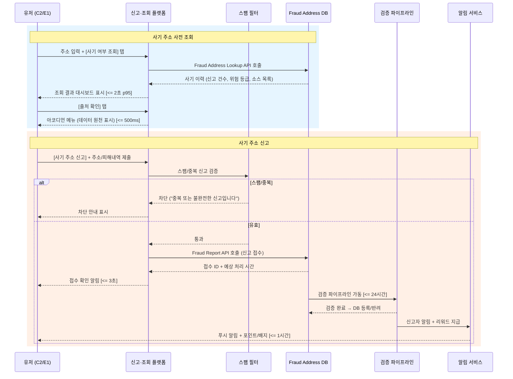

#### 3.4.4 Safe-Name 기반 송금 플로우

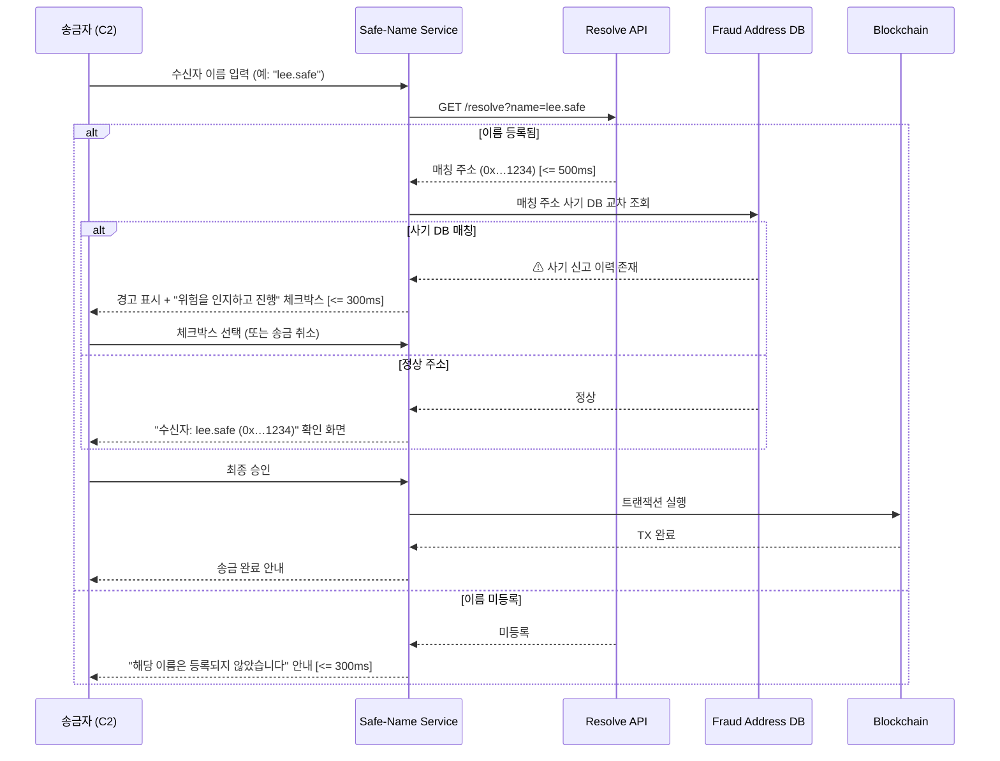

---

## 4. Specific Requirements

### 4.1 Functional Requirements

#### F1. Zero-FP 실시간 API 엔진 (Source: Story 1)

| ID | 요구사항 | Priority | Source | Acceptance Criteria |
|---|---|---|---|---|
| REQ-FUNC-001 | 시스템은 VASP로부터 트랜잭션 서명 전 검증 요청(`TxSimulationRequest`)을 수신하고, 포크 환경 시뮬레이션을 수행하여 Risk Score가 포함된 `RiskAssessmentResult`를 반환해야 한다. | Must | Story 1, AC1 | **Given** 트랜잭션 서명 전 검증 요청이 수신됨 **When** 백엔드 API 엔진이 포크 환경 시뮬레이션을 수행하면 **Then** Risk Score 포함 응답이 반환됨. 응답 시간 <= 100ms (p95) |
| REQ-FUNC-002 | 시스템은 정상 거래를 위협으로 잘못 판별하는 오탐지율(FP Rate)을 <= 0.01%로 유지해야 한다. | Must | Story 1, AC2 | **Given** 10만 건의 정상 거래 요청 발생 **When** 시스템이 서명 필터링을 수행하면 **Then** 오탐지율 <= 0.01% |
| REQ-FUNC-003 | 시스템은 커뮤니티 신고 또는 외부 소스에서 등록된 최신 사기 주소를 5분 이내에 반영하여 Risk Score 산출에 사용해야 한다. | Must | Story 1, AC3 | **Given** 새로운 사기 주소가 DB에 등록됨 **When** 해당 주소가 포함된 검증 요청 수신 **Then** 최신 사기 DB가 반영된 Risk Score 산출. DB 갱신 반영 지연 <= 5분 |
| REQ-FUNC-004 | 외부 RPC 노드(Alchemy 등) 타임아웃 발생 시, 시스템은 자체 Caching Layer를 통해 검증을 지연 없이 수행하거나 적절히 바이패스하여 유저 여정이 중단되지 않아야 한다. | Must | Story 1, AC4 | **Given** 외부 RPC 노드 타임아웃 발생 **When** 검증 요청 수신 **Then** 자체 캐싱을 통해 검증 수행 또는 바이패스. 엔진 가동률 >= 99.99% |
| REQ-FUNC-005 | 미지원 체인의 트랜잭션 검증 요청 시, 시스템은 "해당 체인은 현재 미지원 상태입니다. [지원 요청하기]" 응답을 반환하고 지원 요청을 접수해야 한다. | Must | Story 1, AC5 | **Given** 미지원 체인의 검증 요청 수신 **When** API가 요청을 처리하면 **Then** 미지원 안내 + 지원 요청 제출 가능. 안내 응답 <= 300ms, 요청 제출 성공률 >= 99% |

#### F2. 오탐지 핫라인 SLA 대시보드 (Source: Story 2)

| ID | 요구사항 | Priority | Source | Acceptance Criteria |
|---|---|---|---|---|
| REQ-FUNC-006 | 시스템이 위험 점수(High)로 거래를 자동 차단한 후, 유저가 CS에 예외 처리를 접수하면 CISO의 Slack 봇 및 대시보드로 Override 요청 승인 알림을 즉시 발송해야 한다. | Must | Story 2, AC1 | **Given** 시스템이 High Risk로 거래를 차단하고 유저가 CS에 접수 **When** 핫라인 티켓이 생성되면 **Then** Slack 봇 + 대시보드로 알림 발송. 알림 발송 지연 <= 2초 |
| REQ-FUNC-007 | 핫라인 대시보드에서 권한이 있는 관리자(CISO)가 서명(승인)을 완료하면, 시스템은 즉각 거래 락을 해제하여 트랜잭션이 강제 통과되어야 한다. | Must | Story 2, AC2 | **Given** 핫라인 대시보드에 접수된 건 존재 **When** CISO가 서명을 완료하면 **Then** 거래 락 즉각 해제. 티켓 생성~락 해제 <= 10분 (SLA 100%) |
| REQ-FUNC-008 | 접수된 핫라인 티켓이 8분 이상 미처리 상태일 때, 시스템은 PagerDuty 및 Slack `#urgent` 채널을 통해 자동 경고 콜을 발생시켜야 한다. | Must | Story 2, AC3 | **Given** 핫라인 티켓이 8분 이상 미처리 **When** 시스템 모니터링 룰 발동 **Then** PagerDuty + Slack #urgent 경고. 경보 누락률 = 0% |

#### F3. 사기 주소 신고 및 사전 조회 플랫폼 (Source: Story 3)

| ID | 요구사항 | Priority | Source | Acceptance Criteria |
|---|---|---|---|---|
| REQ-FUNC-009 | 유저가 사기로 의심되는 주소를 발견하여 "[사기 주소 신고]" 버튼을 탭하고 주소 및 피해 내역을 제출하면, 시스템은 신고 접수 확인 알림과 예상 처리 시간을 즉시 표시해야 한다. | Must | Story 3, AC1 | **Given** 유저가 사기 의심 주소 발견 **When** 주소 및 피해 내역 제출 **Then** 접수 확인 알림 + 예상 처리 시간 표시. 신고 접수 응답 <= 3초, 신고 검증 완료 <= 24시간 |
| REQ-FUNC-010 | 유저가 송금 전 상대 주소를 입력하고 "[사기 여부 조회]" 버튼을 탭하면, 시스템은 해당 주소의 사기 이력(신고 건수, 위험 등급, 관련 사건)을 대시보드로 표시하거나, DB 미등록 시 "신고 이력 없음 — 안전을 보장하지 않습니다" 안내를 표시해야 한다. | Must | Story 3, AC2 (수정) | **Given** 유저가 송금 전 상대 주소를 확인하려는 상태 **When** 주소 입력 후 조회 탭 **Then** 사기 이력 대시보드 표시 또는 DB 미등록 안내. 조회 응답 시간 <= 2초 (p95), DB 미등록 주소 안내 정확도 100%. 시스템 전제 조건: 사기 주소 DB 커버리지 >= 85% (NFR REQ-NF-010에서 관리) |
| REQ-FUNC-011 | 사기 주소 조회 결과에서 "[출처 확인]" 버튼을 탭하면, 해당 데이터의 원천(Chainalysis, 커뮤니티 신고, 자체 분석)이 아코디언 메뉴로 표시되어야 한다. | Must | Story 3, AC3 | **Given** 사기 주소 조회 결과 표시 상태 **When** 출처 확인 탭 **Then** 데이터 원천 아코디언 메뉴 표시. 출처 도달 <= 2클릭, 아코디언 렌더 <= 500ms |
| REQ-FUNC-012 | 신고한 사기 주소가 검증/확인 완료되면, 신고자에게 푸시 알림과 리워드(포인트/배지)가 지급되어야 한다. | Must | Story 3, AC4 | **Given** 신고 사기 주소 검증 완료 **When** 확인 반영 시 **Then** 신고자에게 푸시 알림 + 리워드 지급. 확인 후 알림 발송 <= 1시간, 신고자 만족도 >= 4.0/5점 |
| REQ-FUNC-013 | 유저가 동일 주소에 대해 24시간 내 5건 이상 반복 신고하거나, 신고 내용이 빈 문자열인 경우 "중복 또는 불완전한 신고입니다" 안내와 함께 제출을 차단해야 한다. 기존 유효 신고는 영향받지 않아야 한다. | Must | Story 3, AC5 | **Given** 동일 주소 24시간 내 5건 이상 반복 신고 또는 빈 문자열 **When** 제출 시도 **Then** 차단 + 안내 표시, 기존 유효 신고 무영향. 스팸 차단 정확도 >= 95%, 유효 신고 오차단률 <= 2% |

#### F3-A. 사기 주소 오등록(False Report) 이의 신청·심사·해제 (v0.3.1 신규)

| ID | 요구사항 | Priority | Source | Acceptance Criteria |
|---|---|---|---|---|
| **REQ-FUNC-032** | **(v0.3.1)** 사기 주소로 등록된 주소의 실제 소유자가 "[이의 신청]" 버튼을 통해 오등록 해제를 요청할 수 있어야 한다. 이의 신청 시 주소 소유권 증명(온체인 서명)과 반박 증빙(자금 흐름 증빙, 거래 내역 등)을 필수 제출해야 한다. | Must | CR-2, CON-10 | **Given** 사기 DB에 등록된 주소의 소유자가 이의 제기 **When** 주소 소유권 서명 + 반박 증빙 제출 **Then** 이의 접수 확인 + 예상 심사 시간 표시. 접수 응답 <= 3초, 소유권 증명 검증 자동화율 >= 95% |
| **REQ-FUNC-033** | **(v0.3.1)** 이의 신청 접수 후 시스템은 48시간 이내에 심사를 완료해야 한다. 오등록 확인 시: (1) 해당 주소를 사기 DB에서 즉시 해제(status → `cleared`), (2) 원 신고자에게 "오등록 판정" 통보, (3) 동일 신고자의 오신고 누적 3회 이상 시 신고 기능 90일 제한 부과. 이의 기각 시: 기각 사유를 신청자에게 통보하고, 30일 후 재이의 가능 | Must | CR-2, CON-10 | **Given** 이의 신청 접수 완료 **When** 심사 파이프라인 가동 **Then** 48시간 내 심사 완료. 오등록 확인 시 즉시 해제 + 신고자 페널티 적용. 심사 SLA 준수율 >= 95%, 오등록 해제 후 DB 반영 <= 5분 |
| **REQ-FUNC-034** | **(v0.3.1)** 오등록 해제 확인 시, 시스템은 피해 주소 소유자에게 다음을 안내해야 한다: (1) 해제 완료 알림 (푸시 + 이메일), (2) 해당 주소에 대한 재발 방지 모니터링 30일 자동 등록, (3) 오등록으로 인한 실질적 피해(거래 차단 등) 발생 시 고객 지원 채널 연결 안내 | Should | CR-2 | **Given** 오등록 해제 확인 **When** 시스템이 해제 처리 완료 **Then** 피해자 알림 + 30일 모니터링 등록 + 고객 지원 안내. 알림 발송 <= 1시간, 모니터링 등록 성공률 >= 99% |

#### F4. Human-Readable Name 기반 안전 송금 (Source: Story 4)

| ID | 요구사항 | Priority | Source | Acceptance Criteria |
|---|---|---|---|---|
| REQ-FUNC-014 | 유저가 자신의 지갑 주소에 Human-Readable Name(예: "kim.safe")을 입력하고 등록을 완료하면, 해당 이름이 온체인에 기록되고 이후 이름으로 송금 수신이 가능해야 한다. | Must | Story 4, AC1 | **Given** 유저가 이름을 등록하려는 상태 **When** 이름 입력 후 등록 완료 **Then** 온체인 기록 + 이름 기반 수신 가능. 등록 완료 <= 30초, 등록 실패율 < 0.5% |
| REQ-FUNC-015 | 송금자가 수신자의 이름(예: "lee.safe")을 입력하고 "송금" 버튼을 탭하면, 시스템은 이름을 주소로 리졸브하고 매칭된 주소와 함께 확인 화면을 표시한 뒤 최종 승인을 거쳐 트랜잭션을 실행해야 한다. | Must | Story 4, AC2 | **Given** 송금자가 수신자 이름 입력 **When** 송금 버튼 탭 **Then** 이름→주소 리졸브 + "수신자: lee.safe (0x…1234)" 확인 화면 + 최종 승인 후 TX 실행. 리졸브 <= 500ms, 매칭 정확도 100% |
| REQ-FUNC-016 | 이름 기반 송금 시 리졸브된 주소가 사기 DB에 등록되어 있으면, "⚠ 이 주소는 사기 신고 이력이 있습니다" 경고와 상세 정보 링크를 표시하고, 유저가 "위험을 인지하고 진행" 체크박스를 선택해야만 송금 버튼이 활성화되어야 한다. | Must | Story 4, AC3 (수정) | **Given** 리졸브된 주소가 사기 DB 등록 상태 **When** 확인 화면 로드 **Then** 경고 표시 + 체크박스 필수 선택. 경고 표시 <= 300ms, 매칭 주소 경고 표시 성공률 100%, 체크박스 미선택 시 송금 버튼 비활성 100% |
| REQ-FUNC-017 | 송금자가 등록되지 않은 이름을 입력하면 "해당 이름은 등록되지 않았습니다. 주소를 직접 입력하거나 수신자에게 이름 등록을 요청해 주세요." 안내를 표시해야 한다. | Must | Story 4, AC4 | **Given** 미등록 이름 입력 **When** 리졸브 요청 처리 **Then** 미등록 안내 표시. 안내 표시 <= 300ms |

#### F4-A. 외부 네이밍 서비스 연계 및 Safe-Name 통합 (v0.3.1 신규)

| ID | 요구사항 | Priority | Source | Acceptance Criteria |
|---|---|---|---|---|
| **REQ-FUNC-035** | **(v0.3.1)** Safe-Name Resolve API는 외부 네이밍 서비스(ENS `.eth`, Unstoppable Domains `.crypto`/`.wallet` 등) 이름을 입력받아 교차 리졸브를 수행해야 한다. 리졸브된 주소에 대해 사기 DB 교차 검증을 동일하게 적용하고, 결과에 원본 네이밍 소스(ENS/Unstoppable)를 명시해야 한다. | Must | CR-3(가) | **Given** 유저가 "vitalik.eth" 등 외부 네이밍 이름 입력 **When** Resolve API 호출 **Then** 외부 네이밍 서비스에서 주소 리졸브 + 사기 DB 교차 검증 + 소스 명시. 리졸브 <= 1,000ms (p95), 사기 DB 교차 검증 적용률 100% |
| **REQ-FUNC-036** | **(v0.3.1)** Safe-Name 미등록 유저가 외부 네이밍 서비스(ENS 등) 이름을 이미 보유한 경우, "[Safe-Name 원클릭 연동]" 버튼으로 기존 외부 이름을 Safe-Name에 Import하여 Safe-Name 생태계(사기 DB 교차 검증, 이름 기반 송금 등)를 즉시 활용할 수 있어야 한다. | Should | CR-3(가) | **Given** ENS 이름 보유 유저가 Safe-Name 미등록 **When** 원클릭 연동 버튼 탭 + 소유권 검증 **Then** Safe-Name에 외부 이름 Import + 기능 즉시 활성. Import 완료 <= 30초, 소유권 검증 자동화율 >= 95% |

#### F4-B. Safe-Name 가스비 부담 완화 (v0.3.1 신규)

| ID | 요구사항 | Priority | Source | Acceptance Criteria |
|---|---|---|---|---|
| **REQ-FUNC-037** | **(v0.3.1)** Safe-Name 이름 등록·변경 시 메타 트랜잭션(Meta-Transaction / Gasless Relay)을 지원하여, 유저가 가스비를 직접 부담하지 않고 플랫폼 릴레이어가 대납해야 한다. 유저당 일일 무료 메타 TX 한도는 5건이며, 초과 시 유저에게 가스비 직접 부담 안내를 표시해야 한다. | Must | CR-3(나), CON-15 | **Given** 유저가 Safe-Name 등록/변경 요청 **When** 일일 무료 한도 내 **Then** 릴레이어 대납으로 가스비 0원 처리. 한도 초과 시 "일일 무료 한도 초과. 가스비 직접 결제가 필요합니다" 안내 표시. 메타 TX 처리 성공률 >= 99%, 릴레이어 월 비용 <= $2,000 |
| **REQ-FUNC-038** | **(v0.3.1)** 다수의 Safe-Name을 일괄 등록하는 배치 등록(Batch Registration) 기능을 지원하여, 복수 이름을 단일 트랜잭션으로 번들링하고 가스비를 최적화해야 한다. 배치 최대 크기는 1회당 20건이다. | Should | CR-3(나) | **Given** 유저가 2건 이상의 이름 등록 요청 **When** 배치 등록 선택 **Then** 단일 TX 번들링으로 처리. 배치 가스비 <= 개별 등록 합산 대비 60%, 배치 처리 완료 <= 60초 |

#### F4-C. 금융결제원 금융공동망 및 ISO 20022 지원 (v0.3.1 신규)

| ID | 요구사항 | Priority | Source | Acceptance Criteria |
|---|---|---|---|---|
| **REQ-FUNC-039** | **(v0.3.1)** Safe-Name Resolve API의 결과를 금융결제원 금융공동망 전문 형식(계좌이체 전문)으로 변환·응답하는 게이트웨이 엔드포인트(`/api/v1/gateway/kftc`)를 제공해야 한다. Safe-Name → 주소 리졸브 후, 금융공동망 수신자 확인 전문에 매핑하여 응답한다. | Must | CR-3(다) | **Given** TradFi 클라이언트가 금융공동망 게이트웨이 호출 **When** Safe-Name + 금액 + 전문 형식(kftc) 입력 **Then** 금융공동망 수신자 확인 전문 형식으로 응답. 응답 <= 1,000ms (p95), 전문 규격 준수율 100% |
| **REQ-FUNC-040** | **(v0.3.1)** Safe-Name 송금 요청·응답 메시지가 ISO 20022 표준 메시지 구조(pacs.008 송금 지시, pacs.002 처리 상태)를 지원해야 한다. 게이트웨이 엔드포인트(`/api/v1/gateway/iso20022`)를 통해 XML/JSON 형식의 ISO 20022 메시지를 생성·반환하여, 국제 금융 메시징 시스템과 호환되어야 한다. | Must | CR-3(다) | **Given** TradFi 클라이언트가 ISO 20022 게이트웨이 호출 **When** Safe-Name + 금액 + 전문 형식(iso20022) 입력 **Then** pacs.008/pacs.002 표준 메시지 생성·반환. ISO 20022 스키마 검증 통과율 100%, 응답 <= 1,000ms (p95) |

#### F5. 현금 배상 Warranty 보증 (Source: Story 5)

| ID | 요구사항 | Priority | Source | Acceptance Criteria |
|---|---|---|---|---|
| REQ-FUNC-018 | 트랜잭션 서명 전 백그라운드 스캐닝이 안전(Safe)으로 판별되면, 클라이언트 앱 설치 없이 직관적인 "최대 $30K 현금 보상" 팝업 UI가 노출되어야 한다. | Must | Story 5, AC1 | **Given** 백그라운드 스캐닝이 Safe 판별 **When** 거래 진행 전 **Then** Invisible UI 팝업 노출. 팝업 로드 시간 <= 500ms |
| REQ-FUNC-019 | 유저가 보증 프리미엄 구독을 선택하고 결제하면, 온체인 보상 펀드풀과 연동된 보험 증서 NFT가 유저 지갑으로 즉시 자동 발급되어야 한다. | Must | Story 5, AC2 | **Given** 보증 구독 선택 + 결제 완료 **When** 트랜잭션 완료 **Then** 보험 증서 NFT 자동 발급. NFT 민팅 실패율 < 0.1% |
| REQ-FUNC-020 | 엔진의 탐지 오류로 인한 자금 유실이 암호학적으로 입증된 경우, 스마트 컨트랙트의 클레임 조건 충족 시 최대 $30,000 한도 내 보상금이 수동 승인 없이 즉각 유저 지갑으로 릴리즈되어야 한다. | Must | Story 5, AC3 | **Given** 탐지 오류 암호학적 입증 **When** 클레임 조건 충족 **Then** 보상금 자동 릴리즈. 보상금 지급 소요 시간 <= 24시간 |
| REQ-FUNC-021 | Warranty 보증풀 가용 잔고가 총 보증 커버리지 합산의 20% 미만으로 하락하면, 신규 구독 신청 시 "현재 보증풀 잔고가 부족하여 신규 가입이 일시 중단됩니다" 안내를 표시하고 알림 신청을 접수해야 한다. 기존 구독자 보증은 영향 없이 유지되어야 한다. | Must | Story 5, AC4 (수정 추가) | **Given** 보증풀 잔고 < 20% **When** 신규 구독 신청 **Then** 잔고 부족 안내 + 알림 신청, 기존 보증 무영향. 안내 표시 <= 500ms, 기존 보증 영향 건수 = 0건 |
| REQ-FUNC-022 | 유저의 보상 클레임 제출 시 증빙이 암호학적 입증 조건을 충족하지 못하면, 구체적 미충족 항목과 함께 "[증빙 재제출]" 버튼을 표시하고 최대 3회까지 재제출을 허용해야 한다. | Must | Story 5, AC5 (수정 추가) | **Given** 클레임 증빙이 조건 미충족 **When** 검증 완료 **Then** 미충족 사유 + 재제출 버튼 표시 (최대 3회). 사유 고지 응답 <= 10초, 재제출 접수 성공률 >= 99% |
| REQ-FUNC-023 | 클레임 조건이 충족되었으나 스마트 컨트랙트 실행이 2회 연속 실패하면, "자동 배상 처리에 일시적 오류가 발생했습니다" 안내와 함께 운영팀 PagerDuty 에스컬레이션이 발동되어 수동 송금이 진행되어야 한다. | Must | Story 5, AC6 (수정 추가) | **Given** 컨트랙트 실행 2회 연속 실패 **When** 수동 폴백 전환 **Then** 유저 안내 + PagerDuty 에스컬레이션 + 수동 송금. 폴백 전환 알림 <= 1분, 수동 배상 완료 <= 48시간, 전체 배상 SLA <= 72시간 |

#### F6. 기관용 사기 정보 수집 Agent (Source: Story 6)

| ID | 요구사항 | Priority | Source | Acceptance Criteria |
|---|---|---|---|---|
| REQ-FUNC-024 | Agent는 외부 사기 정보 소스(Chainalysis, OFAC, 커뮤니티 신고, **Etherscan Labels, MistTrack, ScamSniffer (v0.3.1 추가)** 등)로부터 스케줄링 또는 실시간 이벤트로 수집을 수행하여, 모든 소스의 사기 주소 데이터를 표준 포맷으로 정규화하여 통합 DB에 적재해야 한다. **정책 변경·접근 차단된 소스는 자동 비활성화하고 대체 소스로 전환한다.** | Should | Story 6, AC1, **CR-1 (v0.3.1 보강)** | **Given** 외부 소스가 연동된 상태 **When** Agent가 수집 수행 **Then** 표준 포맷 정규화 후 통합 DB 적재. 소스별 수집 주기 <= 15분, 정규화 정확도 >= 98%. **(v0.3.1 추가) 소스 정책 변경 감지 시 대체 소스 자동 전환 <= 30일, 전환 중 데이터 수집 중단 없음** |
| REQ-FUNC-025 | CISO가 Agent 대시보드에서 특정 주소 또는 위험 등급으로 필터링하면, 소스별 신고 이력, 위험 등급 변동 추이, 관련 트랜잭션 요약이 한 화면에 표시되어야 한다. | Should | Story 6, AC2 | **Given** CISO가 대시보드 접속 **When** 주소/위험 등급 필터링 **Then** 소스별 이력 + 추이 + TX 요약 표시. 대시보드 로드 <= 3초, 필터 적용 <= 1초 |
| REQ-FUNC-026 | 연동된 외부 소스 중 일부(1~2개)가 타임아웃/5xx 오류 시, 정상 소스 데이터만 적재하고 장애 소스에 "데이터 갱신 실패. 마지막 수집: HH:MM" 안내를 인라인 표시해야 한다. | Should | Story 6, AC3 | **Given** 3개 외부 소스 중 1~2개 장애 **When** Agent가 수집 시도 **Then** 정상 소스 적재 + 장애 소스 인라인 안내. 부분 결과 제공 성공률 >= 99%, 안내 표시까지 <= 500ms |
| REQ-FUNC-027 | 연동된 모든 외부 소스가 동시 장애 시, 자체 커뮤니티 신고 DB 기반의 제한적 결과를 표시하고, 대시보드 상단에 "⚠ 외부 소스 전면 장애 — 자체 신고 DB만 표시 중" 배너 경고를 상시 노출해야 한다. | Should | Story 6, AC4 (수정 추가) | **Given** 모든 외부 소스 동시 장애 **When** Agent가 수집 시도 **Then** 자체 DB 폴백 + 배너 경고 노출. 폴백 전환 <= 3초, 배너 표시 <= 500ms, 대시보드 기능 유지 100% |

#### F6-A. 외부 소스 정책 변경 감지 및 자동 전환 (v0.3.1 신규)

| ID | 요구사항 | Priority | Source | Acceptance Criteria |
|---|---|---|---|---|
| **REQ-FUNC-031** | **(v0.3.1)** Fraud Intelligence Agent는 외부 사기 정보 소스(Chainalysis, OFAC 등)의 API 정책 변경(접근 차단, 가격 인상, 이용약관 변경 등)을 자동 감지해야 한다. 감지 시: (1) Slack `#fraud-source-alert`에 즉시 경보 발송, (2) 사전 정의된 대체 소스 우선순위(무상 소스 최우선: Etherscan Labels → MistTrack → ScamSniffer → 자체 커뮤니티 DB)에 따라 30일 이내 자동 전환을 개시, (3) 전환 기간 중 기존 소스 캐시 데이터를 유지하여 데이터 공백을 방지해야 한다. | Must | CR-1, CON-7, CON-13, CON-14 | **Given** 외부 소스 API가 정책 변경으로 접근 불가 또는 이용 조건 변경됨 **When** Agent가 월 1회 자동 모니터링 또는 수집 시 HTTP 403/변경 감지 **Then** (1) Slack 경보 <= 1분, (2) 대체 소스 전환 개시 <= 24시간, (3) 전환 완료 <= 30일, (4) 전환 중 데이터 수집 중단 0건. 무상 소스 전환 시도를 유료 소스 재계약보다 항상 선행 |

#### F7. TradFi 100% 망분리 ZK 인프라 (Source: Story 7)

| ID | 요구사항 | Priority | Source | Acceptance Criteria |
|---|---|---|---|---|
| REQ-FUNC-028 | 내부 STO 인프라에 설치된 모듈 동작 시, Alchemy/Infura 등 외부 퍼블릭 SaaS 노드로 향하는 아웃바운드 트래픽이 0건이어야 한다. | Should | Story 7, AC1 | **Given** 모듈이 내부 인프라에서 동작 **When** 패킷 모니터링 수행 **Then** 외부 통신 건수 = 0 |
| REQ-FUNC-029 | 폐쇄망 내부에서 자체 노드로 스캐닝 수행 시, 1,000 TPS 이상 트래픽에서도 모듈이 다운타임이나 병목 없이 검증을 처리해야 한다. | Should | Story 7, AC2 | **Given** 폐쇄망 내 자체 노드 운용 **When** 트래픽 >= 1,000 TPS **Then** 다운타임/병목 없이 처리. 가동률 >= 99.99% |
| REQ-FUNC-030 | 당국 감사용 시스템 로그 제출 시, ZK 트랜잭션 증빙 데이터에서 지갑 주소·자산 잔고 등 개인 민감 정보가 암호화되어 일체 노출되지 않음이 수학적으로 입증되어야 한다. | Should | Story 7, AC3 | **Given** 감사용 로그 제출 **When** ZK 증빙 데이터 확인 **Then** 개인 민감 정보 노출 0건 (수학적 입증) |

### 4.2 Non-Functional Requirements

#### 4.2.1 성능 (Performance)

| ID | 요구사항 | 기준 | 측정 경로 | Source |
|---|---|---|---|---|
| REQ-NF-001 | Zero-FP API 검증 응답 시간 | p95 <= 100ms | Datadog APM: `api.simulate.latency_p95` | PRD 5-1, Story 1 AC1 |
| REQ-NF-002 | 사기 주소 조회 응답 시간 | p95 <= 2,000ms | Datadog APM: `api.fraud_lookup.latency_p95` | PRD 5-1, Story 3 AC2 |
| REQ-NF-003 | Safe-Name 리졸브 시간 | p95 <= 500ms | Datadog APM: `api.resolve.latency_p95` | PRD 5-1, Story 4 AC2 |
| REQ-NF-004 | Warranty 팝업 렌더링 시간 | p95 <= 500ms | RUM (Real User Monitoring): `widget.popup.load_p95` | PRD 5-1, Story 5 AC1 |
| REQ-NF-005 | 핫라인 알림 발송 시간 | p95 <= 2,000ms | Datadog: `slack.webhook.latency_p95` | PRD 5-1, Story 2 AC1 |
| REQ-NF-006 | Fraud Agent 대시보드 로드 | p95 <= 3,000ms | Datadog APM: `dashboard.agent.load_p95` | PRD 5-1, Story 6 AC2 |
| REQ-NF-007 | 동시 접속 부하 기준 (Zero-FP API) | 10,000 TPS | k6 부하 테스트: VASP 10곳 × 평균 1,000 TPS 동시 부하 | PRD 5-1 (수정) |
| REQ-NF-008 | 동시 접속 부하 기준 (B2C 엔드포인트) | 동시 접속 500 유저 (피크 1,000) | k6: 혼합 부하 (신고 20% + 조회 50% + Safe-Name 30%) | PRD 5-1 (수정) |
| REQ-NF-009 | 부하 테스트 주기 및 시나리오 | 출시 전 1회 + 분기 1회. 시나리오: ① Zero-FP API 단독 10,000 TPS / 15분, ② B2C 혼합 1,000 동시접속 / 15분, ③ 핫라인+Agent 50 동시접속. p95/p99/에러율 기록 | k6 결과 리포트 (Grafana 대시보드) | PRD 5-1 (수정) |

#### 4.2.2 신뢰성 (Reliability)

| ID | 요구사항 | 기준 | 측정 경로 | Source |
|---|---|---|---|---|
| REQ-NF-010 | 월간 서비스 API 가용성 | >= 99.99% | Datadog Uptime Monitor: 1분 간격 healthcheck | PRD 5-2 |
| REQ-NF-011 | 오탐지율 (FP Rate) | <= 0.01% | Datadog Custom Metric: `fp_count / total_safe_tx × 100` | PRD 5-2, Story 1 AC2 |
| REQ-NF-012 | 핫라인 락 해제 SLA | <= 10분 (초과 시 PagerDuty 에스컬레이션) | Jira SLA 보드: `ticket_created_at → ticket_resolved_at` | PRD 5-2, Story 2 AC2 |
| REQ-NF-013 | 보상 배상 완료 SLA | <= 24시간 (자동), <= 72시간 (수동 폴백 포함) | 온체인 이벤트 로그: `ClaimSubmitted → FundReleased` 타임스탬프 | PRD 5-2, Story 5 AC3/AC6 |
| REQ-NF-014 | 사기 주소 DB 정합성 (오등록률) | <= 0.5% | 월 1회 무작위 200건 샘플 → 외부 3개 소스(Chainalysis, OFAC, Etherscan Labels) 교차 검증. 담당: Data QA팀. 결과: Jira `label:fraud_db_error` | PRD 5-2 (수정) |
| REQ-NF-015 | 사기 신고 처리 SLA | <= 24시간 (접수 → 검증 완료) | Jira SLA 보드: `report_submitted_at → report_verified_at` | PRD 5-2 |
| REQ-NF-016 | Safe-Name 레지스트리 정합성 | 이름↔주소 매핑 불일치율 = 0% | 주 1회 전수 스캔: 온체인 레지스트리 vs 오프체인 캐시 DB 불일치 자동 탐지. 불일치 시 Slack `#safe-name-alert` 즉시 알림. 담당: 백엔드팀 | PRD 5-2 (수정) |
| REQ-NF-017 | 데이터 백업 주기 | 일 1회 (RPO <= 24h) | AWS RDS 자동 스냅샷 + S3 교차 리전 복제 | PRD 5-2 |
| REQ-NF-018 | 사기 DB 갱신 반영 지연 | <= 5분 | Datadog: `fraud_db.sync_delay` | Story 1 AC3 |

#### 4.2.3 보안 (Security)

| ID | 요구사항 | 기준 | 측정 경로 | Source |
|---|---|---|---|---|
| REQ-NF-019 | 핵심 판별 로직 은닉 | 클라이언트(프론트엔드/SDK) 내 로직 노출 0% | 소스코드 스캐닝 및 보안 감사 | PRD 5-3 |
| REQ-NF-020 | HTTPS 전 구간 적용 | TLS 1.2+ 필수 | SSL Labs 등급 A 이상 확인 (출시 전 1회 + 분기 1회) | PRD 5-3 |
| REQ-NF-021 | 사기 신고 데이터 익명화 | 신고자 개인정보 k-anonymity >= 5 적용 | 익명화 파이프라인 단위 테스트 | PRD 5-3 |
| REQ-NF-022 | VASP API 인증 | API Key 기반 인증 + VASP별 Rate Limit 적용 | API Gateway 로그: 인증 실패 건수 모니터링 | PRD 6-2 |

#### 4.2.4 비용 (Cost)

| ID | 요구사항 | 기준 | 측정 경로 | Source |
|---|---|---|---|---|
| REQ-NF-023 | 외부 RPC 비용 통제 | 월간 외부(Alchemy/Infura) API 요금 <= $5,000 | AWS/Node 비용 태깅 모니터링 | PRD 5-3 |
| REQ-NF-024 | 전체 MVP 월 인프라 비용 | <= $15,000 (RPC $5K + AWS Compute/DB $6K + 모니터링/CDN $2K + 버퍼 $2K) | AWS Cost Explorer 월간 리포트 (태그: `project=fraud-shield-mvp`). $12,000 초과 시 Slack `#infra-cost` 알림. 매월 1일 경영진 공유 | PRD 5-3 (수정) |

#### 4.2.5 투명성 (Transparency)

| ID | 요구사항 | 기준 | 측정 경로 | Source |
|---|---|---|---|---|
| REQ-NF-025 | Warranty 보증풀 잔고 투명성 | 보증풀 온체인 잔고를 실시간 퍼블릭 대시보드에 공개. 잔고가 총 커버리지 합산 20% 미만 시 신규 가입 중단 + 기존 구독자 알림 | 대시보드 URL 공개 + Dune Analytics 연동. 잔고 임계치 알림: PagerDuty Tier 1 | PRD 5-3 (수정) |
| REQ-NF-026 | 유사수신/보험업법 헷지 | 대형 손보사 '사이버 배상 책임 보험' B2B 제휴 계약 체결 | 법무법인 컴플라이언스 의견서 확보 | PRD 5-3 |

#### 4.2.6 확장성 (Scalability)

| ID | 요구사항 | 기준 | 측정 경로 | Source |
|---|---|---|---|---|
| REQ-NF-027 | 수평 확장 가능 아키텍처 | API 엔진은 상태 비저장(stateless) 설계로, 트래픽 증가 시 인스턴스 수평 확장으로 10,000 TPS 이상 대응 가능 | 부하 테스트 시 인스턴스 스케일아웃 검증 | PRD 5-1 |
| REQ-NF-028 | 사기 DB 수용 용량 | 최소 1,000,000건의 사기 주소 레코드 저장 및 2초 이내 조회 보장 | DB 벤치마크 테스트 (k6 + DB 모니터링) | PRD 5-1 |

#### 4.2.7 유지보수성 (Maintainability)

| ID | 요구사항 | 기준 | 측정 경로 | Source |
|---|---|---|---|---|
| REQ-NF-029 | 로그 표준화 | 모든 API 응답 시간, 에러 코드, 캐싱 적중률, 사기 DB 동기화 상태 로그 수집 | Datadog / CloudWatch. p95 > 200ms 또는 5xx 지속 시 알림 | PRD 5-4 |
| REQ-NF-030 | 실시간 운영 대시보드 | 실시간 TPS, VASP별 오탐지 접수 건수, PoC 전환율, 사기 신고 일간 건수 | Grafana / Mixpanel. C-Level 주간 리뷰 | PRD 5-4 |
| REQ-NF-031 | 품질 모니터링 | 사기 주소 오등록 신고 건수 및 처리율 | Notion/Jira 보드. 일 5건 초과 시 긴급 대응 | PRD 5-4 |

#### 4.2.8 KPI 관련 NFR

| ID | 요구사항 | 기준 | 측정 경로 | Source |
|---|---|---|---|---|
| REQ-NF-032 | 사기 주소 사전 차단 성공률 (North Star) | >= 95%. 산식: `(사기 DB 매칭 주소 포함 TX 요청 중 차단 건수) / (사기 DB 매칭 주소 포함 TX 요청 총 건수) × 100` | Datadog Custom Metric: `fraud_block_rate`. 주간 p50/p95 트래킹 | PRD 1-3 (수정) |
| REQ-NF-033 | 사기 주소 DB 커버리지 | >= 85% (멀티소스 Agent 통합 기준) | 외부 블랙리스트 DB(Chainalysis, 자체 신고 DB 등) 교차 대비 탐지율 산출 | PRD 1-2 |
| REQ-NF-034 | 시스템 에러 발생 시 배상 SLA 준수율 | 100% (24h 내 처리) | Warranty 스마트 컨트랙트 트랜잭션 기록 | PRD 1-3 보조 KPI |
| REQ-NF-035 | Warranty 구독 월간 이탈률 | <= 5% | 온체인 컨트랙트: `Active→Expired` 전환 / 전체 `Active` × 100. 출시 D30 이후 첫 측정 | PRD 1-3 (수정) |
| REQ-NF-036 | 사기 주소 신고 공유율 | >= 10%. Baseline 확정: 출시 후 4주간 기준선 수립 | Mixpanel: `social_share_click` / `fraud_report_submit` × 100 | PRD 1-3 (수정) |

#### 4.2.9 v0.3.1 추가 NFR

| ID | 요구사항 | 기준 | 측정 경로 | Source |
|---|---|---|---|---|
| **REQ-NF-037** | **(v0.3.1)** Safe-Name 레지스트리 L2 우선 배포 — Safe-Name 레지스트리 컨트랙트는 가스비가 저렴한 L2(Polygon, Arbitrum)에 기본 배포하고, L1(Ethereum)은 선택적 미러링으로 운영한다. L2 등록 가스비가 L1 대비 90% 이상 절감되어야 한다 | L2 등록 가스비 <= L1 대비 10% | L2 가스비 모니터링 대시보드: `safename.gas.l2_vs_l1_ratio` | CR-3(나) |
| **REQ-NF-038** | **(v0.3.1)** 금융공동망·ISO 20022 게이트웨이 응답 시간 | p95 <= 1,000ms | Datadog APM: `api.gateway.kftc.latency_p95`, `api.gateway.iso20022.latency_p95` | CR-3(다) |

---

## 5. Traceability Matrix

| Story | REQ ID | Test Case ID | Priority |
|---|---|---|---|
| Story 1 (Zero-FP Engine) | REQ-FUNC-001 | TC-FUNC-001 | Must |
| Story 1 (Zero-FP Engine) | REQ-FUNC-002 | TC-FUNC-002 | Must |
| Story 1 (Zero-FP Engine) | REQ-FUNC-003 | TC-FUNC-003 | Must |
| Story 1 (Zero-FP Engine) | REQ-FUNC-004 | TC-FUNC-004 | Must |
| Story 1 (Zero-FP Engine) | REQ-FUNC-005 | TC-FUNC-005 | Must |
| Story 2 (SLA Hotline) | REQ-FUNC-006 | TC-FUNC-006 | Must |
| Story 2 (SLA Hotline) | REQ-FUNC-007 | TC-FUNC-007 | Must |
| Story 2 (SLA Hotline) | REQ-FUNC-008 | TC-FUNC-008 | Must |
| Story 3 (Fraud Report & Lookup) | REQ-FUNC-009 | TC-FUNC-009 | Must |
| Story 3 (Fraud Report & Lookup) | REQ-FUNC-010 | TC-FUNC-010 | Must |
| Story 3 (Fraud Report & Lookup) | REQ-FUNC-011 | TC-FUNC-011 | Must |
| Story 3 (Fraud Report & Lookup) | REQ-FUNC-012 | TC-FUNC-012 | Must |
| Story 3 (Fraud Report & Lookup) | REQ-FUNC-013 | TC-FUNC-013 | Must |
| **Story 3-A (False Report Dispute) (v0.3.1)** | **REQ-FUNC-032** | **TC-FUNC-032** | **Must** |
| **Story 3-A (False Report Dispute) (v0.3.1)** | **REQ-FUNC-033** | **TC-FUNC-033** | **Must** |
| **Story 3-A (False Report Dispute) (v0.3.1)** | **REQ-FUNC-034** | **TC-FUNC-034** | **Should** |
| Story 4 (Safe-Name) | REQ-FUNC-014 | TC-FUNC-014 | Must |
| Story 4 (Safe-Name) | REQ-FUNC-015 | TC-FUNC-015 | Must |
| Story 4 (Safe-Name) | REQ-FUNC-016 | TC-FUNC-016 | Must |
| Story 4 (Safe-Name) | REQ-FUNC-017 | TC-FUNC-017 | Must |
| **Story 4-A (External Naming Integration) (v0.3.1)** | **REQ-FUNC-035** | **TC-FUNC-035** | **Must** |
| **Story 4-A (External Naming Integration) (v0.3.1)** | **REQ-FUNC-036** | **TC-FUNC-036** | **Should** |
| **Story 4-B (Gas Fee Optimization) (v0.3.1)** | **REQ-FUNC-037** | **TC-FUNC-037** | **Must** |
| **Story 4-B (Gas Fee Optimization) (v0.3.1)** | **REQ-FUNC-038** | **TC-FUNC-038** | **Should** |
| **Story 4-C (Financial Gateway) (v0.3.1)** | **REQ-FUNC-039** | **TC-FUNC-039** | **Must** |
| **Story 4-C (Financial Gateway) (v0.3.1)** | **REQ-FUNC-040** | **TC-FUNC-040** | **Must** |
| Story 5 (Warranty) | REQ-FUNC-018 | TC-FUNC-018 | Must |
| Story 5 (Warranty) | REQ-FUNC-019 | TC-FUNC-019 | Must |
| Story 5 (Warranty) | REQ-FUNC-020 | TC-FUNC-020 | Must |
| Story 5 (Warranty) | REQ-FUNC-021 | TC-FUNC-021 | Must |
| Story 5 (Warranty) | REQ-FUNC-022 | TC-FUNC-022 | Must |
| Story 5 (Warranty) | REQ-FUNC-023 | TC-FUNC-023 | Must |
| Story 6 (Fraud Agent) | REQ-FUNC-024 | TC-FUNC-024 | Should |
| Story 6 (Fraud Agent) | REQ-FUNC-025 | TC-FUNC-025 | Should |
| Story 6 (Fraud Agent) | REQ-FUNC-026 | TC-FUNC-026 | Should |
| Story 6 (Fraud Agent) | REQ-FUNC-027 | TC-FUNC-027 | Should |
| **Story 6-A (Source Policy Failover) (v0.3.1)** | **REQ-FUNC-031** | **TC-FUNC-031** | **Must** |
| Story 7 (On-Premise ZK) | REQ-FUNC-028 | TC-FUNC-028 | Should |
| Story 7 (On-Premise ZK) | REQ-FUNC-029 | TC-FUNC-029 | Should |
| Story 7 (On-Premise ZK) | REQ-FUNC-030 | TC-FUNC-030 | Should |
| PRD 5-1 (성능) | REQ-NF-001 ~ REQ-NF-009 | TC-NF-001 ~ TC-NF-009 | Must |
| PRD 5-2 (신뢰성) | REQ-NF-010 ~ REQ-NF-018 | TC-NF-010 ~ TC-NF-018 | Must |
| PRD 5-3 (보안) | REQ-NF-019 ~ REQ-NF-022 | TC-NF-019 ~ TC-NF-022 | Must |
| PRD 5-3 (비용) | REQ-NF-023 ~ REQ-NF-024 | TC-NF-023 ~ TC-NF-024 | Must |
| PRD 5-3 (투명성) | REQ-NF-025 ~ REQ-NF-026 | TC-NF-025 ~ TC-NF-026 | Must |
| PRD 5-1 (확장성) | REQ-NF-027 ~ REQ-NF-028 | TC-NF-027 ~ TC-NF-028 | Must |
| PRD 5-4 (유지보수성) | REQ-NF-029 ~ REQ-NF-031 | TC-NF-029 ~ TC-NF-031 | Must |
| PRD 1-3 (KPI) | REQ-NF-032 ~ REQ-NF-036 | TC-NF-032 ~ TC-NF-036 | Must |
| **CR-3(나) (Gas Fee) (v0.3.1)** | **REQ-NF-037** | **TC-NF-037** | **Must** |
| **CR-3(다) (Financial Gateway) (v0.3.1)** | **REQ-NF-038** | **TC-NF-038** | **Must** |

---

## 6. Appendix

### 6.1 API Endpoint List

| # | Endpoint | Method | 설명 | 인증 | Rate Limit | Timeout |
|---|---|---|---|---|---|---|
| A1 | `/api/v1/simulate` | POST | 트랜잭션 위험도 시뮬레이션 (Zero-FP) | API Key (VASP) | VASP당 10,000 req/sec | 100ms |
| A2 | `/api/v1/override` | POST | 오탐지 핫라인 락 해제 | API Key + Admin Multisig | N/A | 5,000ms |
| A3 | `/api/v1/fraud/lookup` | GET | 사기 주소 사전 조회 | Public (Rate Limit 적용) | IP당 100 req/min | 2,000ms |
| A4 | `/api/v1/fraud/report` | POST | 사기 주소 신고 접수 | User Auth Token | 유저당 10 req/day | 5,000ms |
| **A4-1** | **`/api/v1/fraud/dispute`** | **POST** | **사기 주소 오등록 이의 신청 (v0.3.1)** | **User Auth Token + 온체인 서명** | **유저당 3 req/day** | **5,000ms** |
| **A4-2** | **`/api/v1/fraud/dispute/{dispute_id}`** | **GET** | **이의 신청 상태 조회 (v0.3.1)** | **User Auth Token** | **유저당 50 req/day** | **1,000ms** |
| A5 | `/api/v1/resolve` | GET | Safe-Name ↔ 주소 리졸브 | Public (Rate Limit 적용) | IP당 200 req/min | 500ms |
| **A5-1** | **`/api/v1/resolve/external`** | **GET** | **외부 네이밍 서비스(ENS, Unstoppable) 교차 리졸브 (v0.3.1)** | **Public (Rate Limit 적용)** | **IP당 100 req/min** | **1,000ms** |
| A6 | `/api/v1/safename/register` | POST | Safe-Name 이름 등록 | User Auth Token + 온체인 서명 | 유저당 5 req/day | 30,000ms |
| **A6-1** | **`/api/v1/safename/register/batch`** | **POST** | **Safe-Name 배치 등록 (v0.3.1)** | **User Auth Token + 온체인 서명** | **유저당 1 req/day** | **60,000ms** |
| **A6-2** | **`/api/v1/safename/import`** | **POST** | **외부 네이밍 → Safe-Name 원클릭 Import (v0.3.1)** | **User Auth Token + 소유권 증명** | **유저당 5 req/day** | **30,000ms** |
| A7 | `/api/v1/warranty/mint` | POST | Warranty 보험 증서 NFT 발급 | User Auth Token + 결제 증빙 | 유저당 1 req/tx | 60,000ms |
| A8 | `/api/v1/warranty/claim` | POST | Warranty 보상 클레임 제출 | User Auth Token + 암호학적 증빙 | 유저당 3 req/claim | 30,000ms |
| A9 | `/api/v1/agent/intelligence` | GET | 기관용 사기 정보 통합 조회 | API Key (기관 전용) | 기관당 1,000 req/min | 3,000ms |
| A10 | `/api/v1/hotline/tickets` | GET/POST | 핫라인 티켓 조회/생성 | API Key (VASP) | VASP당 100 req/min | 5,000ms |
| A11 | `/api/v1/chain/support-request` | POST | 미지원 체인 지원 요청 | Public | IP당 5 req/day | 300ms |
| **A12** | **`/api/v1/gateway/kftc`** | **POST** | **금융결제원 금융공동망 게이트웨이 (v0.3.1)** | **API Key (인가 기관)** | **기관당 500 req/min** | **1,000ms** |
| **A13** | **`/api/v1/gateway/iso20022`** | **POST** | **ISO 20022 메시지 게이트웨이 (v0.3.1)** | **API Key (인가 기관)** | **기관당 500 req/min** | **1,000ms** |

### 6.2 Entity & Data Model

#### VASP

| 필드 | 타입 | 제약 | 설명 |
|---|---|---|---|
| vasp_id | string | PK | VASP 고유 식별자 |
| company_name | string | NOT NULL | 회사명 |
| api_key | string | UNIQUE, NOT NULL | API 인증 키 |
| plan_type | string | NOT NULL | 요금제 유형 (Freemium / Enterprise) |

#### TX_SIMULATION_REQUEST

| 필드 | 타입 | 제약 | 설명 |
|---|---|---|---|
| request_id | string | PK | 요청 고유 식별자 |
| vasp_id | string | FK → VASP | 요청 VASP |
| tx_hash | string | NOT NULL | 트랜잭션 해시 |
| sender_address | string | NOT NULL | 송신자 주소 |
| target_contract | string | NOT NULL | 대상 컨트랙트/주소 |
| value | float | NOT NULL | 거래 금액 |
| req_timestamp | datetime | NOT NULL | 요청 시각 |

#### RISK_RESULT

| 필드 | 타입 | 제약 | 설명 |
|---|---|---|---|
| result_id | string | PK | 결과 고유 식별자 |
| request_id | string | FK → TX_SIMULATION_REQUEST | 연결 요청 |
| is_safe | boolean | NOT NULL | 안전 여부 |
| confidence_score | int | NOT NULL, 0~100 | 신뢰도 점수 |
| threat_type | string | NULLABLE | 위협 유형 (phishing, rug_pull, blacklist 등) |
| latency_ms | int | NOT NULL | 처리 소요 시간 (ms) |
| fraud_db_matched | boolean | NOT NULL | 사기 DB 매칭 여부 |

#### FRAUD_ADDRESS

| 필드 | 타입 | 제약 | 설명 |
|---|---|---|---|
| fraud_id | string | PK | 사기 주소 레코드 ID |
| chain | string | NOT NULL | 체인 식별자 (ethereum, polygon 등) |
| address | string | NOT NULL, INDEXED | 사기 주소 |
| risk_level | string | NOT NULL | 위험 등급 (low, medium, high, critical) |
| report_count | int | NOT NULL, DEFAULT 0 | 신고 누적 건수 |
| source_type | string | NOT NULL | 소스 유형 (chainalysis, ofac, community, internal, **etherscan, misttrack, scamsniffer (v0.3.1)**) |
| source_detail | string | NULLABLE | 소스 상세 정보 |
| first_reported_at | datetime | NOT NULL | 최초 신고 일시 |
| last_verified_at | datetime | NULLABLE | 최종 검증 일시 |
| status | string | NOT NULL | 상태 (pending, verified, rejected, **disputed, cleared (v0.3.1)**) |

#### FRAUD_REPORT

| 필드 | 타입 | 제약 | 설명 |
|---|---|---|---|
| report_id | string | PK | 신고 고유 식별자 |
| reporter_id | string | FK → USER | 신고자 |
| reported_address | string | NOT NULL | 신고 대상 주소 |
| chain | string | NOT NULL | 체인 식별자 |
| description | string | NOT NULL, MIN 10자 | 피해 내역 설명 |
| evidence_url | string | NULLABLE | 증빙 URL |
| status | string | NOT NULL | 상태 (submitted, verifying, verified, rejected, **false_report (v0.3.1)**) |
| **dispute_count** | **int** | **NOT NULL, DEFAULT 0 (v0.3.1)** | **해당 신고에 대한 이의 신청 건수** |
| reported_at | datetime | NOT NULL | 신고 일시 |
| verified_at | datetime | NULLABLE | 검증 완료 일시 |

#### FRAUD_DISPUTE (v0.3.1 신규)

| 필드 | 타입 | 제약 | 설명 |
|---|---|---|---|
| dispute_id | string | PK | 이의 신청 고유 ID |
| disputed_address | string | NOT NULL, INDEXED | 이의 대상 주소 |
| chain | string | NOT NULL | 체인 식별자 |
| disputant_id | string | FK → USER | 이의 신청자 (주소 소유자) |
| related_fraud_id | string | FK → FRAUD_ADDRESS | 연관 사기 주소 레코드 |
| related_report_id | string | FK → FRAUD_REPORT, NULLABLE | 연관 원 신고 레코드 |
| dispute_reason | string | NOT NULL, MIN 20자 | 이의 사유 상세 |
| evidence_hash | string | NOT NULL | 반박 증빙 해시 (온체인 서명 포함) |
| owner_signature | string | NOT NULL | 주소 소유권 증명 서명 |
| status | string | NOT NULL | 상태 (submitted, reviewing, approved, rejected) |
| reviewer_notes | string | NULLABLE | 심사자 코멘트 |
| submitted_at | datetime | NOT NULL | 이의 제출 일시 |
| reviewed_at | datetime | NULLABLE | 심사 완료 일시 |
| next_dispute_eligible_at | datetime | NULLABLE | 재이의 가능 일시 (기각 시 30일 후) |

#### SAFE_NAME

| 필드 | 타입 | 제약 | 설명 |
|---|---|---|---|
| name_id | string | PK | 이름 레코드 ID |
| human_name | string | UNIQUE, NOT NULL | 사람이 읽을 수 있는 이름 (예: "kim.safe") |
| chain | string | NOT NULL | 체인 식별자 |
| wallet_address | string | NOT NULL | 매핑된 지갑 주소 |
| owner_id | string | FK → USER | 소유자 |
| **external_name_source** | **string** | **NULLABLE (v0.3.1)** | **외부 네이밍 소스 (ens, unstoppable, null=자체 등록)** |
| **external_name** | **string** | **NULLABLE (v0.3.1)** | **Import된 외부 이름 (예: "vitalik.eth")** |
| **registration_method** | **string** | **NOT NULL, DEFAULT 'direct' (v0.3.1)** | **등록 방식 (direct, meta_tx, batch, import)** |
| registered_at | datetime | NOT NULL | 등록 일시 |
| expires_at | datetime | NOT NULL | 만료 일시 |
| status | string | NOT NULL | 상태 (active, expired, suspended) |

#### WARRANTY_POLICY

| 필드 | 타입 | 제약 | 설명 |
|---|---|---|---|
| policy_id | string | PK | 보증 정책 ID |
| subscriber_wallet | string | NOT NULL | 구독자 지갑 주소 |
| max_coverage_usd | float | NOT NULL, DEFAULT 30000 | 최대 보상 한도 (USD) |
| status | string | NOT NULL | 상태 (active, expired, claimed) |
| nft_token_id | string | NULLABLE | 발급된 NFT 토큰 ID |
| created_at | datetime | NOT NULL | 생성 일시 |

#### HOTLINE_TICKET

| 필드 | 타입 | 제약 | 설명 |
|---|---|---|---|
| ticket_id | string | PK | 티켓 고유 ID |
| vasp_id | string | FK → VASP | 소속 VASP |
| tx_hash | string | NOT NULL | 대상 트랜잭션 해시 |
| admin_signature | string | NULLABLE | 관리자 승인 서명 |
| status | string | NOT NULL | 상태 (pending, approved, escalated, resolved) |
| created_at | datetime | NOT NULL | 생성 일시 |
| resolved_at | datetime | NULLABLE | 해결 일시 |

#### USER

| 필드 | 타입 | 제약 | 설명 |
|---|---|---|---|
| user_id | string | PK | 유저 고유 ID |
| wallet_address | string | NOT NULL, UNIQUE | 지갑 주소 |
| email | string | NULLABLE | 이메일 |
| persona_type | string | NULLABLE | 페르소나 유형 (C1, C2, C3, E1) |
| report_reward_points | int | NOT NULL, DEFAULT 0 | 신고 리워드 포인트 |
| **false_report_count** | **int** | **NOT NULL, DEFAULT 0 (v0.3.1)** | **오신고 누적 횟수** |
| **report_restriction_until** | **datetime** | **NULLABLE (v0.3.1)** | **신고 기능 제한 만료 일시 (오신고 3회 시 90일)** |
| created_at | datetime | NOT NULL | 가입 일시 |

#### WARRANTY_CLAIM (v0.3 추가)

| 필드 | 타입 | 제약 | 설명 |
|---|---|---|---|
| claim_id | string | PK | 클레임 고유 ID |
| policy_id | string | FK → WARRANTY_POLICY | 연결된 보증 정책 |
| claimant_wallet | string | NOT NULL | 클레임 제출자 지갑 주소 |
| evidence_hash | string | NOT NULL | 암호학적 증빙 해시 |
| claim_description | string | NOT NULL | 클레임 상세 설명 |
| status | string | NOT NULL | 상태 (submitted, evidence_review, approved, rejected, paid, escalated) |
| attempt_count | int | NOT NULL, DEFAULT 0 | 증빙 제출 시도 횟수 (최대 3) |
| contract_exec_count | int | NOT NULL, DEFAULT 0 | 스마트 컨트랙트 실행 시도 횟수 |
| payout_amount_usd | float | NULLABLE | 실제 지급 금액 (USD) |
| payout_tx_hash | string | NULLABLE | 보상금 지급 트랜잭션 해시 |
| submitted_at | datetime | NOT NULL | 클레임 제출 일시 |
| resolved_at | datetime | NULLABLE | 처리 완료 일시 |

#### FRAUD_INTELLIGENCE_SOURCE (v0.3 추가)

| 필드 | 타입 | 제약 | 설명 |
|---|---|---|---|
| source_id | string | PK | 소스 고유 ID |
| source_type | string | NOT NULL | 소스 유형 (chainalysis, ofac, community, internal, **etherscan, misttrack, scamsniffer (v0.3.1)**) |
| source_name | string | NOT NULL | 소스 표시명 |
| api_endpoint | string | NULLABLE | 외부 API 엔드포인트 URL |
| **is_free** | **boolean** | **NOT NULL, DEFAULT false (v0.3.1)** | **무상 소스 여부** |
| **priority_order** | **int** | **NOT NULL (v0.3.1)** | **대체 전환 우선순위 (1=최우선, 무상 소스 상위)** |
| **policy_status** | **string** | **NOT NULL, DEFAULT 'active' (v0.3.1)** | **API 정책 상태 (active, changed, blocked, deprecated)** |
| **last_policy_check_at** | **datetime** | **NULLABLE (v0.3.1)** | **최종 정책 모니터링 일시** |
| sync_interval_min | int | NOT NULL, DEFAULT 15 | 수집 주기 (분) |
| last_sync_at | datetime | NULLABLE | 최종 수집 성공 일시 |
| last_sync_status | string | NOT NULL | 최종 수집 상태 (success, partial_failure, full_failure) |
| total_records_synced | int | NOT NULL, DEFAULT 0 | 누적 수집 레코드 수 |
| status | string | NOT NULL | 소스 상태 (active, degraded, offline, **policy_blocked (v0.3.1)**) |
| created_at | datetime | NOT NULL | 소스 등록 일시 |

#### Entity Relationship 요약

| 관계 | 설명 |
|---|---|
| VASP ∥--o{ TX_SIMULATION_REQUEST | VASP가 다수의 시뮬레이션 요청을 전송 |
| TX_SIMULATION_REQUEST ∥--∥ RISK_RESULT | 각 요청은 하나의 결과를 생성 |
| VASP ∥--o{ HOTLINE_TICKET | VASP가 다수의 핫라인 티켓을 관리 |
| WARRANTY_POLICY ∥--o{ WARRANTY_CLAIM | 보증 정책에 대해 다수의 클레임 제출 가능 |
| WARRANTY_POLICY ∥--o{ HOTLINE_TICKET | 보증 정책이 클레임 실패 시 핫라인 트리거 |
| USER ∥--o{ FRAUD_REPORT | 유저가 다수의 사기 신고를 제출 |
| FRAUD_REPORT }o--∥ FRAUD_ADDRESS | 사기 신고가 사기 주소 레코드에 기여 |
| USER ∥--o{ SAFE_NAME | 유저가 다수의 Safe-Name을 소유 |
| USER ∥--o{ WARRANTY_POLICY | 유저가 다수의 보증 정책을 구독 |
| RISK_RESULT }o--o∥ FRAUD_ADDRESS | 위험 결과가 사기 주소를 참조 |
| FRAUD_INTELLIGENCE_SOURCE ∥--o{ FRAUD_ADDRESS | 외부 소스가 다수의 사기 주소를 제공 |
| **USER ∥--o{ FRAUD_DISPUTE (v0.3.1)** | **유저가 다수의 이의 신청을 제출** |
| **FRAUD_DISPUTE }o--∥ FRAUD_ADDRESS (v0.3.1)** | **이의 신청이 사기 주소 레코드를 대상으로 함** |
| **FRAUD_DISPUTE }o--o∥ FRAUD_REPORT (v0.3.1)** | **이의 신청이 원 신고 레코드를 참조** |

### 6.2.1 ERD (Entity-Relationship Diagram)

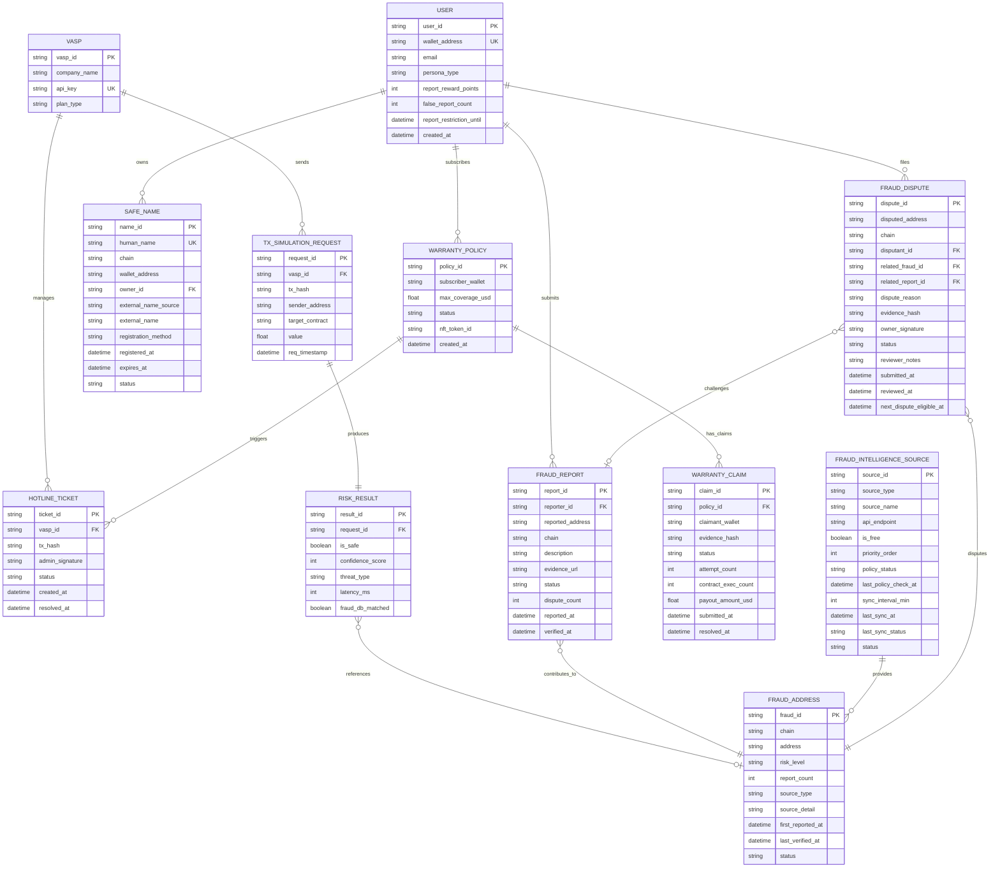

### 6.2.2 Class Diagram (핵심 도메인 모델)

```mermaid
classDiagram
    class TransactionSimulator {
        -cachingLayer: CachingLayer
        -fraudDB: FraudAddressRepository
        -rpcClient: ExternalRPCClient
        +simulate(request: TxSimulationRequest): RiskAssessmentResult
        +checkCache(txHash: string): CacheResult
        +calculateRiskScore(txData: TxData, fraudMatch: FraudMatch): int
    }

    class HotlineManager {
        -ticketRepo: HotlineTicketRepository
        -notificationService: NotificationService
        -slaMonitor: SLAMonitor
        +createTicket(vaspId: string, txHash: string): HotlineTicket
        +approveOverride(ticketId: string, adminSig: string): boolean
        +escalate(ticketId: string): void
    }

    class FraudReportService {
        -fraudAddressRepo: FraudAddressRepository
        -spamFilter: SpamFilter
        -verificationPipeline: VerificationPipeline
        -rewardService: RewardService
        +submitReport(report: FraudReportInput): string
        +lookupAddress(address: string, chainId: string): FraudLookupResult
        +verifyReport(reportId: string): VerificationResult
    }

    class DisputeManager {
        -disputeRepo: FraudDisputeRepository
        -fraudAddressRepo: FraudAddressRepository
        -fraudReportRepo: FraudReportRepository
        -userRepo: UserRepository
        -notificationService: NotificationService
        -signatureVerifier: SignatureVerifier
        +submitDispute(dispute: DisputeInput): FraudDispute
        +verifyOwnership(address: string, signature: string): boolean
        +reviewDispute(disputeId: string): DisputeResult
        +clearAddress(fraudId: string): void
        +applyReporterPenalty(reporterId: string): void
        +registerMonitoring(address: string, days: int): void
    }

    class SafeNameService {
        -nameRegistry: SafeNameRepository
        -blockchainClient: BlockchainClient
        -similarityFilter: SimilarityFilter
        -trademarkDB: TrademarkDB
        -metaTxRelayer: MetaTransactionRelayer
        -externalNameResolver: ExternalNameResolver
        +registerName(name: string, wallet: string): RegistrationResult
        +registerBatch(names: string[], wallet: string): BatchResult
        +registerViaMetaTx(name: string, wallet: string): RegistrationResult
        +resolveName(name: string): ResolveResult
        +resolveExternalName(name: string, source: string): ResolveResult
        +resolveAddress(address: string): ResolveResult
        +validateName(name: string): ValidationResult
        +importExternalName(externalName: string, source: string, wallet: string): ImportResult
    }

    class ExternalNameResolver {
        -ensAdapter: ENSAdapter
        -unstoppableAdapter: UnstoppableDomainsAdapter
        -fraudDB: FraudAddressRepository
        +resolve(name: string, source: string): ExternalResolveResult
        +verifyOwnership(name: string, source: string, wallet: string): boolean
    }

    class MetaTransactionRelayer {
        -relayerWallet: RelayerWallet
        -quotaManager: QuotaManager
        +submitMetaTx(userTx: MetaTransaction): RelayResult
        +checkDailyQuota(userId: string): QuotaStatus
        +estimateGas(tx: Transaction): GasEstimate
    }

    class FinancialGatewayService {
        -safeNameService: SafeNameService
        -kftcFormatter: KFTCMessageFormatter
        -iso20022Formatter: ISO20022MessageFormatter
        +resolveToKFTC(safeName: string, amount: float): KFTCMessage
        +resolveToISO20022(safeName: string, amount: float, msgType: string): ISO20022Message
        +validateMessageSchema(message: any, format: string): ValidationResult
    }

    class WarrantyManager {
        -policyRepo: WarrantyPolicyRepository
        -claimRepo: WarrantyClaimRepository
        -smartContract: WarrantyContract
        -nftMinter: NFTMintingService
        -paymentGateway: PaymentGateway
        +subscribe(wallet: string, payment: PaymentProof): WarrantyPolicy
        +mintPolicyNFT(policyId: string): NFTToken
        +submitClaim(policyId: string, evidence: Evidence): WarrantyClaim
        +processClaim(claimId: string): ClaimResult
        +checkPoolBalance(): PoolStatus
    }

    class FraudIntelligenceAgent {
        -sources: FraudIntelligenceSource[]
        -normalizer: DataNormalizer
        -integratedDB: FraudAddressRepository
        -scheduler: AgentScheduler
        -policyMonitor: SourcePolicyMonitor
        +collectAll(): CollectionResult
        +collectFromSource(sourceId: string): SourceResult
        +normalizeAndStore(rawData: RawFraudData[]): int
        +getSourceStatus(): SourceStatus[]
        +detectPolicyChange(sourceId: string): PolicyChangeResult
        +initiateSourceFailover(sourceId: string): FailoverResult
        +getFailoverPriority(): FraudIntelligenceSource[]
    }

    class SourcePolicyMonitor {
        -sourceRepo: FraudIntelligenceSourceRepository
        -notificationService: NotificationService
        +checkAllPolicies(): PolicyCheckResult[]
        +detectAPIChange(sourceId: string): boolean
        +triggerFailoverAlert(sourceId: string, reason: string): void
    }

    class NotificationService {
        -slackClient: SlackClient
        -pagerDuty: PagerDutyClient
        -pushService: PushNotificationService
        +sendSlackAlert(channel: string, message: string): void
        +triggerPagerDuty(severity: string, details: string): void
        +sendPushNotification(userId: string, payload: NotificationPayload): void
    }

    class CachingLayer {
        -store: RedisClient
        +get(key: string): CacheEntry
        +set(key: string, value: any, ttl: int): void
        +invalidate(key: string): void
        +getHitRate(): float
    }

    TransactionSimulator --> CachingLayer
    TransactionSimulator --> FraudReportService : "fraud DB lookup"
    HotlineManager --> NotificationService
    FraudReportService --> NotificationService
    SafeNameService --> FraudReportService : "fraud DB cross-check"
    SafeNameService --> ExternalNameResolver : "external name resolve"
    SafeNameService --> MetaTransactionRelayer : "gasless tx relay"
    WarrantyManager --> NotificationService
    WarrantyManager --> TransactionSimulator : "risk assessment"
    FraudIntelligenceAgent --> FraudReportService : "updates fraud DB"
    FraudIntelligenceAgent --> SourcePolicyMonitor : "policy monitoring"
    DisputeManager --> FraudReportService : "address status update"
    DisputeManager --> NotificationService : "dispute notifications"
    FinancialGatewayService --> SafeNameService : "name resolve"
    ExternalNameResolver --> FraudReportService : "fraud DB cross-check"
```

### 6.3 Detailed Interaction Models (상세 시퀀스 다이어그램)

#### 6.3.1 Warranty 보상 클레임 전체 플로우 (Happy + Sad Path)

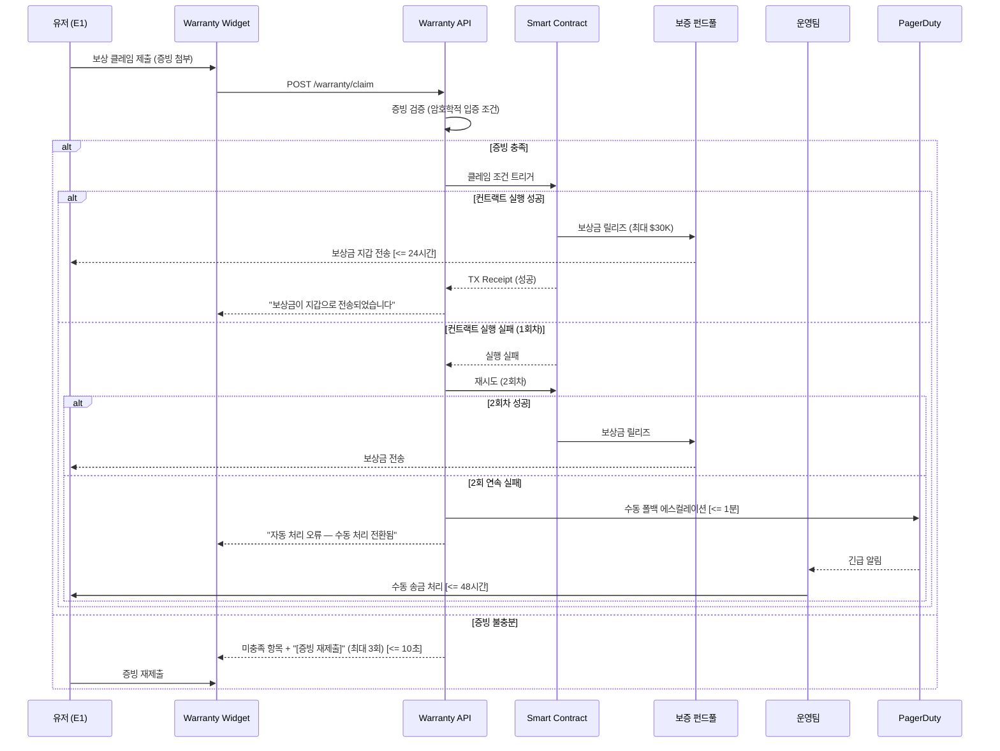

#### 6.3.2 Fraud Intelligence Agent 멀티소스 수집 플로우 (v0.3.1 정책 변경 감지 포함)

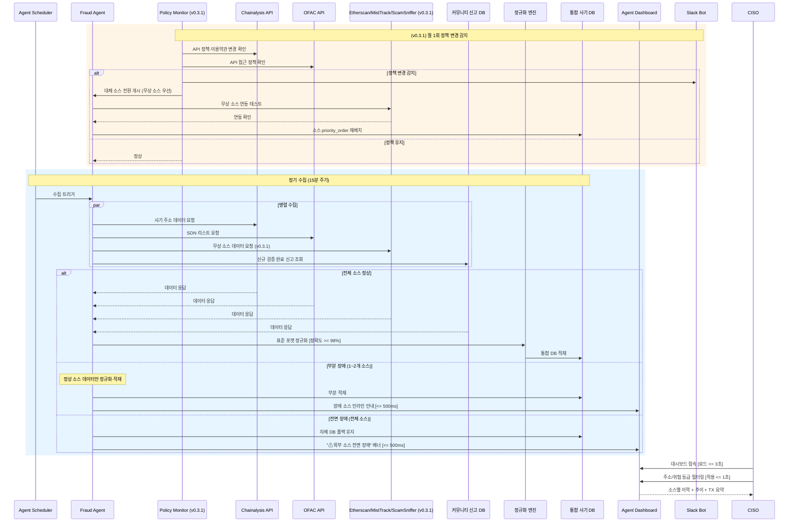

#### 6.3.3 Safe-Name 이름 등록 플로우 (v0.3.1 메타 트랜잭션 포함)

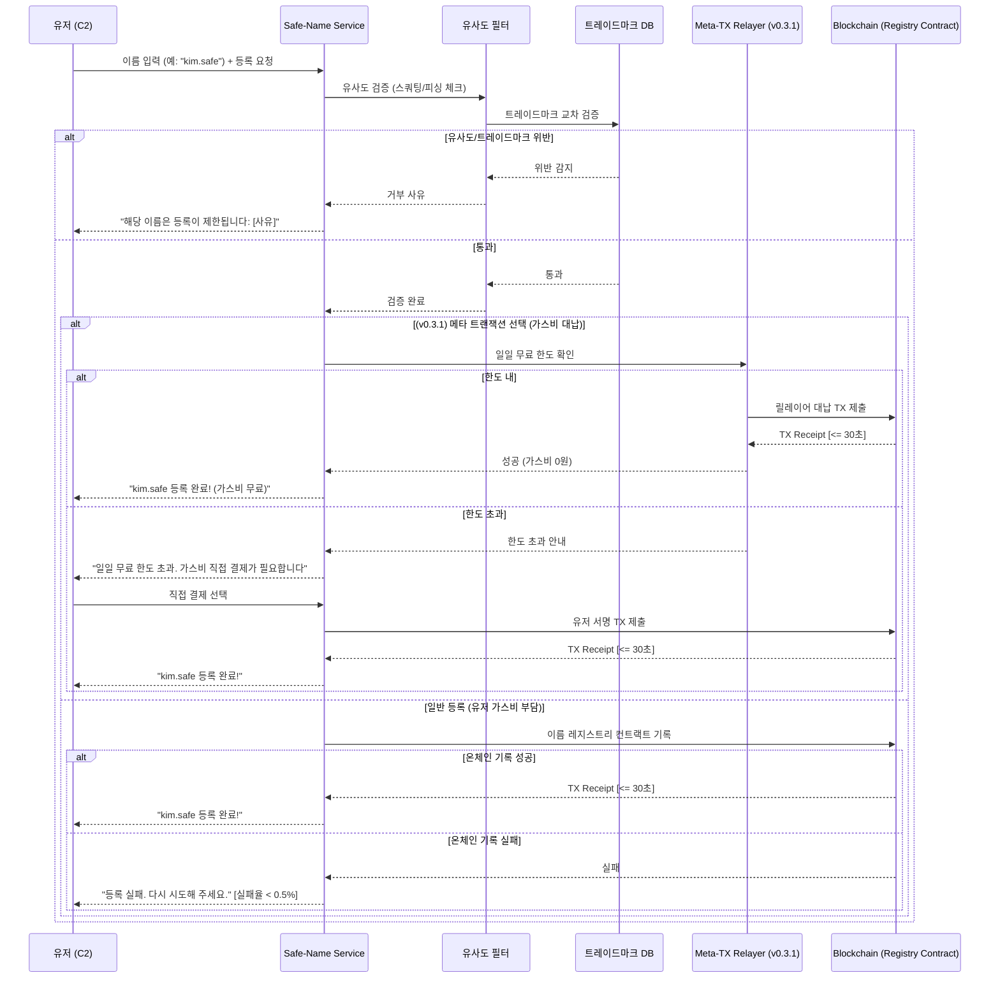

#### 6.3.4 Warranty Invisible UI 팝업 + 구독 + NFT 발급 플로우

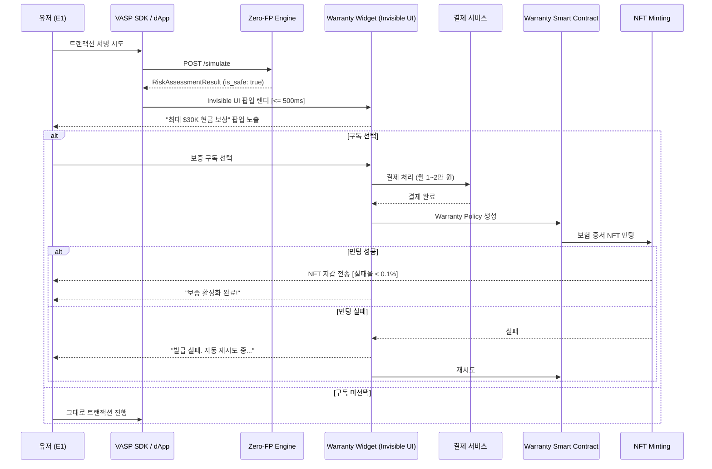

#### 6.3.5 사기 주소 오등록 이의 신청·심사·해제 플로우 (v0.3.1 신규)

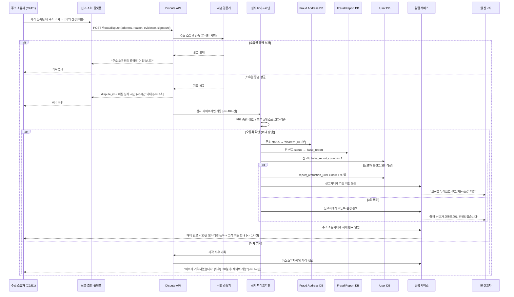

#### 6.3.6 외부 네이밍 서비스 교차 리졸브 플로우 (v0.3.1 신규)

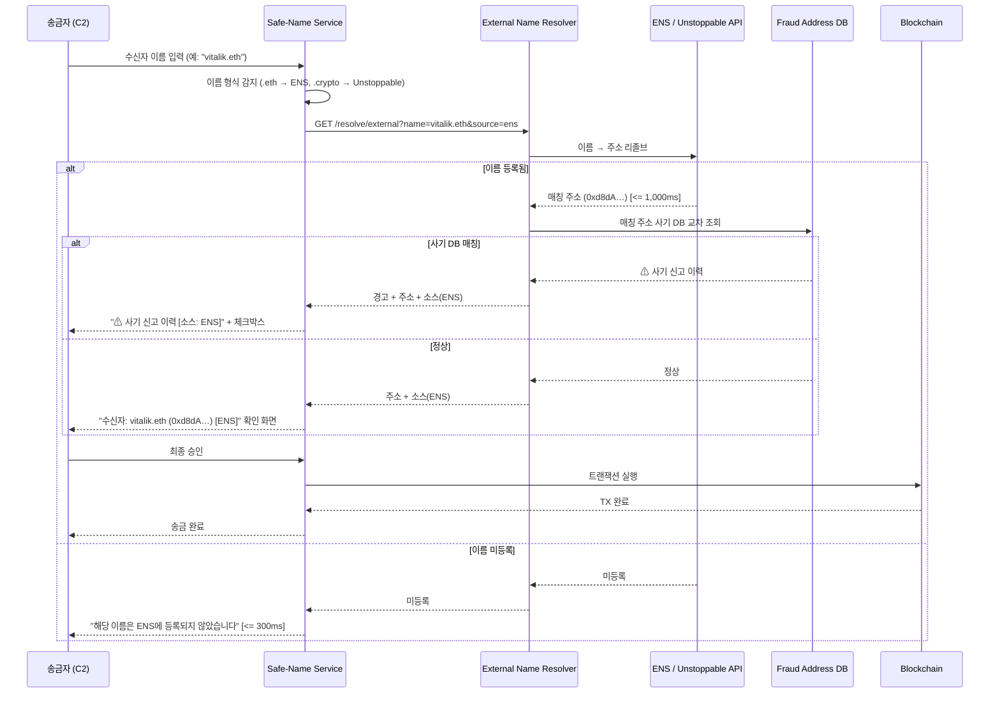

#### 6.3.7 금융공동망·ISO 20022 게이트웨이 플로우 (v0.3.1 신규)

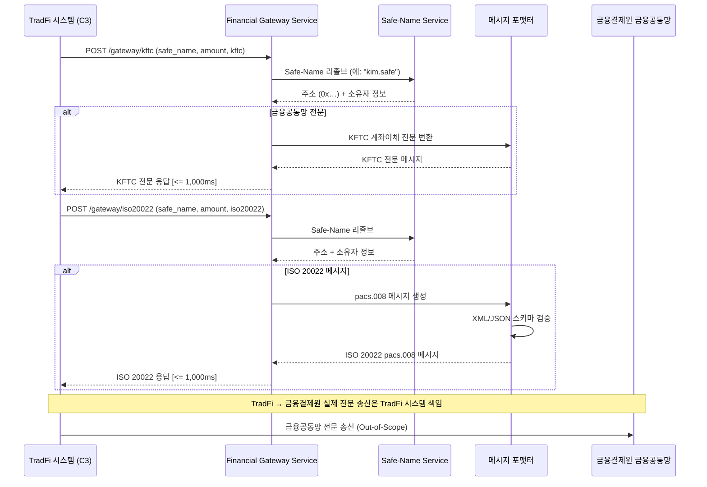

### 6.4 Validation Plan (검증 계획)

| # | 실험 가설 | 실험 설계 | 측정 KPI | 성공 기준 |
|---|---|---|---|---|
| H1 | Zero-FP 엔진 연동 시 오탐지 CS 급감 | A/B Test (n=10,000건): 기존 보안 툴 vs 당사 엔진 CS 발생량 비교 | 일평균 오탐지 CS 건수, 핫라인 SLA 달성률 | CS 티켓 80% 감소, 10분 SLA 100% 달성 |
| H2 | Warranty 구독 유저의 활성도 월등 | 코호트 분석 (n=500명): 구독군 vs 비구독군 1개월 TX 추적 | 주간 인당 평균 TX 수, D30 리텐션 | 활동량 2배 이상, 리텐션 >= 90% |
| H3 | 사기 주소 사전 조회가 피해율 감소 | 코호트 분석 (n=1,000명): 사전 조회 사용군 vs 미사용군 비교. Baseline: Closed Beta 2 미사용군 피해율 (예상 3~5%) | 사기 피해 발생률, 조회→송금 중단율 | 피해율 기준선 대비 70% 감소, 중단율 >= 90% |
| H4 | Safe-Name 등록 유저의 이름 기반 송금 선호 및 오송금 감소 | Within-group (n=200명). Baseline: Closed Beta 1 VASP 월간 오송금 CS 건수 사전 측정 (예상 50~100건) | 이름 기반 송금 비율, 오송금 민원 건수 | 이름 기반 >= 50%, 오송금 기준선 대비 80% 감소 |
| H5 | 커뮤니티 신고가 자체 DB 커버리지 향상 | 누적 분석 (3개월): 신고→검증→DB 등록 파이프라인 추적 | 월간 신고 건수, 커버리지 증가율, 등록 비율 | 월간 신고 >= 500건, 커버리지 >= 85%, 등록 비율 >= 60% |
| **H6** | **(v0.3.1) 이의 신청 프로세스가 오등록 피해를 신속 복구** | **파일럿 (n=50건): 오등록 의심 주소에 이의 신청 → 심사 완료까지 소요 시간 및 정확도 측정** | **심사 완료 SLA 준수율, 오등록 해제 정확도, 유저 만족도** | **48시간 SLA >= 95%, 해제 정확도 >= 98%, 만족도 >= 4.0/5점** |
| **H7** | **(v0.3.1) 메타 트랜잭션이 Safe-Name 등록 전환율 향상** | **A/B Test (n=500명): 메타 TX(가스비 무료)군 vs 일반 등록군 등록 완료율 비교** | **등록 완료율, 이탈율, 등록 소요 시간** | **등록 완료율 30% 이상 향상, 이탈율 50% 감소** |
| **H8** | **(v0.3.1) 무상 소스 전환 시 사기 DB 커버리지 유지** | **전환 시뮬레이션: 유료 소스(Chainalysis) 차단 후 무상 소스 3종만으로 커버리지 측정** | **DB 커버리지, 정규화 정확도, 데이터 공백 기간** | **커버리지 >= 80%, 정확도 >= 95%, 공백 0일** |

---

**— End of Document —**
