# Software Requirements Specification (SRS)

**Document ID:** SRS-001  
**Revision:** 0.33  
**Date:** 2026-05-03  
**Standard:** ISO/IEC/IEEE 29148:2018  
**변경 이력:**
- v0.1 검토 결과 P0·P1 결함 6건 반영 (UseCase·ERD·Class·Component Diagram 추가, Traceability Matrix 보완, 엔터티 스키마 보완, §3.3 API Overview 동기화)
- v0.3.1 보완: CR-1 외부 소스 정책 변경 우회 조치, CR-2 사기 주소 오등록 대응 전략, CR-3 네이밍 서비스 연계·가스비 완화
- v0.31 보완: (1) 이종 온체인 네이밍 서비스 미들웨어(NRM) 전략 (2) Safe-Name 독자 오프체인 레지스트리·DNS식 비용 모델 (3) 통합 알림 게이트웨이 (4) Stakeholders 3계층 분리 및 Client Applications 재배치 (5) MVP 전 컴포넌트 시뮬레이션 모드 아키텍처
- v0.32 보완: (1) 금융결제원 OPEN API·ISO 20022 지원 삭제 (향후 별도 추진) (2) 무료 사기 정보 사이트 정기 수집 전략 + 운영 담당자 승인 워크플로우 신설 (3) 운영기관용 Admin Console을 도메인 기반 5개 관리 콘솔로 분해 — Tier-1/2 Client와 기능 연계 명확화
- **v0.33 보완: Mastercard Crypto Credential(MCC) 대비 송수신자 신뢰성 강화 — (1) 송수신 사전 검증(Pre-Transfer Recipient Verification) 도입 (2) Safe-Name KYC Verification Tier 4단계 체계 + 등록 시 Tier-1 필수 (3) Asset-Chain Compatibility Gate — 미지원 체인·자산 오송금 사전 차단 (4) KYC Verification Service·Chain-Asset Compatibility Service 신규 컴포넌트 (5) SAFE_NAME 엔터티 KYC·호환성 필드 확장, KYC_VERIFICATION_LOG·CHAIN_ASSET_REGISTRY 신규 엔터티**

---

## 1. Introduction

### 1.1 Purpose

본 SRS는 **온체인 사기 방지 플랫폼(On-Chain Fraud Shield Platform)**의 소프트웨어 요구사항을 정의한다. 본 문서는 PRD v0.2(REF-01) 및 PRD v0.2 품질 리뷰 리포트(REF-02)를 유일한 비즈니스·기능 요구의 원천(Source of Truth)으로 사용하며, ISO/IEC/IEEE 29148:2018 표준에 따라 작성되었다.

**해결 대상 문제:**
온체인 금융시장은 공급 과잉·정보 혼돈 상태에 있으며, 다음의 핵심 문제를 해결한다.

| Pain ID | 문제 요약 | 실패 KPI (현 상태) |
|---|---|---|
| CORE-1 | 과도한 오탐지로 VASP의 VIP 정상 출금 차단 및 CS 마비 | 오탐지 CS 처리 지연율(10분 초과) >= 80% |
| CORE-2 | 사람이 인식 불가능한 온체인 주소 구조 — 오송금·피싱 취약 | 주소 기반 오송금 민원 월 15,000~30,000건, 주소 변별 시도 포기율 >= 70% |
| CORE-3 | 퍼블릭 SaaS 망 의존으로 TradFi 인가 탈락 위기 | TradFi 내부 망분리 심사 탈락률 100%, 연 다운타임 >= 10h |
| CJM-1 | 구제/보상 수단이 없는 100% 면책 조항 | 스캠 피해 보상률 0% |
| CJM-2 | 사기 주소 신고 접점 부재 | 사기 주소 신고 가능 플랫폼 접근율 <= 5% |
| EXT-1 | 지속되는 해킹 공포 / 무보증 트라우마 | 스캠 피해 후 서비스 잔존율 <= 10% |
| EXT-2 | 기관의 외부 사기정보 수집 역량 부재 | 기관 자체 사기 DB 커버리지 <= 30% |

**한 줄 비전:** *"수만 건의 오송금 민원과 오탐지를 해결하고, 사람이 읽을 수 있는 이름 기반 안전 거래와 실시간 사기 주소 필터링, 그리고 에러 시 100% 현금 보상을 보장하는 0.1초 온체인 사기 방지 플랫폼"*

### 1.2 Scope (In-Scope / Out-of-Scope)

#### In-Scope (MVP)

| # | 범위 |
|---|---|
| IS-1 | 중앙화 백엔드 검증 API 엔진 (Zero-FP + 사기 DB 연동 기반) |
| IS-2 | VASP 보안 담당자용 Web 핫라인 대시보드 |
| IS-3 | 사기 주소 신고 및 사전 조회 플랫폼 (B2C 웹 기반) |
| IS-4 | Human-Readable Name 독자 등록·리졸브·송금 (Safe-Name Service) — **오프체인 우선 레지스트리 + DNS식 비용 모델 (v0.31 변경)** |
| IS-5 | B2C 보증 스마트 컨트랙트 및 프론트엔드 위젯 팝업 |
| IS-6 | 상위 3~5개 메이저 체인(Ethereum, Polygon, Arbitrum 등) 지원 |
| IS-7 | 사기 주소 오등록(False Report) 이의 신청·심사·해제 프로세스 |
| IS-8 | **이종 온체인 네이밍 서비스 통합 리졸브 미들웨어(NRM) — ENS, Unstoppable Domains, SpaceID, Bonfida 등 플러그인 기반 확장 (v0.31 변경)** |
| ~~IS-9~~ | ~~금융결제원 OPEN API·ISO 20022 게이트웨이~~ **(v0.32 삭제 → Out-of-Scope OS-8로 이동)** |
| **IS-10** | **통합 알림 게이트웨이 (Slack, Email, KakaoTalk, SMS 등 멀티채널 Webhook) (v0.31 신규)** |
| **IS-11** | **운영기관용 도메인별 관리 콘솔 5종 — 사기 정보·Safe-Name·핫라인/SLA·Warranty/보증·시스템 운영 (v0.32 변경)** |
| **IS-12** | **MVP Simulation Mode — 전 컴포넌트 시뮬레이션/목(Mock) 기반 동작 아키텍처 (v0.31 신규)** |

#### Out-of-Scope (명시적 배제)

| # | 배제 항목 | 사유 |
|---|---|---|
| OS-1 | 거래소 매칭 엔진(Matching Engine) 수정 및 침투 | VASP 내부 시스템 비개입 원칙 |
| OS-2 | 개별 DApp 내부 스마트 컨트랙트 코드 직접 보안 감사 | 범위 초과 |
| OS-3 | 개인지갑 App 스토어 출시 | B2B 인프라 공급에 리소스 집중 |
| OS-4 | AI 개인화 투자 추천 | 기술 부채, 데이터 편향 위험 |
| OS-5 | 커뮤니티/리뷰 게시판 | 어뷰징/포지셔닝 훼손 |
| OS-6 | 전체 L1/L2 체인 커버리지 (수백 개) | MVP 범위 초과 |
| OS-7 | 금융결제원 금융공동망 전문(電文) 직접 인터페이스 | 향후 검토 |
| **OS-8** | **금융결제원 OPEN API(예금주·법인명 조회) 및 ISO 20022 메시지 게이트웨이 (v0.32 삭제)** | **향후 별도 추진. 현 MVP에서는 리소스 집중을 위해 배제** |

#### Constraints (제약사항)

| ID | 제약/가정 | 유형 | 검증 방안 | 시한 |
|---|---|---|---|---|
| CON-1 | 자체 Caching 아키텍처가 트래픽의 90% 이상 중복 요청을 커버할 수 있다 | 가정 | PoC 환경 대량 TX 인젝션 테스트 (Hit Rate 측정) | MVP 착수 전 |
| CON-2 | 크립토 포비아 유저층의 WTP(월 1~2만 원)가 실제 결제로 이어진다 | 가정 | B2C 클로즈드 베타 구독 전환율 실측 | 출시 후 1개월 |
| CON-3 | 커뮤니티 사기 주소 신고가 월 500건 이상 유입된다 | 가정 | MVP 출시 후 3개월간 신고 건수 추이 모니터링 | 출시 후 3개월 |
| CON-4 | Safe-Name 등록 유저의 50% 이상이 이름 기반 송금을 실제 사용한다 | 가정 | Closed Beta 내 이름 기반 송금 비율 실측 | 출시 후 3개월 |
| CON-5 | 외부 사기 정보 소스(Chainalysis, OFAC 등) API 응답 속도가 <= 15분 갱신에 부합한다 | 가정 | API 부하 테스트 + 캐시 전략 설계 | MVP 착수 전 |
| CON-6 | 메이저 보험사와의 제휴 계약(B2B 보험 기금 헷징)이 런칭 전 성사된다 | 의존성 | 법무/사업팀 제휴 MOU 체결 | MVP 기획 중 |
| CON-7 | Chainalysis/OFAC API의 외부 개발자 접근 허용 정책이 최소 6개월 유지된다. ▶ 정책 변경 감지 시 30일 이내 대체 소스 전환을 완료한다. 월 1회 API 파트너 문서·변경 로그 자동 모니터링을 수행하며, 변경 감지 시 **통합 알림 게이트웨이 `#fraud-source-alert` 즉시 알림 (v0.31 변경: Slack 한정 → 멀티채널)** | 의존성 | API 파트너 문서 변경 모니터링 + 월 1회 자동 스캔 | 지속 |
| CON-8 | 외부 인프라(RPC) 강세장 트래픽 폭주 시 비용 기하급수 증가 위험 (Risk Score 20, Critical) | 리스크 | 초격차 Caching Layer + 노드 제공자 고정비 상한선 계약 | MVP 착수 전 |
| CON-9 | 스마트 컨트랙트 보증풀의 유사수신·보험업법 위반 간주 가능성 (Risk Score 15, Critical) | 리스크 | 대형 손해보험사 B2B 제휴 + 법무법인 자문 | MVP 기획 중 |
| CON-10 | 사기 주소 오등록(False Report) — 악의적 신고로 무고한 주소 블랙리스트 등록 (Risk Score 15, Critical). ▶ 오등록 발생 시 피해 주소 소유자의 이의 신청을 접수하고 48시간 이내 심사·해제를 완료한다. 반복 오신고자(3회 이상)는 신고 기능 90일 제한한다 | 리스크 | 검증 파이프라인 PoC + 다단계 검증 병행 + 이의 신청·심사 프로세스, 오등록률 0.5% 이하 | MVP 착수 전 |
| CON-11 | Safe-Name 스쿼팅/피싱 — 유명 이름 선점 악용 (Risk Score 16, Critical) | 리스크 | 유사도 필터 + 트레이드마크 DB 교차 검증, UDRP 유사 분쟁 해결 프로세스 | MVP 기획 중 |
| CON-12 | 핫라인 SLA 초과 위약금 페널티 (Risk Score 12, High) | 리스크 | **통합 알림 게이트웨이 에스컬레이션(PagerDuty) 자동화 + 1차 AI 승인 룰셋 (v0.31 변경)** | MVP 개발 중 |
| CON-13 | 외부 사기 정보 소스 API 정책 변경 (Risk Score 8, High). ▶ 복수 외부 소스 병렬 확보 + 자체 커뮤니티 신고 DB 1차 소스 육성. 대체 소스 전환 우선순위: ① Etherscan Labels API(무상) ② MistTrack Open API(무상 티어) ③ ScamSniffer API(무상) ④ 자체 커뮤니티 신고 DB ⑤ Chainalysis(유료) ⑥ OFAC SDN(공공) | 리스크 | 복수 외부 소스 병렬 확보 + 무상 소스 우선 전환 정책 + 자체 커뮤니티 신고 DB 1차 소스 육성 | 지속 |
| CON-14 | 무상 소스 전환 정책 원칙 — 유료 외부 사기 정보 소스가 정책 변경·가격 인상·접근 차단 시, 동등 커버리지의 무상 외부 소스를 최우선 대체 후보로 채택한다. 무상 소스로 커버리지 80% 이상 확보가 불가능한 경우에만 유료 소스 재계약을 검토한다 | 정책 | 분기 1회 소스별 커버리지·품질 비교 리포트 (Data QA팀) | 지속 |
| CON-15 | **(v0.31 변경)** Safe-Name **오프체인 레지스트리 운영 비용(DB·인증·앵커링)이 월 $1,500 이내로 통제 가능하다.** DNS식 연간 등록비($5/년)로 운영비를 상쇄한다. 온체인 앵커링은 일 1회 Merkle Root 기록으로 가스비를 최소화한다 | 가정 | PoC 환경 오프체인 레지스트리 비용 시뮬레이션 (1,000 유저 × 30일) | MVP 착수 전 |
| **CON-16** | **(v0.31 신규)** MVP 전 기간 동안 Simulation Mode로 운영하며, 실제 외부 시스템(RPC, Chainalysis, 블록체인)을 목(Mock)/스텁(Stub)으로 대체한다. 테스트넷(Sepolia, Amoy, Arbitrum Sepolia)을 기본 체인으로 사용한다 | 정책 | MVP 시뮬레이션 PoC + 전환 체크리스트 검증 | MVP 전 기간 |
| **CON-17** | **(v0.31 신규)** Name Resolution Middleware(NRM) 신규 네이밍 서비스 어댑터 추가 시, 코드 배포 없이 설정(Config) 기반으로 무중단 등록이 가능해야 한다 | 가정 | NRM Adapter Registry PoC (어댑터 3종 이상 Hot-Swap 테스트) | MVP 착수 전 |
| ~~CON-18~~ | ~~(v0.31) 금융결제원 OPEN API 핀테크 서비스 등록~~ **(v0.32 삭제 — IS-9 삭제에 따라 제거)** | — | — | — |
| **CON-19** | **(v0.33 신규)** 외부 KYC/KYB 검증 제공자(Mercuryo, Sumsub, Jumio 등) API 응답 시간이 Tier-1 <= 60초, Tier-2 <= 5분을 충족해야 한다. 제공자 장애 시 대체 KYC 제공자로 자동 전환한다. MVP Simulation Mode 시 Mock KYC 응답으로 대체한다 | 의존성 | KYC 제공자 PoC + 대체 제공자 1사 이상 확보 | MVP 착수 전 |
| **CON-20** | **(v0.33 신규)** Safe-Name 등록 시 Tier-1 KYC 필수 정책이 등록 전환율에 미치는 부정적 영향이 10% 이내여야 한다 | 가정 | Closed Beta KYC 필수 등록 전환율 측정 | 출시 후 1개월 |
| **CON-21** | **(v0.33 신규)** CHAIN_ASSET_REGISTRY에 등록된 체인·자산 목록이 실제 블록체인 네트워크 상태와 일치해야 한다. 신규 체인·자산 추가 시 운영기관의 승인을 거친다 | 정책 | 월 1회 레지스트리 정합성 검증 | 지속 |

### 1.3 Definitions, Acronyms, Abbreviations

| 용어 | 정의 |
|---|---|
| VASP | Virtual Asset Service Provider — 가상자산 사업자(거래소 등) |
| CISO | Chief Information Security Officer — 최고 정보보안 책임자 |
| Zero-FP | Zero False-Positive — 오탐지 제로 목표 |
| Safe-Name | Human-Readable Name 기반 온체인 주소 별칭 서비스. **(v0.31 변경) 오프체인 우선 레지스트리 + DNS식 비용 모델** |
| Warranty | 시스템 에러 발생 시 최대 $30,000 현금 보상 보증 스마트 컨트랙트 |
| FP Rate | False Positive Rate — 오탐지율 (정상 거래를 위협으로 잘못 판별한 비율) |
| Risk Score | 트랜잭션 또는 주소의 위험도 점수 |
| TPS | Transactions Per Second — 초당 트랜잭션 처리 수 |
| SLA | Service Level Agreement — 서비스 수준 협약 |
| RPO | Recovery Point Objective — 복구 시점 목표 |
| RTO | Recovery Time Objective — 복구 시간 목표 |
| ZK | Zero-Knowledge (Proof) — 영지식 증명 |
| AOS | Adjusted Opportunity Score — 시장 기회 보정 점수 |
| DOS | Discovered Opportunity Score — 발굴된 기회 점수 |
| JTBD | Jobs to be Done — 고객이 완수하고자 하는 과업 |
| MoSCoW | Must / Should / Could / Won't — 우선순위 분류 프레임워크 |
| Persona | 핵심 이용자 유형의 대표적 인물상 |
| Caching Layer | 외부 RPC 호출 비용 절감 및 응답 속도 향상을 위한 자체 캐싱 계층 |
| Invisible UI | 클라이언트 앱 설치 없이 백그라운드로 렌더링되는 팝업 UI |
| OFAC | Office of Foreign Assets Control — 미국 재무부 해외자산통제국 |
| SDN | Specially Designated Nationals (OFAC 제재 리스트) |
| NFT | Non-Fungible Token — 대체 불가능 토큰 |
| Air-gap | 외부 네트워크와 물리적으로 완전 분리된 폐쇄망 구조 |
| TradFi | Traditional Finance — 전통 금융 |
| STO | Security Token Offering — 증권형 토큰 |
| On-Premise | 고객 내부 인프라에 직접 설치·운영하는 방식 |
| k-anonymity | 개인 식별 방지를 위한 익명화 기법 (동일 속성을 가진 레코드가 최소 k개) |
| ENS | Ethereum Name Service — 이더리움 네이밍 서비스 (.eth 도메인) |
| Meta-Transaction | 유저 대신 릴레이어가 가스비를 대납하여 트랜잭션을 제출하는 방식 (Gasless Relay) |
| ~~ISO 20022~~ | ~~금융 메시지 국제 표준~~ **(v0.32 삭제 — 향후 별도 추진)** |
| False Report | 사기 주소 오등록 — 악의적 또는 실수에 의해 정상 주소가 사기 주소로 잘못 신고·등록되는 상황 |
| Dispute (이의 신청) | 사기 주소로 오등록된 주소의 소유자가 등록 해제를 요청하는 공식 절차 |
| **NRM** | **Name Resolution Middleware — 이종 온체인 네이밍 서비스를 통합 리졸브하는 미들웨어 계층. Adapter Registry 기반 플러그인 아키텍처 (v0.31 신규)** |
| **Naming Adapter** | **NRM의 플러그인 단위. 특정 네이밍 서비스(ENS, Unstoppable, SpaceID 등)와의 연동 로직을 캡슐화한 어댑터 (v0.31 신규)** |
| **Off-Chain First Registry** | **이름 등록·조회를 오프체인 DB에서 수행하고, 소유권 증명·분쟁 해결 시에만 온체인 Merkle Root를 앵커링하는 레지스트리 전략 (v0.31 신규)** |
| **Unified Notification Gateway** | **Slack, Email, KakaoTalk, SMS 등 다양한 알림 채널을 통합 관리하는 게이트웨이 서비스 (v0.31 신규)** |
| ~~금융결제원 OPEN API~~ | ~~금융결제원 오픈뱅킹 REST API~~ **(v0.32 삭제 — 향후 별도 추진)** |
| **Simulation Mode** | **MVP 기간 동안 외부 시스템을 Mock/Stub으로 대체하여 전 기능을 시뮬레이션 환경에서 동작시키는 운영 모드 (v0.31 신규)** |
| **Grace Period** | **Safe-Name 이름 만료 후 기존 소유자에게 갱신 우선권이 부여되는 유예 기간 (30일). DNS 도메인 유예 기간 참조 (v0.31 신규)** |
| **KYC Verification Tier** | **Safe-Name 등록자의 신원 검증 수준을 4단계로 구분: Tier-0(미검증), Tier-1(기본: 이메일·전화번호), Tier-2(신원: ID 문서·생체), Tier-3(기관: 법인 KYB). Mastercard Crypto Credential 참조 (v0.33 신규)** |
| **Verified Badge** | **KYC Tier-2 이상 검증을 완료한 Safe-Name 사용자에게 부여되는 시각적 신뢰 표시. 리졸브 결과에 포함 (v0.33 신규)** |
| **Asset-Chain Compatibility Gate** | **송금 전 수신자의 Safe-Name에 등록된 지원 체인·자산과 송금 체인·자산의 호환성을 검증하여 비호환 시 트랜잭션을 사전 차단하는 검증 게이트 (v0.33 신규)** |
| **Pre-Transfer Recipient Verification** | **송금 실행 전 수신자의 KYC 등급, 체인·자산 호환성, 사기 DB 상태를 종합 검증하는 사전 확인 단계 (v0.33 신규)** |
| **Enhanced Verification** | **일정 금액($1,000) 이상 송금 시 송수신 양측의 KYC Tier-2 이상 검증을 요구하는 강화 검증 (v0.33 신규)** |

### 1.4 References

| ID | 문서명 | 경로/출처 |
|---|---|---|
| REF-01 | PRD v0.2 — 온체인 사기 방지 플랫폼 | `1__PRD_v0_2.md` |
| REF-02 | PRD v0.2 품질 리뷰 리포트 | `2__PRD_v0_2_품질_리뷰_리포트.md` |
| REF-03 | Value Proposition Sheet V2 (fin) | `../3. VPS-Draft/4.Value_Proposition_Sheet_V2(fin).md` |
| REF-04 | Chainalysis Crypto Crime Report (2023) | 외부 공개 보고서 |
| REF-05 | OFAC SDN 제재 리스트 | 외부 공개 데이터 |
| REF-06 | ISO/IEC/IEEE 29148:2018 | 국제 표준 |
| ~~REF-07~~ | ~~ISO 20022 Financial Messaging Standard~~ **(v0.32 삭제)** | — |
| ~~REF-08~~ | ~~금융결제원 OPEN API 기술 규격~~ **(v0.32 삭제)** | — |
| **REF-09** | **ICANN DNS 도메인 생명주기 정책 — 등록·갱신·유예·삭제 절차 (v0.31 신규)** | **ICANN 공개 정책 문서** |

---

## 2. Stakeholders

**(v0.31 변경) Stakeholders를 3계층(고객·이용기관·운영기관)으로 분리하고, 각 계층의 역할·책임·관심사를 명확히 한다.**

### 2.1 Tier-1: 고객 (온체인 사기 방지 서비스 최종 이용자)

| 역할(Role) | 대표 페르소나 | 책임(Responsibility) | 관심사(Interest) |
|---|---|---|---|
| 일반 유저 | C2 이지은 — 온체인 송금 입문자 | 사기 주소 사전 조회, Safe-Name 기반 송금, 사기 주소 신고, 사기 주소 오등록 이의 신청 | 사람이 인식 가능한 이름 기반 송금, 사기 주소 사전 확인, 오등록 시 신속 해제, 가스비 부담 없는 이름 등록 |
| 크립토 포비아 | E1 오재민 — 스캠 자금 유실 피해자 | Warranty 보증 구독, 사기 주소 신고, 보상 클레임, 오등록 이의 신청 | 에러 입증 시 100% 현금 보상 보증, 사기 주소 신고 채널, 피해 복구 |

### 2.2 Tier-2: 이용기관 (고객 앞 온체인 사기 방지 서비스 제공자 및 이용자 관리)

| 역할(Role) | 대표 페르소나 | 책임(Responsibility) | 관심사(Interest) |
|---|---|---|---|
| VASP CISO | C1 김철수 — 대형 거래소 보안책임자 | 트랜잭션 위험 판별 API 연동, 오탐지 핫라인 운영, 사기 정보 수집 Agent 활용, 소속 고객 관리 | 0.1초 제로 오탐지, 10분 락 해제 SLA, 멀티소스 사기 DB Agent, 알림 채널 다양화 |
| TradFi IT팀장 | C3 최수영 — STO 증권사 인프라팀 | On-Premise ZK 모듈 도입, 망분리 규제 준수, 고객 앞 서비스 운영 | 100% 망분리 가능 On-Premise 모듈 **(v0.32 변경: 금융결제원 OPEN API·ISO 20022 삭제)** |

### 2.3 Tier-3: 운영기관 (온체인 사기 방지 서비스 플랫폼 운영) (v0.31 신규)

| 역할(Role) | 대표 페르소나 | 책임(Responsibility) | 관심사(Interest) |
|---|---|---|---|
| 플랫폼 운영자 | O1 박운영 — 플랫폼 운영팀장 | 시스템 전체 모니터링, SLA 관리, 장애 대응, 이용기관·고객 관리, Simulation/Production 모드 전환 관리 | 서비스 가용성 99.99%, 비용 통제, 운영 효율, MVP 시뮬레이션 검증 |
| 컴플라이언스 담당 | O2 한규정 — 컴플라이언스 매니저 | 사기 주소 이의 심사, 오등록 판정, Safe-Name 분쟁 해결(UDRP), 금융 규제 준수 | 이의 심사 SLA 준수, 오등록 해제 정확도, 법적 리스크 최소화 |
| Data QA팀 | O3 정데이터 — 데이터 품질 관리자 | 사기 DB 커버리지·품질 모니터링, 외부 소스 커버리지 비교, 데이터 정합성 검증 | 사기 DB 커버리지 >= 85%, 오등록률 <= 0.5%, 데이터 품질 지표 |

### 2.4 배제 타겟

| 역할(Role) | 사유 |
|---|---|
| N1 은행 | MVP 리소스 투입 전면 금지 |
| N2 맥시멀리스트 | MVP 리소스 투입 전면 금지 |

---

## 3. System Context and Interfaces

### 3.1 External Systems

| 시스템 | 유형 | 역할 | 제약 사항 |
|---|---|---|---|
| 외부 RPC 노드 (Alchemy, Infura 등) | 외부 REST/RPC | 블록 데이터, TX 내역 → 시뮬레이션용 체인 데이터 제공. **(v0.31) MVP 시뮬레이션 시 Mock RPC(Hardhat/Anvil)로 대체** | Rate Limit 초과 시 과금 폭탄 위험 (캐싱 필수), 월 $5,000 상한 |
| Chainalysis API | 외부 REST | 주소 위험 등급, 관련 사건 정보 제공. **(v0.31) MVP 시뮬레이션 시 Stub 응답** | Rate Limit TBD (PoC에서 확인), 유료 구독 |
| OFAC SDN 리스트 | 외부 REST | 제재 대상 주소/엔터티 목록 제공. **(v0.31) MVP 시뮬레이션 시 정적 시드 데이터** | 정책 변경 모니터링 필요 |
| Etherscan Labels API | 외부 REST (무상) | 주소 레이블(사기, 피싱, 해킹 등) 데이터 제공 — 무상 대체 소스 1순위 | Rate Limit: 5 req/sec (무상), 커버리지 Ethereum 메인넷 중심 |
| MistTrack Open API | 외부 REST (무상 티어) | 온체인 자금 추적·사기 주소 데이터 제공 — 무상 대체 소스 2순위 | 무상 티어 일일 호출 한도 존재, 멀티체인 지원 |
| ScamSniffer API | 외부 REST (무상) | 피싱 사이트·사기 컨트랙트 주소 데이터 제공 — 무상 대체 소스 3순위 | 피싱/스캠 특화, 커버리지 범위 제한적 |
| **ENS (Ethereum Name Service)** | **외부 스마트 컨트랙트 / Subgraph API** | **.eth 이름 ↔ 주소 리졸브 — NRM Adapter를 통해 연동** | **Ethereum L1 가스비 의존, 리졸브 API 변경 가능성** |
| **Unstoppable Domains API** | **외부 REST** | **.crypto, .wallet 등 도메인 ↔ 주소 리졸브 — NRM Adapter를 통해 연동** | **API 정책 변경 가능성, Polygon 기반** |
| **SpaceID API (v0.31 신규)** | **외부 REST / 스마트 컨트랙트** | **.bnb 도메인 ↔ 주소 리졸브 — NRM Adapter를 통해 연동** | **BNB Chain 기반, API 안정성 확인 필요** |
| **Bonfida Name Service (v0.31 신규)** | **외부 REST** | **.sol 도메인 ↔ 주소 리졸브 — NRM Adapter를 통해 연동** | **Solana 기반, MVP에서는 Simulation 모드로만 지원** |
| **KYC/KYB Verification Provider (v0.33 신규)** | **외부 REST** | **Safe-Name 등록자의 신원 검증(Tier-1~3) 수행 — 이메일·전화번호 인증(Tier-1), ID 문서·생체 인증(Tier-2), 법인 KYB(Tier-3)** | **외부 KYC 서비스 의존, API 응답 시간 <= 30초, MVP 시뮬레이션 시 Mock KYC 응답** |

| **통합 알림 게이트웨이 연동 대상 (v0.31 변경)** | | | |
| ├ Slack API | 외부 Webhook | 이용기관·운영기관 알림 발송, 내부 경보 채널 연동 | Webhook 응답 시간 의존 |
| ├ Email (Gmail/SMTP) (v0.31 신규) | 외부 SMTP/API | 고객·이용기관 알림 발송 (이의 신청 결과, 이름 등록 확인 등) | 발송 Rate Limit, 스팸 필터 |
| ├ KakaoTalk 알림톡 API (v0.31 신규) | 외부 REST | 고객 알림 발송 (사기 경고, 이름 만료 안내 등) — 한국 시장 특화 | 비즈니스 채널 등록 필요, 건당 과금 |
| └ SMS Gateway (v0.31 신규) | 외부 REST | 긴급 알림 폴백 (핫라인 SLA 위기 등) | 건당 과금, 국제 발송 비용 |
| PagerDuty | 외부 SaaS | SLA 초과 경보, 에스컬레이션 자동 발동 | 외부 SaaS 가용성 의존 |
| Blockchain Networks (Ethereum, Polygon, Arbitrum 등) | 외부 P2P | Safe-Name 온체인 앵커링(Merkle Root), Warranty 스마트 컨트랙트 배포·실행. **(v0.31) MVP 시뮬레이션 시 테스트넷(Sepolia, Amoy, Arbitrum Sepolia) 사용** | 가스비 변동, 네트워크 혼잡 |

### 3.2 Client Applications

**(v0.31 변경) Stakeholders 3계층에 맞춰 Client Applications을 그룹화한다.**

#### 3.2.1 Tier-1 고객용 Client Applications

| 클라이언트 | 대상 사용자 | 기능 |
|---|---|---|
| 사기 주소 신고·조회 플랫폼 (Web) | C2, E1 (일반 유저, 포비아) | 사기 주소 신고 제출, 사기 여부 사전 조회, 출처 확인, 오등록 이의 신청 |
| Safe-Name 서비스 (Web/API) | C2 (일반 유저) | 이름 등록(오프체인 우선), 이름 기반 송금, 주소 리졸브, NRM 외부 네이밍 교차 리졸브, 이름 갱신·만료 관리 |
| Warranty 위젯 (Invisible UI 팝업) | E1 (크립토 포비아) | 보증 팝업 노출, 구독 결제, 보증서 NFT 수령, 클레임 제출 |

#### 3.2.2 Tier-2 이용기관용 Client Applications

| 클라이언트 | 대상 사용자 | 기능 |
|---|---|---|
| VASP 연동 SDK/API | C1 (VASP CISO) | Zero-FP Simulate API 호출, 사기 DB 연동, 핫라인 티켓 관리 |
| B2B 핫라인 대시보드 (Web) | C1 (VASP CISO) | 오탐지 알림 수신(멀티채널), 락 해제 승인, SLA 모니터링 |
| Fraud Intelligence Agent 대시보드 (Web) | C1 (VASP CISO) | 멀티소스 사기 정보 통합 조회, 위험 등급 필터링, 소스 장애 상태 확인 |

#### 3.2.3 Tier-3 운영기관용 Client Applications (v0.32 변경 — 도메인 기반 5개 관리 콘솔)

**(v0.32 변경) 기존 Admin Console·컴플라이언스 대시보드·Data QA 대시보드 3개를 도메인 기반 5개 관리 콘솔로 재분해한다. 각 콘솔은 Tier-1/Tier-2 Client와의 기능 연계를 명확히 하여, 독립 배포 가능한 마이크로 프론트엔드(Micro Frontend) 모듈로 설계한다.**

| # | 콘솔명 | 대상 운영자 | 연계 Tier-1/2 Client | 핵심 기능 |
|---|---|---|---|---|
| OC-1 | **사기 정보 관리 콘솔** | O3 (Data QA팀), O2 (컴플라이언스) | Tier-1 사기 신고·조회 플랫폼, Tier-2 Fraud Agent 대시보드 | 외부 무료 소스 수집 현황 모니터링, **수집 데이터 승인 대기열(v0.32)**, 소스별 커버리지·품질 비교 리포트, 데이터 정합성 검증, 외부 소스 상태 모니터링, 승인/거부 워크플로우 |
| OC-2 | **Safe-Name 관리 콘솔** | O2 (컴플라이언스), O1 (운영자) | Tier-1 Safe-Name 서비스 | 이름 분쟁 심사(UDRP), 프리미엄 이름 분류 기준 관리, 비용 모델 설정(등록비·갱신비), NRM Adapter Registry 관리(어댑터 CRUD), 이름 생명주기 모니터링 |
| OC-3 | **핫라인·SLA 관리 콘솔** | O1 (운영자) | Tier-2 B2B 핫라인 대시보드, Tier-2 VASP SDK/API | 핫라인 SLA 실시간 모니터링, 에스컬레이션 정책 관리, 이용기관(VASP) 계정·API Key 관리, 오탐지 통계 리포트 |
| OC-4 | **Warranty·보증 관리 콘솔** | O1 (운영자), O2 (컴플라이언스) | Tier-1 Warranty 위젯, Tier-1 사기 신고·조회 플랫폼(이의 신청) | 보증풀 잔고 모니터링, 클레임 심사 워크플로우, 이의 신청 심사 대기열·오등록 판정, 보험사 제휴 관리 |
| OC-5 | **시스템 운영 콘솔** | O1 (운영자) | 전체 시스템 공통 | 인프라 모니터링 대시보드(TPS, 가용성, 에러율, 비용), Simulation/Production 모드 전환, 알림 채널 어댑터 관리, 고객 계정 관리, 감사 로그 |

**기능-클라이언트 연계 매핑 매트릭스:**

| Tier-1/2 Client | 연계 운영 콘솔 | 연계 사유 |
|---|---|---|
| 사기 신고·조회 플랫폼 (Tier-1) | OC-1 사기 정보 관리 + OC-4 Warranty·보증 관리 | 신고 데이터 품질 관리, 이의 신청 심사 |
| Safe-Name 서비스 (Tier-1) | OC-2 Safe-Name 관리 | 이름 분쟁, NRM 어댑터, 비용 모델 |
| Warranty 위젯 (Tier-1) | OC-4 Warranty·보증 관리 | 보증풀 잔고, 클레임 심사 |
| VASP SDK/API (Tier-2) | OC-3 핫라인·SLA 관리 | VASP 계정, API Key, SLA |
| B2B 핫라인 대시보드 (Tier-2) | OC-3 핫라인·SLA 관리 | 핫라인 SLA, 에스컬레이션 |
| Fraud Agent 대시보드 (Tier-2) | OC-1 사기 정보 관리 | 소스 수집 현황, 품질 모니터링 |

### 3.2.4 UseCase Diagram

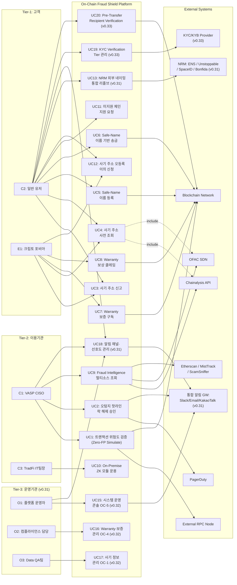

### 3.2.5 Component Diagram

```mermaid
graph TB
    subgraph "Client Layer"
        subgraph "Tier-1: 고객용"
            CL3["사기 신고·조회<br/>플랫폼 (Web)"]
            CL4["Safe-Name Service<br/>(Web/API)"]
            CL5["Warranty Widget<br/>(Invisible UI)"]
        end
        subgraph "Tier-2: 이용기관용"
            CL1["VASP SDK / API Client"]
            CL2["Hotline Dashboard<br/>(Web)"]
            CL6["Fraud Agent<br/>Dashboard (Web)"]

        end
        subgraph "Tier-3: 운영기관용 (v0.32)"
            CL8["OC-1 사기 정보<br/>관리 콘솔"]
            CL9["OC-2 Safe-Name<br/>관리 콘솔"]
            CL10["OC-3 핫라인·SLA<br/>관리 콘솔"]
            CL11["OC-4 Warranty·보증<br/>관리 콘솔"]
            CL12["OC-5 시스템 운영<br/>콘솔"]
        end
    end

    subgraph "API Gateway Layer"
        GW["API Gateway<br/>(인증·Rate Limit·라우팅)"]
    end

    subgraph "Core Service Layer"
        SVC1["Zero-FP<br/>Simulation Engine"]
        SVC2["Hotline<br/>Management Service"]
        SVC3["Fraud Report<br/>& Lookup Service"]
        SVC4["Safe-Name<br/>Registry Service<br/>(Off-Chain First, v0.31)"]
        SVC5["Warranty<br/>Management Service"]
        SVC6["Fraud Intelligence<br/>Agent Service"]
        SVC7["Unified Notification<br/>Gateway (v0.31)"]
        SVC8["Dispute<br/>Management Service"]
        SVC9["Name Resolution<br/>Middleware - NRM (v0.31)"]

        SVC11["On-Chain Anchor<br/>Service (v0.31)"]
        SVC12["Admin &<br/>Operations Service (v0.31)"]
        SVC13["Simulation Mode<br/>Controller (v0.31)"]
        SVC14["KYC Verification<br/>Service (v0.33)"]
        SVC15["Asset-Chain Compatibility<br/>Service (v0.33)"]
    end

    subgraph "Data Layer"
        DB1[("Primary DB<br/>(PostgreSQL)")]
        DB2[("Fraud Address DB<br/>(Indexed)")]
        CACHE["Caching Layer<br/>(Redis)"]
        DB3[("Off-Chain Name<br/>Registry DB (v0.31)")]
    end

    subgraph "Blockchain Layer"
        SC1["Safe-Name<br/>Anchor Contract (v0.31)"]
        SC2["Warranty<br/>Smart Contract"]
        SC3["NFT Minting<br/>Contract"]
    end

    subgraph "NRM Adapter Registry (v0.31)"
        NRM1["ENS Adapter"]
        NRM2["Unstoppable Adapter"]
        NRM3["SpaceID Adapter"]
        NRM4["Bonfida Adapter"]
        NRM5["... (Pluggable)"]
    end

    subgraph "Notification Channel Adapters (v0.31)"
        NA1["Slack Adapter"]
        NA2["Email Adapter"]
        NA3["KakaoTalk Adapter"]
        NA4["SMS Adapter"]
        NA5["... (Pluggable)"]
    end

    subgraph "External Integration Layer"
        EXT1["Chainalysis API"]
        EXT2["OFAC SDN API"]
        EXT3["External RPC Nodes<br/>(Alchemy, Infura)"]
        EXT5["PagerDuty"]
        EXT6["Payment Gateway"]
        EXT7["Etherscan / MistTrack<br/>/ ScamSniffer"]
        EXT8["KYC/KYB Verification<br/>Provider (v0.33)"]

    end

    subgraph "Simulation Layer (v0.31)"
        SIM1["Mock RPC<br/>(Hardhat/Anvil)"]
        SIM2["Stub Fraud DB"]
        SIM3["Testnet Blockchain"]

    end

    CL1 --> GW
    CL2 --> GW
    CL3 --> GW
    CL4 --> GW
    CL5 --> GW
    CL6 --> GW

    CL8 --> GW
    CL9 --> GW
    CL10 --> GW
    CL11 --> GW
    CL12 --> GW

    GW --> SVC1
    GW --> SVC2
    GW --> SVC3
    GW --> SVC4
    GW --> SVC5
    GW --> SVC6
    GW --> SVC8
    GW --> SVC9

    GW --> SVC12

    SVC1 --> CACHE
    SVC1 --> DB2
    SVC1 --> SVC13
    SVC2 --> DB1
    SVC2 --> SVC7
    SVC3 --> DB1
    SVC3 --> DB2
    SVC3 --> SVC7
    SVC4 --> DB3
    SVC4 --> SVC11
    SVC5 --> DB1
    SVC5 --> SC2
    SVC5 --> SC3
    SVC5 --> EXT6
    SVC6 --> DB2
    SVC6 --> EXT1
    SVC6 --> EXT2
    SVC6 --> EXT7
    SVC8 --> DB1
    SVC8 --> DB2
    SVC8 --> SVC7
    SVC9 --> NRM1
    SVC9 --> NRM2
    SVC9 --> NRM3
    SVC9 --> NRM4
    SVC9 --> SVC3

    SVC11 --> SC1
    SVC12 --> DB1
    SVC12 --> SVC13

    SVC7 --> NA1
    SVC7 --> NA2
    SVC7 --> NA3
    SVC7 --> NA4
    SVC7 --> EXT5

    SVC13 --> SIM1
    SVC13 --> SIM2
    SVC13 --> SIM3

    SVC1 -.->|Production| EXT3
    SVC1 -.->|Simulation| SIM1
    SVC4 --> SVC14
    SVC4 --> SVC15
    SVC14 --> EXT8
    SVC14 --> DB1
    SVC15 --> DB1
```

### 3.3 API Overview

| API | 유형 | 입력 | 출력 | 주요 제약 |
|---|---|---|---|---|
| **Zero-FP Simulate API** | 내부 REST | `TxSimulationRequest` (Raw TX, sender, target, value) | `RiskAssessmentResult` (is_safe, confidence_score, threat_type, fraud_db_matched). **(v0.31) Simulation Mode 시 Mock 응답** | VASP당 10,000 req/sec, Timeout: 100ms |
| **SLA Hotline Override API** | 내부 REST | `tx_hash`, `admin_signature` | Status 200 (성공 여부) | VASP 관리자 멀티시그 사전 인증 필수 |
| **Hotline Ticket API** | 내부 REST | vasp_id, tx_hash, description | ticket_id, status, created_at | VASP당 100 req/min, Timeout: 5,000ms |
| **Fraud Address Lookup API** | 내부 REST | address, chain_id | 사기 이력 (신고 건수, 위험 등급, 소스 목록) | 응답 <= 2초 (p95) |
| **Fraud Report API** | 내부 REST | address, description, evidence_url, chain | 신고 접수 ID, 예상 처리 시간 | 스팸 필터 적용, 동일 주소 중복 신고 제한 |
| **Fraud Dispute API** | 내부 REST | address, dispute_reason, evidence_hash, owner_signature | dispute_id, status, estimated_review_time | 주소 소유권 증명 필수, 유저당 3 req/day |
| **Safe-Name Resolve API** | 내부 REST | human_name 또는 address | 매칭된 주소/이름 + 사기 DB 교차 결과 + **등록 상태·만료일 (v0.31)** + **KYC 검증 등급·Verified 배지·수신 가능 체인·자산 (v0.33)** | 응답 <= 500ms, 매칭 정확도 100% |
| **Safe-Name Register API** | 내부 REST | human_name, wallet_address, chain, 소유자 서명, **supported_chains, supported_assets (v0.33)** | name_id, registered_at, expires_at, **annual_fee (v0.31)**, **kyc_tier (v0.33)** | 유저당 5 req/day, Timeout: 5,000ms **(v0.31 변경: 오프체인 등록으로 단축)**, **(v0.33: Tier-1 KYC 필수)** |
| **NRM Unified Resolve API (v0.31 변경)** | 내부 REST | name (예: "vitalik.eth", "alice.bnb"), auto_detect: true | 매칭 주소 + 사기 DB 교차 결과 + 원본 소스 + 체인 정보 | 응답 <= 1,000ms, **NRM Adapter Registry 기반 자동 라우팅** |
| **Warranty Mint API** | 내부 Web3 | 유저 결제 증빙, wallet_address | NFT Policy 메타데이터 | 스마트 컨트랙트 1:1 연동 |
| **Warranty Claim API** | 내부 REST | policy_id, evidence_hash, claim_description | claim_id, status, estimated_payout_time | 유저당 3 req/claim, Timeout: 30,000ms |
| **Fraud Intelligence Agent API** | 내부 REST | source_filter, risk_level_filter, time_range | 통합 사기 주소 목록, 소스별 상세 | 기관 전용 엔드포인트, API Key 인증 |
| **Chain Support Request API** | 내부 REST | chain_name, contact_email, description | request_id, status | Public, IP당 5 req/day, Timeout: 300ms |

| **Notification Preference API (v0.31 신규)** | 내부 REST | user_id 또는 org_id, channel_preferences (slack, email, kakao, sms) | 설정 확인 응답 | 유저당 10 req/day |
| **Admin Operations API (v0.31 신규)** | 내부 REST | operation_type (mode_switch, adapter_manage, system_config) | 작업 결과 | 운영기관 전용, MFA 인증 필수 |
| **Etherscan / MistTrack / ScamSniffer API** | 외부 REST (무상) | 주소, 체인 ID | 주소 레이블, 사기 여부, 피싱 이력 | 무상 티어 Rate Limit 존재, 커버리지 제한적 |
| **KYC Verification API (v0.33 신규)** | 내부 REST | user_id, name_id, tier_requested, evidence_data | verification_id, status, tier_granted, verified_at | 유저당 3 req/day, Timeout: 30,000ms (외부 KYC 의존) |
| **Pre-Transfer Verification API (v0.33 신규)** | 내부 REST | sender_name, recipient_name, asset, chain, amount | recipient_kyc_tier, verified_badge, chain_compatible, asset_compatible, fraud_db_status, verification_summary | 응답 <= 1,000ms, 호환성 검증 정확도 100% |
| **Chain-Asset Registry API (v0.33 신규)** | 내부 REST | chain_id 또는 asset_symbol | 지원 체인·자산 목록, 호환성 매트릭스 | Public (Rate Limit), IP당 100 req/min |

### 3.4 Interaction Sequences (핵심 시퀀스 다이어그램)

#### 3.4.1 Zero-FP 실시간 트랜잭션 검증 플로우 (v0.31 Simulation Mode 포함)

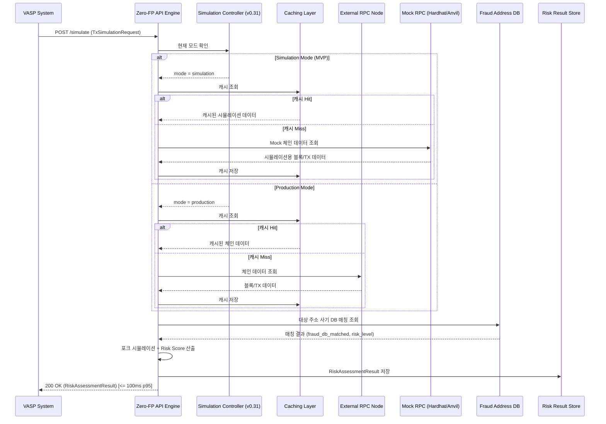

#### 3.4.2 오탐지 핫라인 락 해제 플로우 (v0.31 멀티채널 알림)

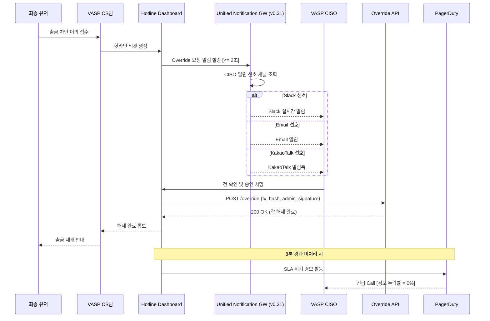

#### 3.4.3 사기 주소 신고 및 사전 조회 플로우

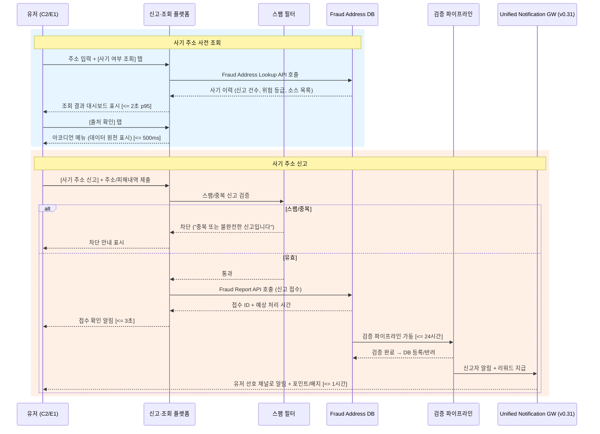

#### 3.4.4 Safe-Name 기반 송금 플로우 (v0.33 변경: Pre-Transfer Verification 추가)

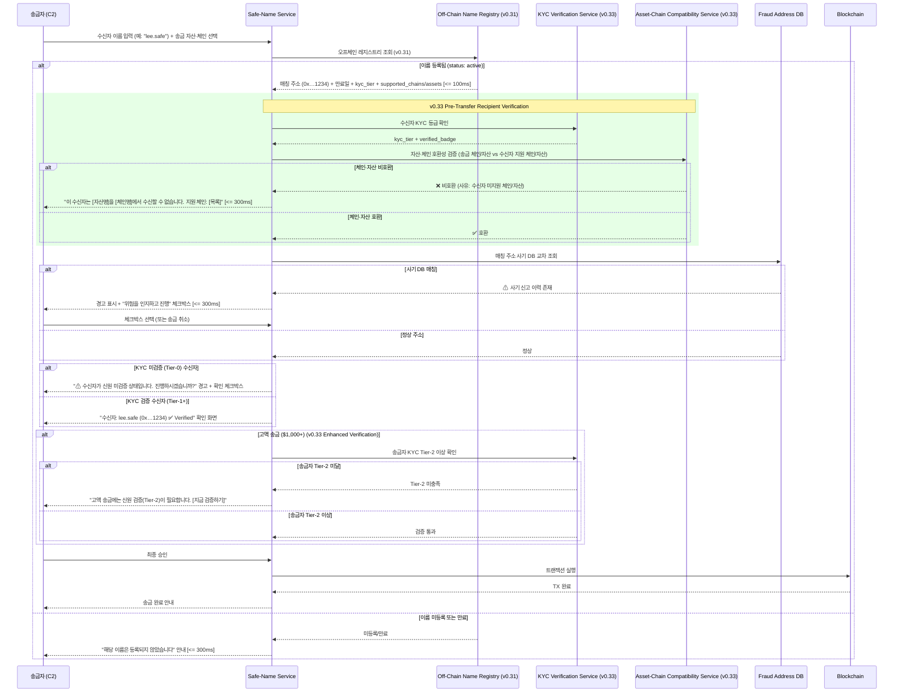

---

## 4. Specific Requirements

### 4.1 Functional Requirements

#### F1. Zero-FP 실시간 API 엔진 (Source: Story 1)

| ID | 요구사항 | Priority | Source | Acceptance Criteria |
|---|---|---|---|---|
| REQ-FUNC-001 | 시스템은 VASP로부터 트랜잭션 서명 전 검증 요청(`TxSimulationRequest`)을 수신하고, 포크 환경 시뮬레이션을 수행하여 Risk Score가 포함된 `RiskAssessmentResult`를 반환해야 한다. **(v0.31) Simulation Mode 시 Mock RPC 데이터 기반으로 동일한 응답 구조를 반환한다.** | Must | Story 1, AC1 | **Given** 트랜잭션 서명 전 검증 요청이 수신됨 **When** 백엔드 API 엔진이 포크 환경 시뮬레이션을 수행하면 **Then** Risk Score 포함 응답이 반환됨. 응답 시간 <= 100ms (p95). **(v0.31) Simulation Mode에서도 동일 응답 구조·지연시간 준수** |
| REQ-FUNC-002 | 시스템은 정상 거래를 위협으로 잘못 판별하는 오탐지율(FP Rate)을 <= 0.01%로 유지해야 한다. | Must | Story 1, AC2 | **Given** 10만 건의 정상 거래 요청 발생 **When** 시스템이 서명 필터링을 수행하면 **Then** 오탐지율 <= 0.01% |
| REQ-FUNC-003 | 시스템은 커뮤니티 신고 또는 외부 소스에서 등록된 최신 사기 주소를 5분 이내에 반영하여 Risk Score 산출에 사용해야 한다. | Must | Story 1, AC3 | **Given** 새로운 사기 주소가 DB에 등록됨 **When** 해당 주소가 포함된 검증 요청 수신 **Then** 최신 사기 DB가 반영된 Risk Score 산출. DB 갱신 반영 지연 <= 5분 |
| REQ-FUNC-004 | 외부 RPC 노드(Alchemy 등) 타임아웃 발생 시, 시스템은 자체 Caching Layer를 통해 검증을 지연 없이 수행하거나 적절히 바이패스하여 유저 여정이 중단되지 않아야 한다. **(v0.31) Simulation Mode 시 Mock RPC가 이 역할을 대체한다.** | Must | Story 1, AC4 | **Given** 외부 RPC 노드 타임아웃 발생 **When** 검증 요청 수신 **Then** 자체 캐싱을 통해 검증 수행 또는 바이패스. 엔진 가동률 >= 99.99% |
| REQ-FUNC-005 | 미지원 체인의 트랜잭션 검증 요청 시, 시스템은 "해당 체인은 현재 미지원 상태입니다. [지원 요청하기]" 응답을 반환하고 지원 요청을 접수해야 한다. | Must | Story 1, AC5 | **Given** 미지원 체인의 검증 요청 수신 **When** API가 요청을 처리하면 **Then** 미지원 안내 + 지원 요청 제출 가능. 안내 응답 <= 300ms, 요청 제출 성공률 >= 99% |

#### F2. 오탐지 핫라인 SLA 대시보드 (Source: Story 2)

| ID | 요구사항 | Priority | Source | Acceptance Criteria |
|---|---|---|---|---|
| REQ-FUNC-006 | 시스템이 위험 점수(High)로 거래를 자동 차단한 후, 유저가 CS에 예외 처리를 접수하면 CISO의 **설정된 선호 알림 채널(Slack, Email, KakaoTalk 등) 및 대시보드**로 Override 요청 승인 알림을 즉시 발송해야 한다. **(v0.31 변경: Slack 단일 → 멀티채널)** | Must | Story 2, AC1 | **Given** 시스템이 High Risk로 거래를 차단하고 유저가 CS에 접수 **When** 핫라인 티켓이 생성되면 **Then** CISO 선호 채널 + 대시보드로 알림 발송. 알림 발송 지연 <= 2초 |
| REQ-FUNC-007 | 핫라인 대시보드에서 권한이 있는 관리자(CISO)가 서명(승인)을 완료하면, 시스템은 즉각 거래 락을 해제하여 트랜잭션이 강제 통과되어야 한다. | Must | Story 2, AC2 | **Given** 핫라인 대시보드에 접수된 건 존재 **When** CISO가 서명을 완료하면 **Then** 거래 락 즉각 해제. 티켓 생성~락 해제 <= 10분 (SLA 100%) |
| REQ-FUNC-008 | 접수된 핫라인 티켓이 8분 이상 미처리 상태일 때, 시스템은 **PagerDuty 및 CISO의 선호 긴급 채널(Slack #urgent, Email, SMS 등)**을 통해 자동 경고 콜을 발생시켜야 한다. **(v0.31 변경: Slack #urgent 단일 → 멀티채널 에스컬레이션)** | Must | Story 2, AC3 | **Given** 핫라인 티켓이 8분 이상 미처리 **When** 시스템 모니터링 룰 발동 **Then** PagerDuty + 긴급 알림 채널 경고. 경보 누락률 = 0% |

#### F3. 사기 주소 신고 및 사전 조회 플랫폼 (Source: Story 3)

| ID | 요구사항 | Priority | Source | Acceptance Criteria |
|---|---|---|---|---|
| REQ-FUNC-009 | 유저가 사기로 의심되는 주소를 발견하여 "[사기 주소 신고]" 버튼을 탭하고 주소 및 피해 내역을 제출하면, 시스템은 신고 접수 확인 알림과 예상 처리 시간을 즉시 표시해야 한다. | Must | Story 3, AC1 | **Given** 유저가 사기 의심 주소 발견 **When** 주소 및 피해 내역 제출 **Then** 접수 확인 알림 + 예상 처리 시간 표시. 신고 접수 응답 <= 3초, 신고 검증 완료 <= 24시간 |
| REQ-FUNC-010 | 유저가 송금 전 상대 주소를 입력하고 "[사기 여부 조회]" 버튼을 탭하면, 시스템은 해당 주소의 사기 이력을 대시보드로 표시하거나, DB 미등록 시 "신고 이력 없음 — 안전을 보장하지 않습니다" 안내를 표시해야 한다. | Must | Story 3, AC2 | **Given** 유저가 송금 전 상대 주소를 확인하려는 상태 **When** 주소 입력 후 조회 탭 **Then** 사기 이력 대시보드 표시 또는 DB 미등록 안내. 조회 응답 시간 <= 2초 (p95) |
| REQ-FUNC-011 | 사기 주소 조회 결과에서 "[출처 확인]" 버튼을 탭하면, 해당 데이터의 원천이 아코디언 메뉴로 표시되어야 한다. | Must | Story 3, AC3 | **Given** 사기 주소 조회 결과 표시 상태 **When** 출처 확인 탭 **Then** 데이터 원천 아코디언 메뉴 표시. 출처 도달 <= 2클릭, 아코디언 렌더 <= 500ms |
| REQ-FUNC-012 | 신고한 사기 주소가 검증/확인 완료되면, 신고자에게 **선호 알림 채널(푸시, Email, KakaoTalk 등)**로 알림과 리워드(포인트/배지)가 지급되어야 한다. **(v0.31 변경)** | Must | Story 3, AC4 | **Given** 신고 사기 주소 검증 완료 **When** 확인 반영 시 **Then** 신고자에게 선호 채널 알림 + 리워드 지급. 확인 후 알림 발송 <= 1시간, 신고자 만족도 >= 4.0/5점 |
| REQ-FUNC-013 | 유저가 동일 주소에 대해 24시간 내 5건 이상 반복 신고하거나, 신고 내용이 빈 문자열인 경우 "중복 또는 불완전한 신고입니다" 안내와 함께 제출을 차단해야 한다. | Must | Story 3, AC5 | **Given** 동일 주소 24시간 내 5건 이상 반복 신고 또는 빈 문자열 **When** 제출 시도 **Then** 차단 + 안내 표시, 기존 유효 신고 무영향. 스팸 차단 정확도 >= 95% |

#### F3-A. 사기 주소 오등록(False Report) 이의 신청·심사·해제

| ID | 요구사항 | Priority | Source | Acceptance Criteria |
|---|---|---|---|---|
| REQ-FUNC-032 | 사기 주소로 등록된 주소의 실제 소유자가 "[이의 신청]" 버튼을 통해 오등록 해제를 요청할 수 있어야 한다. 이의 신청 시 주소 소유권 증명(온체인 서명)과 반박 증빙을 필수 제출해야 한다. | Must | CR-2, CON-10 | **Given** 사기 DB에 등록된 주소의 소유자가 이의 제기 **When** 주소 소유권 서명 + 반박 증빙 제출 **Then** 이의 접수 확인 + 예상 심사 시간 표시. 접수 응답 <= 3초 |
| REQ-FUNC-033 | 이의 신청 접수 후 시스템은 48시간 이내에 심사를 완료해야 한다. 오등록 확인 시 즉시 해제 + 원 신고자 통보 + 오신고 3회 이상 시 90일 제한. 이의 기각 시 기각 사유 통보 + 30일 후 재이의 가능. **(v0.31) 심사 워크플로우는 운영기관 컴플라이언스 대시보드(O2)에서 관리** | Must | CR-2, CON-10 | **Given** 이의 신청 접수 완료 **When** 심사 파이프라인 가동 **Then** 48시간 내 심사 완료. 심사 SLA 준수율 >= 95% |
| REQ-FUNC-034 | 오등록 해제 확인 시, 시스템은 피해 주소 소유자에게 **선호 알림 채널(푸시, Email, KakaoTalk 등)**로 해제 완료 알림 + 30일 모니터링 등록 + 고객 지원 안내를 발송해야 한다. **(v0.31 변경: 멀티채널 알림)** | Should | CR-2 | **Given** 오등록 해제 확인 **When** 시스템이 해제 처리 완료 **Then** 피해자 선호 채널 알림 + 30일 모니터링 등록 + 고객 지원 안내. 알림 발송 <= 1시간 |

#### F4. Human-Readable Name 기반 안전 송금 (Source: Story 4)

| ID | 요구사항 | Priority | Source | Acceptance Criteria |
|---|---|---|---|---|
| REQ-FUNC-014 | **(v0.33 변경)** 유저가 자신의 지갑 주소에 Human-Readable Name(예: "kim.safe")을 입력하고 등록을 완료하면, 해당 이름이 **오프체인 레지스트리 DB에 즉시 기록**되고 이후 이름으로 송금 수신이 가능해야 한다. **온체인 앵커링(Merkle Root)은 일 1회 배치로 수행한다.** **등록 시 최소 Tier-1 KYC 검증(이메일·전화번호 인증)을 필수로 완료해야 하며, 수신 가능 체인·자산 목록을 함께 등록해야 한다.** | Must | Story 4, AC1, CR-V33-B | **Given** 유저가 이름을 등록하려는 상태 **When** 이름 입력 + Tier-1 KYC 검증 완료 + 수신 가능 체인·자산 선택 + 등록 완료 **Then** 오프체인 DB 기록 + kyc_tier = tier_1 + 수신 가능 체인·자산 저장 + 이름 기반 수신 가능. 등록 완료 <= 3초(오프체인), 등록 실패율 < 0.5%, 온체인 앵커링 <= 24시간 이내, **KYC Tier-1 검증 <= 60초** |
| REQ-FUNC-015 | **(v0.33 변경)** 송금자가 수신자의 이름(예: "lee.safe")을 입력하고 "송금" 버튼을 탭하면, 시스템은 이름을 주소로 리졸브하고, **수신자의 KYC 검증 등급 확인 + 자산·체인 호환성 검증(Asset-Chain Compatibility Gate) + 사기 DB 교차 조회(Pre-Transfer Recipient Verification)**를 수행한 후, 매칭된 주소·검증 상태와 함께 확인 화면을 표시한 뒤 최종 승인을 거쳐 트랜잭션을 실행해야 한다. 수신자가 KYC 미검증(Tier-0)인 경우 경고를 표시하고, 체인·자산 비호환 시 트랜잭션을 차단한다. | Must | Story 4, AC2, CR-V33-A, CR-V33-C | **Given** 송금자가 수신자 이름 입력 **When** 송금 버튼 탭 **Then** 이름→주소 리졸브 + KYC 등급 확인 + 체인·자산 호환성 검증 + 사기 DB 교차 조회 + 확인 화면(KYC 등급·Verified 배지 표시) + 최종 승인 후 TX 실행. 리졸브 <= 500ms, 전체 사전 검증 <= 1,000ms, 매칭 정확도 100%, **체인 비호환 시 TX 차단율 100%** |
| REQ-FUNC-016 | 이름 기반 송금 시 리졸브된 주소가 사기 DB에 등록되어 있으면, 경고와 체크박스를 표시하여 유저 확인 후에만 송금이 가능해야 한다. | Must | Story 4, AC3 | **Given** 리졸브된 주소가 사기 DB 등록 상태 **When** 확인 화면 로드 **Then** 경고 표시 + 체크박스 필수 선택. 경고 표시 <= 300ms |
| REQ-FUNC-017 | 송금자가 등록되지 않은 이름을 입력하면 미등록 안내를 표시해야 한다. | Must | Story 4, AC4 | **Given** 미등록 이름 입력 **When** 리졸브 요청 처리 **Then** 미등록 안내 표시. 안내 표시 <= 300ms |

#### F4-A. NRM(Name Resolution Middleware) 기반 이종 네이밍 서비스 통합 (v0.31 변경)

| ID | 요구사항 | Priority | Source | Acceptance Criteria |
|---|---|---|---|---|
| **REQ-FUNC-035** | **(v0.31 변경)** NRM Unified Resolve API는 이름 입력 시 TLD(.eth, .crypto, .wallet, .bnb, .sol, .lens 등)를 자동 감지하여, **NRM Adapter Registry에 등록된 해당 네이밍 서비스 어댑터로 라우팅**하여 교차 리졸브를 수행해야 한다. 리졸브된 주소에 대해 사기 DB 교차 검증을 동일 적용하고, 결과에 원본 네이밍 소스·체인 정보를 명시해야 한다. | Must | CR-3(가), CR-REVIEW-1 | **Given** 유저가 "vitalik.eth", "alice.bnb" 등 외부 네이밍 이름 입력 **When** NRM Resolve API 호출 **Then** TLD 자동 감지 → Adapter Registry 라우팅 → 주소 리졸브 + 사기 DB 교차 검증 + 소스·체인 명시. 리졸브 <= 1,000ms (p95), 미등록 Adapter TLD 입력 시 "해당 네이밍 서비스는 현재 미지원입니다. [지원 요청]" 안내 |
| **REQ-FUNC-036** | Safe-Name 미등록 유저가 외부 네이밍 서비스 이름을 이미 보유한 경우, "[Safe-Name 원클릭 연동]" 버튼으로 기존 외부 이름을 Safe-Name에 Import하여 생태계를 즉시 활용할 수 있어야 한다. | Should | CR-3(가) | **Given** 외부 이름 보유 유저가 Safe-Name 미등록 **When** 원클릭 연동 버튼 탭 + 소유권 검증 **Then** Safe-Name에 외부 이름 Import + 기능 즉시 활성. Import 완료 <= 10초(오프체인), 소유권 검증 자동화율 >= 95% |
| **REQ-FUNC-041** | **(v0.31 신규)** NRM Adapter Registry는 신규 네이밍 서비스 어댑터를 **코드 배포 없이 설정(Config) 기반으로 무중단 등록·활성화·비활성화**할 수 있어야 한다. 어댑터 등록 시 필수 항목: adapter_id, tld_pattern, resolve_endpoint, chain_id, health_check_url | Must | CR-REVIEW-1, CON-17 | **Given** 운영자(O1)가 Admin Console에서 신규 어댑터 등록 **When** 필수 항목 입력 + 활성화 **Then** NRM이 해당 TLD를 즉시 라우팅 시작. Hot-Swap 지연 <= 30초, 기존 어댑터 무영향 |
| **REQ-FUNC-042** | **(v0.31 신규)** NRM은 등록된 모든 어댑터에 대해 5분 주기로 Health Check를 수행하고, 장애 어댑터는 자동 비활성화 + 운영자 알림을 발송해야 한다. 장애 어댑터의 TLD 입력 시 "해당 네이밍 서비스가 일시적으로 이용 불가합니다" 안내를 표시한다. | Should | CR-REVIEW-1 | **Given** 어댑터 Health Check 실패 3회 연속 **When** NRM 모니터 감지 **Then** 자동 비활성화 + 운영자 알림 + 유저 안내. 감지→비활성화 <= 15분 |

#### F4-B. Safe-Name 독자 오프체인 레지스트리 및 DNS식 비용 모델 (v0.31 변경)

| ID | 요구사항 | Priority | Source | Acceptance Criteria |
|---|---|---|---|---|
| **REQ-FUNC-037** | **(v0.31 변경)** Safe-Name 이름 등록·변경·갱신을 **오프체인 레지스트리 DB에서 수행**하고, 소유권 증명이 필요한 경우(분쟁, 감사)에만 온체인 Merkle Root 앵커링으로 무결성을 보장한다. 유저는 가스비를 부담하지 않으며, **DNS식 연간 등록비($5/년, 일반 이름 기준)**를 결제한다. | Must | CR-3(나), CR-REVIEW-2 | **Given** 유저가 Safe-Name 등록 요청 **When** 연간 등록비 결제 완료 **Then** 오프체인 DB 즉시 기록 (가스비 0원). 등록 완료 <= 3초, 연간 등록비 결제 성공률 >= 99% |
| **REQ-FUNC-038** | **(v0.31 변경)** Safe-Name 배치 등록(Batch Registration) 기능을 지원하여 복수 이름을 단일 요청으로 등록한다. 배치 최대 크기는 1회당 20건이며, **배치 등록비는 개별 합산 대비 20% 할인**을 적용한다. | Should | CR-3(나) | **Given** 유저가 2건 이상의 이름 등록 요청 **When** 배치 등록 선택 **Then** 오프체인 일괄 처리. 배치 등록 완료 <= 10초, 할인율 적용 정확도 100% |
| **REQ-FUNC-043** | **(v0.31 신규)** Safe-Name 이름 생명주기는 DNS 제도를 참조하여 다음 상태를 관리한다: 등록(active) → 만료 안내(30일 전 알림) → 만료(expired) → 유예 기간(Grace Period, 30일 — 기존 소유자 갱신 우선권) → 삭제 대기(redemption, 30일 — 높은 복원 비용) → 삭제(available — 일반 재등록 가능). 각 상태 전환 시 소유자에게 알림을 발송한다. | Must | CR-REVIEW-2, REF-09 | **Given** Safe-Name이 만료일에 도달 **When** 갱신 미수행 **Then** 상태 expired → grace_period(30일) → redemption(30일) → available 순차 전환. 각 전환 시 소유자 알림 발송 성공률 >= 99% |
| **REQ-FUNC-044** | **(v0.31 신규)** Safe-Name 이름 등록비는 다음 DNS식 비용 모델을 적용한다: (가) 일반 이름(4자 이상): $5/년, (나) 프리미엄 이름(3자 이하, 순수 숫자, 사전 단어 등): 경매 또는 $50/년, (다) 갱신비: 등록비와 동일, (라) Grace Period 내 갱신: 등록비 + 지연 수수료($5), (마) Redemption 복원: $30. 프리미엄 이름 분류 기준은 운영기관 Admin Console에서 관리한다. | Must | CR-REVIEW-2 | **Given** 유저가 이름 등록 요청 **When** 이름 분류(일반/프리미엄) 판정 **Then** 해당 비용 모델 적용 + 결제 화면 표시. 비용 산정 정확도 100% |
| **REQ-FUNC-045** | **(v0.31 신규)** 오프체인 레지스트리의 무결성을 보장하기 위해, 일 1회 모든 활성 이름의 Merkle Root를 L2 체인(Polygon/Arbitrum)에 앵커링한다. 앵커링 실패 시 재시도(최대 3회) + 운영자 알림을 발송하며, 3회 연속 실패 시 PagerDuty 에스컬레이션을 발동한다. | Must | CR-REVIEW-2 | **Given** 일일 앵커링 스케줄 도래 **When** Merkle Root 계산 + L2 TX 제출 **Then** 온체인 기록 완료. 앵커링 성공률 >= 99.9%, 앵커링 가스비 <= $5/회(L2) |

**(v0.32 삭제) F4-C. 금융결제원 OPEN API·ISO 20022 — 향후 별도 추진으로 이관. REQ-FUNC-039/040 삭제.**

#### F4-D. 송수신자 신뢰성 강화 — KYC Verification Tier·Pre-Transfer Verification·Asset-Chain Compatibility Gate (v0.33 신규)

| ID | 요구사항 | Priority | Source | Acceptance Criteria |
|---|---|---|---|---|
| **REQ-FUNC-053** | **(v0.33 신규)** 시스템은 Safe-Name 기반 송금 시 트랜잭션 실행 전 **Pre-Transfer Recipient Verification**을 수행해야 한다. 검증 항목: (가) 수신자 KYC 검증 등급(Tier-0~3) 확인 및 표시, (나) 수신자 지원 체인·자산과 송금 체인·자산의 호환성 확인, (다) 사기 DB 교차 조회. 수신자가 Tier-0(미검증)인 경우 "수신자가 신원 미검증 상태입니다" 경고와 확인 체크박스를 표시한다. 체인·자산 비호환 시 트랜잭션을 차단하고 "이 수신자는 [자산명]을 [체인명]에서 수신할 수 없습니다. 지원 체인: [목록]" 안내를 표시한다. | Must | CR-V33-A | **Given** 송금자가 Safe-Name으로 수신자 지정 후 송금 시도 **When** Pre-Transfer Verification 실행 **Then** KYC 등급 확인 + 체인·자산 호환성 검증 + 사기 DB 교차 조회 완료. 전체 검증 <= 1,000ms(p95), 체인 비호환 차단율 100%, KYC 미검증 경고 표시율 100% |
| **REQ-FUNC-054** | **(v0.33 신규)** 송금 금액이 $1,000(또는 동등 가치) 이상인 경우, 시스템은 **Enhanced Verification**을 적용하여 송수신 양측 모두 **KYC Tier-2(ID 문서·생체 인증) 이상**을 요구해야 한다. 송금자가 Tier-2 미달인 경우 "고액 송금에는 신원 검증(Tier-2)이 필요합니다. [지금 검증하기]" 안내와 함께 KYC 업그레이드 화면으로 유도한다. 임계값은 운영기관 시스템 운영 콘솔(OC-5)에서 설정 가능해야 한다. | Should | CR-V33-A | **Given** 송금 금액 >= $1,000 **When** Enhanced Verification 트리거 **Then** 송수신 양측 Tier-2 이상 확인. Tier-2 미달 시 검증 유도 안내 표시 <= 300ms, 임계값 설정 변경 <= 즉시 반영 |
| **REQ-FUNC-055** | **(v0.33 신규)** Safe-Name에 **KYC Verification Tier 4단계 체계**를 도입한다: **Tier-0(미검증)** — 지갑 서명만 완료, **Tier-1(기본 검증)** — 이메일 + 전화번호 인증, **Tier-2(신원 검증)** — ID 문서 업로드 + 생체(Liveness) 인증, **Tier-3(기관 검증)** — 법인 KYB(사업자 등록증, 법인 대표 인증). 각 등급은 외부 KYC 제공자와 연동하여 검증하며, Simulation Mode 시 Mock KYC 응답으로 대체한다. | Must | CR-V33-B | **Given** 유저가 KYC 검증 요청 **When** 해당 Tier 검증 절차 완료 **Then** SAFE_NAME.kyc_tier 업데이트 + 검증 로그 기록. Tier-1 완료 <= 60초, Tier-2 완료 <= 5분, Tier-3 완료 <= 24시간, 검증 정확도 >= 99% |
| **REQ-FUNC-056** | **(v0.33 신규)** Safe-Name 등록 시 **최소 Tier-1 KYC 검증(이메일·전화번호 인증)을 필수 조건**으로 적용한다. Tier-2 이상 검증을 완료한 사용자에게는 **Verified 배지(✅)**를 부여하여 리졸브 결과·프로필에 표시한다. Verified 배지는 KYC 검증 만료(1년) 시 자동 해제되며, 재검증으로 복원한다. | Must | CR-V33-B | **Given** 유저가 Safe-Name 등록 요청 **When** Tier-1 KYC 미완료 상태 **Then** "이름 등록에는 기본 검증이 필요합니다. [지금 인증하기]" 안내. Tier-1 완료 후 등록 진행. Tier-2 이상 완료 시 Verified 배지 부여. 배지 만료 자동 해제 정확도 100% |
| **REQ-FUNC-057** | **(v0.33 신규)** 금융 목적 송금 시 송수신자 모두 **최소 Tier-1 검증 필수** 정책을 적용한다. $1,000 이상 고액 송금 시 **Tier-2 필수** 정책을 적용한다. 임계값·정책은 운영기관 시스템 운영 콘솔(OC-5)에서 설정 가능하며, 정책 변경 시 통합 알림 게이트웨이로 운영자 알림을 발송한다. | Should | CR-V33-B | **Given** 정책에 따른 KYC 등급 미충족 송금 시도 **When** 검증 게이트 발동 **Then** 해당 Tier 미충족 안내 + 검증 유도. 정책 적용 정확도 100%, 정책 변경 알림 <= 30초 |
| **REQ-FUNC-058** | **(v0.33 신규)** Safe-Name Resolve API 응답에 **KYC 검증 등급(kyc_tier), Verified 배지(verified_badge), 수신 가능 체인·자산 목록(supported_chains, supported_assets)**을 포함해야 한다. NRM Unified Resolve API 응답에도 외부 네이밍 이름에 대해 Safe-Name 연동 시 동일 정보를 포함한다. | Must | CR-V33-B | **Given** Resolve API 호출 **When** 매칭 이름 존재 **Then** 응답에 kyc_tier, verified_badge, supported_chains, supported_assets 필드 포함. 필드 누락 0건 |
| **REQ-FUNC-059** | **(v0.33 신규)** 시스템은 Safe-Name 기반 송금 시 **Asset-Chain Compatibility Gate**를 적용하여, 송금 자산·체인과 수신자의 등록된 지원 자산·체인을 교차 검증한다. 비호환 시 트랜잭션을 차단하고 "이 수신자는 [자산명]을 [체인명]에서 수신할 수 없습니다. 수신 가능: [대안 체인·자산 목록]" 안내를 표시한다. 수신자의 지원 체인·자산 목록이 미등록인 경우 경고만 표시하고 송금은 허용한다(단, 확인 체크박스 필수). | Must | CR-V33-C | **Given** 송금 체인·자산과 수신자 지원 체인·자산 불일치 **When** Compatibility Gate 검증 **Then** 트랜잭션 차단 + 비호환 안내 + 대안 목록 표시. 차단 정확도 100%, 검증 응답 <= 200ms |
| **REQ-FUNC-060** | **(v0.33 신규)** Safe-Name 등록 시 유저는 **수신 가능 체인·자산 목록**을 설정해야 한다. 기본값은 등록 체인의 네이티브 자산 + 주요 스테이블코인(USDC, USDT)으로 설정하며, 유저가 추가·수정할 수 있다. 시스템은 **CHAIN_ASSET_REGISTRY**를 관리하여 플랫폼에서 지원하는 전체 체인·자산 목록을 제공한다. | Must | CR-V33-C | **Given** 유저가 Safe-Name 등록 진행 **When** 수신 가능 체인·자산 설정 화면 표시 **Then** 기본값 자동 설정 + 유저 추가·수정 가능. 설정 저장 성공률 >= 99.9% |
| **REQ-FUNC-061** | **(v0.33 신규)** NRM Unified Resolve API를 통해 외부 네이밍 서비스(ENS, Unstoppable 등) 이름을 리졸브할 때, 리졸브된 주소의 원본 체인과 송금자의 현재 체인이 불일치하는 경우 **"⚠ 크로스체인 주의: 이 주소는 [원본 체인]에 등록되어 있습니다. 현재 선택된 [송금 체인]과 다릅니다"** 경고를 표시해야 한다. 송금자는 경고를 확인한 후 진행 또는 취소를 선택할 수 있다. | Should | CR-V33-C | **Given** NRM 리졸브된 주소의 체인과 송금 체인 불일치 **When** 리졸브 결과 반환 **Then** 크로스체인 경고 표시 + 확인/취소 선택. 경고 표시 정확도 100%, 표시 지연 <= 300ms |

#### F5. 현금 배상 Warranty 보증 (Source: Story 5)

| ID | 요구사항 | Priority | Source | Acceptance Criteria |
|---|---|---|---|---|
| REQ-FUNC-018 | 트랜잭션 서명 전 백그라운드 스캐닝이 안전(Safe)으로 판별되면, 직관적인 "최대 $30K 현금 보상" 팝업 UI가 노출되어야 한다. **(v0.31) Simulation Mode 시 테스트넷 기반 시뮬레이션 팝업** | Must | Story 5, AC1 | **Given** 백그라운드 스캐닝이 Safe 판별 **When** 거래 진행 전 **Then** Invisible UI 팝업 노출. 팝업 로드 시간 <= 500ms |
| REQ-FUNC-019 | 유저가 보증 구독을 선택하고 결제하면, 보험 증서 NFT가 유저 지갑으로 즉시 자동 발급되어야 한다. **(v0.31) Simulation Mode 시 테스트넷 NFT 민팅** | Must | Story 5, AC2 | **Given** 보증 구독 선택 + 결제 완료 **When** 트랜잭션 완료 **Then** 보험 증서 NFT 자동 발급. NFT 민팅 실패율 < 0.1% |
| REQ-FUNC-020 | 엔진의 탐지 오류로 인한 자금 유실이 암호학적으로 입증된 경우, 최대 $30,000 한도 내 보상금이 자동 릴리즈되어야 한다. | Must | Story 5, AC3 | **Given** 탐지 오류 암호학적 입증 **When** 클레임 조건 충족 **Then** 보상금 자동 릴리즈. 보상금 지급 소요 시간 <= 24시간 |
| REQ-FUNC-021 | Warranty 보증풀 가용 잔고가 총 커버리지 20% 미만 시, 신규 가입 중단 + 알림 신청 접수. 기존 구독자 보증은 영향 없이 유지. | Must | Story 5, AC4 | **Given** 보증풀 잔고 < 20% **When** 신규 구독 신청 **Then** 잔고 부족 안내 + 알림 신청 |
| REQ-FUNC-022 | 클레임 증빙 미충족 시 미충족 항목 + 재제출 버튼 표시 (최대 3회). | Must | Story 5, AC5 | **Given** 클레임 증빙이 조건 미충족 **When** 검증 완료 **Then** 미충족 사유 + 재제출 버튼 표시 |
| REQ-FUNC-023 | 스마트 컨트랙트 실행 2회 연속 실패 시 안내 + PagerDuty 에스컬레이션 + 수동 송금. | Must | Story 5, AC6 | **Given** 컨트랙트 실행 2회 연속 실패 **When** 수동 폴백 전환 **Then** 유저 안내 + PagerDuty + 수동 송금. 전체 배상 SLA <= 72시간 |

#### F6. 기관용 사기 정보 수집 Agent (Source: Story 6)

| ID | 요구사항 | Priority | Source | Acceptance Criteria |
|---|---|---|---|---|
| REQ-FUNC-024 | **(v0.32 변경)** Agent는 다양한 무료 사기 정보 제공 사이트(Etherscan Labels, MistTrack, ScamSniffer, ChainAbuse, OFAC SDN 등)로부터 **소스별 정기 수집 전략**(아래 수집 전략 테이블 참조)에 따라 데이터를 수집하고, 표준 포맷으로 정규화하여 **Staging DB에 임시 적재**해야 한다. **Staging DB의 데이터는 자동 품질 검증(중복 제거, 형식 검증, 기존 DB 교차 확인) 후, 운영기관 담당자(O3 Data QA팀)의 승인을 받은 후에만 본 Fraud Address DB에 반영한다.** 자동 승인 룰(3개 이상 소스 교차 확인 주소)에 해당하는 건은 자동 승인 처리하고, 단일 소스 확인 건은 수동 승인 대상으로 분류한다. 정책 변경·접근 차단된 소스는 자동 비활성화하고 대체 소스로 전환한다. **(v0.31) Simulation Mode 시 Stub 데이터 기반 수집 시뮬레이션** | Must | Story 6, AC1, CR-V32-2 | **Given** 외부 무료 소스가 연동된 상태 **When** Agent가 정기 수집 수행 **Then** 표준 포맷 정규화 후 Staging DB 적재 → 자동 품질 검증 → 승인 대기열 등록(또는 자동 승인). 소스별 수집 주기 준수, 자동 승인 정확도 >= 98%, 수동 승인 대기열 표시 <= 1초 |
| REQ-FUNC-025 | CISO가 Agent 대시보드에서 필터링하면, 소스별 신고 이력, 위험 등급 변동 추이, TX 요약이 한 화면에 표시되어야 한다. | Should | Story 6, AC2 | **Given** CISO가 대시보드 접속 **When** 주소/위험 등급 필터링 **Then** 소스별 이력 + 추이 + TX 요약 표시. 대시보드 로드 <= 3초 |
| REQ-FUNC-026 | 외부 소스 1~2개 장애 시, 정상 소스 데이터만 적재하고 장애 소스에 인라인 안내를 표시해야 한다. | Should | Story 6, AC3 | **Given** 3개 외부 소스 중 1~2개 장애 **When** Agent가 수집 시도 **Then** 정상 소스 적재 + 장애 소스 인라인 안내 |
| REQ-FUNC-027 | 모든 외부 소스 동시 장애 시, 자체 DB 폴백 + 배너 경고를 노출해야 한다. | Should | Story 6, AC4 | **Given** 모든 외부 소스 동시 장애 **When** Agent가 수집 시도 **Then** 자체 DB 폴백 + 배너 경고 |

#### F6-A. 외부 소스 정책 변경 감지 및 자동 전환

| ID | 요구사항 | Priority | Source | Acceptance Criteria |
|---|---|---|---|---|
| REQ-FUNC-031 | Fraud Intelligence Agent는 외부 사기 정보 소스의 API 정책 변경을 자동 감지해야 한다. 감지 시 **통합 알림 게이트웨이 `#fraud-source-alert` 채널에 즉시 경보 발송 (v0.31 변경)**, 무상 소스 우선 전환, 전환 기간 중 캐시 유지. | Must | CR-1, CON-7, CON-13, CON-14 | **Given** 외부 소스 API가 정책 변경으로 접근 불가 **When** Agent가 월 1회 자동 모니터링 또는 수집 시 감지 **Then** 알림 <= 1분, 대체 소스 전환 <= 30일, 데이터 수집 중단 0건 |

#### F6-B. 무료 사기 정보 정기 수집 전략 및 운영 담당자 승인 워크플로우 (v0.32 신규)

**무료 사기 정보 소스별 수집 전략 테이블:**

| 소스명 | 수집 방식 | 수집 주기 | 데이터 형식 | 커버리지 | 비고 |
|---|---|---|---|---|---|
| Etherscan Labels API | REST API | 1시간 | JSON (address, label, category) | Ethereum 메인넷 중심 | 무상, Rate Limit 5 req/sec |
| MistTrack Open API | REST API | 4시간 | JSON (address, risk_type, chain) | 멀티체인 | 무상 티어 일일 한도 존재 |
| ScamSniffer API | REST API | 2시간 | JSON (address, scam_type, url) | 피싱/스캠 특화 | 무상, 커버리지 제한적 |
| OFAC SDN List | 공공 파일 다운로드 (CSV/XML) | 일 1회 | CSV/XML (entity, address, program) | 미국 제재 대상 | 공공 무상, 변경 빈도 낮음 |
| ChainAbuse | REST API / 크롤링 | 일 1회 | JSON (address, report_type, description) | 커뮤니티 신고 기반 | 무상, 품질 편차 有 |

| ID | 요구사항 | Priority | Source | Acceptance Criteria |
|---|---|---|---|---|
| **REQ-FUNC-051** | **(v0.32 신규)** Fraud Intelligence Agent가 수집한 사기 정보 데이터는 본 Fraud Address DB에 직접 적재하지 않고, **Staging DB(fraud_staging 테이블)에 임시 적재**한다. Staging 데이터에 대해 다음 자동 품질 검증을 수행한다: (가) 중복 주소 제거(기존 DB + Staging 내 중복), (나) 주소 형식 검증(체인별 주소 규격 일치 여부), (다) 기존 Fraud Address DB 교차 확인(이미 등록된 주소 여부). 검증 완료 후 **자동 승인 룰** 적용: 3개 이상 외부 소스에서 교차 확인된 주소는 자동 승인(auto_approved) 처리하여 본 DB에 즉시 반영하고, **단일 소스만 확인된 주소는 수동 승인 대기(pending_approval) 상태**로 운영 담당자(O3) 승인 대기열에 등록한다. | Must | CR-V32-2 | **Given** Agent가 외부 소스에서 사기 주소 100건 수집 **When** Staging DB 적재 + 자동 품질 검증 **Then** 중복 제거 + 형식 검증 + 교차 확인. 3소스 이상 교차 건 자동 승인, 단일 소스 건 수동 대기. 자동 승인 정확도 >= 98%, 검증 처리 시간 <= 5분(100건 기준) |
| **REQ-FUNC-052** | **(v0.32 신규)** 운영 담당자(O3 Data QA팀)는 **사기 정보 관리 콘솔의 승인 대기열 화면**에서 수동 승인 대기 건을 조회하고, 건별 또는 일괄로 승인(approve)·거부(reject)를 수행할 수 있어야 한다. 승인 시 해당 주소가 본 Fraud Address DB에 반영되고, 거부 시 거부 사유를 기록하고 Staging에서 삭제한다. 승인 대기열에는 각 건의 소스 출처, 수집 일시, 위험 등급 추천, 교차 확인 소스 수가 표시된다. | Must | CR-V32-2 | **Given** 승인 대기열에 수동 승인 대기 건 50건 존재 **When** O3 담당자가 사기 정보 관리 콘솔 접속 **Then** 대기열 조회(소스, 일시, 등급, 교차 수 표시) + 건별/일괄 승인·거부. 승인→본 DB 반영 <= 30초, 거부→사유 기록 + Staging 삭제 |

#### F7. TradFi 100% 망분리 ZK 인프라 (Source: Story 7)

| ID | 요구사항 | Priority | Source | Acceptance Criteria |
|---|---|---|---|---|
| REQ-FUNC-028 | 내부 STO 인프라에 설치된 모듈 동작 시 외부 SaaS 노드로의 아웃바운드 트래픽이 0건이어야 한다. | Should | Story 7, AC1 | **Given** 모듈이 내부 인프라에서 동작 **When** 패킷 모니터링 수행 **Then** 외부 통신 건수 = 0 |
| REQ-FUNC-029 | 폐쇄망 내부에서 1,000 TPS 이상 트래픽에서도 검증을 처리해야 한다. | Should | Story 7, AC2 | **Given** 폐쇄망 내 자체 노드 운용 **When** 트래픽 >= 1,000 TPS **Then** 다운타임/병목 없이 처리 |
| REQ-FUNC-030 | 감사용 ZK 증빙 데이터에서 개인 민감 정보가 노출되지 않아야 한다. | Should | Story 7, AC3 | **Given** 감사용 로그 제출 **When** ZK 증빙 데이터 확인 **Then** 개인 민감 정보 노출 0건 |

#### F8. 통합 알림 게이트웨이 (v0.31 신규)

| ID | 요구사항 | Priority | Source | Acceptance Criteria |
|---|---|---|---|---|
| **REQ-FUNC-046** | **(v0.31 신규)** Unified Notification Gateway는 Channel Adapter 패턴으로 Slack, Email(Gmail/SMTP), KakaoTalk 알림톡, SMS, PagerDuty 등 알림 채널을 플러그인 방식으로 관리해야 한다. 신규 채널 어댑터는 코드 배포 없이 설정 기반으로 추가 가능하다. | Must | CR-REVIEW-3 | **Given** 운영자가 Admin Console에서 신규 알림 채널 어댑터 등록 **When** 필수 항목(adapter_id, channel_type, api_endpoint, auth_config) 입력 + 활성화 **Then** 해당 채널로 알림 발송 가능. Hot-Swap <= 30초 |
| **REQ-FUNC-047** | **(v0.31 신규)** 유저·이용기관·운영기관은 각자의 Notification Preference를 설정할 수 있어야 한다. 알림 유형(긴급 경보, 일반 알림, 마케팅)별로 선호 채널을 지정하며, 긴급 경보는 최소 2개 채널 이상 필수 설정. 선호 채널 미설정 시 기본 채널(이용기관: Slack, 고객: Email)로 폴백한다. | Must | CR-REVIEW-3 | **Given** 유저/기관이 알림 선호 설정 **When** 채널별 선호 저장 **Then** 이후 모든 알림이 선호 채널로 라우팅. 폴백 정확도 100% |

#### F9. 운영기관 도메인별 관리 콘솔 5종 (v0.32 변경)

| ID | 요구사항 | Priority | Source | Acceptance Criteria |
|---|---|---|---|---|
| **REQ-FUNC-048** | **(v0.32 변경)** 운영기관용 관리 콘솔은 도메인 기반 5개 마이크로 프론트엔드 모듈로 구성한다: **(OC-1) 사기 정보 관리 콘솔** — 외부 무료 소스 수집 현황, 수집 데이터 승인 대기열(건별·일괄 승인/거부), 소스별 커버리지·품질 리포트, 데이터 정합성 검증 (O3, O2). **(OC-2) Safe-Name 관리 콘솔** — 이름 분쟁 심사(UDRP), 프리미엄 이름 분류, 비용 모델 설정, NRM Adapter Registry CRUD, 이름 생명주기 모니터링 (O2, O1). **(OC-3) 핫라인·SLA 관리 콘솔** — 핫라인 SLA 실시간 모니터링, 에스컬레이션 정책, 이용기관 계정·API Key 관리 (O1). **(OC-4) Warranty·보증 관리 콘솔** — 보증풀 잔고, 클레임 심사, 이의 신청 심사·오등록 판정 (O1, O2). **(OC-5) 시스템 운영 콘솔** — 인프라 모니터링(TPS, 가용성, 비용), Simulation/Production 모드 전환, 알림 채널 관리, 감사 로그 (O1). 각 콘솔은 독립 배포 가능하며 MFA 인증 공유. | Must | CR-REVIEW-4, CR-V32-3 | **Given** 운영자가 해당 콘솔 접속 **When** MFA 인증 완료 **Then** 역할 기반 접근 제어에 따라 허가된 콘솔 기능만 접근 가능. 각 콘솔 로드 <= 3초, 콘솔 간 전환 <= 1초, 독립 배포 가능(타 콘솔 무영향) |

#### F10. MVP Simulation Mode (v0.31 신규)

| ID | 요구사항 | Priority | Source | Acceptance Criteria |
|---|---|---|---|---|
| **REQ-FUNC-049** | **(v0.31 신규)** 시스템은 Simulation Mode와 Production Mode를 지원하며, 모드 전환은 Admin Console에서 운영자(O1)가 수행한다. Simulation Mode에서는 모든 외부 시스템 호출이 Mock/Stub/테스트넷으로 대체되며, 응답 구조·지연시간·에러 시나리오는 Production과 동일하게 시뮬레이션한다. | Must | CR-REVIEW-6, CON-16 | **Given** 운영자가 Admin Console에서 모드 전환 실행 **When** Simulation → Production 전환 **Then** 전환 체크리스트 자동 검증(외부 API 키 설정, 메인넷 RPC 연결, 보증풀 잔고 확인 등) 후 전환. 전환 소요 <= 5분, 전환 실패 시 자동 롤백 |
| **REQ-FUNC-050** | **(v0.33 변경)** Simulation Mode에서 사용하는 시드(Seed) 데이터는 다음을 포함해야 한다: (가) 사기 주소 1,000건(위험 등급 분포: critical 10%, high 30%, medium 40%, low 20%), (나) 정상 주소 10,000건, (다) Safe-Name 등록 100건(일반 80건, 프리미엄 20건, **KYC Tier 분포: Tier-0 10건, Tier-1 50건, Tier-2 30건, Tier-3 10건**), (라) WARRANTY_POLICY 50건(active 40, expired 5, claimed 5), (마) Hotline Ticket 20건(다양한 상태), **(바) CHAIN_ASSET_REGISTRY 30건(3개 체인 × 10개 자산), (사) KYC_VERIFICATION_LOG 100건(다양한 상태), (아) TRANSFER_VERIFICATION_LOG 50건(호환/비호환 혼합)**. 시드 데이터는 Admin Console에서 초기화·재생성이 가능하다. | Must | CR-REVIEW-6 | **Given** 시스템이 Simulation Mode로 시작 **When** 시드 데이터 로드 **Then** 전 기능이 시드 데이터 기반으로 동작. 시드 로드 <= 30초, 전 기능 동작 검증 테스트 통과율 100% |

### 4.2 Non-Functional Requirements

#### 4.2.1 성능 (Performance)

| ID | 요구사항 | 기준 | 측정 경로 | Source |
|---|---|---|---|---|
| REQ-NF-001 | Zero-FP API 검증 응답 시간 | p95 <= 100ms | Datadog APM: `api.simulate.latency_p95` | PRD 5-1, Story 1 AC1 |
| REQ-NF-002 | 사기 주소 조회 응답 시간 | p95 <= 2,000ms | Datadog APM: `api.fraud_lookup.latency_p95` | PRD 5-1, Story 3 AC2 |
| REQ-NF-003 | Safe-Name 리졸브 시간 | p95 <= 500ms **(v0.31: 오프체인 DB 조회로 단축 기대)** | Datadog APM: `api.resolve.latency_p95` | PRD 5-1, Story 4 AC2 |
| REQ-NF-004 | Warranty 팝업 렌더링 시간 | p95 <= 500ms | RUM: `widget.popup.load_p95` | PRD 5-1, Story 5 AC1 |
| REQ-NF-005 | **통합 알림 게이트웨이 발송 시간 (v0.31 변경)** | p95 <= 2,000ms **(모든 채널 공통)** | Datadog: `notify_gw.send.latency_p95` | PRD 5-1, Story 2 AC1 |
| REQ-NF-006 | Fraud Agent 대시보드 로드 | p95 <= 3,000ms | Datadog APM: `dashboard.agent.load_p95` | PRD 5-1, Story 6 AC2 |
| REQ-NF-007 | 동시 접속 부하 기준 (Zero-FP API) | 10,000 TPS | k6 부하 테스트 | PRD 5-1 |
| REQ-NF-008 | 동시 접속 부하 기준 (B2C 엔드포인트) | 동시 접속 500 유저 (피크 1,000) | k6 혼합 부하 | PRD 5-1 |
| REQ-NF-009 | 부하 테스트 주기 및 시나리오 | 출시 전 1회 + 분기 1회 | k6 결과 리포트 (Grafana) | PRD 5-1 |

#### 4.2.2 신뢰성 (Reliability)

| ID | 요구사항 | 기준 | 측정 경로 | Source |
|---|---|---|---|---|
| REQ-NF-010 | 월간 서비스 API 가용성 | >= 99.99% | Datadog Uptime Monitor | PRD 5-2 |
| REQ-NF-011 | 오탐지율 (FP Rate) | <= 0.01% | Datadog Custom Metric | PRD 5-2 |
| REQ-NF-012 | 핫라인 락 해제 SLA | <= 10분 | Jira SLA 보드 | PRD 5-2 |
| REQ-NF-013 | 보상 배상 완료 SLA | <= 24시간 (자동), <= 72시간 (수동 폴백) | 온체인 이벤트 로그 | PRD 5-2 |
| REQ-NF-014 | 사기 주소 DB 정합성 (오등록률) | <= 0.5% | 월 1회 무작위 200건 샘플 교차 검증 | PRD 5-2 |
| REQ-NF-015 | 사기 신고 처리 SLA | <= 24시간 | Jira SLA 보드 | PRD 5-2 |
| REQ-NF-016 | Safe-Name 레지스트리 정합성 | 이름↔주소 매핑 불일치율 = 0% **(v0.31: 오프체인 DB vs 온체인 앵커 Merkle Root 교차 검증)** | 주 1회 전수 스캔 | PRD 5-2 |
| REQ-NF-017 | 데이터 백업 주기 | 일 1회 (RPO <= 24h) | AWS RDS 자동 스냅샷 + S3 | PRD 5-2 |
| REQ-NF-018 | 사기 DB 갱신 반영 지연 | <= 5분 | Datadog: `fraud_db.sync_delay` | Story 1 AC3 |

#### 4.2.3 보안 (Security)

| ID | 요구사항 | 기준 | 측정 경로 | Source |
|---|---|---|---|---|
| REQ-NF-019 | 핵심 판별 로직 은닉 | 클라이언트 내 로직 노출 0% | 소스코드 스캐닝 | PRD 5-3 |
| REQ-NF-020 | HTTPS 전 구간 적용 | TLS 1.2+ 필수 | SSL Labs 등급 A 이상 | PRD 5-3 |
| REQ-NF-021 | 사기 신고 데이터 익명화 | k-anonymity >= 5 | 익명화 파이프라인 단위 테스트 | PRD 5-3 |
| REQ-NF-022 | VASP API 인증 | API Key 기반 인증 + Rate Limit | API Gateway 로그 | PRD 6-2 |

#### 4.2.4 비용 (Cost)

| ID | 요구사항 | 기준 | 측정 경로 | Source |
|---|---|---|---|---|
| REQ-NF-023 | 외부 RPC 비용 통제 | 월간 <= $5,000 **(v0.31: Simulation Mode 시 $0)** | AWS/Node 비용 태깅 | PRD 5-3 |
| REQ-NF-024 | 전체 MVP 월 인프라 비용 | <= $15,000 **(v0.31: Simulation Mode 시 <= $5,000 목표)** | AWS Cost Explorer | PRD 5-3 |

#### 4.2.5 투명성 (Transparency)

| ID | 요구사항 | 기준 | 측정 경로 | Source |
|---|---|---|---|---|
| REQ-NF-025 | Warranty 보증풀 잔고 투명성 | 실시간 퍼블릭 대시보드 공개 | 대시보드 URL + Dune Analytics | PRD 5-3 |
| REQ-NF-026 | 유사수신/보험업법 헷지 | 대형 손보사 B2B 제휴 계약 체결 | 법무법인 컴플라이언스 의견서 | PRD 5-3 |

#### 4.2.6 확장성 (Scalability)

| ID | 요구사항 | 기준 | 측정 경로 | Source |
|---|---|---|---|---|
| REQ-NF-027 | 수평 확장 가능 아키텍처 | 상태 비저장(stateless) 설계 | 부하 테스트 시 스케일아웃 검증 | PRD 5-1 |
| REQ-NF-028 | 사기 DB 수용 용량 | 최소 1,000,000건 + 2초 이내 조회 | DB 벤치마크 테스트 | PRD 5-1 |

#### 4.2.7 유지보수성 (Maintainability)

| ID | 요구사항 | 기준 | 측정 경로 | Source |
|---|---|---|---|---|
| REQ-NF-029 | 로그 표준화 | 모든 API 응답 시간, 에러 코드, 캐싱 적중률 로그 수집 | Datadog / CloudWatch | PRD 5-4 |
| REQ-NF-030 | 실시간 운영 대시보드 | TPS, VASP별 오탐지, PoC 전환율, 신고 건수 | Grafana / Mixpanel | PRD 5-4 |
| REQ-NF-031 | 품질 모니터링 | 사기 주소 오등록 신고 건수 및 처리율 | Notion/Jira 보드 | PRD 5-4 |

#### 4.2.8 KPI 관련 NFR

| ID | 요구사항 | 기준 | 측정 경로 | Source |
|---|---|---|---|---|
| REQ-NF-032 | 사기 주소 사전 차단 성공률 (North Star) | >= 95% | Datadog Custom Metric: `fraud_block_rate` | PRD 1-3 |
| REQ-NF-033 | 사기 주소 DB 커버리지 | >= 85% | 외부 블랙리스트 DB 교차 대비 탐지율 | PRD 1-2 |
| REQ-NF-034 | 시스템 에러 발생 시 배상 SLA 준수율 | 100% (24h 내) | Warranty 스마트 컨트랙트 기록 | PRD 1-3 |
| REQ-NF-035 | Warranty 구독 월간 이탈률 | <= 5% | 온체인 Active→Expired 전환율 | PRD 1-3 |
| REQ-NF-036 | 사기 주소 신고 공유율 | >= 10% | Mixpanel: share_click / report_submit | PRD 1-3 |

#### 4.2.9 v0.31 추가 NFR

| ID | 요구사항 | 기준 | 측정 경로 | Source |
|---|---|---|---|---|
| **REQ-NF-037** | **(v0.31 변경)** Safe-Name 오프체인 레지스트리 등록 응답 시간 | p95 <= 3,000ms (오프체인 등록), 온체인 앵커링 일 1회 | Datadog APM: `safename.register.latency_p95` | CR-REVIEW-2 |

| **REQ-NF-039** | **(v0.31 신규)** NRM Unified Resolve 응답 시간 | p95 <= 1,000ms (어댑터 라우팅 + 외부 리졸브 + 사기 DB 교차) | Datadog APM: `nrm.resolve.latency_p95` | CR-REVIEW-1 |
| **REQ-NF-040** | **(v0.31 신규)** 통합 알림 게이트웨이 발송 성공률 | >= 99.5% (1차 시도 기준, 실패 시 1회 재시도) | Datadog: `notify_gw.success_rate` | CR-REVIEW-3 |
| **REQ-NF-041** | **(v0.31 신규)** MVP Simulation Mode ↔ Production Mode 전환 시간 | <= 5분, 전환 중 서비스 중단 0초 (Hot-Swap) | Admin Console 전환 로그 | CR-REVIEW-6 |
| **REQ-NF-042** | **(v0.31 신규)** Safe-Name 온체인 Merkle Root 앵커링 가스비 | L2 앵커링 1회당 <= $5 | 온체인 TX 비용 모니터링 | CR-REVIEW-2 |

#### 4.2.10 v0.33 추가 NFR (송수신자 신뢰성 강화)

| ID | 요구사항 | 기준 | 측정 경로 | Source |
|---|---|---|---|---|
| **REQ-NF-043** | **(v0.33 신규)** Pre-Transfer Recipient Verification 전체 응답 시간 | p95 <= 1,000ms (KYC 등급 + 체인 호환성 + 사기 DB 교차 포함) | Datadog APM: `transfer.verify.latency_p95` | CR-V33-A |
| **REQ-NF-044** | **(v0.33 신규)** Asset-Chain Compatibility Gate 체인·자산 비호환 차단 정확도 | 100% (비호환 트랜잭션 통과 0건) | Datadog Custom Metric: `compat_gate.false_pass_rate` | CR-V33-C |
| **REQ-NF-045** | **(v0.33 신규)** KYC Tier-1 검증 완료 시간 (이메일·전화번호) | p95 <= 60초 | Datadog APM: `kyc.tier1.latency_p95` | CR-V33-B |
| **REQ-NF-046** | **(v0.33 신규)** KYC Tier-2 검증 완료 시간 (ID 문서·생체) | p95 <= 5분 | Datadog APM: `kyc.tier2.latency_p95` | CR-V33-B |
| **REQ-NF-047** | **(v0.33 신규)** KYC 검증 정확도 (False Accept Rate) | <= 0.1% | 분기 1회 검증 품질 감사 | CR-V33-B |

---

## 5. Traceability Matrix

| Story | REQ ID | Test Case ID | Priority |
|---|---|---|---|
| Story 1 (Zero-FP Engine) | REQ-FUNC-001 | TC-FUNC-001 | Must |
| Story 1 (Zero-FP Engine) | REQ-FUNC-002 | TC-FUNC-002 | Must |
| Story 1 (Zero-FP Engine) | REQ-FUNC-003 | TC-FUNC-003 | Must |
| Story 1 (Zero-FP Engine) | REQ-FUNC-004 | TC-FUNC-004 | Must |
| Story 1 (Zero-FP Engine) | REQ-FUNC-005 | TC-FUNC-005 | Must |
| Story 2 (SLA Hotline) | REQ-FUNC-006 | TC-FUNC-006 | Must |
| Story 2 (SLA Hotline) | REQ-FUNC-007 | TC-FUNC-007 | Must |
| Story 2 (SLA Hotline) | REQ-FUNC-008 | TC-FUNC-008 | Must |
| Story 3 (Fraud Report & Lookup) | REQ-FUNC-009 | TC-FUNC-009 | Must |
| Story 3 (Fraud Report & Lookup) | REQ-FUNC-010 | TC-FUNC-010 | Must |
| Story 3 (Fraud Report & Lookup) | REQ-FUNC-011 | TC-FUNC-011 | Must |
| Story 3 (Fraud Report & Lookup) | REQ-FUNC-012 | TC-FUNC-012 | Must |
| Story 3 (Fraud Report & Lookup) | REQ-FUNC-013 | TC-FUNC-013 | Must |
| Story 3-A (False Report Dispute) | REQ-FUNC-032 | TC-FUNC-032 | Must |
| Story 3-A (False Report Dispute) | REQ-FUNC-033 | TC-FUNC-033 | Must |
| Story 3-A (False Report Dispute) | REQ-FUNC-034 | TC-FUNC-034 | Should |
| Story 4 (Safe-Name) | REQ-FUNC-014 | TC-FUNC-014 | Must |
| Story 4 (Safe-Name) | REQ-FUNC-015 | TC-FUNC-015 | Must |
| Story 4 (Safe-Name) | REQ-FUNC-016 | TC-FUNC-016 | Must |
| Story 4 (Safe-Name) | REQ-FUNC-017 | TC-FUNC-017 | Must |
| **Story 4-A (NRM Integration, v0.31)** | **REQ-FUNC-035** | **TC-FUNC-035** | **Must** |
| **Story 4-A (NRM Integration, v0.31)** | **REQ-FUNC-036** | **TC-FUNC-036** | **Should** |
| **Story 4-A (NRM Integration, v0.31)** | **REQ-FUNC-041** | **TC-FUNC-041** | **Must** |
| **Story 4-A (NRM Integration, v0.31)** | **REQ-FUNC-042** | **TC-FUNC-042** | **Should** |
| **Story 4-B (Off-Chain Registry & DNS Pricing, v0.31)** | **REQ-FUNC-037** | **TC-FUNC-037** | **Must** |
| **Story 4-B (Off-Chain Registry & DNS Pricing, v0.31)** | **REQ-FUNC-038** | **TC-FUNC-038** | **Should** |
| **Story 4-B (Off-Chain Registry & DNS Pricing, v0.31)** | **REQ-FUNC-043** | **TC-FUNC-043** | **Must** |
| **Story 4-B (Off-Chain Registry & DNS Pricing, v0.31)** | **REQ-FUNC-044** | **TC-FUNC-044** | **Must** |
| **Story 4-B (Off-Chain Registry & DNS Pricing, v0.31)** | **REQ-FUNC-045** | **TC-FUNC-045** | **Must** |
| **Story 4-D (Trust Enhancement — KYC·Pre-Transfer·Compatibility, v0.33)** | **REQ-FUNC-053** | **TC-FUNC-053** | **Must** |
| **Story 4-D (Trust Enhancement, v0.33)** | **REQ-FUNC-054** | **TC-FUNC-054** | **Should** |
| **Story 4-D (Trust Enhancement, v0.33)** | **REQ-FUNC-055** | **TC-FUNC-055** | **Must** |
| **Story 4-D (Trust Enhancement, v0.33)** | **REQ-FUNC-056** | **TC-FUNC-056** | **Must** |
| **Story 4-D (Trust Enhancement, v0.33)** | **REQ-FUNC-057** | **TC-FUNC-057** | **Should** |
| **Story 4-D (Trust Enhancement, v0.33)** | **REQ-FUNC-058** | **TC-FUNC-058** | **Must** |
| **Story 4-D (Trust Enhancement, v0.33)** | **REQ-FUNC-059** | **TC-FUNC-059** | **Must** |
| **Story 4-D (Trust Enhancement, v0.33)** | **REQ-FUNC-060** | **TC-FUNC-060** | **Must** |
| **Story 4-D (Trust Enhancement, v0.33)** | **REQ-FUNC-061** | **TC-FUNC-061** | **Should** |

| Story 5 (Warranty) | REQ-FUNC-018 | TC-FUNC-018 | Must |
| Story 5 (Warranty) | REQ-FUNC-019 | TC-FUNC-019 | Must |
| Story 5 (Warranty) | REQ-FUNC-020 | TC-FUNC-020 | Must |
| Story 5 (Warranty) | REQ-FUNC-021 | TC-FUNC-021 | Must |
| Story 5 (Warranty) | REQ-FUNC-022 | TC-FUNC-022 | Must |
| Story 5 (Warranty) | REQ-FUNC-023 | TC-FUNC-023 | Must |
| Story 6 (Fraud Agent) | REQ-FUNC-024 | TC-FUNC-024 | Should |
| Story 6 (Fraud Agent) | REQ-FUNC-025 | TC-FUNC-025 | Should |
| Story 6 (Fraud Agent) | REQ-FUNC-026 | TC-FUNC-026 | Should |
| Story 6 (Fraud Agent) | REQ-FUNC-027 | TC-FUNC-027 | Should |
| Story 6-A (Source Policy Failover) | REQ-FUNC-031 | TC-FUNC-031 | Must |
| **Story 6-B (Fraud Collection & Approval, v0.32)** | **REQ-FUNC-051** | **TC-FUNC-051** | **Must** |
| **Story 6-B (Fraud Collection & Approval, v0.32)** | **REQ-FUNC-052** | **TC-FUNC-052** | **Must** |
| Story 7 (On-Premise ZK) | REQ-FUNC-028 | TC-FUNC-028 | Should |
| Story 7 (On-Premise ZK) | REQ-FUNC-029 | TC-FUNC-029 | Should |
| Story 7 (On-Premise ZK) | REQ-FUNC-030 | TC-FUNC-030 | Should |
| **Story 8 (Unified Notification GW, v0.31)** | **REQ-FUNC-046** | **TC-FUNC-046** | **Must** |
| **Story 8 (Unified Notification GW, v0.31)** | **REQ-FUNC-047** | **TC-FUNC-047** | **Must** |
| **Story 9 (Admin Console, v0.31)** | **REQ-FUNC-048** | **TC-FUNC-048** | **Must** |
| **Story 10 (Simulation Mode, v0.31)** | **REQ-FUNC-049** | **TC-FUNC-049** | **Must** |
| **Story 10 (Simulation Mode, v0.31)** | **REQ-FUNC-050** | **TC-FUNC-050** | **Must** |
| PRD 5-1 (성능) | REQ-NF-001 ~ REQ-NF-009 | TC-NF-001 ~ TC-NF-009 | Must |
| PRD 5-2 (신뢰성) | REQ-NF-010 ~ REQ-NF-018 | TC-NF-010 ~ TC-NF-018 | Must |
| PRD 5-3 (보안) | REQ-NF-019 ~ REQ-NF-022 | TC-NF-019 ~ TC-NF-022 | Must |
| PRD 5-3 (비용) | REQ-NF-023 ~ REQ-NF-024 | TC-NF-023 ~ TC-NF-024 | Must |
| PRD 5-3 (투명성) | REQ-NF-025 ~ REQ-NF-026 | TC-NF-025 ~ TC-NF-026 | Must |
| PRD 5-1 (확장성) | REQ-NF-027 ~ REQ-NF-028 | TC-NF-027 ~ TC-NF-028 | Must |
| PRD 5-4 (유지보수성) | REQ-NF-029 ~ REQ-NF-031 | TC-NF-029 ~ TC-NF-031 | Must |
| PRD 1-3 (KPI) | REQ-NF-032 ~ REQ-NF-036 | TC-NF-032 ~ TC-NF-036 | Must |
| **v0.31 NFR** | **REQ-NF-037 ~ REQ-NF-042** | **TC-NF-037 ~ TC-NF-042** | **Must** |
| **v0.33 NFR (Trust Enhancement)** | **REQ-NF-043 ~ REQ-NF-047** | **TC-NF-043 ~ TC-NF-047** | **Must** |

---

## 6. Appendix

### 6.1 API Endpoint List

| # | Endpoint | Method | 설명 | 인증 | Rate Limit | Timeout |
|---|---|---|---|---|---|---|
| A1 | `/api/v1/simulate` | POST | 트랜잭션 위험도 시뮬레이션 (Zero-FP). Simulation Mode 시 Mock 응답 | API Key (VASP) | VASP당 10,000 req/sec | 100ms |
| A2 | `/api/v1/override` | POST | 오탐지 핫라인 락 해제 | API Key + Admin Multisig | N/A | 5,000ms |
| A3 | `/api/v1/fraud/lookup` | GET | 사기 주소 사전 조회 | Public (Rate Limit) | IP당 100 req/min | 2,000ms |
| A4 | `/api/v1/fraud/report` | POST | 사기 주소 신고 접수 | User Auth Token | 유저당 10 req/day | 5,000ms |
| A4-1 | `/api/v1/fraud/dispute` | POST | 사기 주소 오등록 이의 신청 | User Auth Token + 온체인 서명 | 유저당 3 req/day | 5,000ms |
| A4-2 | `/api/v1/fraud/dispute/{dispute_id}` | GET | 이의 신청 상태 조회 | User Auth Token | 유저당 50 req/day | 1,000ms |
| A5 | `/api/v1/resolve` | GET | Safe-Name ↔ 주소 리졸브 (오프체인 DB 조회) | Public (Rate Limit) | IP당 200 req/min | 500ms |
| **A5-1** | **`/api/v1/resolve/unified`** | **GET** | **NRM 통합 리졸브 — TLD 자동 감지 + Adapter Registry 라우팅 (v0.31 변경)** | **Public (Rate Limit)** | **IP당 100 req/min** | **1,000ms** |
| A6 | `/api/v1/safename/register` | POST | Safe-Name 이름 등록 (오프체인 우선, v0.31) | User Auth Token + 소유자 서명 | 유저당 5 req/day | 5,000ms |
| A6-1 | `/api/v1/safename/register/batch` | POST | Safe-Name 배치 등록 (v0.31: 오프체인 일괄) | User Auth Token + 소유자 서명 | 유저당 1 req/day | 30,000ms |
| A6-2 | `/api/v1/safename/import` | POST | 외부 네이밍 → Safe-Name Import | User Auth Token + 소유권 증명 | 유저당 5 req/day | 10,000ms |
| **A6-3** | **`/api/v1/safename/renew`** | **POST** | **Safe-Name 이름 갱신 (v0.31 신규)** | **User Auth Token** | **유저당 10 req/day** | **3,000ms** |
| A7 | `/api/v1/warranty/mint` | POST | Warranty 보험 증서 NFT 발급 | User Auth Token + 결제 증빙 | 유저당 1 req/tx | 60,000ms |
| A8 | `/api/v1/warranty/claim` | POST | Warranty 보상 클레임 제출 | User Auth Token + 암호학적 증빙 | 유저당 3 req/claim | 30,000ms |
| A9 | `/api/v1/agent/intelligence` | GET | 기관용 사기 정보 통합 조회 | API Key (기관 전용) | 기관당 1,000 req/min | 3,000ms |
| A10 | `/api/v1/hotline/tickets` | GET/POST | 핫라인 티켓 조회/생성 | API Key (VASP) | VASP당 100 req/min | 5,000ms |
| A11 | `/api/v1/chain/support-request` | POST | 미지원 체인 지원 요청 | Public | IP당 5 req/day | 300ms |

| **A14** | **`/api/v1/notification/preference`** | **GET/PUT** | **알림 채널 선호도 조회/설정 (v0.31 신규)** | **User Auth Token / API Key** | **10 req/day** | **1,000ms** |
| **A15** | **`/api/v1/admin/operations`** | **POST** | **Admin 운영 API (모드 전환, 어댑터 관리 등) (v0.31 신규)** | **Admin MFA Token** | **50 req/day** | **10,000ms** |
| **A16** | **`/api/v1/admin/nrm/adapters`** | **GET/POST/PUT/DELETE** | **NRM Adapter Registry CRUD (v0.31 신규)** | **Admin MFA Token** | **50 req/day** | **3,000ms** |
| **A17** | **`/api/v1/kyc/verify`** | **POST** | **KYC Verification 요청 — Tier 등급별 신원 검증 시작 (v0.33 신규)** | **User Auth Token** | **유저당 3 req/day** | **30,000ms** |
| **A18** | **`/api/v1/kyc/status/{name_id}`** | **GET** | **Safe-Name의 KYC 검증 상태 조회 (v0.33 신규)** | **User Auth Token** | **유저당 50 req/day** | **500ms** |
| **A19** | **`/api/v1/transfer/verify`** | **POST** | **Pre-Transfer Recipient Verification — 송금 전 수신자 종합 검증 (v0.33 신규)** | **User Auth Token** | **유저당 100 req/day** | **1,000ms** |
| **A20** | **`/api/v1/chain-asset/registry`** | **GET** | **지원 체인·자산 레지스트리 조회 (v0.33 신규)** | **Public (Rate Limit)** | **IP당 100 req/min** | **500ms** |
| **A21** | **`/api/v1/safename/supported-assets`** | **GET/PUT** | **Safe-Name 수신 가능 자산·체인 조회/수정 (v0.33 신규)** | **User Auth Token** | **유저당 20 req/day** | **1,000ms** |

### 6.2 Entity & Data Model

#### VASP

| 필드 | 타입 | 제약 | 설명 |
|---|---|---|---|
| vasp_id | string | PK | VASP 고유 식별자 |
| company_name | string | NOT NULL | 회사명 |
| api_key | string | UNIQUE, NOT NULL | API 인증 키 |
| plan_type | string | NOT NULL | 요금제 유형 (Freemium / Enterprise) |

#### TX_SIMULATION_REQUEST

| 필드 | 타입 | 제약 | 설명 |
|---|---|---|---|
| request_id | string | PK | 요청 고유 식별자 |
| vasp_id | string | FK → VASP | 요청 VASP |
| tx_hash | string | NOT NULL | 트랜잭션 해시 |
| sender_address | string | NOT NULL | 송신자 주소 |
| target_contract | string | NOT NULL | 대상 컨트랙트/주소 |
| value | float | NOT NULL | 거래 금액 |
| req_timestamp | datetime | NOT NULL | 요청 시각 |
| **simulation_mode** | **boolean** | **NOT NULL, DEFAULT false (v0.31)** | **Simulation Mode 여부** |

#### RISK_RESULT

| 필드 | 타입 | 제약 | 설명 |
|---|---|---|---|
| result_id | string | PK | 결과 고유 식별자 |
| request_id | string | FK → TX_SIMULATION_REQUEST | 연결 요청 |
| is_safe | boolean | NOT NULL | 안전 여부 |
| confidence_score | int | NOT NULL, 0~100 | 신뢰도 점수 |
| threat_type | string | NULLABLE | 위협 유형 |
| latency_ms | int | NOT NULL | 처리 소요 시간 (ms) |
| fraud_db_matched | boolean | NOT NULL | 사기 DB 매칭 여부 |

#### FRAUD_ADDRESS

| 필드 | 타입 | 제약 | 설명 |
|---|---|---|---|
| fraud_id | string | PK | 사기 주소 레코드 ID |
| chain | string | NOT NULL | 체인 식별자 |
| address | string | NOT NULL, INDEXED | 사기 주소 |
| risk_level | string | NOT NULL | 위험 등급 (low, medium, high, critical) |
| report_count | int | NOT NULL, DEFAULT 0 | 신고 누적 건수 |
| source_type | string | NOT NULL | 소스 유형 (chainalysis, ofac, community, internal, etherscan, misttrack, scamsniffer) |
| source_detail | string | NULLABLE | 소스 상세 정보 |
| first_reported_at | datetime | NOT NULL | 최초 신고 일시 |
| last_verified_at | datetime | NULLABLE | 최종 검증 일시 |
| status | string | NOT NULL | 상태 (pending, verified, rejected, disputed, cleared) |
| **approved_by** | **string** | **FK → OPERATOR, NULLABLE (v0.32)** | **DB 등록 승인자 (운영 담당자)** |
| **approval_source** | **string** | **NULLABLE (v0.32)** | **승인 방식 (auto_approved, manually_approved)** |

#### FRAUD_STAGING (v0.32 신규)

| 필드 | 타입 | 제약 | 설명 |
|---|---|---|---|
| **staging_id** | **string** | **PK** | **스테이징 레코드 고유 ID** |
| **chain** | **string** | **NOT NULL** | **체인 식별자** |
| **address** | **string** | **NOT NULL, INDEXED** | **수집된 사기 의심 주소** |
| **risk_level_suggested** | **string** | **NOT NULL** | **추천 위험 등급 (low, medium, high, critical)** |
| **source_type** | **string** | **NOT NULL** | **수집 소스 (etherscan, misttrack, scamsniffer, ofac, chainabuse)** |
| **source_detail** | **string** | **NULLABLE** | **소스 상세 (API 응답 원본 참조)** |
| **cross_source_count** | **int** | **NOT NULL, DEFAULT 1** | **교차 확인 소스 수** |
| **cross_source_list** | **json** | **NULLABLE** | **교차 확인된 소스 목록** |
| **quality_check_status** | **string** | **NOT NULL, DEFAULT 'pending'** | **품질 검증 상태 (pending, passed, failed)** |
| **approval_status** | **string** | **NOT NULL, DEFAULT 'pending_approval'** | **승인 상태 (pending_approval, auto_approved, manually_approved, rejected)** |
| **approved_by** | **string** | **FK → OPERATOR, NULLABLE** | **승인자 (수동 승인 시)** |
| **approved_at** | **datetime** | **NULLABLE** | **승인 일시** |
| **reject_reason** | **string** | **NULLABLE** | **거부 사유 (거부 시)** |
| **collected_at** | **datetime** | **NOT NULL** | **수집 일시** |
| **created_at** | **datetime** | **NOT NULL** | **스테이징 적재 일시** |

#### FRAUD_REPORT

| 필드 | 타입 | 제약 | 설명 |
|---|---|---|---|
| report_id | string | PK | 신고 고유 식별자 |
| reporter_id | string | FK → USER | 신고자 |
| reported_address | string | NOT NULL | 신고 대상 주소 |
| chain | string | NOT NULL | 체인 식별자 |
| description | string | NOT NULL, MIN 10자 | 피해 내역 설명 |
| evidence_url | string | NULLABLE | 증빙 URL |
| status | string | NOT NULL | 상태 (submitted, verifying, verified, rejected, false_report) |
| dispute_count | int | NOT NULL, DEFAULT 0 | 이의 신청 건수 |
| reported_at | datetime | NOT NULL | 신고 일시 |
| verified_at | datetime | NULLABLE | 검증 완료 일시 |

#### FRAUD_DISPUTE

| 필드 | 타입 | 제약 | 설명 |
|---|---|---|---|
| dispute_id | string | PK | 이의 신청 고유 ID |
| disputed_address | string | NOT NULL, INDEXED | 이의 대상 주소 |
| chain | string | NOT NULL | 체인 식별자 |
| disputant_id | string | FK → USER | 이의 신청자 |
| related_fraud_id | string | FK → FRAUD_ADDRESS | 연관 사기 주소 레코드 |
| related_report_id | string | FK → FRAUD_REPORT, NULLABLE | 연관 원 신고 레코드 |
| dispute_reason | string | NOT NULL, MIN 20자 | 이의 사유 상세 |
| evidence_hash | string | NOT NULL | 반박 증빙 해시 |
| owner_signature | string | NOT NULL | 주소 소유권 증명 서명 |
| status | string | NOT NULL | 상태 (submitted, reviewing, approved, rejected) |
| reviewer_notes | string | NULLABLE | 심사자 코멘트 |
| **reviewer_id** | **string** | **FK → OPERATOR, NULLABLE (v0.31)** | **심사 담당 운영자(O2)** |
| submitted_at | datetime | NOT NULL | 이의 제출 일시 |
| reviewed_at | datetime | NULLABLE | 심사 완료 일시 |
| next_dispute_eligible_at | datetime | NULLABLE | 재이의 가능 일시 |

#### SAFE_NAME (v0.31 변경: 오프체인 우선 + DNS식 비용 모델)

| 필드 | 타입 | 제약 | 설명 |
|---|---|---|---|
| name_id | string | PK | 이름 레코드 ID |
| human_name | string | UNIQUE, NOT NULL | 사람이 읽을 수 있는 이름 (예: "kim.safe") |
| chain | string | NOT NULL | 체인 식별자 |
| wallet_address | string | NOT NULL | 매핑된 지갑 주소 |
| owner_id | string | FK → USER | 소유자 |
| external_name_source | string | NULLABLE | 외부 네이밍 소스 (ens, unstoppable, spaceid, bonfida, null=자체 등록) |
| external_name | string | NULLABLE | Import된 외부 이름 |
| registration_method | string | NOT NULL, DEFAULT 'offchain' | 등록 방식 (offchain, batch, import) **(v0.31 변경)** |
| **name_tier** | **string** | **NOT NULL, DEFAULT 'standard' (v0.31)** | **이름 등급 (standard, premium)** |
| **annual_fee_usd** | **float** | **NOT NULL (v0.31)** | **연간 등록비 (USD)** |
| registered_at | datetime | NOT NULL | 등록 일시 |
| expires_at | datetime | NOT NULL | 만료 일시 |
| **status** | **string** | **NOT NULL (v0.31 변경)** | **상태 (active, expired, grace_period, redemption, available, suspended)** |
| **last_renewed_at** | **datetime** | **NULLABLE (v0.31)** | **최종 갱신 일시** |
| **anchor_merkle_root** | **string** | **NULLABLE (v0.31)** | **최종 온체인 앵커링 Merkle Root 해시** |
| **anchor_tx_hash** | **string** | **NULLABLE (v0.31)** | **최종 온체인 앵커링 TX 해시** |
| **anchor_timestamp** | **datetime** | **NULLABLE (v0.31)** | **최종 온체인 앵커링 일시** |
| **kyc_tier** | **string** | **NOT NULL, DEFAULT 'tier_0' (v0.33)** | **KYC 검증 등급 (tier_0, tier_1, tier_2, tier_3)** |
| **kyc_verified_at** | **datetime** | **NULLABLE (v0.33)** | **KYC 검증 완료 일시** |
| **kyc_provider** | **string** | **NULLABLE (v0.33)** | **KYC 검증 수행 기관** |
| **kyc_expiry_at** | **datetime** | **NULLABLE (v0.33)** | **KYC 검증 만료 일시 (1년, 갱신 필요)** |
| **verified_badge** | **boolean** | **NOT NULL, DEFAULT false (v0.33)** | **Verified 배지 표시 여부 (Tier-2 이상)** |
| **supported_chains** | **json** | **NOT NULL (v0.33)** | **수신 가능 체인 목록 (예: ["ethereum","polygon","arbitrum"])** |
| **supported_assets** | **json** | **NOT NULL (v0.33)** | **수신 가능 자산 목록 (예: ["ETH","USDC","USDT"])** |

#### NAMING_ADAPTER (v0.31 신규)

| 필드 | 타입 | 제약 | 설명 |
|---|---|---|---|
| **adapter_id** | **string** | **PK** | **어댑터 고유 ID** |
| **adapter_name** | **string** | **NOT NULL** | **어댑터 표시명 (예: "ENS Adapter")** |
| **tld_pattern** | **string** | **NOT NULL, UNIQUE** | **지원 TLD 패턴 (예: ".eth", ".crypto", ".bnb")** |
| **chain_id** | **string** | **NOT NULL** | **연동 체인 (ethereum, polygon, bnb, solana 등)** |
| **resolve_endpoint** | **string** | **NOT NULL** | **리졸브 API 엔드포인트 URL** |
| **resolve_method** | **string** | **NOT NULL** | **리졸브 방식 (rest_api, subgraph, smart_contract)** |
| **health_check_url** | **string** | **NOT NULL** | **Health Check URL** |
| **status** | **string** | **NOT NULL, DEFAULT 'active'** | **상태 (active, degraded, inactive)** |
| **last_health_check_at** | **datetime** | **NULLABLE** | **최종 Health Check 일시** |
| **consecutive_failures** | **int** | **NOT NULL, DEFAULT 0** | **연속 Health Check 실패 횟수** |
| **created_at** | **datetime** | **NOT NULL** | **등록 일시** |
| **updated_at** | **datetime** | **NOT NULL** | **최종 수정 일시** |

#### NOTIFICATION_PREFERENCE (v0.31 신규)

| 필드 | 타입 | 제약 | 설명 |
|---|---|---|---|
| **pref_id** | **string** | **PK** | **선호도 고유 ID** |
| **entity_id** | **string** | **NOT NULL** | **유저/기관 ID (user_id 또는 vasp_id 등)** |
| **entity_type** | **string** | **NOT NULL** | **엔터티 유형 (user, vasp, operator)** |
| **alert_type** | **string** | **NOT NULL** | **알림 유형 (urgent, normal, marketing)** |
| **channel_type** | **string** | **NOT NULL** | **채널 유형 (slack, email, kakao, sms, push)** |
| **channel_config** | **json** | **NOT NULL** | **채널 설정 (webhook_url, email_address 등)** |
| **is_enabled** | **boolean** | **NOT NULL, DEFAULT true** | **활성화 여부** |
| **created_at** | **datetime** | **NOT NULL** | **설정 일시** |
| **updated_at** | **datetime** | **NOT NULL** | **최종 수정 일시** |

#### SIMULATION_CONFIG (v0.31 신규)

| 필드 | 타입 | 제약 | 설명 |
|---|---|---|---|
| **config_id** | **string** | **PK** | **설정 고유 ID** |
| **current_mode** | **string** | **NOT NULL, DEFAULT 'simulation'** | **현재 모드 (simulation, production)** |
| **testnet_chain_ids** | **json** | **NOT NULL** | **테스트넷 체인 매핑 (예: {"ethereum":"sepolia","polygon":"amoy"})** |
| **mock_rpc_endpoint** | **string** | **NOT NULL** | **Mock RPC 엔드포인트 URL** |
| **seed_data_version** | **string** | **NOT NULL** | **시드 데이터 버전** |
| **last_mode_change_at** | **datetime** | **NULLABLE** | **최종 모드 전환 일시** |
| **last_mode_change_by** | **string** | **NULLABLE** | **모드 전환 수행자 (operator_id)** |
| **production_checklist** | **json** | **NULLABLE** | **Production 전환 체크리스트 결과** |

#### OPERATOR (v0.31 신규)

| 필드 | 타입 | 제약 | 설명 |
|---|---|---|---|
| **operator_id** | **string** | **PK** | **운영자 고유 ID** |
| **name** | **string** | **NOT NULL** | **운영자 이름** |
| **email** | **string** | **NOT NULL, UNIQUE** | **이메일** |
| **role** | **string** | **NOT NULL** | **역할 (platform_admin, compliance, data_qa)** |
| **mfa_enabled** | **boolean** | **NOT NULL, DEFAULT true** | **MFA 활성화 여부** |
| **created_at** | **datetime** | **NOT NULL** | **등록 일시** |

#### KYC_VERIFICATION_LOG (v0.33 신규)

| 필드 | 타입 | 제약 | 설명 |
|---|---|---|---|
| **verification_id** | **string** | **PK** | **검증 레코드 ID** |
| **user_id** | **string** | **FK → USER, NOT NULL** | **검증 대상 사용자** |
| **name_id** | **string** | **FK → SAFE_NAME, NULLABLE** | **연관 Safe-Name** |
| **tier_requested** | **string** | **NOT NULL** | **요청 검증 등급 (tier_1, tier_2, tier_3)** |
| **tier_granted** | **string** | **NULLABLE** | **부여된 검증 등급** |
| **provider** | **string** | **NOT NULL** | **검증 기관 (외부 KYC 제공자 ID)** |
| **status** | **string** | **NOT NULL, DEFAULT 'pending'** | **상태 (pending, in_progress, approved, rejected, expired)** |
| **evidence_hash** | **string** | **NULLABLE** | **제출 증빙 해시** |
| **rejection_reason** | **string** | **NULLABLE** | **거부 사유 (rejected 시)** |
| **verified_at** | **datetime** | **NULLABLE** | **검증 완료 일시** |
| **expires_at** | **datetime** | **NULLABLE** | **검증 만료 일시 (1년)** |
| **simulation_mode** | **boolean** | **NOT NULL, DEFAULT false** | **Simulation Mode 여부 (Mock KYC)** |
| **created_at** | **datetime** | **NOT NULL** | **요청 일시** |

#### CHAIN_ASSET_REGISTRY (v0.33 신규)

| 필드 | 타입 | 제약 | 설명 |
|---|---|---|---|
| **registry_id** | **string** | **PK** | **레코드 ID** |
| **chain_id** | **string** | **NOT NULL** | **체인 식별자 (ethereum, polygon, arbitrum 등)** |
| **chain_name** | **string** | **NOT NULL** | **체인 표시명** |
| **asset_symbol** | **string** | **NOT NULL** | **자산 심볼 (ETH, USDC, USDT 등)** |
| **asset_contract** | **string** | **NULLABLE** | **토큰 컨트랙트 주소 (네이티브 자산은 NULL)** |
| **asset_type** | **string** | **NOT NULL** | **자산 유형 (native, erc20, erc721 등)** |
| **is_supported** | **boolean** | **NOT NULL, DEFAULT true** | **플랫폼 지원 여부** |
| **is_default** | **boolean** | **NOT NULL, DEFAULT false** | **Safe-Name 등록 시 기본 선택 여부** |
| **added_at** | **datetime** | **NOT NULL** | **등록 일시** |
| **updated_at** | **datetime** | **NOT NULL** | **최종 수정 일시** |

#### TRANSFER_VERIFICATION_LOG (v0.33 신규)

| 필드 | 타입 | 제약 | 설명 |
|---|---|---|---|
| **log_id** | **string** | **PK** | **검증 로그 ID** |
| **sender_name_id** | **string** | **FK → SAFE_NAME, NULLABLE** | **송금자 Safe-Name** |
| **recipient_name_id** | **string** | **FK → SAFE_NAME** | **수신자 Safe-Name** |
| **sender_kyc_tier** | **string** | **NOT NULL** | **송금자 KYC 등급** |
| **recipient_kyc_tier** | **string** | **NOT NULL** | **수신자 KYC 등급** |
| **asset_symbol** | **string** | **NOT NULL** | **송금 자산** |
| **chain_id** | **string** | **NOT NULL** | **송금 체인** |
| **amount** | **float** | **NOT NULL** | **송금 금액** |
| **chain_compatible** | **boolean** | **NOT NULL** | **체인 호환성 검증 결과** |
| **asset_compatible** | **boolean** | **NOT NULL** | **자산 호환성 검증 결과** |
| **fraud_db_status** | **string** | **NOT NULL** | **사기 DB 상태 (clean, flagged, blocked)** |
| **enhanced_verification_required** | **boolean** | **NOT NULL, DEFAULT false** | **Enhanced Verification 적용 여부** |
| **verification_result** | **string** | **NOT NULL** | **최종 검증 결과 (passed, blocked_chain, blocked_asset, blocked_fraud, blocked_kyc, warning_kyc)** |
| **created_at** | **datetime** | **NOT NULL** | **검증 일시** | — 향후 별도 추진 시 재정의**

#### 기존 엔터티 (변경 없음)

WARRANTY_POLICY, HOTLINE_TICKET, USER (false_report_count, report_restriction_until 필드 포함), WARRANTY_CLAIM, FRAUD_INTELLIGENCE_SOURCE는 v0.3.1과 동일하게 유지한다.

#### Entity Relationship 요약

| 관계 | 설명 |
|---|---|
| VASP ∥--o{ TX_SIMULATION_REQUEST | VASP가 다수의 시뮬레이션 요청을 전송 |
| TX_SIMULATION_REQUEST ∥--∥ RISK_RESULT | 각 요청은 하나의 결과를 생성 |
| VASP ∥--o{ HOTLINE_TICKET | VASP가 다수의 핫라인 티켓을 관리 |
| WARRANTY_POLICY ∥--o{ WARRANTY_CLAIM | 보증 정책에 대해 다수의 클레임 제출 가능 |
| USER ∥--o{ FRAUD_REPORT | 유저가 다수의 사기 신고를 제출 |
| FRAUD_REPORT }o--∥ FRAUD_ADDRESS | 사기 신고가 사기 주소 레코드에 기여 |
| USER ∥--o{ SAFE_NAME | 유저가 다수의 Safe-Name을 소유 |
| USER ∥--o{ WARRANTY_POLICY | 유저가 다수의 보증 정책을 구독 |
| USER ∥--o{ FRAUD_DISPUTE | 유저가 다수의 이의 신청을 제출 |
| FRAUD_DISPUTE }o--∥ FRAUD_ADDRESS | 이의 신청이 사기 주소 레코드를 대상으로 함 |
| FRAUD_DISPUTE }o--o∥ FRAUD_REPORT | 이의 신청이 원 신고 레코드를 참조 |
| FRAUD_INTELLIGENCE_SOURCE ∥--o{ FRAUD_ADDRESS | 외부 소스가 다수의 사기 주소를 제공 |
| **OPERATOR ∥--o{ FRAUD_DISPUTE (v0.31)** | **운영자가 다수의 이의 신청을 심사** |
| **USER/VASP/OPERATOR ∥--o{ NOTIFICATION_PREFERENCE (v0.31)** | **각 엔터티가 다수의 알림 선호를 설정** |
| **NRM → NAMING_ADAPTER ∥--o{ (v0.31)** | **NRM이 다수의 네이밍 어댑터를 관리** |
| **FRAUD_STAGING }o--o∥ FRAUD_ADDRESS (v0.32)** | **스테이징 데이터가 승인 후 사기 주소로 반영** |
| **OPERATOR ∥--o{ FRAUD_STAGING (v0.32)** | **운영자가 스테이징 데이터를 승인/거부** |
| **USER ∥--o{ KYC_VERIFICATION_LOG (v0.33)** | **유저가 다수의 KYC 검증 요청을 제출** |
| **SAFE_NAME ∥--o{ KYC_VERIFICATION_LOG (v0.33)** | **Safe-Name에 대한 KYC 검증 이력** |
| **SAFE_NAME ∥--o{ TRANSFER_VERIFICATION_LOG (v0.33)** | **Safe-Name 기반 송금 사전 검증 이력** |
| **CHAIN_ASSET_REGISTRY → SAFE_NAME.supported_chains/assets (v0.33)** | **체인·자산 레지스트리가 Safe-Name 호환성 검증에 참조됨** |

### 6.3 Detailed Interaction Models (상세 시퀀스 다이어그램)

#### 6.3.1 Warranty 보상 클레임 전체 플로우 (Happy + Sad Path)

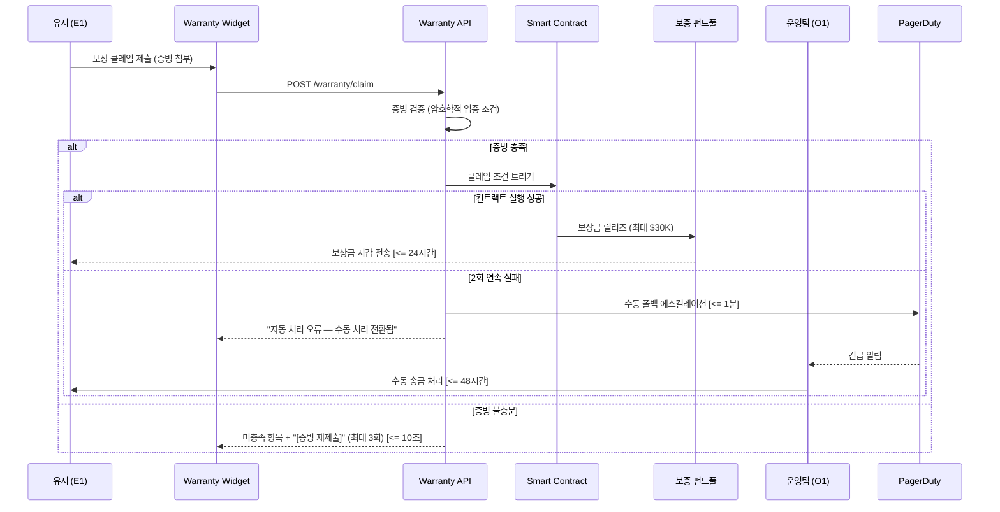

#### 6.3.2 NRM 기반 외부 네이밍 통합 리졸브 플로우 (v0.31 변경)

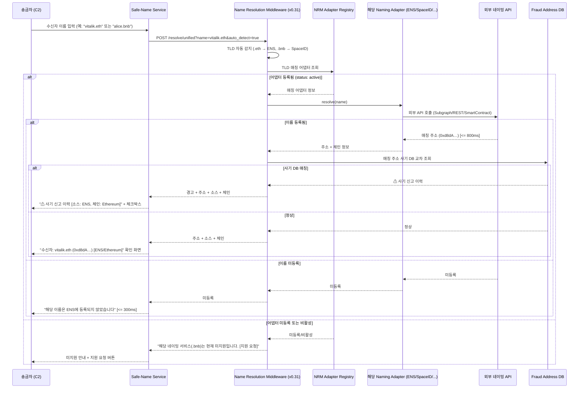

#### 6.3.3 Safe-Name 오프체인 등록 + DNS식 비용 모델 플로우 (v0.31 변경)

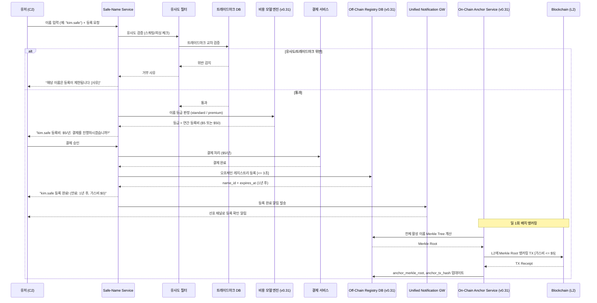

#### 6.3.4 Safe-Name 생명주기(DNS식) 상태 전환 플로우 (v0.31 신규)

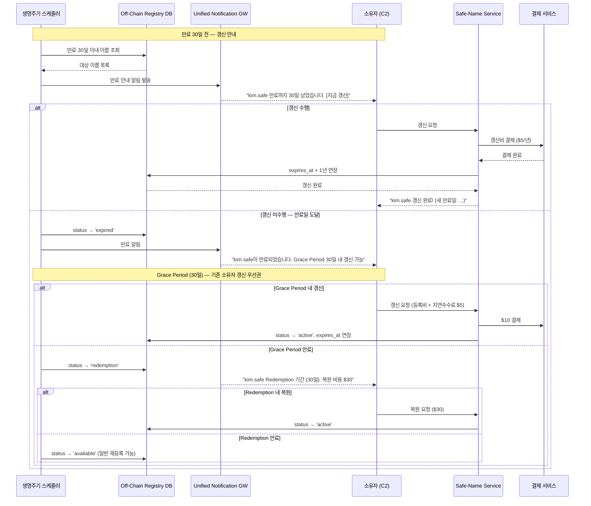

**(v0.32 삭제) §6.3.5 금융결제원 OPEN API 게이트웨이 플로우 — 향후 별도 추진**

#### 6.3.6 통합 알림 게이트웨이 라우팅 플로우 (v0.31 신규)

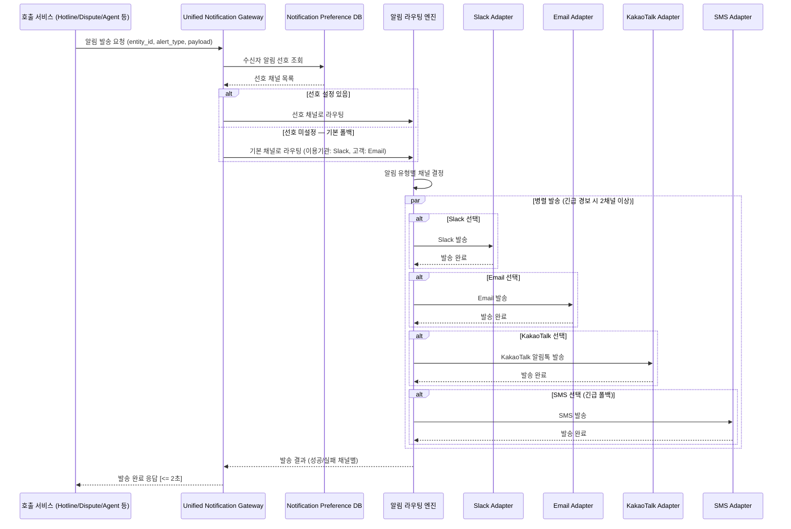

#### 6.3.7 MVP Simulation Mode 전환 플로우 (v0.31 신규)

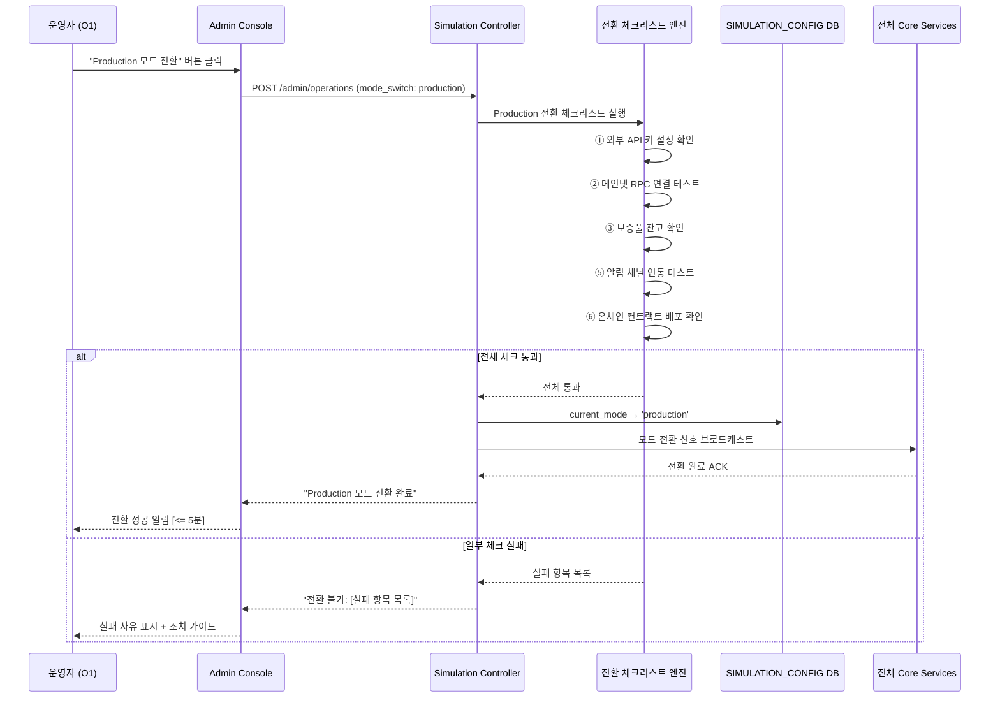

### 6.4 Validation Plan (검증 계획)

| # | 실험 가설 | 실험 설계 | 측정 KPI | 성공 기준 |
|---|---|---|---|---|
| H1 | Zero-FP 엔진 연동 시 오탐지 CS 급감 | A/B Test (n=10,000건): 기존 보안 툴 vs 당사 엔진 **(v0.31: Simulation Mode에서 Mock 데이터 기반 검증)** | 일평균 오탐지 CS 건수, 핫라인 SLA 달성률 | CS 티켓 80% 감소, 10분 SLA 100% 달성 |
| H2 | Warranty 구독 유저의 활성도 월등 | 코호트 분석 (n=500명) **(v0.31: 테스트넷 기반 시뮬레이션 구독)** | 주간 인당 평균 TX 수, D30 리텐션 | 활동량 2배 이상, 리텐션 >= 90% |
| H3 | 사기 주소 사전 조회가 피해율 감소 | 코호트 분석 (n=1,000명) **(v0.31: Simulation 시드 데이터 기반)** | 사기 피해 발생률, 조회→송금 중단율 | 피해율 기준선 대비 70% 감소, 중단율 >= 90% |
| H4 | Safe-Name 등록 유저의 이름 기반 송금 선호 | Within-group (n=200명) **(v0.31: 오프체인 등록 UX 검증 포함)** | 이름 기반 송금 비율, 오송금 민원 건수 | 이름 기반 >= 50%, 오송금 80% 감소 |
| H5 | 커뮤니티 신고가 자체 DB 커버리지 향상 | 누적 분석 (3개월) | 월간 신고 건수, 커버리지 증가율 | 월간 신고 >= 500건, 커버리지 >= 85% |
| H6 | 이의 신청 프로세스가 오등록 피해를 신속 복구 | 파일럿 (n=50건) **(v0.31: 컴플라이언스 대시보드(O2) 워크플로우 포함 검증)** | 심사 완료 SLA 준수율, 해제 정확도 | 48시간 SLA >= 95%, 해제 정확도 >= 98% |
| **H7** | **(v0.31 변경)** Safe-Name 오프체인 등록 + DNS식 비용 모델이 등록 전환율 향상 | **A/B Test (n=500명): 오프체인 등록(가스비 0원, $5/년) vs 기존 온체인 등록 전환율 비교** | **등록 완료율, 이탈율, 등록 소요 시간** | **등록 완료율 50% 이상 향상, 이탈율 60% 감소, 등록 소요 시간 90% 단축** |
| H8 | 무상 소스 전환 시 사기 DB 커버리지 유지 | 전환 시뮬레이션 | DB 커버리지, 정확도, 공백 기간 | 커버리지 >= 80%, 정확도 >= 95%, 공백 0일 |
| **H9** | **(v0.31 신규)** NRM Adapter 플러그인 방식으로 신규 네이밍 서비스 추가 시간 단축 | **파일럿: 운영자가 Admin Console에서 신규 어댑터 등록 → 리졸브 동작까지 소요 시간 측정** | **어댑터 등록→동작 소요 시간, 기존 어댑터 영향** | **소요 시간 <= 5분, 기존 어댑터 무영향 100%** |
| **H10** | **(v0.31 신규)** 멀티채널 알림이 단일 채널 대비 알림 확인율 향상 | **A/B Test (n=200명): Slack 단일 vs 멀티채널(Slack+Email) 알림 확인율 비교** | **알림 확인율, 확인 소요 시간, 에스컬레이션 건수** | **확인율 30% 향상, 확인 시간 40% 단축** |
| **H11** | **(v0.31 신규)** MVP Simulation Mode가 Production 전환 후 동일 기능 동작 보장 | **전환 테스트: Simulation → Production 전환 후 전 기능 자동 E2E 테스트** | **전환 성공률, E2E 테스트 통과율, 전환 소요 시간** | **전환 성공률 100%, E2E 통과율 100%, 전환 <= 5분** |
| **H12** | **(v0.33 신규)** KYC Tier-1 필수 등록 정책이 사기 목적 Safe-Name 등록을 감소시킴 | **A/B Test (n=500명): KYC Tier-1 필수 vs KYC 없는 등록 비교** | **사기 목적 등록 발견 건수, 정상 등록 전환율, 등록 이탈율** | **사기 등록 70% 감소, 정상 등록 전환율 80% 이상 유지, 이탈율 증가 <= 10%** |
| **H13** | **(v0.33 신규)** Pre-Transfer Verification이 오송금·사기 피해를 감소시킴 | **코호트 분석 (n=1,000건): 사전 검증 적용 vs 미적용 송금 비교** | **오송금 발생률, 사기 피해 발생률, 사용자 만족도** | **오송금 90% 감소, 사기 피해 80% 감소, 만족도 >= 4.0/5** |
| **H14** | **(v0.33 신규)** Asset-Chain Compatibility Gate가 체인 비호환 오송금을 사전 차단 | **파일럿 (n=200건): 의도적 비호환 송금 시도 차단률 측정** | **비호환 차단율, 오차단율(호환 건 차단), 사용자 인지도** | **차단율 100%, 오차단율 0%, 인지도 >= 90%** |

---

**— End of Document —**
