# Software Requirements Specification (SRS)

**Document ID:** SRS-001  
**Revision:** 0.4  
**Date:** 2026-05-03  
**Standard:** ISO/IEC/IEEE 29148:2018  
**변경 이력:**
- v0.1 검토 결과 P0·P1 결함 6건 반영 (UseCase·ERD·Class·Component Diagram 추가, Traceability Matrix 보완, 엔터티 스키마 보완, §3.3 API Overview 동기화)
- v0.3.1 보완: CR-1 외부 소스 정책 변경 우회 조치, CR-2 사기 주소 오등록 대응 전략, CR-3 네이밍 서비스 연계·가스비 완화
- v0.31 보완: (1) 이종 온체인 네이밍 서비스 미들웨어(NRM) 전략 (2) Safe-Name 독자 오프체인 레지스트리·DNS식 비용 모델 (3) 통합 알림 게이트웨이 (4) Stakeholders 3계층 분리 및 Client Applications 재배치 (5) MVP 전 컴포넌트 시뮬레이션 모드 아키텍처
- v0.32 보완: (1) 금융결제원 OPEN API·ISO 20022 지원 삭제 (향후 별도 추진) (2) 무료 사기 정보 사이트 정기 수집 전략 + 운영 담당자 승인 워크플로우 신설 (3) 운영기관용 Admin Console을 도메인 기반 5개 관리 콘솔로 분해 — Tier-1/2 Client와 기능 연계 명확화
- v0.33 보완: Mastercard Crypto Credential(MCC) 대비 송수신자 신뢰성 강화 — (1) 송수신 사전 검증(Pre-Transfer Recipient Verification) 도입 (2) Safe-Name KYC Verification Tier 4단계 체계 + 등록 시 Tier-1 필수 (3) Asset-Chain Compatibility Gate — 미지원 체인·자산 오송금 사전 차단 (4) KYC Verification Service·Chain-Asset Compatibility Service 신규 컴포넌트 (5) SAFE_NAME 엔터티 KYC·호환성 필드 확장, KYC_VERIFICATION_LOG·CHAIN_ASSET_REGISTRY 신규 엔터티
- **v0.4 보완 (기술 스택 마이그레이션): (1) C-TEC-001~007 확정 기술 스택 제약사항 추가 — Next.js App Router 단일 풀스택, Prisma+Supabase, Tailwind+shadcn/ui, Vercel AI SDK+Gemini, Vercel 배포 (2) 마이크로서비스 → 모놀리식 아키텍처 전환 — Component Diagram 전면 재작성, API Gateway 제거→Next.js Middleware 대체 (3) Client Applications을 단일 Next.js App 내 Route Group으로 재구성 (4) F7(TradFi ZK 모듈) Out-of-Scope 이동 (5) F9 Admin Console '마이크로 프론트엔드' → Route Group+RBAC 재정의 (6) NFR 수치 현실화 — TPS, 응답시간, 비용, 측정 경로(Datadog/AWS→Vercel/Supabase) (7) AI/LLM 통합 기능 신규 추가(F11) — Fraud 자동 분류, 이의 심사 보조, 알림 메시지 생성 (8) Entity & Data Model Prisma 단일 스키마 전환 (9) 비전 문구 "0.1초" → "0.5초 이내"로 조정**

---

## 1. Introduction

### 1.1 Purpose

본 SRS는 **온체인 사기 방지 플랫폼(On-Chain Fraud Shield Platform)**의 소프트웨어 요구사항을 정의한다. 본 문서는 PRD v0.2(REF-01) 및 PRD v0.2 품질 리뷰 리포트(REF-02)를 유일한 비즈니스·기능 요구의 원천(Source of Truth)으로 사용하며, ISO/IEC/IEEE 29148:2018 표준에 따라 작성되었다.

**해결 대상 문제:**
온체인 금융시장은 공급 과잉·정보 혼돈 상태에 있으며, 다음의 핵심 문제를 해결한다.

| Pain ID | 문제 요약 | 실패 KPI (현 상태) |
|---|---|---|
| CORE-1 | 과도한 오탐지로 VASP의 VIP 정상 출금 차단 및 CS 마비 | 오탐지 CS 처리 지연율(10분 초과) >= 80% |
| CORE-2 | 사람이 인식 불가능한 온체인 주소 구조 — 오송금·피싱 취약 | 주소 기반 오송금 민원 월 15,000~30,000건, 주소 변별 시도 포기율 >= 70% |
| ~~CORE-3~~ | ~~퍼블릭 SaaS 망 의존으로 TradFi 인가 탈락 위기~~ | ~~TradFi 내부 망분리 심사 탈락률 100%, 연 다운타임 >= 10h~~ **(v0.4 Post-MVP로 이연 — F7 Out-of-Scope 이동)** |
| CJM-1 | 구제/보상 수단이 없는 100% 면책 조항 | 스캠 피해 보상률 0% |
| CJM-2 | 사기 주소 신고 접점 부재 | 사기 주소 신고 가능 플랫폼 접근율 <= 5% |
| EXT-1 | 지속되는 해킹 공포 / 무보증 트라우마 | 스캠 피해 후 서비스 잔존율 <= 10% |
| EXT-2 | 기관의 외부 사기정보 수집 역량 부재 | 기관 자체 사기 DB 커버리지 <= 30% |

**한 줄 비전:** *"수만 건의 오송금 민원과 오탐지를 해결하고, 사람이 읽을 수 있는 이름 기반 안전 거래와 실시간 사기 주소 필터링, 그리고 에러 시 100% 현금 보상을 보장하는 **0.5초 이내** 온체인 사기 방지 플랫폼"* **(v0.4 변경: "0.1초" → "0.5초 이내"로 조정. Edge Runtime 도입 시 100ms 달성 Scale-up 경로 유지)**

### 1.2 Scope (In-Scope / Out-of-Scope)

#### In-Scope (MVP)

| # | 범위 |
|---|---|
| IS-1 | 중앙화 백엔드 검증 API 엔진 (Zero-FP + 사기 DB 연동 기반) — **Next.js Route Handlers로 구현 (v0.4)** |
| IS-2 | VASP 보안 담당자용 Web 핫라인 대시보드 — **Next.js Route Group `/(dashboard)/hotline`으로 구현 (v0.4)** |
| IS-3 | 사기 주소 신고 및 사전 조회 플랫폼 (B2C 웹 기반) — **Next.js Route Group `/(public)/fraud`로 구현 (v0.4)** |
| IS-4 | Human-Readable Name 독자 등록·리졸브·송금 (Safe-Name Service) — 오프체인 우선 레지스트리 + DNS식 비용 모델 |
| IS-5 | B2C 보증 스마트 컨트랙트 및 프론트엔드 위젯 팝업 — **shadcn/ui Dialog 컴포넌트 기반 (v0.4)** |
| IS-6 | 상위 3~5개 메이저 체인(Ethereum, Polygon, Arbitrum 등) 지원 |
| IS-7 | 사기 주소 오등록(False Report) 이의 신청·심사·해제 프로세스 |
| IS-8 | 이종 온체인 네이밍 서비스 통합 리졸브 미들웨어(NRM) — ENS, Unstoppable Domains, SpaceID, Bonfida 등 플러그인 기반 확장 |
| ~~IS-9~~ | ~~금융결제원 OPEN API·ISO 20022 게이트웨이~~ **(v0.32 삭제 → Out-of-Scope OS-8로 이동)** |
| IS-10 | 통합 알림 게이트웨이 (Slack, Email, KakaoTalk, SMS 등 멀티채널 Webhook) |
| IS-11 | 운영기관용 도메인별 관리 콘솔 5종 — **단일 Next.js App 내 Route Group + RBAC 기반 (v0.4 변경: 마이크로 프론트엔드 → Route Group)** |
| IS-12 | MVP Simulation Mode — 전 컴포넌트 시뮬레이션/목(Mock) 기반 동작 아키텍처 |
| **IS-13** | **AI/LLM 통합 기능 — Vercel AI SDK + Gemini 기반 사기 정보 자동 분류, 이의 심사 보조, 알림 메시지 생성 (v0.4 신규)** |

#### Out-of-Scope (명시적 배제)

| # | 배제 항목 | 사유 |
|---|---|---|
| OS-1 | 거래소 매칭 엔진(Matching Engine) 수정 및 침투 | VASP 내부 시스템 비개입 원칙 |
| OS-2 | 개별 DApp 내부 스마트 컨트랙트 코드 직접 보안 감사 | 범위 초과 |
| OS-3 | 개인지갑 App 스토어 출시 | B2B 인프라 공급에 리소스 집중 |
| OS-4 | AI 개인화 투자 추천 | 기술 부채, 데이터 편향 위험 |
| OS-5 | 커뮤니티/리뷰 게시판 | 어뷰징/포지셔닝 훼손 |
| OS-6 | 전체 L1/L2 체인 커버리지 (수백 개) | MVP 범위 초과 |
| OS-7 | 금융결제원 금융공동망 전문(電文) 직접 인터페이스 | 향후 검토 |
| OS-8 | 금융결제원 OPEN API(예금주·법인명 조회) 및 ISO 20022 메시지 게이트웨이 (v0.32 삭제) | 향후 별도 추진 |
| **OS-9** | **TradFi 100% 망분리 ZK 인프라 (v0.4 이동: 기존 IS에서 이관)** | **C-TEC-001(단일 풀스택) 원칙과 충돌. Post-MVP 별도 배포 패키지로 대응 (§M-09 참조)** |

#### Constraints (제약사항)

**(v0.4 변경) 기술 스택 제약사항(C-TEC-001~007) 추가**

| ID | 제약/가정 | 유형 | 검증 방안 | 시한 |
|---|---|---|---|---|
| **C-TEC-001** | **모든 서비스는 Next.js (App Router) 기반의 단일 풀스택 프레임워크로 구현한다. 프론트엔드와 백엔드를 별도 분리하지 않는다.** | **기술 제약** | **아키텍처 PoC** | **MVP 착수 전** |
| **C-TEC-002** | **서버 측 로직(DB 접근, API 호출 등)은 Next.js의 Server Actions 또는 Route Handlers를 사용하여 별도 백엔드 서버 없이 구현한다.** | **기술 제약** | **API 응답 시간 벤치마크** | **MVP 착수 전** |
| **C-TEC-003** | **데이터베이스는 Prisma + 로컬 SQLite(개발)를 기본으로 하고, 배포 시 Supabase(PostgreSQL)를 사용하여 인프라 설정 복잡도를 최소화한다.** | **기술 제약** | **스키마 마이그레이션 테스트** | **MVP 착수 전** |
| **C-TEC-004** | **UI 및 스타일링은 Tailwind CSS와 shadcn/ui를 사용하여 AI가 일관된 디자인 코드를 생성하도록 강제한다.** | **기술 제약** | **UI 컴포넌트 라이브러리 PoC** | **MVP 착수 전** |
| **C-TEC-005** | **LLM 오케스트레이션은 별도 Python 서버 없이 Vercel AI SDK를 사용하여 Next.js 내부에서 직접 구현한다.** | **기술 제약** | **AI 기능 PoC (Agent 분류, 심사 보조)** | **MVP 개발 중** |
| **C-TEC-006** | **LLM 호출은 Google Gemini API를 기본으로 사용하며, 환경 변수 설정만으로 모델 교체가 가능하도록 SDK 표준 인터페이스를 준수한다.** | **기술 제약** | **Gemini API 연동 + 모델 교체 테스트** | **MVP 개발 중** |
| **C-TEC-007** | **배포 및 인프라 관리는 Vercel 플랫폼으로 단일화하며, CI/CD 설정 없이 Git Push만으로 배포를 자동화한다.** | **기술 제약** | **배포 파이프라인 검증** | **MVP 착수 전** |
| CON-1 | 자체 Caching 아키텍처가 트래픽의 90% 이상 중복 요청을 커버할 수 있다. **(v0.4 변경: 인메모리 LRU Cache 기반)** | 가정 | PoC 환경 대량 TX 인젝션 테스트 (Hit Rate 측정) | MVP 착수 전 |
| CON-2 | 크립토 포비아 유저층의 WTP(월 1~2만 원)가 실제 결제로 이어진다 | 가정 | B2C 클로즈드 베타 구독 전환율 실측 | 출시 후 1개월 |
| CON-3 | 커뮤니티 사기 주소 신고가 월 500건 이상 유입된다 | 가정 | MVP 출시 후 3개월간 신고 건수 추이 모니터링 | 출시 후 3개월 |
| CON-4 | Safe-Name 등록 유저의 50% 이상이 이름 기반 송금을 실제 사용한다 | 가정 | Closed Beta 내 이름 기반 송금 비율 실측 | 출시 후 3개월 |
| CON-5 | 외부 사기 정보 소스(Chainalysis, OFAC 등) API 응답 속도가 <= 15분 갱신에 부합한다 | 가정 | API 부하 테스트 + 캐시 전략 설계 | MVP 착수 전 |
| CON-6 | 메이저 보험사와의 제휴 계약(B2B 보험 기금 헷징)이 런칭 전 성사된다 | 의존성 | 법무/사업팀 제휴 MOU 체결 | MVP 기획 중 |
| CON-7 | Chainalysis/OFAC API의 외부 개발자 접근 허용 정책이 최소 6개월 유지된다. ▶ 정책 변경 감지 시 30일 이내 대체 소스 전환을 완료한다. 월 1회 API 파트너 문서·변경 로그 자동 모니터링을 수행하며, 변경 감지 시 **통합 알림 게이트웨이 `#fraud-source-alert` 즉시 알림** | 의존성 | API 파트너 문서 변경 모니터링 + 월 1회 자동 스캔 | 지속 |
| CON-8 | 외부 인프라(RPC) 강세장 트래픽 폭주 시 비용 기하급수 증가 위험 (Risk Score 20, Critical). **(v0.4 변경: Vercel Function 실행 비용 모니터링으로 대체)** | 리스크 | 초격차 Caching Layer + **Vercel Usage Dashboard 비용 모니터링 (v0.4)** | MVP 착수 전 |
| CON-9 | 스마트 컨트랙트 보증풀의 유사수신·보험업법 위반 간주 가능성 (Risk Score 15, Critical) | 리스크 | 대형 손해보험사 B2B 제휴 + 법무법인 자문 | MVP 기획 중 |
| CON-10 | 사기 주소 오등록(False Report) — 악의적 신고로 무고한 주소 블랙리스트 등록 (Risk Score 15, Critical). ▶ 오등록 발생 시 피해 주소 소유자의 이의 신청을 접수하고 48시간 이내 심사·해제를 완료한다. 반복 오신고자(3회 이상)는 신고 기능 90일 제한한다 | 리스크 | 검증 파이프라인 PoC + 다단계 검증 병행 + 이의 신청·심사 프로세스, 오등록률 0.5% 이하 | MVP 착수 전 |
| CON-11 | Safe-Name 스쿼팅/피싱 — 유명 이름 선점 악용 (Risk Score 16, Critical) | 리스크 | 유사도 필터 + 트레이드마크 DB 교차 검증, UDRP 유사 분쟁 해결 프로세스 | MVP 기획 중 |
| CON-12 | 핫라인 SLA 초과 위약금 페널티 (Risk Score 12, High) | 리스크 | 통합 알림 게이트웨이 에스컬레이션(PagerDuty) 자동화 + 1차 AI 승인 룰셋 | MVP 개발 중 |
| CON-13 | 외부 사기 정보 소스 API 정책 변경 (Risk Score 8, High). ▶ 복수 외부 소스 병렬 확보 + 자체 커뮤니티 신고 DB 1차 소스 육성. 대체 소스 전환 우선순위: ① Etherscan Labels API(무상) ② MistTrack Open API(무상 티어) ③ ScamSniffer API(무상) ④ 자체 커뮤니티 신고 DB ⑤ Chainalysis(유료) ⑥ OFAC SDN(공공) | 리스크 | 복수 외부 소스 병렬 확보 + 무상 소스 우선 전환 정책 + 자체 커뮤니티 신고 DB 1차 소스 육성 | 지속 |
| CON-14 | 무상 소스 전환 정책 원칙 — 유료 외부 사기 정보 소스가 정책 변경·가격 인상·접근 차단 시, 동등 커버리지의 무상 외부 소스를 최우선 대체 후보로 채택한다. 무상 소스로 커버리지 80% 이상 확보가 불가능한 경우에만 유료 소스 재계약을 검토한다 | 정책 | 분기 1회 소스별 커버리지·품질 비교 리포트 (Data QA팀) | 지속 |
| CON-15 | Safe-Name 오프체인 레지스트리 운영 비용(DB·인증·앵커링)이 월 $1,500 이내로 통제 가능하다. DNS식 연간 등록비($5/년)로 운영비를 상쇄한다. 온체인 앵커링은 일 1회 Merkle Root 기록으로 가스비를 최소화한다. **(v0.4 변경: Supabase 기반 운영 비용은 월 $25~200 수준으로 대폭 절감 예상)** | 가정 | PoC 환경 오프체인 레지스트리 비용 시뮬레이션 (1,000 유저 × 30일) | MVP 착수 전 |
| CON-16 | MVP 전 기간 동안 Simulation Mode로 운영하며, 실제 외부 시스템(RPC, Chainalysis, 블록체인)을 목(Mock)/스텁(Stub)으로 대체한다. 테스트넷(Sepolia, Amoy, Arbitrum Sepolia)을 기본 체인으로 사용한다 | 정책 | MVP 시뮬레이션 PoC + 전환 체크리스트 검증 | MVP 전 기간 |
| CON-17 | Name Resolution Middleware(NRM) 신규 네이밍 서비스 어댑터 추가 시, **어댑터 설정(엔드포인트, TLD, 체인 등)은 코드 배포 없이 DB 설정 기반으로 무중단 변경이 가능해야 한다. 신규 어댑터 로직 추가는 코드 배포가 필요하다. (v0.4 정밀화)** | 가정 | NRM Adapter Registry PoC (어댑터 3종 이상 설정 변경 테스트) | MVP 착수 전 |
| ~~CON-18~~ | ~~(v0.31) 금융결제원 OPEN API 핀테크 서비스 등록~~ **(v0.32 삭제)** | — | — | — |
| CON-19 | 외부 KYC/KYB 검증 제공자(Mercuryo, Sumsub, Jumio 등) API 응답 시간이 Tier-1 <= 60초, Tier-2 <= 5분을 충족해야 한다. 제공자 장애 시 대체 KYC 제공자로 자동 전환한다. MVP Simulation Mode 시 Mock KYC 응답으로 대체한다 | 의존성 | KYC 제공자 PoC + 대체 제공자 1사 이상 확보 | MVP 착수 전 |
| CON-20 | Safe-Name 등록 시 Tier-1 KYC 필수 정책이 등록 전환율에 미치는 부정적 영향이 10% 이내여야 한다 | 가정 | Closed Beta KYC 필수 등록 전환율 측정 | 출시 후 1개월 |
| CON-21 | CHAIN_ASSET_REGISTRY에 등록된 체인·자산 목록이 실제 블록체인 네트워크 상태와 일치해야 한다. 신규 체인·자산 추가 시 운영기관의 승인을 거친다 | 정책 | 월 1회 레지스트리 정합성 검증 | 지속 |
| **CON-22** | **(v0.4 신규)** Vercel Cron Jobs 실행 한도(Pro: 일 40회)를 초과하는 고빈도 스케줄링(NRM Health Check 5분 주기 등)은 **Upstash QStash 또는 외부 무상 Cron 서비스**로 보완한다 | **기술 제약** | **Cron 실행 한도 + 외부 서비스 연동 PoC** | **MVP 착수 전** |
| **CON-23** | **(v0.4 신규)** AI/LLM 기능의 모든 판정은 "보조(assistant)" 역할이며, 최종 의사결정은 반드시 인간 운영자가 수행한다. Simulation Mode에서는 Mock AI 응답(고정 JSON)으로 대체한다 | **정책** | **AI 판정 보조 PoC + 인간 검증 워크플로우 설계** | **MVP 개발 중** |

### 1.3 Definitions, Acronyms, Abbreviations

| 용어 | 정의 |
|---|---|
| VASP | Virtual Asset Service Provider — 가상자산 사업자(거래소 등) |
| CISO | Chief Information Security Officer — 최고 정보보안 책임자 |
| Zero-FP | Zero False-Positive — 오탐지 제로 목표 |
| Safe-Name | Human-Readable Name 기반 온체인 주소 별칭 서비스. 오프체인 우선 레지스트리 + DNS식 비용 모델 |
| Warranty | 시스템 에러 발생 시 최대 $30,000 현금 보상 보증 스마트 컨트랙트 |
| FP Rate | False Positive Rate — 오탐지율 (정상 거래를 위협으로 잘못 판별한 비율) |
| Risk Score | 트랜잭션 또는 주소의 위험도 점수 |
| TPS | Transactions Per Second — 초당 트랜잭션 처리 수 |
| SLA | Service Level Agreement — 서비스 수준 협약 |
| RPO | Recovery Point Objective — 복구 시점 목표 |
| RTO | Recovery Time Objective — 복구 시간 목표 |
| ZK | Zero-Knowledge (Proof) — 영지식 증명 |
| AOS | Adjusted Opportunity Score — 시장 기회 보정 점수 |
| DOS | Discovered Opportunity Score — 발굴된 기회 점수 |
| JTBD | Jobs to be Done — 고객이 완수하고자 하는 과업 |
| MoSCoW | Must / Should / Could / Won't — 우선순위 분류 프레임워크 |
| Persona | 핵심 이용자 유형의 대표적 인물상 |
| Caching Layer | **인메모리 LRU Cache 기반 자체 캐싱 계층 (v0.4 변경: Redis → 인메모리)** |
| Invisible UI | 클라이언트 앱 설치 없이 백그라운드로 렌더링되는 팝업 UI — **shadcn/ui Dialog + next/dynamic 기반 (v0.4)** |
| OFAC | Office of Foreign Assets Control — 미국 재무부 해외자산통제국 |
| SDN | Specially Designated Nationals (OFAC 제재 리스트) |
| NFT | Non-Fungible Token — 대체 불가능 토큰 |
| Air-gap | 외부 네트워크와 물리적으로 완전 분리된 폐쇄망 구조 |
| TradFi | Traditional Finance — 전통 금융 |
| STO | Security Token Offering — 증권형 토큰 |
| On-Premise | 고객 내부 인프라에 직접 설치·운영하는 방식 |
| k-anonymity | 개인 식별 방지를 위한 익명화 기법 (동일 속성을 가진 레코드가 최소 k개) |
| ENS | Ethereum Name Service — 이더리움 네이밍 서비스 (.eth 도메인) |
| Meta-Transaction | 유저 대신 릴레이어가 가스비를 대납하여 트랜잭션을 제출하는 방식 (Gasless Relay) |
| False Report | 사기 주소 오등록 — 악의적 또는 실수에 의해 정상 주소가 사기 주소로 잘못 신고·등록되는 상황 |
| Dispute (이의 신청) | 사기 주소로 오등록된 주소의 소유자가 등록 해제를 요청하는 공식 절차 |
| NRM | Name Resolution Middleware — 이종 온체인 네이밍 서비스를 통합 리졸브하는 미들웨어 계층. Adapter Registry 기반 플러그인 아키텍처 |
| Naming Adapter | NRM의 플러그인 단위. 특정 네이밍 서비스(ENS, Unstoppable, SpaceID 등)와의 연동 로직을 캡슐화한 어댑터 |
| Off-Chain First Registry | 이름 등록·조회를 오프체인 DB에서 수행하고, 소유권 증명·분쟁 해결 시에만 온체인 Merkle Root를 앵커링하는 레지스트리 전략 |
| Unified Notification Gateway | Slack, Email, KakaoTalk, SMS 등 다양한 알림 채널을 통합 관리하는 게이트웨이 서비스 |
| Simulation Mode | MVP 기간 동안 외부 시스템을 Mock/Stub으로 대체하여 전 기능을 시뮬레이션 환경에서 동작시키는 운영 모드 |
| Grace Period | Safe-Name 이름 만료 후 기존 소유자에게 갱신 우선권이 부여되는 유예 기간 (30일). DNS 도메인 유예 기간 참조 |
| KYC Verification Tier | Safe-Name 등록자의 신원 검증 수준을 4단계로 구분: Tier-0(미검증), Tier-1(기본: 이메일·전화번호), Tier-2(신원: ID 문서·생체), Tier-3(기관: 법인 KYB). Mastercard Crypto Credential 참조 (v0.33) |
| Verified Badge | KYC Tier-2 이상 검증을 완료한 Safe-Name 사용자에게 부여되는 시각적 신뢰 표시. 리졸브 결과에 포함 (v0.33) |
| Asset-Chain Compatibility Gate | 송금 전 수신자의 Safe-Name에 등록된 지원 체인·자산과 송금 체인·자산의 호환성을 검증하여 비호환 시 트랜잭션을 사전 차단하는 검증 게이트 (v0.33) |
| Pre-Transfer Recipient Verification | 송금 실행 전 수신자의 KYC 등급, 체인·자산 호환성, 사기 DB 상태를 종합 검증하는 사전 확인 단계 (v0.33) |
| Enhanced Verification | 일정 금액($1,000) 이상 송금 시 송수신 양측의 KYC Tier-2 이상 검증을 요구하는 강화 검증 (v0.33) |
| **Next.js App Router** | **Next.js 13+의 파일 시스템 기반 라우팅 방식. Server Components, Route Handlers, Server Actions를 지원 (v0.4 신규)** |
| **Route Handler** | **Next.js App Router에서 HTTP API 엔드포인트를 정의하는 서버 사이드 핸들러 (`route.ts`) (v0.4 신규)** |
| **Server Action** | **Next.js에서 클라이언트 컴포넌트가 서버 사이드 함수를 직접 호출할 수 있는 RPC 방식의 서버 함수 (v0.4 신규)** |
| **Prisma** | **Node.js/TypeScript용 ORM. 스키마 정의, 마이그레이션, 타입 안전한 쿼리를 지원 (v0.4 신규)** |
| **Supabase** | **PostgreSQL 기반 오픈소스 BaaS(Backend-as-a-Service). 인증, 스토리지, 실시간 구독 제공 (v0.4 신규)** |
| **shadcn/ui** | **Tailwind CSS 기반의 Re-usable UI 컴포넌트 라이브러리. 복사-붙여넣기 방식으로 프로젝트에 통합 (v0.4 신규)** |
| **Vercel AI SDK** | **Vercel에서 제공하는 AI 애플리케이션 개발 SDK. 스트리밍, 도구 호출, 멀티 프로바이더 지원 (v0.4 신규)** |
| **Vercel Cron Jobs** | **Vercel 서버리스 환경에서 정기 실행되는 스케줄링 함수. `vercel.json`의 cron 설정으로 정의 (v0.4 신규)** |
| **Route Group** | **Next.js App Router에서 URL 경로에 영향을 주지 않고 라우트를 논리적으로 그룹화하는 폴더 구조 `(groupName)` (v0.4 신규)** |
| **RBAC** | **Role-Based Access Control — 역할 기반 접근 제어 (v0.4 신규)** |
| **LRU Cache** | **Least Recently Used Cache — 가장 오래 미사용된 항목을 먼저 제거하는 인메모리 캐시 전략 (v0.4 신규)** |

### 1.4 References

| ID | 문서명 | 경로/출처 |
|---|---|---|
| REF-01 | PRD v0.2 — 온체인 사기 방지 플랫폼 | `1__PRD_v0_2.md` |
| REF-02 | PRD v0.2 품질 리뷰 리포트 | `2__PRD_v0_2_품질_리뷰_리포트.md` |
| REF-03 | Value Proposition Sheet V2 (fin) | `../3. VPS-Draft/4.Value_Proposition_Sheet_V2(fin).md` |
| REF-04 | Chainalysis Crypto Crime Report (2023) | 외부 공개 보고서 |
| REF-05 | OFAC SDN 제재 리스트 | 외부 공개 데이터 |
| REF-06 | ISO/IEC/IEEE 29148:2018 | 국제 표준 |
| REF-09 | ICANN DNS 도메인 생명주기 정책 — 등록·갱신·유예·삭제 절차 | ICANN 공개 정책 문서 |
| **REF-10** | **SRS v0.33→v0.4 기술 스택 마이그레이션 플랜 (PLAN-MIGRATION-001) (v0.4 신규)** | **`4.plans/SRS_v4.1_TechStack_Migration_Plan.md`** |

---

## 2. Stakeholders

**(v0.31 변경) Stakeholders를 3계층(고객·이용기관·운영기관)으로 분리하고, 각 계층의 역할·책임·관심사를 명확히 한다.**

### 2.1 Tier-1: 고객 (온체인 사기 방지 서비스 최종 이용자)

| 역할(Role) | 대표 페르소나 | 책임(Responsibility) | 관심사(Interest) |
|---|---|---|---|
| 일반 유저 | C2 이지은 — 온체인 송금 입문자 | 사기 주소 사전 조회, Safe-Name 기반 송금, 사기 주소 신고, 사기 주소 오등록 이의 신청 | 사람이 인식 가능한 이름 기반 송금, 사기 주소 사전 확인, 오등록 시 신속 해제, 가스비 부담 없는 이름 등록 |
| 크립토 포비아 | E1 오재민 — 스캠 자금 유실 피해자 | Warranty 보증 구독, 사기 주소 신고, 보상 클레임, 오등록 이의 신청 | 에러 입증 시 100% 현금 보상 보증, 사기 주소 신고 채널, 피해 복구 |

### 2.2 Tier-2: 이용기관 (고객 앞 온체인 사기 방지 서비스 제공자 및 이용자 관리)

| 역할(Role) | 대표 페르소나 | 책임(Responsibility) | 관심사(Interest) |
|---|---|---|---|
| VASP CISO | C1 김철수 — 대형 거래소 보안책임자 | 트랜잭션 위험 판별 API 연동, 오탐지 핫라인 운영, 사기 정보 수집 Agent 활용, 소속 고객 관리 | 0.5초 이내 제로 오탐지 **(v0.4 변경)**, 10분 락 해제 SLA, 멀티소스 사기 DB Agent, 알림 채널 다양화 |
| ~~TradFi IT팀장~~ | ~~C3 최수영 — STO 증권사 인프라팀~~ | ~~On-Premise ZK 모듈 도입, 망분리 규제 준수~~ | ~~100% 망분리 가능 On-Premise 모듈~~ **(v0.4 Post-MVP로 이연 — OS-9 참조)** |

### 2.3 Tier-3: 운영기관 (온체인 사기 방지 서비스 플랫폼 운영)

| 역할(Role) | 대표 페르소나 | 책임(Responsibility) | 관심사(Interest) |
|---|---|---|---|
| 플랫폼 운영자 | O1 박운영 — 플랫폼 운영팀장 | 시스템 전체 모니터링, SLA 관리, 장애 대응, 이용기관·고객 관리, Simulation/Production 모드 전환 관리 | 서비스 가용성 99.9% **(v0.4 변경)**, 비용 통제, 운영 효율, MVP 시뮬레이션 검증 |
| 컴플라이언스 담당 | O2 한규정 — 컴플라이언스 매니저 | 사기 주소 이의 심사, 오등록 판정, Safe-Name 분쟁 해결(UDRP), 금융 규제 준수 | 이의 심사 SLA 준수, 오등록 해제 정확도, 법적 리스크 최소화 |
| Data QA팀 | O3 정데이터 — 데이터 품질 관리자 | 사기 DB 커버리지·품질 모니터링, 외부 소스 커버리지 비교, 데이터 정합성 검증 | 사기 DB 커버리지 >= 85%, 오등록률 <= 0.5%, 데이터 품질 지표 |

### 2.4 배제 타겟

| 역할(Role) | 사유 |
|---|---|
| N1 은행 | MVP 리소스 투입 전면 금지 |
| N2 맥시멀리스트 | MVP 리소스 투입 전면 금지 |
| **N3 TradFi IT팀장 (v0.4 이동)** | **Post-MVP 별도 배포 패키지로 대응. C-TEC-001 단일 풀스택 원칙과 충돌하는 On-Premise ZK 모듈은 MVP 범위 배제** |

---

## 3. System Context and Interfaces

### 3.1 External Systems

**(v0.4 변경) 시스템 내부 아키텍처가 Next.js 모놀리식으로 전환됨에 따라, 외부 시스템 연동 방식이 Route Handlers 기반 직접 호출로 통일된다.**

| 시스템 | 유형 | 역할 | 제약 사항 |
|---|---|---|---|
| 외부 RPC 노드 (Alchemy, Infura 등) | 외부 REST/RPC | 블록 데이터, TX 내역 → 시뮬레이션용 체인 데이터 제공. MVP 시뮬레이션 시 Mock RPC(Hardhat/Anvil)로 대체. **Route Handler에서 ethers.js로 직접 호출 (v0.4)** | Rate Limit 초과 시 과금 폭탄 위험 (캐싱 필수), 월 $500 상한 **(v0.4 변경)** |
| Chainalysis API | 외부 REST | 주소 위험 등급, 관련 사건 정보 제공. MVP 시뮬레이션 시 Stub 응답 | Rate Limit TBD (PoC에서 확인), 유료 구독 |
| OFAC SDN 리스트 | 외부 REST | 제재 대상 주소/엔터티 목록 제공. MVP 시뮬레이션 시 정적 시드 데이터 | 정책 변경 모니터링 필요 |
| Etherscan Labels API | 외부 REST (무상) | 주소 레이블(사기, 피싱, 해킹 등) 데이터 제공 — 무상 대체 소스 1순위 | Rate Limit: 5 req/sec (무상), 커버리지 Ethereum 메인넷 중심 |
| MistTrack Open API | 외부 REST (무상 티어) | 온체인 자금 추적·사기 주소 데이터 제공 — 무상 대체 소스 2순위 | 무상 티어 일일 호출 한도 존재, 멀티체인 지원 |
| ScamSniffer API | 외부 REST (무상) | 피싱 사이트·사기 컨트랙트 주소 데이터 제공 — 무상 대체 소스 3순위 | 피싱/스캠 특화, 커버리지 범위 제한적 |
| ENS (Ethereum Name Service) | 외부 스마트 컨트랙트 / Subgraph API | .eth 이름 ↔ 주소 리졸브 — NRM Adapter를 통해 연동 | Ethereum L1 가스비 의존, 리졸브 API 변경 가능성 |
| Unstoppable Domains API | 외부 REST | .crypto, .wallet 등 도메인 ↔ 주소 리졸브 — NRM Adapter를 통해 연동 | API 정책 변경 가능성, Polygon 기반 |
| SpaceID API | 외부 REST / 스마트 컨트랙트 | .bnb 도메인 ↔ 주소 리졸브 — NRM Adapter를 통해 연동 | BNB Chain 기반, API 안정성 확인 필요 |
| Bonfida Name Service | 외부 REST | .sol 도메인 ↔ 주소 리졸브 — NRM Adapter를 통해 연동 | Solana 기반, MVP에서는 Simulation 모드로만 지원 |
| KYC/KYB Verification Provider (v0.33) | 외부 REST | Safe-Name 등록자의 신원 검증(Tier-1~3) 수행 | 외부 KYC 서비스 의존, API 응답 시간 <= 30초, MVP 시뮬레이션 시 Mock KYC 응답 |
| **Google Gemini API (v0.4 신규)** | **외부 REST** | **AI/LLM 기반 사기 정보 자동 분류, 이의 심사 보조, 알림 메시지 생성. Vercel AI SDK를 통해 호출** | **API 응답 시간 <= 3초(p95), 환경 변수로 모델 교체 가능, Simulation Mode 시 Mock AI 응답** |
| 통합 알림 게이트웨이 연동 대상 | | | |
| ├ Slack API | 외부 Webhook | 이용기관·운영기관 알림 발송, 내부 경보 채널 연동 | Webhook 응답 시간 의존 |
| ├ Email (Gmail/SMTP) | 외부 SMTP/API | 고객·이용기관 알림 발송 (이의 신청 결과, 이름 등록 확인 등) | 발송 Rate Limit, 스팸 필터 |
| ├ KakaoTalk 알림톡 API | 외부 REST | 고객 알림 발송 (사기 경고, 이름 만료 안내 등) — 한국 시장 특화 | 비즈니스 채널 등록 필요, 건당 과금 |
| └ SMS Gateway | 외부 REST | 긴급 알림 폴백 (핫라인 SLA 위기 등) | 건당 과금, 국제 발송 비용 |
| PagerDuty | 외부 SaaS | SLA 초과 경보, 에스컬레이션 자동 발동 | 외부 SaaS 가용성 의존 |
| Blockchain Networks (Ethereum, Polygon, Arbitrum 등) | 외부 P2P | Safe-Name 온체인 앵커링(Merkle Root), Warranty 스마트 컨트랙트 배포·실행. MVP 시뮬레이션 시 테스트넷(Sepolia, Amoy, Arbitrum Sepolia) 사용. **ethers.js로 Server Action에서 직접 호출 (v0.4)** | 가스비 변동, 네트워크 혼잡 |
| **Supabase (v0.4 신규)** | **외부 BaaS** | **운영 환경 PostgreSQL 데이터베이스. Prisma ORM을 통해 접근. 자동 백업(Point-in-Time Recovery) 제공** | **Supabase Pro 플랜 기준, 월 $25~** |
| **Upstash QStash (v0.4 신규)** | **외부 SaaS** | **고빈도 Cron 스케줄링 보완 (Vercel Cron 한도 초과 시). NRM Health Check 5분 주기 등** | **무상 티어 일 500회, 유료 시 확장** |

### 3.2 Client Applications

**(v0.4 변경) 모든 Client Applications은 단일 Next.js App (App Router) 내 Route Group으로 구현한다. UI는 Tailwind CSS + shadcn/ui 공통 디자인 시스템을 사용한다.**

#### 3.2.1 Tier-1 고객용 Route Groups

| Route Group | 대상 사용자 | 기능 |
|---|---|---|
| `/(public)/fraud` — 사기 주소 신고·조회 | C2, E1 (일반 유저, 포비아) | 사기 주소 신고 제출, 사기 여부 사전 조회, 출처 확인, 오등록 이의 신청 |
| `/(public)/safename` — Safe-Name 서비스 | C2 (일반 유저) | 이름 등록(오프체인 우선), 이름 기반 송금, 주소 리졸브, NRM 외부 네이밍 교차 리졸브, 이름 갱신·만료 관리 |
| `/(public)/warranty` — Warranty 위젯 | E1 (크립토 포비아) | 보증 팝업 노출(shadcn Dialog), 구독 결제, 보증서 NFT 수령, 클레임 제출 |

#### 3.2.2 Tier-2 이용기관용 Route Groups

| Route Group | 대상 사용자 | 기능 |
|---|---|---|
| Route Handlers (`/api/v1/*`) — VASP 연동 API | C1 (VASP CISO) | Zero-FP Simulate API 호출, 사기 DB 연동, 핫라인 티켓 관리 |
| `/(dashboard)/hotline` — B2B 핫라인 대시보드 | C1 (VASP CISO) | 오탐지 알림 수신(멀티채널), 락 해제 승인, SLA 모니터링 |
| `/(dashboard)/fraud-agent` — Fraud Intelligence Agent 대시보드 | C1 (VASP CISO) | 멀티소스 사기 정보 통합 조회, 위험 등급 필터링, 소스 장애 상태 확인 |

#### 3.2.3 Tier-3 운영기관용 Route Groups (v0.4 변경 — Route Group + RBAC)

**(v0.4 변경) 기존 마이크로 프론트엔드(독립 배포) 설계를 단일 Next.js App 내 Route Group + RBAC 기반으로 재정의한다. 각 콘솔은 논리적으로 독립된 Route Group이며, Next.js Middleware에서 운영자 역할(O1/O2/O3)에 따라 접근을 제어한다. 향후 트래픽 증가 또는 조직 분리 필요 시 Route Group 단위로 독립 앱으로 분리 가능한 구조를 유지한다.**

| # | Route Group | 대상 운영자 | 연계 Tier-1/2 Route Group | 핵심 기능 |
|---|---|---|---|---|
| OC-1 | `/(admin)/fraud-intel` — **사기 정보 관리** | O3, O2 | Tier-1 사기 신고·조회, Tier-2 Fraud Agent | 외부 무료 소스 수집 현황, 수집 데이터 승인 대기열, 소스별 커버리지·품질 비교, 데이터 정합성, 승인/거부 워크플로우 |
| OC-2 | `/(admin)/safename` — **Safe-Name 관리** | O2, O1 | Tier-1 Safe-Name 서비스 | 이름 분쟁 심사(UDRP), 프리미엄 이름 분류, 비용 모델 설정, NRM Adapter Registry 관리, 이름 생명주기 모니터링 |
| OC-3 | `/(admin)/hotline` — **핫라인·SLA 관리** | O1 | Tier-2 핫라인 대시보드, Tier-2 VASP API | 핫라인 SLA 실시간 모니터링, 에스컬레이션 정책 관리, 이용기관 계정·API Key 관리, 오탐지 통계 리포트 |
| OC-4 | `/(admin)/warranty` — **Warranty·보증 관리** | O1, O2 | Tier-1 Warranty 위젯, Tier-1 사기 신고·조회(이의 신청) | 보증풀 잔고 모니터링, 클레임 심사 워크플로우, 이의 신청 심사·오등록 판정, 보험사 제휴 관리 |
| OC-5 | `/(admin)/system` — **시스템 운영** | O1 | 전체 시스템 공통 | 인프라 모니터링(TPS, 가용성, 에러율, 비용), Simulation/Production 모드 전환, 알림 채널 어댑터 관리, 감사 로그 |

**기능-클라이언트 연계 매핑 매트릭스:**

| Tier-1/2 Route Group | 연계 운영 콘솔 | 연계 사유 |
|---|---|---|
| `/(public)/fraud` (Tier-1) | OC-1 사기 정보 관리 + OC-4 Warranty·보증 관리 | 신고 데이터 품질 관리, 이의 신청 심사 |
| `/(public)/safename` (Tier-1) | OC-2 Safe-Name 관리 | 이름 분쟁, NRM 어댑터, 비용 모델 |
| `/(public)/warranty` (Tier-1) | OC-4 Warranty·보증 관리 | 보증풀 잔고, 클레임 심사 |
| `/api/v1/*` VASP API (Tier-2) | OC-3 핫라인·SLA 관리 | VASP 계정, API Key, SLA |
| `/(dashboard)/hotline` (Tier-2) | OC-3 핫라인·SLA 관리 | 핫라인 SLA, 에스컬레이션 |
| `/(dashboard)/fraud-agent` (Tier-2) | OC-1 사기 정보 관리 | 소스 수집 현황, 품질 모니터링 |

### 3.2.4 UseCase Diagram

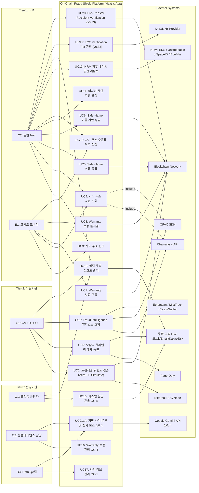

### 3.2.5 Component Diagram (v0.4 전면 재작성 — Next.js 모놀리식 아키텍처)

```mermaid
graph TB
    subgraph "Next.js App (App Router) — 단일 풀스택 (C-TEC-001)"
        subgraph "프론트엔드 (Tailwind + shadcn/ui, C-TEC-004)"
            subgraph "Tier-1: 고객용 Route Groups"
                RG1["/(public)/fraud<br/>사기 신고·조회"]
                RG2["/(public)/safename<br/>Safe-Name Service"]
                RG3["/(public)/warranty<br/>Warranty Widget<br/>(shadcn Dialog)"]
            end
            subgraph "Tier-2: 이용기관용 Route Groups"
                RG4["/(dashboard)/hotline<br/>핫라인 대시보드"]
                RG5["/(dashboard)/fraud-agent<br/>Fraud Agent 대시보드"]
            end
            subgraph "Tier-3: 운영기관용 Route Groups (RBAC)"
                RG6["/(admin)/fraud-intel<br/>OC-1"]
                RG7["/(admin)/safename<br/>OC-2"]
                RG8["/(admin)/hotline<br/>OC-3"]
                RG9["/(admin)/warranty<br/>OC-4"]
                RG10["/(admin)/system<br/>OC-5"]
            end
        end

        subgraph "Next.js Middleware (인증·Rate Limit·RBAC)"
            MW["middleware.ts<br/>(API Key, User Auth,<br/>Admin MFA, Rate Limit)"]
        end

        subgraph "Route Handlers + Server Actions (C-TEC-002)"
            API1["/api/v1/simulate"]
            API2["/api/v1/override"]
            API3["/api/v1/fraud/*"]
            API4["/api/v1/safename/*"]
            API5["/api/v1/resolve/*"]
            API6["/api/v1/warranty/*"]
            API7["/api/v1/kyc/*"]
            API8["/api/v1/transfer/*"]
            API9["/api/v1/notification/*"]
            API10["/api/v1/admin/*"]
            API11["/api/v1/agent/*"]
            API12["/api/v1/ai/*<br/>(v0.4 신규)"]
            CRON["/api/cron/*<br/>(Vercel Cron)"]
        end

        subgraph "서비스 모듈 (lib/services/)"
            SVC1["zero-fp.ts"]
            SVC2["hotline.ts"]
            SVC3["fraud-report.ts"]
            SVC4["safename-registry.ts"]
            SVC5["warranty.ts"]
            SVC6["fraud-agent.ts"]
            SVC7["notification-gateway.ts"]
            SVC8["dispute.ts"]
            SVC9["nrm.ts"]
            SVC11["onchain-anchor.ts"]
            SVC12["simulation-controller.ts"]
            SVC13["kyc-verification.ts"]
            SVC14["chain-asset-compat.ts"]
        end

        subgraph "어댑터 (lib/adapters/)"
            AD1["nrm/<br/>ENS, Unstoppable,<br/>SpaceID, Bonfida"]
            AD2["notification/<br/>Slack, Email,<br/>KakaoTalk, SMS"]
            AD3["fraud-source/<br/>Etherscan, MistTrack,<br/>ScamSniffer"]
            AD4["kyc-provider/<br/>Sumsub, Jumio"]
            AD5["blockchain/<br/>ethers.js"]
        end

        subgraph "AI 모듈 (lib/ai/, C-TEC-005/006)"
            AI1["fraud-classifier.ts"]
            AI2["dispute-assistant.ts"]
            AI3["alert-composer.ts"]
        end

        subgraph "Simulation (lib/simulation/)"
            SIM["Mock RPC, Stub DB,<br/>Mock KYC, Mock AI"]
        end
    end

    subgraph "데이터 레이어 (C-TEC-003)"
        PRISMA["Prisma ORM<br/>(단일 스키마)"]
        SQLITE["SQLite<br/>(로컬 개발)"]
        SUPABASE["Supabase<br/>PostgreSQL<br/>(운영)"]
        CACHE["인메모리 LRU Cache"]
    end

    subgraph "Blockchain Layer"
        SC1["Safe-Name<br/>Anchor Contract"]
        SC2["Warranty<br/>Smart Contract"]
        SC3["NFT Minting<br/>Contract"]
    end

    subgraph "External APIs"
        EXT1["Chainalysis"]
        EXT2["OFAC SDN"]
        EXT3["RPC Nodes"]
        EXT5["PagerDuty"]
        EXT6["Payment Gateway"]
        EXT7["Free Fraud Sources"]
        EXT8["KYC Providers"]
        EXT9["Google Gemini<br/>(v0.4)"]
    end

    subgraph "배포 (C-TEC-007)"
        VERCEL["Vercel Platform<br/>(Git Push 자동 배포)"]
    end

    MW --> API1
    MW --> API2
    MW --> API3
    MW --> API4
    MW --> API5
    MW --> API6
    MW --> API7
    MW --> API8
    MW --> API9
    MW --> API10
    MW --> API11
    MW --> API12

    API1 --> SVC1
    API2 --> SVC2
    API3 --> SVC3
    API3 --> SVC8
    API4 --> SVC4
    API5 --> SVC9
    API6 --> SVC5
    API7 --> SVC13
    API8 --> SVC14
    API9 --> SVC7
    API10 --> SVC12
    API11 --> SVC6
    API12 --> AI1
    API12 --> AI2
    API12 --> AI3
    CRON --> SVC11
    CRON --> SVC6
    CRON --> SVC9
    CRON --> SVC4

    SVC1 --> CACHE
    SVC1 --> PRISMA
    SVC1 --> SVC12
    SVC2 --> PRISMA
    SVC2 --> SVC7
    SVC3 --> PRISMA
    SVC3 --> SVC7
    SVC4 --> PRISMA
    SVC4 --> SVC11
    SVC4 --> SVC13
    SVC4 --> SVC14
    SVC5 --> PRISMA
    SVC5 --> AD5
    SVC6 --> PRISMA
    SVC6 --> AD3
    SVC7 --> AD2
    SVC7 --> EXT5
    SVC8 --> PRISMA
    SVC8 --> SVC7
    SVC9 --> AD1
    SVC9 --> SVC3
    SVC11 --> AD5
    SVC12 --> SIM
    SVC13 --> AD4
    AI1 --> EXT9
    AI2 --> EXT9
    AI3 --> EXT9

    PRISMA --> SQLITE
    PRISMA --> SUPABASE

    AD5 --> SC1
    AD5 --> SC2
    AD5 --> SC3
    AD5 --> EXT3

    SVC1 -.->|Production| EXT3
    SVC1 -.->|Simulation| SIM
    SVC6 --> EXT1
    SVC6 --> EXT2
    SVC6 --> EXT7
    SVC13 --> EXT8
```

### 3.3 API Overview

**(v0.4 변경) 모든 API는 Next.js Route Handlers로 구현하며, 인증·Rate Limit은 Next.js Middleware에서 처리한다.**

| API | 유형 | 입력 | 출력 | 주요 제약 |
|---|---|---|---|---|
| **Zero-FP Simulate API** | Route Handler (REST) | `TxSimulationRequest` (Raw TX, sender, target, value) | `RiskAssessmentResult` (is_safe, confidence_score, threat_type, fraud_db_matched). Simulation Mode 시 Mock 응답 | VASP당 100 req/sec **(v0.4 변경)**, Timeout: 500ms **(v0.4 변경)** |
| **SLA Hotline Override API** | Route Handler (REST) | `tx_hash`, `admin_signature` | Status 200 (성공 여부) | VASP 관리자 멀티시그 사전 인증 필수 |
| **Hotline Ticket API** | Route Handler (REST) | vasp_id, tx_hash, description | ticket_id, status, created_at | VASP당 100 req/min, Timeout: 5,000ms |
| **Fraud Address Lookup API** | Route Handler (REST) | address, chain_id | 사기 이력 (신고 건수, 위험 등급, 소스 목록) | 응답 <= 2초 (p95) |
| **Fraud Report API** | Route Handler (REST) | address, description, evidence_url, chain | 신고 접수 ID, 예상 처리 시간 | 스팸 필터 적용, 동일 주소 중복 신고 제한 |
| **Fraud Dispute API** | Route Handler (REST) | address, dispute_reason, evidence_hash, owner_signature | dispute_id, status, estimated_review_time | 주소 소유권 증명 필수, 유저당 3 req/day |
| **Safe-Name Resolve API** | Route Handler (REST) | human_name 또는 address | 매칭된 주소/이름 + 사기 DB 교차 결과 + 등록 상태·만료일 + KYC 검증 등급·Verified 배지·수신 가능 체인·자산 | 응답 <= 500ms, 매칭 정확도 100% |
| **Safe-Name Register API** | Route Handler (REST) | human_name, wallet_address, chain, 소유자 서명, supported_chains, supported_assets | name_id, registered_at, expires_at, annual_fee, kyc_tier | 유저당 5 req/day, Timeout: 5,000ms, Tier-1 KYC 필수 |
| **NRM Unified Resolve API** | Route Handler (REST) | name (예: "vitalik.eth"), auto_detect: true | 매칭 주소 + 사기 DB 교차 결과 + 원본 소스 + 체인 정보 | 응답 <= 1,000ms, NRM Adapter Registry 기반 자동 라우팅 |
| **Warranty Mint API** | Route Handler (Web3) | 유저 결제 증빙, wallet_address | NFT Policy 메타데이터 | 스마트 컨트랙트 1:1 연동 (ethers.js) |
| **Warranty Claim API** | Route Handler (REST) | policy_id, evidence_hash, claim_description | claim_id, status, estimated_payout_time | 유저당 3 req/claim, Timeout: 30,000ms |
| **Fraud Intelligence Agent API** | Route Handler (REST) | source_filter, risk_level_filter, time_range | 통합 사기 주소 목록, 소스별 상세 | 기관 전용, API Key 인증 |
| **Chain Support Request API** | Route Handler (REST) | chain_name, contact_email, description | request_id, status | Public, IP당 5 req/day |
| **Notification Preference API** | Route Handler (REST) | user_id 또는 org_id, channel_preferences | 설정 확인 응답 | 유저당 10 req/day |
| **Admin Operations API** | Route Handler (REST) | operation_type (mode_switch, adapter_manage, system_config) | 작업 결과 | 운영기관 전용, MFA 인증 필수 |
| **Etherscan / MistTrack / ScamSniffer API** | 외부 REST (무상) | 주소, 체인 ID | 주소 레이블, 사기 여부, 피싱 이력 | 무상 티어 Rate Limit 존재, 커버리지 제한적 |
| **KYC Verification API** (v0.33) | Route Handler (REST) | user_id, name_id, tier_requested, evidence_data | verification_id, status, tier_granted, verified_at | 유저당 3 req/day, Timeout: 30,000ms |
| **Pre-Transfer Verification API** (v0.33) | Route Handler (REST) | sender_name, recipient_name, asset, chain, amount | recipient_kyc_tier, verified_badge, chain_compatible, asset_compatible, fraud_db_status, verification_summary | 응답 <= 1,000ms, 호환성 검증 정확도 100% |
| **Chain-Asset Registry API** (v0.33) | Route Handler (REST) | chain_id 또는 asset_symbol | 지원 체인·자산 목록, 호환성 매트릭스 | Public (Rate Limit), IP당 100 req/min |
| **AI Fraud Classify API (v0.4 신규)** | **Route Handler (REST)** | **staging_id, address, source_data** | **ai_risk_score, ai_category, confidence, recommendation** | **Vercel AI SDK + Gemini, 응답 <= 3,000ms** |
| **AI Dispute Assist API (v0.4 신규)** | **Route Handler (REST)** | **dispute_id, evidence_data, reporter_history** | **ai_opinion (approve_recommend / reject_recommend / manual_review), reasoning** | **Vercel AI SDK + Gemini, 응답 <= 3,000ms, 최종 판정은 인간 수행** |

### 3.4 Interaction Sequences (핵심 시퀀스 다이어그램)

**(v0.4 변경) 시퀀스 다이어그램의 participant를 Next.js 아키텍처에 맞게 변경. 논리적 흐름은 동일 유지.**

#### 3.4.1 Zero-FP 실시간 트랜잭션 검증 플로우

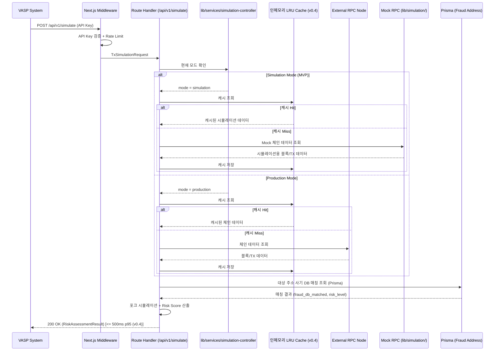

#### 3.4.2 오탐지 핫라인 락 해제 플로우

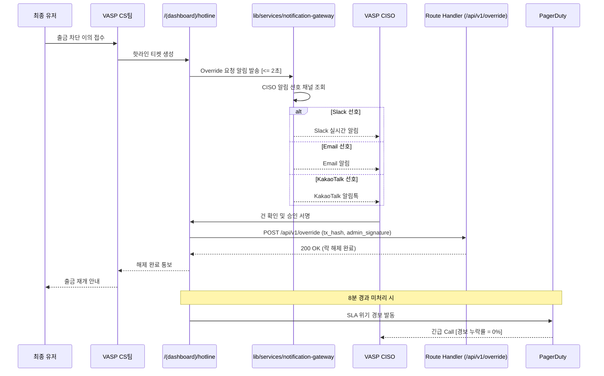

#### 3.4.3 사기 주소 신고 및 사전 조회 플로우

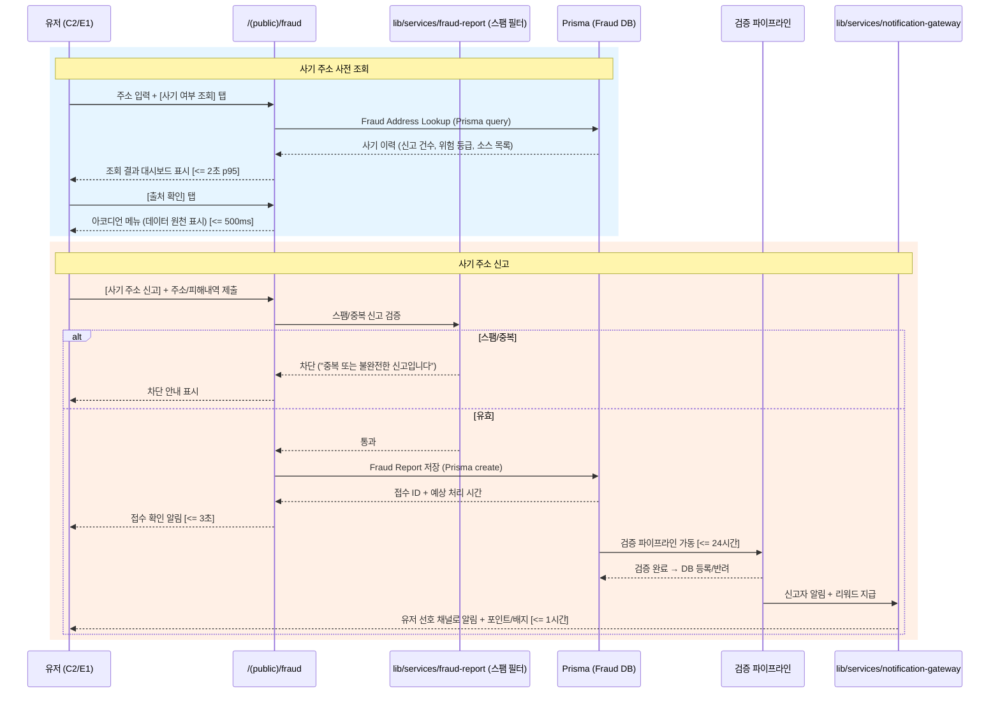

#### 3.4.4 Safe-Name 기반 송금 플로우 (v0.33 Pre-Transfer Verification 포함)

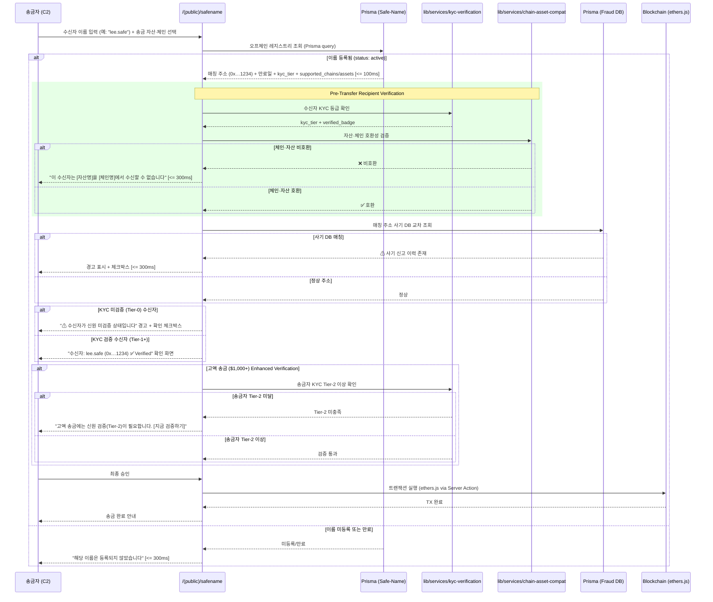

---

## 4. Specific Requirements

### 4.1 Functional Requirements

**(v0.4 변경 요약) F1~F6, F8, F10의 기능 요구사항은 v0.33과 동일하게 유지. F7은 Out-of-Scope 이동. F9는 Route Group+RBAC로 재정의. F11(AI/LLM 통합) 신규 추가. 아래에는 변경이 있는 기능만 기재하며, 변경 없는 기능(F1~F6, F3-A, F4-A~D, F5, F6, F6-A~B, F8, F10)은 SRS v0.33의 해당 섹션을 그대로 승계한다.**

#### F1~F6 (변경 없음 — v0.33 승계)

F1(Zero-FP 실시간 API 엔진), F2(오탐지 핫라인 SLA 대시보드), F3(사기 주소 신고·조회), F3-A(이의 신청·심사·해제), F4(Safe-Name 기반 안전 송금), F4-A(NRM 통합), F4-B(오프체인 레지스트리·DNS식 비용), F4-D(KYC·Pre-Transfer·Compatibility Gate), F5(현금 배상 Warranty 보증), F6(기관용 사기 정보 수집 Agent), F6-A(외부 소스 정책 변경 감지), F6-B(수집 전략·승인 워크플로우)는 **v0.33의 REQ-FUNC-001~060 전체를 변경 없이 승계**한다.

단, 구현 위치가 "Core Service"에서 "Next.js 서비스 모듈(lib/services/)"로 변경되며, DB 접근이 "PostgreSQL 직접 쿼리"에서 "Prisma ORM"으로 변경된다. 이는 구현 수준의 변경이며 기능 요구사항 자체는 동일하다.

#### ~~F7. TradFi 100% 망분리 ZK 인프라~~ (v0.4 Out-of-Scope 이동)

**(v0.4 변경) REQ-FUNC-028~030은 Out-of-Scope(OS-9)로 이동. C-TEC-001(단일 풀스택) 원칙과 근본적으로 충돌하며, 폐쇄망 내 별도 바이너리 배포물은 Next.js 내에서 구현 불가. Post-MVP에서 별도 배포 패키지(Go/Rust 기반)로 대응한다. C3(TradFi IT팀장) 관련 요구는 §2.4 배제 타겟에 명시.**

#### F8. 통합 알림 게이트웨이 (변경 없음 — v0.33 승계)

REQ-FUNC-046~047은 변경 없이 승계. 구현이 `lib/services/notification-gateway.ts` + `lib/adapters/notification/` 내 채널 어댑터로 매핑된다.

#### F9. 운영기관 도메인별 관리 콘솔 5종 (v0.4 변경 — Route Group + RBAC)

| ID | 요구사항 | Priority | Source | Acceptance Criteria |
|---|---|---|---|---|
| **REQ-FUNC-048** | **(v0.4 변경)** 운영기관용 관리 콘솔은 **단일 Next.js App 내 5개 Route Group**으로 구성하며, **Next.js Middleware에서 운영자 역할(O1/O2/O3)에 따라 RBAC를 적용**한다: **(OC-1) `/(admin)/fraud-intel`** — 사기 정보 관리 (O3, O2). **(OC-2) `/(admin)/safename`** — Safe-Name 관리 (O2, O1). **(OC-3) `/(admin)/hotline`** — 핫라인·SLA 관리 (O1). **(OC-4) `/(admin)/warranty`** — Warranty·보증 관리 (O1, O2). **(OC-5) `/(admin)/system`** — 시스템 운영 (O1). 모든 콘솔은 **Tailwind CSS + shadcn/ui 공통 디자인 시스템**을 공유하며, MFA 인증을 공유한다. 향후 트래픽 증가 또는 조직 분리 필요 시 Route Group 단위로 독립 앱 분리가 가능한 구조를 유지한다. | Must | CR-REVIEW-4, CR-V32-3, **C-TEC-001, C-TEC-004 (v0.4)** | **Given** 운영자가 해당 콘솔 접속 **When** MFA 인증 완료 **Then** Middleware RBAC에 따라 역할별 허가된 Route Group만 접근 가능. 각 콘솔 로드 <= 3초, 콘솔 간 전환 <= 1초 (App Router 클라이언트 내비게이션) |

#### F10. MVP Simulation Mode (변경 없음 — v0.33 승계)

REQ-FUNC-049~050은 변경 없이 승계. Simulation Controller가 `lib/services/simulation-controller.ts`로, Mock/Stub이 `lib/simulation/` 디렉토리로 매핑된다. 환경 변수(`SIMULATION_MODE=true/false`)로 모드 분기.

#### F11. AI/LLM 통합 기능 (v0.4 신규)

| ID | 요구사항 | Priority | Source | Acceptance Criteria |
|---|---|---|---|---|
| **REQ-FUNC-AI-001** | **(v0.4 신규)** Fraud Intelligence Agent가 수집한 사기 정보를 **Vercel AI SDK + Gemini API**로 자동 분류하고 위험도를 추천한다. 자동 승인 룰셋(3소스 교차)에 해당하지 않는 단일 소스 건에 대해 AI 기반 위험도 점수를 산출하여 OC-1 사기 정보 관리 콘솔의 승인 대기열에 표시한다. AI 분류 결과는 참고 정보이며, 최종 승인은 인간 운영자(O3)가 수행한다. | Should | C-TEC-005, C-TEC-006 | **Given** Staging DB에 단일 소스 사기 의심 주소 적재 **When** AI 분류 API 호출 **Then** 위험도 점수(0~100) + 카테고리(scam/phishing/hack/sanction/unknown) + 신뢰도 반환. 응답 <= 3,000ms, Simulation Mode 시 고정 Mock 응답 |
| **REQ-FUNC-AI-002** | **(v0.4 신규)** 이의 신청(Dispute) 건에 대해 AI가 1차 판정 보조 의견을 생성한다. 증빙 해시, 소유권 서명, 기존 신고 이력을 종합하여 "승인 권고 / 기각 권고 / 수동 검토 필요" 3단계 의견을 운영자(O2)에게 OC-4 Warranty·보증 관리 콘솔에서 제시한다. **최종 판정은 반드시 인간 운영자가 수행한다.** | Should | C-TEC-005, C-TEC-006 | **Given** 이의 신청 건 접수 **When** AI 심사 보조 API 호출 **Then** 판정 의견(approve_recommend/reject_recommend/manual_review) + 추론 근거 반환. 응답 <= 3,000ms, 인간 최종 판정 필수 |
| **REQ-FUNC-AI-003** | **(v0.4 신규)** 통합 알림 게이트웨이에서 발송하는 알림 메시지의 본문을 AI가 상황에 맞게 자동 생성한다. 알림 유형(긴급 경보, 일반, 마케팅)과 수신자 프로필에 따라 톤·내용을 조절한다. | Could | C-TEC-005, C-TEC-006 | **Given** 알림 발송 이벤트 발생 **When** 알림 메시지 생성 요청 **Then** 상황에 맞는 알림 본문 자동 생성. 생성 <= 2,000ms |

### 4.2 Non-Functional Requirements

**(v0.4 변경) NFR 수치를 Vercel+Supabase 기반 MVP에 맞게 현실화하고, 측정 경로를 Datadog/AWS에서 Vercel/Supabase로 전면 변경한다.**

#### 4.2.1 성능 (Performance)

| ID | 요구사항 | 기준 | 측정 경로 | Source |
|---|---|---|---|---|
| REQ-NF-001 | Zero-FP API 검증 응답 시간 | p95 <= **500ms (v0.4 변경: 100ms→500ms. Edge Runtime 도입 시 100ms Scale-up 경로 유지)** | **Vercel Analytics: API latency p95 (v0.4)** | PRD 5-1, Story 1 AC1 |
| REQ-NF-002 | 사기 주소 조회 응답 시간 | p95 <= 2,000ms | **Vercel Analytics (v0.4)** | PRD 5-1, Story 3 AC2 |
| REQ-NF-003 | Safe-Name 리졸브 시간 | p95 <= 500ms (오프체인 DB 조회) | **Vercel Analytics (v0.4)** | PRD 5-1, Story 4 AC2 |
| REQ-NF-004 | Warranty 팝업 렌더링 시간 | p95 <= 500ms | **Vercel Speed Insights (Web Vitals) (v0.4)** | PRD 5-1, Story 5 AC1 |
| REQ-NF-005 | 통합 알림 게이트웨이 발송 시간 | p95 <= 2,000ms (모든 채널 공통) | **Vercel Analytics (v0.4)** | PRD 5-1, Story 2 AC1 |
| REQ-NF-006 | Fraud Agent 대시보드 로드 | p95 <= 3,000ms | **Vercel Speed Insights (v0.4)** | PRD 5-1, Story 6 AC2 |
| REQ-NF-007 | 동시 접속 부하 기준 (Zero-FP API) | **100 TPS (v0.4 변경: 10,000→100. Production Scale-up 시 Vercel Enterprise 또는 Edge Functions 전환)** | k6 부하 테스트 | PRD 5-1 |
| REQ-NF-008 | 동시 접속 부하 기준 (B2C 엔드포인트) | **동시 접속 100 유저 (피크 300) (v0.4 변경)** | k6 혼합 부하 | PRD 5-1 |
| REQ-NF-009 | 부하 테스트 주기 및 시나리오 | 출시 전 1회 + 분기 1회 | k6 결과 리포트 | PRD 5-1 |

#### 4.2.2 신뢰성 (Reliability)

| ID | 요구사항 | 기준 | 측정 경로 | Source |
|---|---|---|---|---|
| REQ-NF-010 | 월간 서비스 API 가용성 | >= **99.9% (v0.4 변경: 99.99%→99.9%. Vercel Pro SLA 기준)** | **Vercel Uptime Monitoring 또는 UptimeRobot (v0.4)** | PRD 5-2 |
| REQ-NF-011 | 오탐지율 (FP Rate) | <= 0.01% | **앱 내 커스텀 로깅 + Supabase Dashboard (v0.4)** | PRD 5-2 |
| REQ-NF-012 | 핫라인 락 해제 SLA | <= 10분 | **앱 내 SLA 대시보드 (OC-3) (v0.4)** | PRD 5-2 |
| REQ-NF-013 | 보상 배상 완료 SLA | <= 24시간 (자동), <= 72시간 (수동 폴백) | 온체인 이벤트 로그 | PRD 5-2 |
| REQ-NF-014 | 사기 주소 DB 정합성 (오등록률) | <= 0.5% | 월 1회 무작위 200건 샘플 교차 검증 | PRD 5-2 |
| REQ-NF-015 | 사기 신고 처리 SLA | <= 24시간 | **앱 내 SLA 대시보드 (OC-3) (v0.4)** | PRD 5-2 |
| REQ-NF-016 | Safe-Name 레지스트리 정합성 | 이름↔주소 매핑 불일치율 = 0% (오프체인 DB vs 온체인 앵커 Merkle Root 교차 검증) | 주 1회 전수 스캔 (Vercel Cron) | PRD 5-2 |
| REQ-NF-017 | 데이터 백업 주기 | 일 1회 (RPO <= 24h) | **Supabase 자동 백업 (Point-in-Time Recovery) (v0.4 변경)** | PRD 5-2 |
| REQ-NF-018 | 사기 DB 갱신 반영 지연 | <= 5분 | **앱 내 Prisma 쿼리 로그 (v0.4)** | Story 1 AC3 |

#### 4.2.3 보안 (Security)

| ID | 요구사항 | 기준 | 측정 경로 | Source |
|---|---|---|---|---|
| REQ-NF-019 | 핵심 판별 로직 은닉 | 클라이언트 내 로직 노출 0% — **Server Actions/Route Handlers에서만 실행 (v0.4)** | 소스코드 스캐닝 | PRD 5-3 |
| REQ-NF-020 | HTTPS 전 구간 적용 | TLS 1.2+ 필수 — **Vercel 기본 제공 (v0.4)** | SSL Labs 등급 A 이상 | PRD 5-3 |
| REQ-NF-021 | 사기 신고 데이터 익명화 | k-anonymity >= 5 | 익명화 파이프라인 단위 테스트 | PRD 5-3 |
| REQ-NF-022 | VASP API 인증 | API Key 기반 인증 + Rate Limit — **Next.js Middleware에서 처리 (v0.4)** | **Vercel Logs (v0.4)** | PRD 6-2 |

#### 4.2.4 비용 (Cost)

| ID | 요구사항 | 기준 | 측정 경로 | Source |
|---|---|---|---|---|
| REQ-NF-023 | 외부 RPC 비용 통제 | 월간 <= **$500 (v0.4 변경: $5,000→$500)** / Simulation Mode 시 $0 | **Vercel Usage Dashboard (v0.4)** | PRD 5-3 |
| REQ-NF-024 | 전체 MVP 월 인프라 비용 | <= **$500/월 (Simulation) / <= $2,000/월 (Production MVP) (v0.4 변경: Vercel Pro + Supabase Pro 기준)** | **Vercel Usage + Supabase Usage (v0.4)** | PRD 5-3 |

#### 4.2.5 투명성 (Transparency)

| ID | 요구사항 | 기준 | 측정 경로 | Source |
|---|---|---|---|---|
| REQ-NF-025 | Warranty 보증풀 잔고 투명성 | 실시간 퍼블릭 대시보드 공개 | 대시보드 URL + Dune Analytics | PRD 5-3 |
| REQ-NF-026 | 유사수신/보험업법 헷지 | 대형 손보사 B2B 제휴 계약 체결 | 법무법인 컴플라이언스 의견서 | PRD 5-3 |

#### 4.2.6 확장성 (Scalability)

| ID | 요구사항 | 기준 | 측정 경로 | Source |
|---|---|---|---|---|
| REQ-NF-027 | 수평 확장 가능 아키텍처 | **Vercel Serverless 자동 스케일링 기반 Stateless 설계 (v0.4 변경)** | 부하 테스트 시 스케일아웃 검증 | PRD 5-1 |
| REQ-NF-028 | 사기 DB 수용 용량 | 최소 1,000,000건 + 2초 이내 조회 | **Supabase PostgreSQL 벤치마크 (v0.4)** | PRD 5-1 |

#### 4.2.7 유지보수성 (Maintainability)

| ID | 요구사항 | 기준 | 측정 경로 | Source |
|---|---|---|---|---|
| REQ-NF-029 | 로그 표준화 | 모든 API 응답 시간, 에러 코드, 캐싱 적중률 로그 수집 | **Vercel Logs + Supabase Logs (v0.4 변경)** | PRD 5-4 |
| REQ-NF-030 | 실시간 운영 대시보드 | TPS, VASP별 오탐지, PoC 전환율, 신고 건수 | **Vercel Analytics + PostHog (무상 티어) (v0.4 변경)** | PRD 5-4 |
| REQ-NF-031 | 품질 모니터링 | 사기 주소 오등록 신고 건수 및 처리율 | **OC-1 사기 정보 관리 콘솔 내 대시보드 (v0.4)** | PRD 5-4 |

#### 4.2.8 KPI 관련 NFR (변경 없음 — v0.33 승계)

REQ-NF-032~036은 변경 없이 승계. 측정 경로에서 "Datadog Custom Metric"을 "앱 내 커스텀 메트릭 + PostHog"으로 변경.

#### 4.2.9 v0.31 추가 NFR

| ID | 요구사항 | 기준 | 측정 경로 | Source |
|---|---|---|---|---|
| REQ-NF-037 | Safe-Name 오프체인 레지스트리 등록 응답 시간 | p95 <= 3,000ms, 온체인 앵커링 일 1회 | **Vercel Analytics (v0.4)** | CR-REVIEW-2 |
| REQ-NF-039 | NRM Unified Resolve 응답 시간 | p95 <= 1,000ms | **Vercel Analytics (v0.4)** | CR-REVIEW-1 |
| REQ-NF-040 | 통합 알림 게이트웨이 발송 성공률 | >= 99.5% (1차 시도 기준) | **앱 내 발송 로그 (v0.4)** | CR-REVIEW-3 |
| REQ-NF-041 | Simulation ↔ Production 전환 시간 | <= 5분, 전환 중 서비스 중단 0초 | **OC-5 시스템 운영 콘솔 전환 로그 (v0.4)** | CR-REVIEW-6 |
| REQ-NF-042 | Safe-Name Merkle Root 앵커링 가스비 | L2 앵커링 1회당 <= $5 | 온체인 TX 비용 모니터링 | CR-REVIEW-2 |

#### 4.2.10 v0.33 추가 NFR (변경 없음 — v0.33 승계)

REQ-NF-043~047은 변경 없이 승계. 측정 경로에서 "Datadog APM"을 "Vercel Analytics"로 변경.

#### 4.2.11 v0.4 추가 NFR (AI/LLM 통합)

| ID | 요구사항 | 기준 | 측정 경로 | Source |
|---|---|---|---|---|
| **REQ-NF-048** | **(v0.4 신규)** AI Fraud Classify API 응답 시간 | p95 <= 3,000ms | **Vercel Analytics (v0.4)** | **C-TEC-005** |
| **REQ-NF-049** | **(v0.4 신규)** AI Dispute Assist API 응답 시간 | p95 <= 3,000ms | **Vercel Analytics (v0.4)** | **C-TEC-005** |
| **REQ-NF-050** | **(v0.4 신규)** AI 모델 교체 소요 시간 | 환경 변수 변경 + 재배포 <= 5분 | **Vercel Deployment 로그 (v0.4)** | **C-TEC-006** |

---

## 5. Traceability Matrix

| Story | REQ ID | Test Case ID | Priority |
|---|---|---|---|
| Story 1 (Zero-FP Engine) | REQ-FUNC-001~005 | TC-FUNC-001~005 | Must |
| Story 2 (SLA Hotline) | REQ-FUNC-006~008 | TC-FUNC-006~008 | Must |
| Story 3 (Fraud Report & Lookup) | REQ-FUNC-009~013 | TC-FUNC-009~013 | Must |
| Story 3-A (False Report Dispute) | REQ-FUNC-032~034 | TC-FUNC-032~034 | Must/Should |
| Story 4 (Safe-Name) | REQ-FUNC-014~017 | TC-FUNC-014~017 | Must |
| Story 4-A (NRM Integration) | REQ-FUNC-035, 036, 041, 042 | TC-FUNC-035, 036, 041, 042 | Must/Should |
| Story 4-B (Off-Chain Registry & DNS Pricing) | REQ-FUNC-037, 038, 043~045 | TC-FUNC-037, 038, 043~045 | Must/Should |
| Story 4-D (Trust Enhancement — KYC·Pre-Transfer·Compatibility) | REQ-FUNC-053~061 | TC-FUNC-053~061 | Must/Should |
| Story 5 (Warranty) | REQ-FUNC-018~023 | TC-FUNC-018~023 | Must |
| Story 6 (Fraud Agent) | REQ-FUNC-024~027 | TC-FUNC-024~027 | Should |
| Story 6-A (Source Policy Failover) | REQ-FUNC-031 | TC-FUNC-031 | Must |
| Story 6-B (Fraud Collection & Approval) | REQ-FUNC-051~052 | TC-FUNC-051~052 | Must |
| ~~Story 7 (On-Premise ZK)~~ | ~~REQ-FUNC-028~030~~ | ~~TC-FUNC-028~030~~ | ~~Should~~ **(v0.4 Out-of-Scope)** |
| Story 8 (Unified Notification GW) | REQ-FUNC-046~047 | TC-FUNC-046~047 | Must |
| Story 9 (Admin Console) — **(v0.4 Route Group+RBAC)** | REQ-FUNC-048 | TC-FUNC-048 | Must |
| Story 10 (Simulation Mode) | REQ-FUNC-049~050 | TC-FUNC-049~050 | Must |
| **Story 11 (AI/LLM Integration, v0.4 신규)** | **REQ-FUNC-AI-001~003** | **TC-FUNC-AI-001~003** | **Should/Could** |
| PRD 5-1 (성능) | REQ-NF-001~009 | TC-NF-001~009 | Must |
| PRD 5-2 (신뢰성) | REQ-NF-010~018 | TC-NF-010~018 | Must |
| PRD 5-3 (보안) | REQ-NF-019~022 | TC-NF-019~022 | Must |
| PRD 5-3 (비용) | REQ-NF-023~024 | TC-NF-023~024 | Must |
| PRD 5-3 (투명성) | REQ-NF-025~026 | TC-NF-025~026 | Must |
| PRD 5-1 (확장성) | REQ-NF-027~028 | TC-NF-027~028 | Must |
| PRD 5-4 (유지보수성) | REQ-NF-029~031 | TC-NF-029~031 | Must |
| PRD 1-3 (KPI) | REQ-NF-032~036 | TC-NF-032~036 | Must |
| v0.31 NFR | REQ-NF-037~042 | TC-NF-037~042 | Must |
| v0.33 NFR (Trust Enhancement) | REQ-NF-043~047 | TC-NF-043~047 | Must |
| **v0.4 NFR (AI/LLM)** | **REQ-NF-048~050** | **TC-NF-048~050** | **Must** |

---

## 6. Appendix

### 6.1 API Endpoint List

**(v0.4 변경) 모든 엔드포인트의 인증은 Next.js Middleware에서 처리. Rate Limit은 인메모리 토큰 버킷 또는 Upstash Rate Limit으로 구현. Cron 및 AI 엔드포인트 신규 추가.**

| # | Endpoint | Method | 설명 | 인증 | Rate Limit | Timeout |
|---|---|---|---|---|---|---|
| A1 | `/api/v1/simulate` | POST | 트랜잭션 위험도 시뮬레이션 (Zero-FP). Simulation Mode 시 Mock 응답 | API Key (VASP) via **Middleware** | VASP당 **100 req/sec (v0.4)** | **500ms (v0.4)** |
| A2 | `/api/v1/override` | POST | 오탐지 핫라인 락 해제 | API Key + Admin Multisig via **Middleware** | N/A | 5,000ms |
| A3 | `/api/v1/fraud/lookup` | GET | 사기 주소 사전 조회 | Public (Rate Limit) via **Middleware** | IP당 100 req/min | 2,000ms |
| A4 | `/api/v1/fraud/report` | POST | 사기 주소 신고 접수 | User Auth Token via **Middleware** | 유저당 10 req/day | 5,000ms |
| A4-1 | `/api/v1/fraud/dispute` | POST | 사기 주소 오등록 이의 신청 | User Auth Token + 온체인 서명 via **Middleware** | 유저당 3 req/day | 5,000ms |
| A4-2 | `/api/v1/fraud/dispute/{dispute_id}` | GET | 이의 신청 상태 조회 | User Auth Token via **Middleware** | 유저당 50 req/day | 1,000ms |
| A5 | `/api/v1/resolve` | GET | Safe-Name ↔ 주소 리졸브 (Prisma 조회) | Public (Rate Limit) via **Middleware** | IP당 200 req/min | 500ms |
| A5-1 | `/api/v1/resolve/unified` | GET | NRM 통합 리졸브 — TLD 자동 감지 + Adapter Registry 라우팅 | Public (Rate Limit) via **Middleware** | IP당 100 req/min | 1,000ms |
| A6 | `/api/v1/safename/register` | POST | Safe-Name 이름 등록 (오프체인 우선) | User Auth Token via **Middleware** | 유저당 5 req/day | 5,000ms |
| A6-1 | `/api/v1/safename/register/batch` | POST | Safe-Name 배치 등록 (오프체인 일괄) | User Auth Token via **Middleware** | 유저당 1 req/day | 30,000ms |
| A6-2 | `/api/v1/safename/import` | POST | 외부 네이밍 → Safe-Name Import | User Auth Token via **Middleware** | 유저당 5 req/day | 10,000ms |
| A6-3 | `/api/v1/safename/renew` | POST | Safe-Name 이름 갱신 | User Auth Token via **Middleware** | 유저당 10 req/day | 3,000ms |
| A7 | `/api/v1/warranty/mint` | POST | Warranty 보험 증서 NFT 발급 | User Auth Token via **Middleware** | 유저당 1 req/tx | 60,000ms |
| A8 | `/api/v1/warranty/claim` | POST | Warranty 보상 클레임 제출 | User Auth Token via **Middleware** | 유저당 3 req/claim | 30,000ms |
| A9 | `/api/v1/agent/intelligence` | GET | 기관용 사기 정보 통합 조회 | API Key (기관 전용) via **Middleware** | 기관당 1,000 req/min | 3,000ms |
| A10 | `/api/v1/hotline/tickets` | GET/POST | 핫라인 티켓 조회/생성 | API Key (VASP) via **Middleware** | VASP당 100 req/min | 5,000ms |
| A11 | `/api/v1/chain/support-request` | POST | 미지원 체인 지원 요청 | Public via **Middleware** | IP당 5 req/day | 300ms |
| A14 | `/api/v1/notification/preference` | GET/PUT | 알림 채널 선호도 조회/설정 | User Auth Token / API Key via **Middleware** | 10 req/day | 1,000ms |
| A15 | `/api/v1/admin/operations` | POST | Admin 운영 API (모드 전환, 어댑터 관리 등) | Admin MFA Token via **Middleware** | 50 req/day | 10,000ms |
| A16 | `/api/v1/admin/nrm/adapters` | GET/POST/PUT/DELETE | NRM Adapter Registry CRUD | Admin MFA Token via **Middleware** | 50 req/day | 3,000ms |
| A17 | `/api/v1/kyc/verify` | POST | KYC Verification 요청 (v0.33) | User Auth Token via **Middleware** | 유저당 3 req/day | 30,000ms |
| A18 | `/api/v1/kyc/status/{name_id}` | GET | Safe-Name KYC 검증 상태 조회 (v0.33) | User Auth Token via **Middleware** | 유저당 50 req/day | 500ms |
| A19 | `/api/v1/transfer/verify` | POST | Pre-Transfer Recipient Verification (v0.33) | User Auth Token via **Middleware** | 유저당 100 req/day | 1,000ms |
| A20 | `/api/v1/chain-asset/registry` | GET | 지원 체인·자산 레지스트리 조회 (v0.33) | Public (Rate Limit) via **Middleware** | IP당 100 req/min | 500ms |
| A21 | `/api/v1/safename/supported-assets` | GET/PUT | Safe-Name 수신 가능 자산·체인 조회/수정 (v0.33) | User Auth Token via **Middleware** | 유저당 20 req/day | 1,000ms |
| **A22** | **`/api/v1/ai/classify-fraud`** | **POST** | **AI 기반 사기 정보 자동 분류 (v0.4 신규)** | **Admin API Key via Middleware** | **100 req/day** | **3,000ms** |
| **A23** | **`/api/v1/ai/dispute-assist`** | **POST** | **AI 기반 이의 심사 1차 판정 보조 (v0.4 신규)** | **Admin API Key via Middleware** | **50 req/day** | **3,000ms** |
| **A24** | **`/api/cron/anchor`** | **POST** | **일일 Merkle Root 온체인 앵커링 (v0.4 신규)** | **Vercel Cron Secret** | **일 1회** | **60,000ms** |
| **A25** | **`/api/cron/collect`** | **POST** | **사기 정보 소스별 정기 수집 (v0.4 신규)** | **Vercel Cron Secret** | **소스별 수집 주기** | **30,000ms** |
| **A26** | **`/api/cron/health`** | **POST** | **NRM 어댑터 Health Check (v0.4 신규)** | **Upstash QStash Secret** | **5분 주기** | **10,000ms** |
| **A27** | **`/api/cron/expiry`** | **POST** | **Safe-Name 만료 처리 + 알림 발송 (v0.4 신규)** | **Vercel Cron Secret** | **일 1회** | **30,000ms** |

### 6.2 Entity & Data Model

**(v0.4 변경) 모든 엔터티는 단일 Prisma 스키마(`prisma/schema.prisma`)로 정의하며, Prisma ORM을 통해 접근한다. 개발 환경에서는 SQLite, 운영 환경에서는 Supabase PostgreSQL을 사용한다. 기존 3개 분리 DB(Primary DB, Fraud Address DB, Off-Chain Name Registry DB)를 단일 Prisma 스키마로 통합하되, 테이블은 논리적 그룹으로 분류한다.**

**Prisma 스키마 논리적 그룹:**

| 그룹 | 포함 엔터티 |
|---|---|
| Core | VASP, USER, OPERATOR |
| Fraud | FRAUD_ADDRESS, FRAUD_REPORT, FRAUD_DISPUTE, FRAUD_STAGING |
| Safe-Name | SAFE_NAME, NAMING_ADAPTER |
| Warranty | WARRANTY_POLICY, WARRANTY_CLAIM |
| KYC & Compatibility | KYC_VERIFICATION_LOG, CHAIN_ASSET_REGISTRY, TRANSFER_VERIFICATION_LOG |
| Notification | NOTIFICATION_PREFERENCE |
| System | SIMULATION_CONFIG, HOTLINE_TICKET, TX_SIMULATION_REQUEST, RISK_RESULT |

**엔터티 스키마는 v0.33의 §6.2 전체를 변경 없이 승계한다.** 필드 구조, 타입, 제약 조건, 관계(Entity Relationship)는 동일하며, 물리적 접근 방식만 "PostgreSQL 직접 쿼리" → "Prisma ORM"으로 변경된다.

**v0.33 승계 엔터티 목록:** VASP, TX_SIMULATION_REQUEST, RISK_RESULT, FRAUD_ADDRESS, FRAUD_STAGING, FRAUD_REPORT, FRAUD_DISPUTE, SAFE_NAME, NAMING_ADAPTER, NOTIFICATION_PREFERENCE, SIMULATION_CONFIG, OPERATOR, KYC_VERIFICATION_LOG, CHAIN_ASSET_REGISTRY, TRANSFER_VERIFICATION_LOG, WARRANTY_POLICY, HOTLINE_TICKET, USER, WARRANTY_CLAIM, FRAUD_INTELLIGENCE_SOURCE

**Entity Relationship 요약 (v0.33 승계 + v0.4 보완):**

| 관계 | 설명 |
|---|---|
| VASP ∥--o{ TX_SIMULATION_REQUEST | VASP가 다수의 시뮬레이션 요청을 전송 |
| TX_SIMULATION_REQUEST ∥--∥ RISK_RESULT | 각 요청은 하나의 결과를 생성 |
| VASP ∥--o{ HOTLINE_TICKET | VASP가 다수의 핫라인 티켓을 관리 |
| WARRANTY_POLICY ∥--o{ WARRANTY_CLAIM | 보증 정책에 대해 다수의 클레임 제출 가능 |
| USER ∥--o{ FRAUD_REPORT | 유저가 다수의 사기 신고를 제출 |
| FRAUD_REPORT }o--∥ FRAUD_ADDRESS | 사기 신고가 사기 주소 레코드에 기여 |
| USER ∥--o{ SAFE_NAME | 유저가 다수의 Safe-Name을 소유 |
| USER ∥--o{ WARRANTY_POLICY | 유저가 다수의 보증 정책을 구독 |
| USER ∥--o{ FRAUD_DISPUTE | 유저가 다수의 이의 신청을 제출 |
| FRAUD_DISPUTE }o--∥ FRAUD_ADDRESS | 이의 신청이 사기 주소 레코드를 대상으로 함 |
| FRAUD_DISPUTE }o--o∥ FRAUD_REPORT | 이의 신청이 원 신고 레코드를 참조 |
| FRAUD_INTELLIGENCE_SOURCE ∥--o{ FRAUD_ADDRESS | 외부 소스가 다수의 사기 주소를 제공 |
| OPERATOR ∥--o{ FRAUD_DISPUTE | 운영자가 다수의 이의 신청을 심사 |
| USER/VASP/OPERATOR ∥--o{ NOTIFICATION_PREFERENCE | 각 엔터티가 다수의 알림 선호를 설정 |
| NRM → NAMING_ADAPTER ∥--o{ | NRM이 다수의 네이밍 어댑터를 관리 |
| FRAUD_STAGING }o--o∥ FRAUD_ADDRESS | 스테이징 데이터가 승인 후 사기 주소로 반영 |
| OPERATOR ∥--o{ FRAUD_STAGING | 운영자가 스테이징 데이터를 승인/거부 |
| USER ∥--o{ KYC_VERIFICATION_LOG | 유저가 다수의 KYC 검증 요청을 제출 |
| SAFE_NAME ∥--o{ KYC_VERIFICATION_LOG | Safe-Name에 대한 KYC 검증 이력 |
| SAFE_NAME ∥--o{ TRANSFER_VERIFICATION_LOG | Safe-Name 기반 송금 사전 검증 이력 |
| CHAIN_ASSET_REGISTRY → SAFE_NAME.supported_chains/assets | 체인·자산 레지스트리가 Safe-Name 호환성 검증에 참조됨 |

### 6.3 Detailed Interaction Models (상세 시퀀스 다이어그램)

**(v0.4 변경) 아래 시퀀스 다이어그램의 participant를 Next.js 아키텍처에 맞게 변경. "API" → "Route Handler", "DB" → "Prisma", "Widget" → "shadcn Dialog" 등. 논리적 흐름은 v0.33과 동일 유지.**

#### 6.3.1 Warranty 보상 클레임 전체 플로우

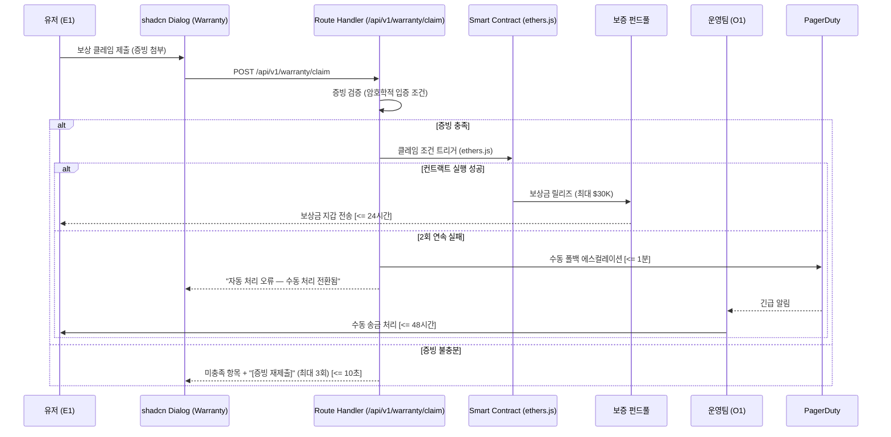

#### 6.3.2 NRM 기반 외부 네이밍 통합 리졸브 플로우

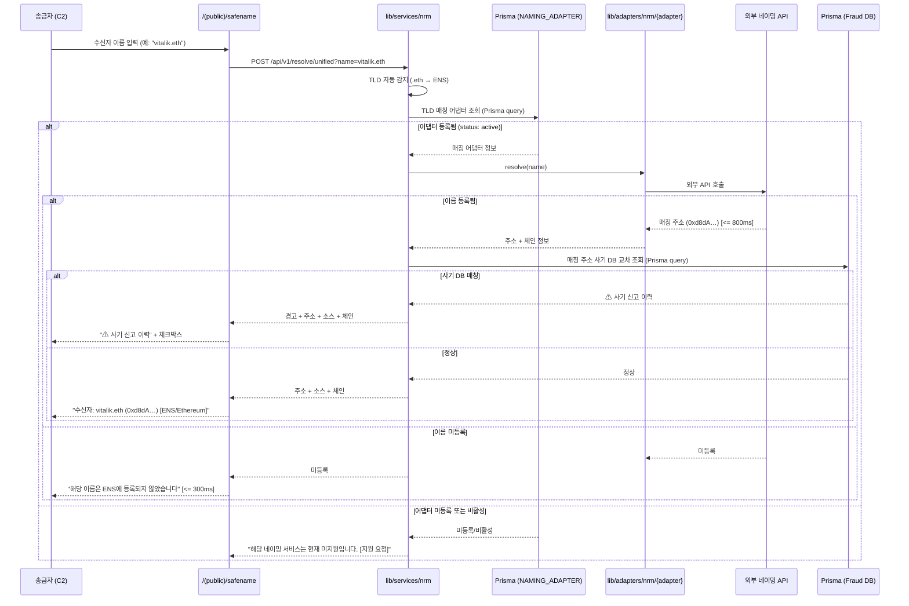

#### 6.3.3 Safe-Name 오프체인 등록 + DNS식 비용 모델 플로우

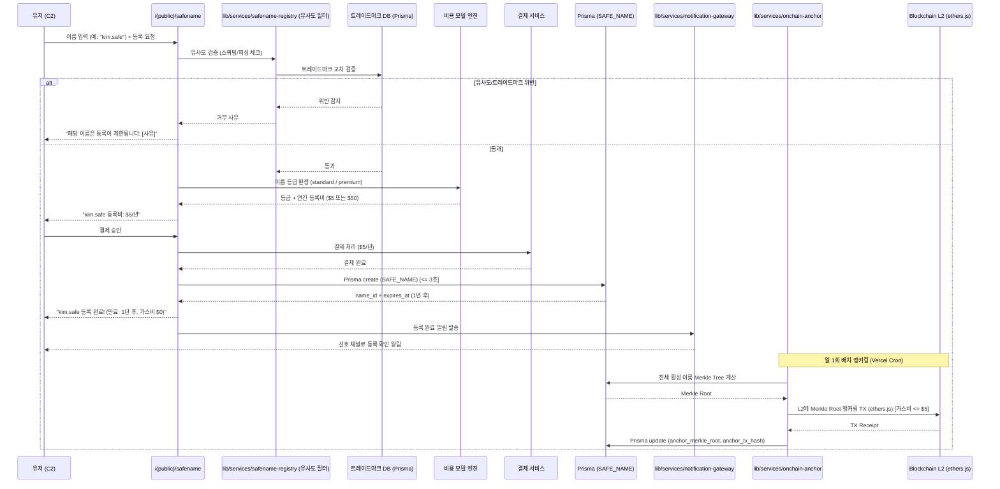

#### 6.3.4 Safe-Name 생명주기(DNS식) 상태 전환 플로우

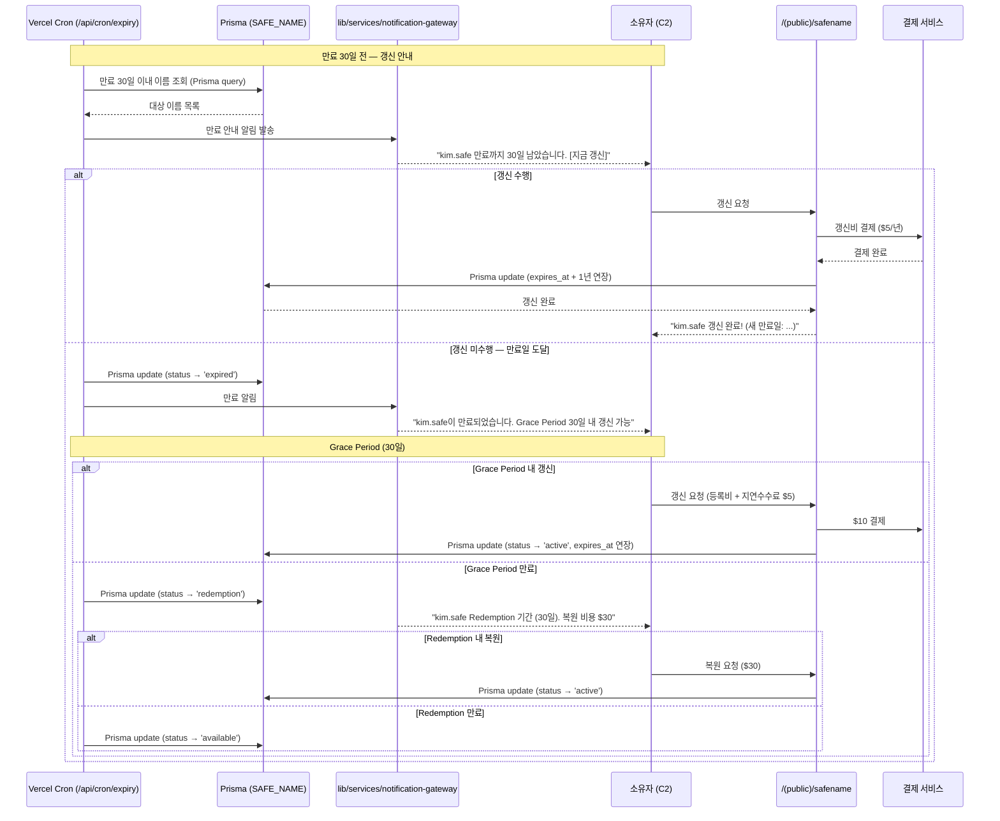

**(v0.32 삭제) §6.3.5 금융결제원 OPEN API 게이트웨이 플로우 — 향후 별도 추진**

#### 6.3.6 통합 알림 게이트웨이 라우팅 플로우

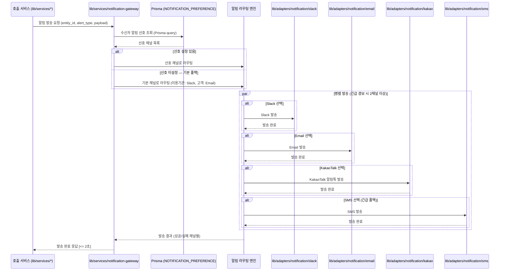

#### 6.3.7 MVP Simulation Mode 전환 플로우

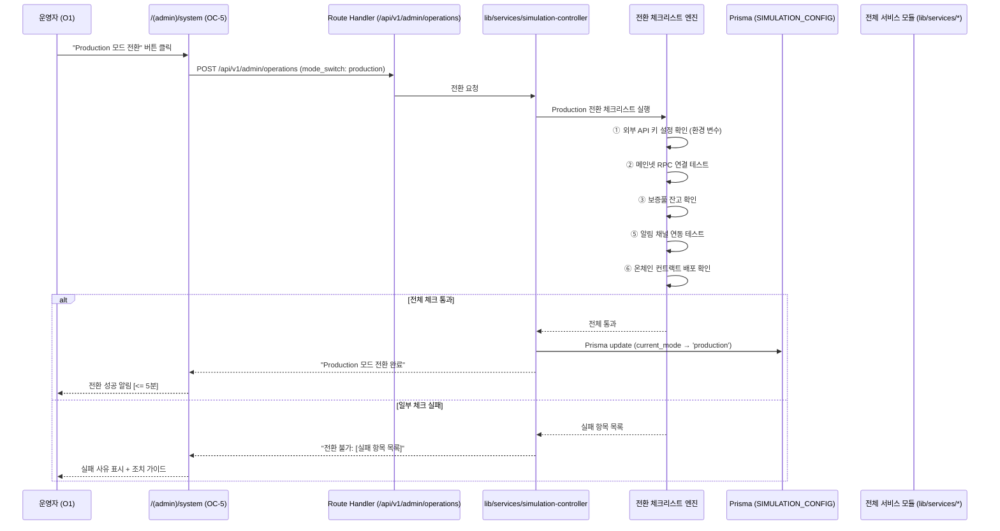

### 6.4 Validation Plan (검증 계획)

| # | 실험 가설 | 실험 설계 | 측정 KPI | 성공 기준 |
|---|---|---|---|---|
| H1 | Zero-FP 엔진 연동 시 오탐지 CS 급감 | A/B Test (n=10,000건): Simulation Mode에서 Mock 데이터 기반 검증 | 일평균 오탐지 CS 건수, 핫라인 SLA 달성률 | CS 티켓 80% 감소, 10분 SLA 100% 달성 |
| H2 | Warranty 구독 유저의 활성도 월등 | 코호트 분석 (n=500명): 테스트넷 기반 시뮬레이션 구독 | 주간 인당 평균 TX 수, D30 리텐션 | 활동량 2배 이상, 리텐션 >= 90% |
| H3 | 사기 주소 사전 조회가 피해율 감소 | 코호트 분석 (n=1,000명): Simulation 시드 데이터 기반 | 사기 피해 발생률, 조회→송금 중단율 | 피해율 70% 감소, 중단율 >= 90% |
| H4 | Safe-Name 등록 유저의 이름 기반 송금 선호 | Within-group (n=200명): 오프체인 등록 UX 검증 | 이름 기반 송금 비율, 오송금 민원 건수 | 이름 기반 >= 50%, 오송금 80% 감소 |
| H5 | 커뮤니티 신고가 자체 DB 커버리지 향상 | 누적 분석 (3개월) | 월간 신고 건수, 커버리지 증가율 | 월간 >= 500건, 커버리지 >= 85% |
| H6 | 이의 신청 프로세스가 오등록 피해를 신속 복구 | 파일럿 (n=50건): OC-4 워크플로우 검증 | 심사 완료 SLA 준수율, 해제 정확도 | 48시간 SLA >= 95%, 해제 정확도 >= 98% |
| H7 | Safe-Name 오프체인 등록 + DNS식 비용 모델이 등록 전환율 향상 | A/B Test (n=500명) | 등록 완료율, 이탈율, 등록 소요 시간 | 등록 완료율 50% 이상 향상 |
| H8 | 무상 소스 전환 시 사기 DB 커버리지 유지 | 전환 시뮬레이션 | DB 커버리지, 정확도 | 커버리지 >= 80%, 정확도 >= 95% |
| H9 | NRM Adapter 설정 변경 시 리졸브 즉시 동작 **(v0.4 변경: "코드 배포 없이" → "설정 변경 시")** | 파일럿: Admin Console에서 어댑터 설정 변경 → 리졸브 동작 확인 | 설정 변경→동작 소요 시간 | 소요 시간 <= 5분, 기존 어댑터 무영향 |
| H10 | 멀티채널 알림이 단일 채널 대비 확인율 향상 | A/B Test (n=200명) | 알림 확인율, 확인 소요 시간 | 확인율 30% 향상 |
| H11 | Simulation Mode → Production 전환 후 동일 기능 동작 보장 | 전환 테스트: 전환 후 E2E 테스트 | 전환 성공률, E2E 통과율 | 전환 성공 100%, E2E 통과 100% |
| H12 | KYC Tier-1 필수 등록 정책이 사기 등록 감소 (v0.33) | A/B Test (n=500명) | 사기 등록 건수, 정상 전환율 | 사기 등록 70% 감소, 정상 전환 80%+ |
| H13 | Pre-Transfer Verification이 오송금·사기 피해 감소 (v0.33) | 코호트 분석 (n=1,000건) | 오송금 발생률, 사기 피해율 | 오송금 90% 감소, 사기 80% 감소 |
| H14 | Asset-Chain Compatibility Gate가 비호환 오송금 차단 (v0.33) | 파일럿 (n=200건) | 차단율, 오차단율 | 차단율 100%, 오차단율 0% |
| **H15** | **(v0.4 신규)** AI 사기 분류가 운영자 승인 효율 향상 | **A/B Test (n=200건): AI 추천 있는 승인 대기열 vs AI 없는 대기열** | **승인 소요 시간, 승인 정확도** | **소요 시간 40% 단축, 정확도 동등 이상** |
| **H16** | **(v0.4 신규)** AI 이의 심사 보조가 심사 효율 향상 | **A/B Test (n=50건): AI 의견 제시 vs 미제시** | **심사 소요 시간, 판정 일관성** | **소요 시간 30% 단축** |

---

**— End of Document —**
