# Software Requirements Specification (SRS)

**Document ID:** SRS-001  
**Revision:** 0.4  
**Date:** 2026-05-09  
**Standard:** ISO/IEC/IEEE 29148:2018  
**변경 이력:**
- v0.1 검토 결과 P0·P1 결함 6건 반영 (UseCase·ERD·Class·Component Diagram 추가, Traceability Matrix 보완, 엔터티 스키마 보완, §3.3 API Overview 동기화)
- v0.3.1 보완: CR-1 외부 소스 정책 변경 우회 조치, CR-2 사기 주소 오등록 대응 전략, CR-3 네이밍 서비스 연계·가스비 완화
- v0.31 보완: (1) 이종 온체인 네이밍 서비스 미들웨어(NRM) 전략 (2) Safe-Name 독자 오프체인 레지스트리·DNS식 비용 모델 (3) 통합 알림 게이트웨이 (4) Stakeholders 3계층 분리 및 Client Applications 재배치 (5) MVP 전 컴포넌트 시뮬레이션 모드 아키텍처
- v0.32 보완: (1) 금융결제원 OPEN API·ISO 20022 지원 삭제 (향후 별도 추진) (2) 무료 사기 정보 사이트 정기 수집 전략 + 운영 담당자 승인 워크플로우 신설 (3) 운영기관용 Admin Console을 도메인 기반 5개 관리 콘솔로 분해 — Tier-1/2 Client와 기능 연계 명확화
- v0.33 보완: Mastercard Crypto Credential(MCC) 대비 송수신자 신뢰성 강화 — KYC Verification Tier 4단계, Pre-Transfer Recipient Verification, Asset-Chain Compatibility Gate
- v0.34 보완: Credential 기반 간소화 이체 UX 및 사기 방지 정책 강화 — "이름 + 금액" 간소화 UI, Hard Block 정책, 양측 통지 의무화
- v0.35 보완: 일회용 주소(Disposable Address) 기반 온체인 보안 강화 — HD Wallet 파생, 자금 포워딩, 생명주기 관리
- **v0.4 보완: Next.js 단일 풀스택 기술 스택 전환 — (1) 마이크로서비스 → Next.js App Router 모놀리스 전환 (2) C-TEC-001~010 기술 스택 제약 신규 추가 (3) Data Layer를 Prisma + Supabase PostgreSQL 단일 DB로 통합 (4) API Gateway → Next.js Middleware 대체 (5) Micro Frontend 5종 → 라우트 그룹 기반 단일 앱 전환 (6) 성능 NFR을 Vercel Serverless 환경에 맞게 조정 (7) 인프라 비용 기준을 Vercel + Supabase 기준으로 재산정 (8) 스마트 컨트랙트·HD Wallet·Relayer를 MVP Simulation Mode에서 오프체인 DB 시뮬레이션으로 대체 (9) Monitoring 스택을 Vercel Analytics + 자체 대시보드로 전환 (10) LLM 통합(Vercel AI SDK + Gemini API) 후보 영역 정의**

---

## 1. Introduction

### 1.1 Purpose

본 SRS는 **온체인 사기 방지 플랫폼(On-Chain Fraud Shield Platform)**의 소프트웨어 요구사항을 정의한다. 본 문서는 PRD v0.2(REF-01) 및 PRD v0.2 품질 리뷰 리포트(REF-02)를 유일한 비즈니스·기능 요구의 원천(Source of Truth)으로 사용하며, ISO/IEC/IEEE 29148:2018 표준에 따라 작성되었다.

**해결 대상 문제:**
온체인 금융시장은 공급 과잉·정보 혼돈 상태에 있으며, 다음의 핵심 문제를 해결한다.

| Pain ID | 문제 요약 | 실패 KPI (현 상태) |
|---|---|---|
| CORE-1 | 과도한 오탐지로 VASP의 VIP 정상 출금 차단 및 CS 마비 | 오탐지 CS 처리 지연율(10분 초과) >= 80% |
| CORE-2 | 사람이 인식 불가능한 온체인 주소 구조 — 오송금·피싱 취약 | 주소 기반 오송금 민원 월 15,000~30,000건, 주소 변별 시도 포기율 >= 70% |
| CORE-3 | 퍼블릭 SaaS 망 의존으로 TradFi 인가 탈락 위기 | TradFi 내부 망분리 심사 탈락률 100%, 연 다운타임 >= 10h |
| CJM-1 | 구제/보상 수단이 없는 100% 면책 조항 | 스캠 피해 보상률 0% |
| CJM-2 | 사기 주소 신고 접점 부재 | 사기 주소 신고 가능 플랫폼 접근율 <= 5% |
| EXT-1 | 지속되는 해킹 공포 / 무보증 트라우마 | 스캠 피해 후 서비스 잔존율 <= 10% |
| EXT-2 | 기관의 외부 사기정보 수집 역량 부재 | 기관 자체 사기 DB 커버리지 <= 30% |

**한 줄 비전:** *"수만 건의 오송금 민원과 오탐지를 해결하고, 사람이 읽을 수 있는 이름 기반 안전 거래와 실시간 사기 주소 필터링, 그리고 에러 시 100% 현금 보상을 보장하는 0.1초 온체인 사기 방지 플랫폼"*

**핵심 이체 원칙:** 고객은 사전 등록된 Safe-Name Credential(이름↔온체인 주소 매핑)을 기반으로 **"이름"과 "금액"만 입력**하여 이체를 수행한다. 시스템은 credential을 자동 리졸브하여 사기 주소 여부를 검증하고, 체인·자산을 자동 결정하며, 사기 주소 확인 시 이체를 강제 차단(Hard Block)하고 송금자에게 통지한다. 정상 이체 완료 시 송수신 양측에 이체 결과를 통지한다.

### 1.2 Scope (In-Scope / Out-of-Scope)

#### In-Scope (MVP)

| # | 범위 |
|---|---|
| IS-1 | 중앙화 백엔드 검증 API 엔진 (Zero-FP + 사기 DB 연동 기반) — **Next.js Route Handler로 구현** |
| IS-2 | VASP 보안 담당자용 Web 핫라인 대시보드 — **Next.js 페이지(Tailwind + shadcn/ui)로 구현** |
| IS-3 | 사기 주소 신고 및 사전 조회 플랫폼 (B2C 웹 기반) — **Next.js 페이지로 구현** |
| IS-4 | Human-Readable Name 독자 등록·리졸브·송금 (Safe-Name Service) — 오프체인 우선 레지스트리 + DNS식 비용 모델, **Prisma DB로 구현** |
| IS-5 | B2C 보증 프론트엔드 위젯 팝업 — **MVP Simulation Mode: 오프체인 DB 기반 시뮬레이션 (스마트 컨트랙트는 Production 전환 시 별도 추진)** |
| IS-6 | 상위 3~5개 메이저 체인(Ethereum, Polygon, Arbitrum 등) 지원 — **MVP Simulation Mode: Mock 체인 데이터** |
| IS-7 | 사기 주소 오등록(False Report) 이의 신청·심사·해제 프로세스 |
| IS-8 | 이종 온체인 네이밍 서비스 통합 리졸브 미들웨어(NRM) — ENS, Unstoppable Domains, SpaceID, Bonfida 등 **DB 설정 기반 어댑터 Strategy 패턴** |
| ~~IS-9~~ | ~~금융결제원 OPEN API·ISO 20022 게이트웨이~~ **(v0.32 삭제 → Out-of-Scope OS-8로 이동)** |
| IS-10 | 통합 알림 게이트웨이 (Slack, Email, KakaoTalk, SMS 등 멀티채널) — **Route Handler에서 외부 Webhook/API 호출로 구현** |
| IS-11 | 운영기관용 도메인별 관리 콘솔 5종 — **단일 Next.js 앱 내 라우트 그룹(`/admin/oc-*`)으로 구현** |
| IS-12 | MVP Simulation Mode — 전 컴포넌트 시뮬레이션/Mock 기반 동작 — **환경 변수 + DB Config + Mock 서비스 모듈로 구현** |

#### Out-of-Scope (명시적 배제)

| # | 배제 항목 | 사유 |
|---|---|---|
| OS-1 | 거래소 매칭 엔진(Matching Engine) 수정 및 침투 | VASP 내부 시스템 비개입 원칙 |
| OS-2 | 개별 DApp 내부 스마트 컨트랙트 코드 직접 보안 감사 | 범위 초과 |
| OS-3 | 개인지갑 App 스토어 출시 | B2B 인프라 공급에 리소스 집중 |
| OS-4 | AI 개인화 투자 추천 | 기술 부채, 데이터 편향 위험 |
| OS-5 | 커뮤니티/리뷰 게시판 | 어뷰징/포지셔닝 훼손 |
| OS-6 | 전체 L1/L2 체인 커버리지 (수백 개) | MVP 범위 초과 |
| OS-7 | 금융결제원 금융공동망 전문(電文) 직접 인터페이스 | 향후 검토 |
| OS-8 | 금융결제원 OPEN API(예금주·법인명 조회) 및 ISO 20022 메시지 게이트웨이 (v0.32 삭제) | 향후 별도 추진 |
| **OS-9** | **(v0.4 신규)** 마이크로서비스 아키텍처, 독립 배포형 Micro Frontend, 별도 백엔드 서버 | C-TEC-001~002에 의한 단일 풀스택 정책. Production 규모 확장 시 재검토 |
| **OS-10** | **(v0.4 신규)** 스마트 컨트랙트 실제 배포·실행 (Warranty NFT 민팅, 보상금 릴리즈, 보증풀 온체인 관리) | MVP Simulation Mode에서 오프체인 DB 시뮬레이션. Production 전환 시 별도 Hardhat 프로젝트로 추진 |
| **OS-11** | **(v0.4 신규)** HD Wallet BIP-44 실제 키 파생 + Forwarding Relayer 상시 프로세스 | Vercel Serverless 비호환. MVP에서 Mock 주소 + DB 상태 전환. Production 전환 시 별도 서비스 추진 |

#### Constraints (제약사항)

##### 기술 스택 제약 (v0.4 신규)

| ID | 제약/가정 | 유형 | 검증 방안 | 시한 |
|---|---|---|---|---|
| **C-TEC-001** | 모든 서비스는 Next.js (App Router) 기반의 단일 풀스택 프레임워크로 구현한다. 프론트엔드와 백엔드를 별도 분리하지 않는다 | 정책 | 코드 리뷰 + 아키텍처 검증 | 전 기간 |
| **C-TEC-002** | 서버 측 로직(DB 접근, API 호출 등)은 Next.js의 Server Actions 또는 Route Handlers를 사용하여 별도의 백엔드 서버 없이 구현한다 | 정책 | 코드 리뷰 | 전 기간 |
| **C-TEC-003** | 데이터베이스는 Prisma + 로컬 SQLite를 사용하여 로컬 개발환경을 구성하고 배포 시 Supabase(PostgreSQL)를 사용하여 인프라 설정 복잡도를 최소화한다 | 정책 | Prisma 스키마 호환성 테스트 | MVP 착수 전 |
| **C-TEC-004** | UI 및 스타일링은 Tailwind CSS와 shadcn/ui를 사용하여 일관된 디자인 코드를 생성하도록 강제한다 | 정책 | 코드 리뷰 + 디자인 시스템 검증 | 전 기간 |
| **C-TEC-005** | LLM 오케스트레이션은 별도의 Python 서버 없이 Vercel AI SDK를 사용하여 Next.js 내부에서 직접 구현한다 | 정책 | 통합 테스트 | MVP 개발 중 |
| **C-TEC-006** | LLM 호출은 Google Gemini API를 기본으로 사용하며, 환경 변수 설정만으로 모델 교체가 가능하도록 SDK의 표준 인터페이스를 준수한다 | 정책 | 모델 교체 E2E 테스트 | MVP 개발 중 |
| **C-TEC-007** | 배포 및 인프라 관리는 Vercel 플랫폼으로 단일화하며, CI/CD 설정 없이 Git Push만으로 배포를 자동화한다 | 정책 | 배포 파이프라인 검증 | MVP 착수 전 |
| **C-TEC-008** | Vercel Serverless Function Timeout은 Pro 플랜 기준 최대 60초이다. 이를 초과하는 배치 작업은 분할 실행 또는 Supabase Edge Functions로 오프로드한다 | 제약 | Timeout 초과 작업 식별 + 분할 설계 | MVP 개발 중 |
| **C-TEC-009** | Vercel Cron Jobs 실행 시간은 최대 60초이다. 대용량 배치(사기 DB 수집, Merkle Root 앵커링, GC 등)는 60초 이내 완료 가능한 단위로 분할한다 | 제약 | Cron Job 실행 시간 측정 | MVP 개발 중 |
| **C-TEC-010** | 로컬 SQLite → Supabase PostgreSQL 전환은 Prisma 마이그레이션으로 수행하며, Simulation→Production 전환 체크리스트에 DB 마이그레이션을 포함한다 | 정책 | 마이그레이션 자동화 테스트 | MVP 전환 전 |

##### 비즈니스·운영 제약 (기존 유지)

| ID | 제약/가정 | 유형 | 검증 방안 | 시한 |
|---|---|---|---|---|
| CON-1 | 자체 캐싱 아키텍처(인메모리 캐시 또는 Vercel KV)가 트래픽의 90% 이상 중복 요청을 커버할 수 있다. **(v0.4 변경: Redis → 인메모리 캐시/Vercel KV)** | 가정 | PoC 환경 대량 TX 인젝션 테스트 (Hit Rate 측정) | MVP 착수 전 |
| CON-2 | 크립토 포비아 유저층의 WTP(월 1~2만 원)가 실제 결제로 이어진다 | 가정 | B2C 클로즈드 베타 구독 전환율 실측 | 출시 후 1개월 |
| CON-3 | 커뮤니티 사기 주소 신고가 월 500건 이상 유입된다 | 가정 | MVP 출시 후 3개월간 신고 건수 추이 모니터링 | 출시 후 3개월 |
| CON-4 | Safe-Name 등록 유저의 50% 이상이 이름 기반 송금을 실제 사용한다 | 가정 | Closed Beta 내 이름 기반 송금 비율 실측 | 출시 후 3개월 |
| CON-5 | 외부 사기 정보 소스(Chainalysis, OFAC 등) API 응답 속도가 <= 15분 갱신에 부합한다 | 가정 | API 부하 테스트 + 캐시 전략 설계 | MVP 착수 전 |
| CON-6 | 메이저 보험사와의 제휴 계약(B2B 보험 기금 헷징)이 런칭 전 성사된다 | 의존성 | 법무/사업팀 제휴 MOU 체결 | MVP 기획 중 |
| CON-7 | Chainalysis/OFAC API의 외부 개발자 접근 허용 정책이 최소 6개월 유지된다. 변경 감지 시 30일 이내 대체 소스 전환을 완료한다. 월 1회 API 파트너 문서·변경 로그 자동 모니터링을 수행하며, 변경 감지 시 통합 알림 게이트웨이 `#fraud-source-alert` 즉시 알림 | 의존성 | API 파트너 문서 변경 모니터링 + 월 1회 자동 스캔 | 지속 |
| CON-8 | 외부 인프라(RPC) 강세장 트래픽 폭주 시 비용 기하급수 증가 위험 (Risk Score 20, Critical). **(v0.4 변경: Simulation Mode에서 RPC 비용 = $0. Production 전환 시 비용을 Vercel 인프라와 통합 관리)** | 리스크 | 캐싱 전략 + 노드 제공자 고정비 상한선 계약 | MVP 착수 전 |
| CON-9 | 스마트 컨트랙트 보증풀의 유사수신·보험업법 위반 간주 가능성 (Risk Score 15, Critical) | 리스크 | 대형 손해보험사 B2B 제휴 + 법무법인 자문 | MVP 기획 중 |
| CON-10 | 사기 주소 오등록(False Report) — 악의적 신고로 무고한 주소 블랙리스트 등록 (Risk Score 15, Critical). 오등록 발생 시 피해 주소 소유자의 이의 신청을 접수하고 48시간 이내 심사·해제를 완료한다. 반복 오신고자(3회 이상)는 신고 기능 90일 제한한다 | 리스크 | 검증 파이프라인 PoC + 다단계 검증 병행 + 이의 신청·심사 프로세스, 오등록률 0.5% 이하 | MVP 착수 전 |
| CON-11 | Safe-Name 스쿼팅/피싱 — 유명 이름 선점 악용 (Risk Score 16, Critical) | 리스크 | 유사도 필터 + 트레이드마크 DB 교차 검증, UDRP 유사 분쟁 해결 프로세스 | MVP 기획 중 |
| CON-12 | 핫라인 SLA 초과 위약금 페널티 (Risk Score 12, High) | 리스크 | 통합 알림 게이트웨이 에스컬레이션(PagerDuty) 자동화 + 1차 AI 승인 룰셋 | MVP 개발 중 |
| CON-13 | 외부 사기 정보 소스 API 정책 변경 (Risk Score 8, High). 복수 외부 소스 병렬 확보 + 자체 커뮤니티 신고 DB 1차 소스 육성. 대체 소스 전환 우선순위: ① Etherscan Labels API(무상) ② MistTrack Open API(무상 티어) ③ ScamSniffer API(무상) ④ 자체 커뮤니티 신고 DB ⑤ Chainalysis(유료) ⑥ OFAC SDN(공공) | 리스크 | 복수 외부 소스 병렬 확보 + 무상 소스 우선 전환 정책 | 지속 |
| CON-14 | 무상 소스 전환 정책 원칙 — 유료 소스 정책 변경 시 무상 외부 소스를 최우선 대체 후보로 채택한다 | 정책 | 분기 1회 소스별 커버리지·품질 비교 리포트 (Data QA팀) | 지속 |
| CON-15 | Safe-Name 오프체인 레지스트리 운영 비용 통제. **(v0.4 변경: Supabase Pro 월 $25 기준. 전체 인프라 비용 목표 월 $500 이하)** DNS식 연간 등록비($5/년)로 운영비를 상쇄한다 | 가정 | PoC 환경 비용 시뮬레이션 | MVP 착수 전 |
| CON-16 | MVP 전 기간 동안 Simulation Mode로 운영하며, 실제 외부 시스템(RPC, Chainalysis, 블록체인)을 Mock 서비스 모듈로 대체한다. **(v0.4 변경: 별도 Mock 서버(Hardhat/Anvil) 대신 Next.js 코드 내 Mock 모듈로 구현. 테스트넷 연동은 ethers.js로 Route Handler에서 직접 호출)** | 정책 | MVP 시뮬레이션 PoC + 전환 체크리스트 검증 | MVP 전 기간 |
| CON-17 | Name Resolution Middleware(NRM) 신규 네이밍 서비스 어댑터 추가 시, **DB 설정 변경 + 사전 등록된 어댑터 풀에서 활성화로 무중단 전환이 가능해야 한다. 완전히 새로운 어댑터 유형 추가 시 코드 배포가 필요하다 (v0.4 변경)** | 가정 | NRM Adapter 전환 테스트 (어댑터 3종 이상 활성/비활성 전환) | MVP 착수 전 |
| CON-19 | 외부 KYC/KYB 검증 제공자 API 응답 시간이 Tier-1 <= 60초, Tier-2 <= 5분을 충족해야 한다. MVP Simulation Mode 시 Mock KYC 응답으로 대체한다 | 의존성 | KYC 제공자 PoC + 대체 제공자 1사 이상 확보 | MVP 착수 전 |
| CON-20 | Safe-Name 등록 시 Tier-1 KYC 필수 정책이 등록 전환율에 미치는 부정적 영향이 10% 이내여야 한다 | 가정 | Closed Beta KYC 필수 등록 전환율 측정 | 출시 후 1개월 |
| CON-21 | CHAIN_ASSET_REGISTRY에 등록된 체인·자산 목록이 실제 블록체인 네트워크 상태와 일치해야 한다 | 정책 | 월 1회 레지스트리 정합성 검증 | 지속 |
| CON-22 | 일회용 주소 자금 포워딩 가스비 — L2 우선 사용 건당 $0.01 이하. 월간 총 포워딩 가스비 $500 초과 시 운영자 알림. **(v0.4: MVP Simulation Mode에서 해당 없음. Production 전환 시 적용)** | 가정 | PoC 환경 L2 포워딩 가스비 실측 | Production 전환 전 |
| CON-23 | HD Wallet Seed 보안 관리. **(v0.4 변경: MVP Simulation Mode에서는 환경 변수 기반 Mock Seed 사용. Production 전환 시 KMS(AWS KMS 또는 HashiCorp Vault) 연동 별도 추진)** | 정책 | Production 전환 시 KMS 접근 감사 + 메모리 삭제 검증 테스트 | Production 전환 전 |
| CON-24 | 일회용 주소 만료 시간(기본 24시간)은 OC-5 시스템 운영 콘솔에서 설정 가능해야 한다. **(v0.4: MVP에서는 DB Config 값으로 관리)** | 정책 | 만료 후 잔금 포워딩 자동화 테스트 | MVP 개발 중 |

### 1.3 Definitions, Acronyms, Abbreviations

| 용어 | 정의 |
|---|---|
| VASP | Virtual Asset Service Provider — 가상자산 사업자(거래소 등) |
| CISO | Chief Information Security Officer — 최고 정보보안 책임자 |
| Zero-FP | Zero False-Positive — 오탐지 제로 목표 |
| Safe-Name | Human-Readable Name 기반 온체인 주소 별칭 서비스. 오프체인 우선 레지스트리 + DNS식 비용 모델 |
| Warranty | 시스템 에러 발생 시 최대 $30,000 현금 보상 보증. **(v0.4: MVP Simulation Mode에서 오프체인 DB 시뮬레이션)** |
| Safe-Name Credential | 유저가 Safe-Name 등록 시 생성되는 이름↔온체인 주소 매핑 정보. 이름 기반 이체 시 자동 리졸브·사기 검증·체인 결정의 기반 |
| Chain-Asset Auto-Select | 이름 + 금액만으로 이체 시, 수신자의 credential 기반으로 최적의 체인·자산을 자동 결정하는 로직 |
| Hard Block (강제 차단) | 사기 DB 등록 주소로의 이체를 원천 차단하는 정책. 이체 진행 옵션을 제공하지 않음 |
| Disposable Address (일회용 주소) | 거래 단위 일회성 수신 주소. **(v0.4: MVP에서 Mock 주소(UUID 기반) + DB 상태 전환으로 시뮬레이션)** |
| NRM | Name Resolution Middleware — 이종 온체인 네이밍 서비스를 통합 리졸브하는 미들웨어 계층. **DB 설정 기반 어댑터 Strategy 패턴 (v0.4 변경)** |
| Simulation Mode | MVP 기간 동안 외부 시스템을 Mock 서비스 모듈로 대체하여 전 기능을 시뮬레이션 환경에서 동작시키는 운영 모드 |
| KYC Verification Tier | Safe-Name 등록자의 신원 검증 수준 4단계: Tier-0(미검증), Tier-1(기본), Tier-2(신원), Tier-3(기관) |
| **Route Handler** | **(v0.4 신규)** Next.js App Router에서 API 엔드포인트를 구현하는 서버 측 핸들러 (`/app/api/*/route.ts`) |
| **Server Action** | **(v0.4 신규)** Next.js에서 서버 측 로직을 클라이언트 컴포넌트에서 직접 호출할 수 있는 함수 |
| **Prisma** | **(v0.4 신규)** TypeScript ORM. 스키마 정의, 마이그레이션, 타입 안전 쿼리 제공 |
| **Vercel AI SDK** | **(v0.4 신규)** LLM 호출을 위한 통합 SDK. 스트리밍, 도구 호출, 다중 모델 지원 |

### 1.4 References

| ID | 문서명 | 경로/출처 |
|---|---|---|
| REF-01 | PRD v0.2 — 온체인 사기 방지 플랫폼 | `1__PRD_v0_2.md` |
| REF-02 | PRD v0.2 품질 리뷰 리포트 | `2__PRD_v0_2_품질_리뷰_리포트.md` |
| REF-03 | Value Proposition Sheet V2 (fin) | `../3. VPS-Draft/4.Value_Proposition_Sheet_V2(fin).md` |
| REF-04 | Chainalysis Crypto Crime Report (2023) | 외부 공개 보고서 |
| REF-05 | OFAC SDN 제재 리스트 | 외부 공개 데이터 |
| REF-06 | ISO/IEC/IEEE 29148:2018 | 국제 표준 |
| REF-09 | ICANN DNS 도메인 생명주기 정책 | ICANN 공개 정책 문서 |
| **REF-10** | **(v0.4 신규)** SRS v4.1 Tech Stack Migration Plan | `4.plans/SRS_v4.1_TechStack_Migration_Plan.md` |
| **REF-11** | **(v0.4 신규)** Next.js App Router Documentation | Next.js 공식 문서 |
| **REF-12** | **(v0.4 신규)** Prisma Documentation | Prisma 공식 문서 |
| **REF-13** | **(v0.4 신규)** Vercel AI SDK Documentation | Vercel AI SDK 공식 문서 |

---

## 2. Stakeholders

**(v0.31 이후 유지) Stakeholders를 3계층(고객·이용기관·운영기관)으로 분리한다.**

### 2.1 Tier-1: 고객 (온체인 사기 방지 서비스 최종 이용자)

| 역할(Role) | 대표 페르소나 | 책임(Responsibility) | 관심사(Interest) |
|---|---|---|---|
| 일반 유저 | C2 이지은 — 온체인 송금 입문자 | 사기 주소 사전 조회, Safe-Name 기반 송금, 사기 주소 신고, 이의 신청 | 이름 기반 송금, 사기 주소 사전 확인, 오등록 시 신속 해제, 가스비 부담 없는 이름 등록 |
| 크립토 포비아 | E1 오재민 — 스캠 자금 유실 피해자 | Warranty 보증 구독, 사기 주소 신고, 보상 클레임, 이의 신청 | 에러 입증 시 100% 현금 보상 보증, 사기 주소 신고 채널, 피해 복구 |

### 2.2 Tier-2: 이용기관 (고객 앞 온체인 사기 방지 서비스 제공자)

| 역할(Role) | 대표 페르소나 | 책임(Responsibility) | 관심사(Interest) |
|---|---|---|---|
| VASP CISO | C1 김철수 — 대형 거래소 보안책임자 | 트랜잭션 위험 판별 API 연동, 오탐지 핫라인 운영, 사기 정보 수집 Agent 활용 | 0.1초 제로 오탐지, 10분 락 해제 SLA, 멀티소스 사기 DB Agent |
| TradFi IT팀장 | C3 최수영 — STO 증권사 인프라팀 | On-Premise ZK 모듈 도입, 망분리 규제 준수 | 100% 망분리 가능 On-Premise 모듈 |

### 2.3 Tier-3: 운영기관 (플랫폼 운영)

| 역할(Role) | 대표 페르소나 | 책임(Responsibility) | 관심사(Interest) |
|---|---|---|---|
| 플랫폼 운영자 | O1 박운영 — 운영팀장 | 시스템 모니터링, SLA 관리, Simulation/Production 모드 전환 | 서비스 가용성, 비용 통제, MVP 시뮬레이션 검증 |
| 컴플라이언스 담당 | O2 한규정 — 컴플라이언스 매니저 | 이의 심사, 오등록 판정, Safe-Name 분쟁 해결 | 이의 심사 SLA 준수, 법적 리스크 최소화 |
| Data QA팀 | O3 정데이터 — 데이터 품질 관리자 | 사기 DB 커버리지·품질 모니터링 | 사기 DB 커버리지 >= 85%, 오등록률 <= 0.5% |

### 2.4 배제 타겟

| 역할(Role) | 사유 |
|---|---|
| N1 은행 | MVP 리소스 투입 전면 금지 |
| N2 맥시멀리스트 | MVP 리소스 투입 전면 금지 |

---

## 3. System Context and Interfaces

### 3.1 External Systems

**(v0.4 변경: 인프라 시스템을 Vercel + Supabase 기반으로 전환)**

| 시스템 | 유형 | 역할 | 제약 사항 |
|---|---|---|---|
| **Vercel Platform (v0.4 신규)** | 배포 인프라 | 애플리케이션 호스팅, Edge Network, Serverless Functions, Cron Jobs | Serverless Timeout: Pro 60초, Cron 60초. C-TEC-007 |
| **Supabase (v0.4 신규)** | 외부 DBaaS | PostgreSQL 호스팅, 자동 백업 (Pro: 일 1회) | Free: 500MB, Pro: 8GB. 연결 풀 제한. C-TEC-003 |
| **Google Gemini API (v0.4 신규)** | 외부 REST | LLM 추론 (Vercel AI SDK 경유) | Rate Limit·과금 정책, 환경 변수로 모델 교체 가능. C-TEC-005, C-TEC-006 |
| 외부 RPC 노드 (Alchemy, Infura 등) | 외부 REST/RPC | 블록 데이터, TX 내역. MVP Simulation Mode 시 **코드 내 Mock 모듈로 대체 (v0.4 변경)** | Rate Limit 초과 시 과금 위험 (캐싱 필수) |
| Chainalysis API | 외부 REST | 주소 위험 등급. MVP Simulation Mode 시 Mock 모듈 응답 | Rate Limit TBD, 유료 구독 |
| OFAC SDN 리스트 | 외부 REST | 제재 대상 주소/엔터티. MVP Simulation Mode 시 정적 시드 데이터 | 정책 변경 모니터링 필요 |
| Etherscan Labels API | 외부 REST (무상) | 주소 레이블 데이터 — 무상 대체 소스 1순위 | Rate Limit: 5 req/sec |
| MistTrack Open API | 외부 REST (무상 티어) | 온체인 자금 추적·사기 주소 — 무상 대체 소스 2순위 | 무상 티어 일일 한도 |
| ScamSniffer API | 외부 REST (무상) | 피싱·사기 컨트랙트 주소 — 무상 대체 소스 3순위 | 커버리지 제한적 |
| ENS (Ethereum Name Service) | 외부 스마트 컨트랙트 / Subgraph API | .eth 이름 ↔ 주소 리졸브 — NRM 어댑터 연동 | Ethereum L1 가스비 의존 |
| Unstoppable Domains API | 외부 REST | .crypto, .wallet 도메인 리졸브 — NRM 어댑터 연동 | API 정책 변경 가능성 |
| SpaceID API | 외부 REST / 스마트 컨트랙트 | .bnb 도메인 리졸브 — NRM 어댑터 연동 | BNB Chain 기반 |
| Bonfida Name Service | 외부 REST | .sol 도메인 리졸브 — MVP Simulation 모드로만 지원 | Solana 기반 |
| KYC/KYB Verification Provider | 외부 REST | Safe-Name 등록자 신원 검증(Tier-1~3). MVP Simulation Mode 시 Mock 응답 | 외부 KYC 서비스 의존 |
| Slack API | 외부 Webhook | 이용기관·운영기관 알림 발송 | Webhook 응답 시간 의존 |
| Email (Gmail/SMTP) | 외부 SMTP/API | 고객·이용기관 알림 발송 | 발송 Rate Limit, 스팸 필터 |
| KakaoTalk 알림톡 API | 외부 REST | 고객 알림 발송 — 한국 시장 특화 | 비즈니스 채널 등록, 건당 과금 |
| SMS Gateway | 외부 REST | 긴급 알림 폴백 | 건당 과금 |
| PagerDuty | 외부 SaaS | SLA 초과 경보, 에스컬레이션. **Route Handler에서 Webhook 호출 (v0.4)** | 외부 SaaS 가용성 의존 |
| Blockchain Networks | 외부 P2P | Safe-Name 앵커링, Warranty 컨트랙트. MVP Simulation Mode 시 테스트넷 | 가스비 변동 |

### 3.2 Client Applications

**(v0.4 변경: 모든 Client Application은 단일 Next.js 앱 내 라우트로 구현)**

#### 3.2.1 Tier-1 고객용 페이지

| 라우트 경로 | 대상 사용자 | 기능 |
|---|---|---|
| `/(public)/fraud-lookup` | C2, E1 | 사기 주소 신고 제출, 사기 여부 사전 조회, 출처 확인, 오등록 이의 신청 |
| `/(public)/safe-name` | C2 | 이름 등록(오프체인), 이름 기반 송금, 주소 리졸브, NRM 교차 리졸브, 갱신·만료 관리 |
| `/(public)/warranty` | E1 | 보증 팝업 노출, 구독 결제, 보증서 확인(MVP: DB 기반), 클레임 제출 |

#### 3.2.2 Tier-2 이용기관용 페이지

| 라우트 경로 | 대상 사용자 | 기능 |
|---|---|---|
| `/(dashboard)/hotline` | C1 (VASP CISO) | 오탐지 알림 수신(멀티채널), 락 해제 승인, SLA 모니터링 |
| `/(dashboard)/fraud-agent` | C1 (VASP CISO) | 멀티소스 사기 정보 통합 조회, 위험 등급 필터링 |
| VASP 연동 API | C1 (VASP CISO) | Zero-FP Simulate API 호출, 사기 DB 연동, 핫라인 티켓 관리 |

#### 3.2.3 Tier-3 운영기관용 관리 콘솔 (라우트 그룹)

**(v0.4 변경: 마이크로 프론트엔드 → 단일 Next.js 앱 내 라우트 그룹. 독립 배포 불가, 역할 기반 접근 제어는 Next.js Middleware에서 처리)**

| # | 라우트 경로 | 콘솔명 | 대상 운영자 | 핵심 기능 |
|---|---|---|---|---|
| OC-1 | `/(admin)/oc-1` | 사기 정보 관리 콘솔 | O3, O2 | 외부 소스 수집 현황, 수집 데이터 승인 대기열, 소스별 커버리지·품질 리포트, 데이터 정합성 검증 |
| OC-2 | `/(admin)/oc-2` | Safe-Name 관리 콘솔 | O2, O1 | 이름 분쟁 심사(UDRP), 프리미엄 이름 분류, 비용 모델 설정, NRM 어댑터 설정 관리, 이름 생명주기 모니터링 |
| OC-3 | `/(admin)/oc-3` | 핫라인·SLA 관리 콘솔 | O1 | 핫라인 SLA 실시간 모니터링, 에스컬레이션 정책, 이용기관 계정·API Key 관리 |
| OC-4 | `/(admin)/oc-4` | Warranty·보증 관리 콘솔 | O1, O2 | 보증풀 잔고(MVP: DB 기반), 클레임 심사, 이의 신청 심사·오등록 판정 |
| OC-5 | `/(admin)/oc-5` | 시스템 운영 콘솔 | O1 | 인프라 모니터링(자체 대시보드), Simulation/Production 모드 전환, 알림 채널 관리, 감사 로그 |

**기능-클라이언트 연계 매핑 매트릭스:**

| Tier-1/2 Client | 연계 운영 콘솔 | 연계 사유 |
|---|---|---|
| 사기 신고·조회 페이지 (Tier-1) | OC-1 사기 정보 관리 + OC-4 Warranty·보증 관리 | 신고 데이터 품질 관리, 이의 신청 심사 |
| Safe-Name 서비스 페이지 (Tier-1) | OC-2 Safe-Name 관리 | 이름 분쟁, NRM 어댑터, 비용 모델 |
| Warranty 위젯 페이지 (Tier-1) | OC-4 Warranty·보증 관리 | 보증풀 잔고, 클레임 심사 |
| VASP 연동 API (Tier-2) | OC-3 핫라인·SLA 관리 | VASP 계정, API Key, SLA |
| 핫라인 대시보드 (Tier-2) | OC-3 핫라인·SLA 관리 | 핫라인 SLA, 에스컬레이션 |
| Fraud Agent 대시보드 (Tier-2) | OC-1 사기 정보 관리 | 소스 수집 현황, 품질 모니터링 |

#### 3.2.4 UseCase Diagram

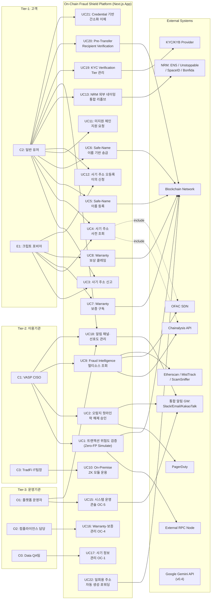

#### 3.2.5 Component Diagram (v0.4 전면 재작성)

```mermaid
graph TB
    subgraph "Next.js App Router (단일 애플리케이션)"
        subgraph "Pages (Tier-1: 고객용)"
            PG1["/(public)/fraud-lookup"]
            PG2["/(public)/safe-name"]
            PG3["/(public)/warranty"]
        end
        subgraph "Pages (Tier-2: 이용기관용)"
            PG4["/(dashboard)/hotline"]
            PG5["/(dashboard)/fraud-agent"]
        end
        subgraph "Pages (Tier-3: 운영기관용)"
            PG6["/(admin)/oc-1 사기 정보"]
            PG7["/(admin)/oc-2 Safe-Name"]
            PG8["/(admin)/oc-3 핫라인·SLA"]
            PG9["/(admin)/oc-4 Warranty·보증"]
            PG10["/(admin)/oc-5 시스템 운영"]
        end

        MW["middleware.ts<br/>(인증·Rate Limit·RBAC)"]

        subgraph "Route Handlers (/app/api/v1/)"
            RH1["/simulate"]
            RH2["/override"]
            RH3["/fraud/*"]
            RH4["/resolve/*"]
            RH5["/safename/*"]
            RH6["/warranty/*"]
            RH7["/kyc/*"]
            RH8["/transfer/*"]
            RH9["/disposable/*"]
            RH10["/notification/*"]
            RH11["/admin/*"]
            RH12["/agent/*"]
        end

        subgraph "Service Modules (lib/services/)"
            SVC1["zero-fp.ts"]
            SVC2["hotline.ts"]
            SVC3["fraud-report.ts"]
            SVC4["safe-name.ts"]
            SVC5["warranty.ts"]
            SVC6["fraud-agent.ts"]
            SVC7["notification.ts"]
            SVC8["dispute.ts"]
            SVC9["nrm.ts"]
            SVC10["kyc.ts"]
            SVC11["compatibility.ts"]
            SVC12["auto-select.ts"]
            SVC13["disposable-address.ts"]
            SVC14["anchor.ts"]
            SVC15["admin.ts"]
            SVC16["simulation.ts"]
        end

        subgraph "Adapter Modules (lib/adapters/)"
            AD1["naming/ (ENS, Unstoppable, SpaceID, Bonfida)"]
            AD2["notification/ (Slack, Email, KakaoTalk, SMS)"]
            AD3["fraud-source/ (Etherscan, MistTrack, ScamSniffer)"]
            AD4["kyc/ (외부 KYC Provider)"]
            AD5["mock/ (Simulation Mode Mock 모듈)"]
        end

        subgraph "AI Module (lib/ai/)"
            AI1["Vercel AI SDK + Gemini"]
        end

        CACHE["In-Memory Cache<br/>(lib/cache.ts)"]
    end

    subgraph "Data Layer"
        DB1[("Supabase PostgreSQL<br/>(Prisma ORM)<br/>— 배포 환경")]
        DB2[("SQLite<br/>(Prisma ORM)<br/>— 로컬 개발")]
    end

    subgraph "External Systems"
        EXT1["Chainalysis / OFAC / Etherscan / MistTrack / ScamSniffer"]
        EXT2["ENS / Unstoppable / SpaceID / Bonfida"]
        EXT3["KYC/KYB Provider"]
        EXT4["Slack / Email / KakaoTalk / SMS"]
        EXT5["PagerDuty"]
        EXT6["Blockchain Networks (테스트넷)"]
        EXT7["Google Gemini API"]
    end

    subgraph "Infrastructure"
        VERCEL["Vercel Platform<br/>(Hosting·Cron·Analytics)"]
    end

    PG1 & PG2 & PG3 & PG4 & PG5 --> MW
    PG6 & PG7 & PG8 & PG9 & PG10 --> MW
    MW --> RH1 & RH2 & RH3 & RH4 & RH5 & RH6 & RH7 & RH8 & RH9 & RH10 & RH11 & RH12

    RH1 --> SVC1
    RH2 --> SVC2
    RH3 --> SVC3 & SVC8
    RH4 --> SVC4 & SVC9
    RH5 --> SVC4
    RH6 --> SVC5
    RH7 --> SVC10
    RH8 --> SVC11 & SVC12
    RH9 --> SVC13
    RH10 --> SVC7
    RH11 --> SVC15 & SVC16
    RH12 --> SVC6

    SVC1 & SVC3 & SVC4 & SVC5 & SVC6 & SVC8 & SVC10 & SVC13 --> DB1
    SVC1 --> CACHE
    SVC9 --> AD1
    SVC7 --> AD2
    SVC6 --> AD3
    SVC10 --> AD4
    SVC16 --> AD5
    AI1 --> EXT7

    AD1 -.->|Production| EXT2
    AD3 -.->|Production| EXT1
    AD4 -.->|Production| EXT3
    AD2 --> EXT4
    SVC2 --> EXT5
    SVC14 -.->|Production| EXT6

    VERCEL --> DB1
```

### 3.3 API Overview

**(v0.4 변경: 모든 API는 Next.js Route Handler로 구현. Internal Service Token 인증 엔드포인트는 함수 직접 호출로 대체하여 API 미노출)**

| API | 구현 방식 | 입력 | 출력 | 주요 제약 |
|---|---|---|---|---|
| **Zero-FP Simulate API** | Route Handler (`/api/v1/simulate`) | `TxSimulationRequest` | `RiskAssessmentResult`. Simulation Mode 시 Mock 응답 | VASP당 1,000 req/sec **(v0.4: 10,000→1,000)**, Timeout: 500ms **(v0.4: 100ms→500ms)** |
| **SLA Hotline Override API** | Route Handler (`/api/v1/override`) | `tx_hash`, `admin_signature` | Status 200 | VASP 관리자 멀티시그 사전 인증 필수 |
| **Hotline Ticket API** | Route Handler (`/api/v1/hotline/tickets`) | vasp_id, tx_hash, description | ticket_id, status | VASP당 100 req/min |
| **Fraud Address Lookup API** | Route Handler (`/api/v1/fraud/lookup`) | address, chain_id | 사기 이력 | 응답 <= 2초 (p95) |
| **Fraud Report API** | Route Handler (`/api/v1/fraud/report`) | address, description, evidence_url, chain | 신고 접수 ID | 스팸 필터 적용 |
| **Fraud Dispute API** | Route Handler (`/api/v1/fraud/dispute`) | address, dispute_reason, evidence_hash, owner_signature | dispute_id, status | 주소 소유권 증명 필수 |
| **Safe-Name Resolve API** | Route Handler (`/api/v1/resolve`) | human_name 또는 address | 매칭 주소/이름 + 사기 DB 교차 결과 + KYC 등급 + Verified 배지 + 지원 체인·자산 | 응답 <= 500ms |
| **Safe-Name Register API** | Route Handler (`/api/v1/safename/register`) | human_name, wallet_address, chain, supported_chains, supported_assets | name_id, registered_at, expires_at, kyc_tier, credential_id | 유저당 5 req/day, Tier-1 KYC 필수 |
| **NRM Unified Resolve API** | Route Handler (`/api/v1/resolve/unified`) | name, auto_detect: true | 매칭 주소 + 사기 DB 교차 + 원본 소스 + 체인 정보 | 응답 <= 2,000ms **(v0.4: 1,000ms→2,000ms, 외부 API 의존 반영)** |
| **Warranty Mint API** | Route Handler (`/api/v1/warranty/mint`) | 유저 결제 증빙, wallet_address | **MVP: DB 레코드 + 시뮬레이션 메타데이터 (v0.4)** | 유저당 1 req/tx |
| **Warranty Claim API** | Route Handler (`/api/v1/warranty/claim`) | policy_id, evidence_hash, claim_description | claim_id, status | 유저당 3 req/claim |
| **Fraud Intelligence Agent API** | Route Handler (`/api/v1/agent/intelligence`) | source_filter, risk_level_filter, time_range | 통합 사기 주소 목록 | 기관 전용, API Key 인증 |
| **Notification Preference API** | Route Handler (`/api/v1/notification/preference`) | user_id/org_id, channel_preferences | 설정 확인 | 유저당 10 req/day |
| **Admin Operations API** | Route Handler (`/api/v1/admin/operations`) | operation_type | 작업 결과 | 운영기관 전용, MFA 인증 필수 |
| **NRM Adapter Management API** | Route Handler (`/api/v1/admin/nrm/adapters`) | CRUD 데이터 | 어댑터 설정 결과 | Admin MFA Token |
| **KYC Verification API** | Route Handler (`/api/v1/kyc/verify`) | user_id, name_id, tier_requested | verification_id, status, tier_granted | 유저당 3 req/day |
| **Pre-Transfer Verification API** | Route Handler (`/api/v1/transfer/verify`) | sender_name, recipient_name, amount, asset(선택), chain(선택) | 종합 검증 결과 + auto_selected_chain/asset + hard_blocked | 응답 <= 1,000ms |
| **Chain-Asset Registry API** | Route Handler (`/api/v1/chain-asset/registry`) | chain_id 또는 asset_symbol | 지원 체인·자산 목록 | Public, IP당 100 req/min |
| **Forwarding Status API** | Route Handler (`/api/v1/disposable/forwarding-status`) | disposable_address 또는 log_id | forwarding_status, 관련 정보 | User Auth Token |

**내부 전용 함수 (API 미노출, v0.4 변경):**

| 함수 | 모듈 | 설명 | 이전 API |
|---|---|---|---|
| `sendTransferNotification()` | `lib/services/notification.ts` | 이체 결과 송수신 양측 통지 | 이전 A22 `/api/v1/transfer/notify` |
| `generateDisposableAddress()` | `lib/services/disposable-address.ts` | 일회용 수신 주소 생성 | 이전 A23 `/api/v1/disposable/generate` |

### 3.4 Interaction Sequences (핵심 시퀀스 다이어그램)

**(v0.4 변경: 모든 시퀀스에서 마이크로서비스 간 REST 호출 → 동일 프로세스 내 함수 호출로 변경. 사용자 관점 인터랙션 흐름은 동일 유지)**

#### 3.4.1 Zero-FP 실시간 트랜잭션 검증 플로우

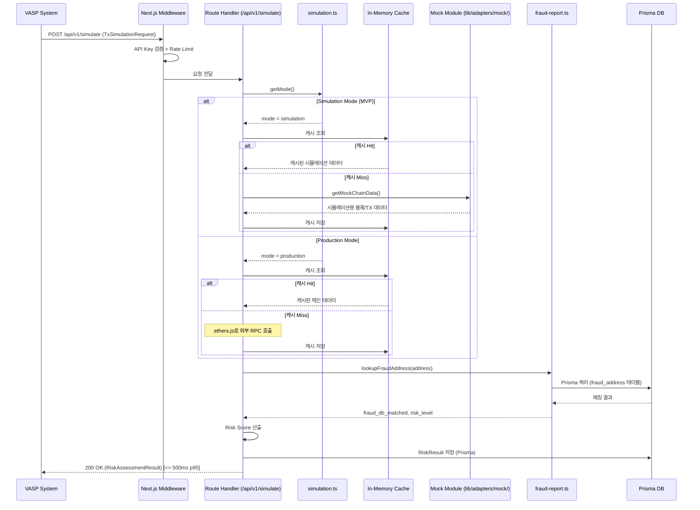

#### 3.4.2 오탐지 핫라인 락 해제 플로우

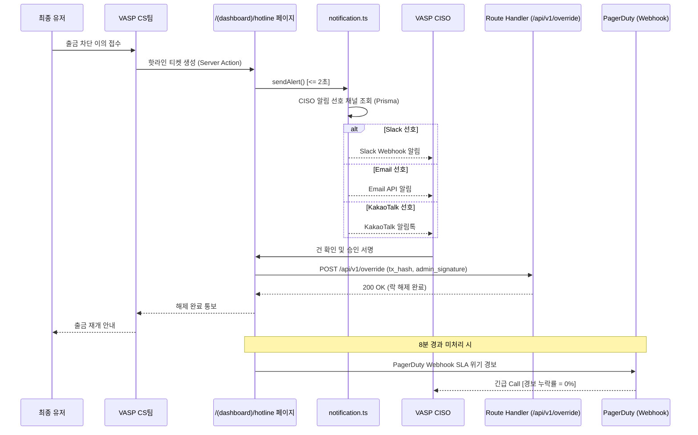

#### 3.4.3 사기 주소 신고 및 사전 조회 플로우

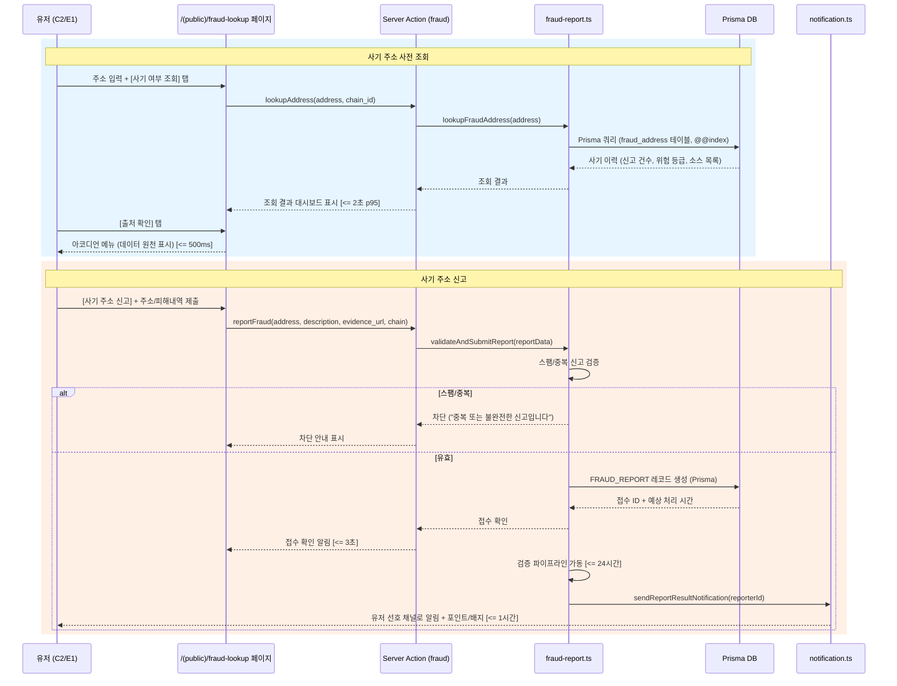

#### 3.4.4 Safe-Name 기반 송금 플로우 (v0.4: 단일 프로세스 내 함수 호출 체인)

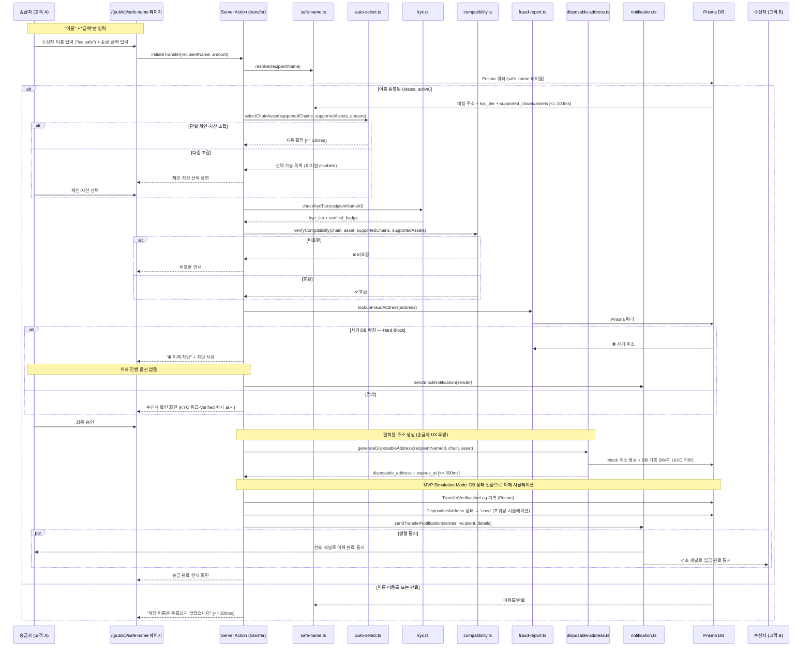

---

## 4. Specific Requirements

### 4.1 Functional Requirements

**(v0.4 변경 원칙: 기능 요구사항의 입출력·사용자 경험은 동일 유지. 구현 기술 참조만 변경. 스마트 컨트랙트·HD Wallet·Relayer는 MVP에서 오프체인 DB 시뮬레이션으로 대체)**

#### F1. Zero-FP 실시간 API 엔진 (Source: Story 1)

| ID | 요구사항 | Priority | Source | Acceptance Criteria |
|---|---|---|---|---|
| REQ-FUNC-001 | 시스템은 VASP로부터 트랜잭션 서명 전 검증 요청(`TxSimulationRequest`)을 수신하고, Risk Score가 포함된 `RiskAssessmentResult`를 반환해야 한다. **Route Handler(`/api/v1/simulate`)로 구현하며, Simulation Mode 시 Mock 모듈 데이터 기반으로 동일한 응답 구조를 반환한다. (v0.4 변경)** | Must | Story 1, AC1 | **Given** 검증 요청 수신 **When** Route Handler가 시뮬레이션 수행 **Then** Risk Score 포함 응답 반환. 응답 시간 <= 500ms (p95). **(v0.4: 100ms→500ms, Serverless Cold Start 반영)** |
| REQ-FUNC-002 | 시스템은 오탐지율(FP Rate)을 <= 0.01%로 유지해야 한다. | Must | Story 1, AC2 | 변경 없음 |
| REQ-FUNC-003 | 최신 사기 주소를 5분 이내에 반영하여 Risk Score 산출에 사용해야 한다. | Must | Story 1, AC3 | 변경 없음 |
| REQ-FUNC-004 | 외부 RPC 타임아웃 시, **인메모리 캐시(v0.4: Redis→인메모리)를 통해 검증을 수행하거나 바이패스**해야 한다. Simulation Mode 시 Mock 모듈이 대체. | Must | Story 1, AC4 | 변경: Redis → 인메모리 캐시 |
| REQ-FUNC-005 | 미지원 체인 요청 시 미지원 안내 + 지원 요청 접수. | Must | Story 1, AC5 | 변경 없음 |

#### F2. 오탐지 핫라인 SLA 대시보드 (Source: Story 2)

| ID | 요구사항 | Priority | Source | Acceptance Criteria |
|---|---|---|---|---|
| REQ-FUNC-006 | 유저가 CS에 예외 처리를 접수하면 CISO의 선호 알림 채널로 Override 요청 알림을 발송해야 한다. **Route Handler에서 외부 Webhook/API 호출로 구현 (v0.4).** | Must | Story 2, AC1 | 알림 발송 지연 <= 2초 |
| REQ-FUNC-007 | CISO가 서명 완료 시 거래 락 즉각 해제. | Must | Story 2, AC2 | 변경 없음 |
| REQ-FUNC-008 | 8분 이상 미처리 시 **PagerDuty Webhook + 긴급 채널** 자동 경고. | Must | Story 2, AC3 | 변경 없음 |

#### F3. 사기 주소 신고 및 사전 조회 플랫폼 (Source: Story 3)

| ID | 요구사항 | Priority | Source | Acceptance Criteria |
|---|---|---|---|---|
| REQ-FUNC-009 ~ REQ-FUNC-013 | 사기 주소 신고·조회·출처 확인·리워드·스팸 필터 | Must | Story 3 | **변경 없음.** UI는 Tailwind + shadcn/ui, 백엔드는 Server Action + Prisma로 구현 |

#### F3-A. 사기 주소 오등록 이의 신청·심사·해제

| ID | 요구사항 | Priority | Source | Acceptance Criteria |
|---|---|---|---|---|
| REQ-FUNC-032 ~ REQ-FUNC-034 | 이의 신청 접수·48시간 심사·해제 알림 | Must/Should | CR-2, CON-10 | **변경 없음.** 심사 워크플로우는 OC-4(`/(admin)/oc-4`) 라우트에서 관리 |

#### F4. Human-Readable Name 기반 안전 송금 (Source: Story 4)

| ID | 요구사항 | Priority | Source | Acceptance Criteria |
|---|---|---|---|---|
| REQ-FUNC-014 | Safe-Name 등록 — **Prisma를 통해 DB에 즉시 기록 (v0.4: "오프체인 레지스트리 DB" → "Prisma DB").** Tier-1 KYC 필수, 수신 가능 체인·자산 등록 필수. 온체인 앵커링은 Vercel Cron Job으로 일 1회 배치 수행. | Must | Story 4 | 등록 완료 <= 3초(Prisma), KYC Tier-1 <= 60초 |
| REQ-FUNC-015 | 이름 + 금액 간소화 이체 — Auto-Select + Pre-Transfer Verification + Hard Block + 양측 통지. **모든 서비스 호출이 동일 프로세스 내 함수 호출로 수행 (v0.4).** | Must | Story 4 | 리졸브 <= 500ms, 전체 사전 검증 <= 1,000ms |
| REQ-FUNC-016 | 사기 주소 강제 차단(Hard Block). | Must | Story 4 | 변경 없음 |
| REQ-FUNC-017 | 미등록 이름 안내. | Must | Story 4 | 변경 없음 |

#### F4-A. NRM 기반 이종 네이밍 서비스 통합 (v0.4 변경)

| ID | 요구사항 | Priority | Source | Acceptance Criteria |
|---|---|---|---|---|
| REQ-FUNC-035 | NRM Unified Resolve — **DB의 naming_adapter 테이블 조회 + 코드 내 어댑터 Strategy 패턴으로 라우팅 (v0.4: Adapter Registry 플러그인 → Strategy 패턴).** | Must | CR-3 | 리졸브 <= 2,000ms (p95) **(v0.4: 1,000ms→2,000ms, 외부 API 지연 반영)** |
| REQ-FUNC-036 | 외부 이름 Import. | Should | CR-3 | 변경 없음 |
| REQ-FUNC-041 | 신규 어댑터 등록 — **DB 설정 변경(naming_adapter 테이블 INSERT) + 사전 등록된 어댑터 풀에서 활성화. 완전히 새로운 어댑터 유형 추가 시 코드 배포 필요 (v0.4: 플러그인 Hot-Swap → DB Config 기반).** | Must | CON-17 | DB 설정 변경 후 어댑터 활성화 <= 30초 |
| REQ-FUNC-042 | 어댑터 Health Check + 자동 비활성화. **Vercel Cron Job으로 5분 주기 수행 (v0.4).** | Should | CR-3 | 변경 없음 (실행 환경만 변경) |

#### F4-B. Safe-Name 오프체인 레지스트리 및 DNS식 비용 모델

| ID | 요구사항 | Priority | Source | Acceptance Criteria |
|---|---|---|---|---|
| REQ-FUNC-037 | 오프체인 등록 + DNS식 연간 등록비. **Prisma DB 기록 (v0.4).** | Must | CR-3(나) | 변경 없음 (DB 기술만 변경) |
| REQ-FUNC-038 | 배치 등록. | Should | CR-3(나) | 변경 없음 |
| REQ-FUNC-043 | 이름 생명주기 (DNS식 상태 전환). **상태 전환 스케줄링: Vercel Cron Job (v0.4).** | Must | REF-09 | 변경 없음 (실행 환경만 변경) |
| REQ-FUNC-044 | DNS식 비용 모델 ($5/년, 프리미엄 $50/년 등). | Must | CR-3(나) | 변경 없음 |
| REQ-FUNC-045 | 일 1회 Merkle Root L2 앵커링. **Vercel Cron Job에서 ethers.js로 L2 TX 제출. Cron 60초 제한 내 완료 가능 (단일 TX) (v0.4).** | Must | CR-3(나) | 변경 없음 (실행 환경만 변경) |

#### F4-D. 송수신자 신뢰성 강화 — KYC·Pre-Transfer·Compatibility Gate

| ID | 요구사항 | Priority | Source | Acceptance Criteria |
|---|---|---|---|---|
| REQ-FUNC-053 ~ REQ-FUNC-061 | KYC Tier 4단계, Pre-Transfer Verification, Asset-Chain Compatibility Gate, Enhanced Verification, Verified 배지 | Must/Should | CR-V33 | **변경 없음.** 모든 검증 로직은 `lib/services/` 모듈 내 함수 호출로 구현. 외부 KYC 제공자는 `lib/adapters/kyc/` 어댑터 경유 (Simulation: Mock) |

#### F4-E. Credential 기반 간소화 이체 UX 및 이체 결과 통지

| ID | 요구사항 | Priority | Source | Acceptance Criteria |
|---|---|---|---|---|
| REQ-FUNC-062 | 이체 결과 송수신 양측 통지. **`sendTransferNotification()` 함수 직접 호출 (v0.4: API 미노출).** | Must | CR-V34-A | 변경 없음 (호출 방식만 변경) |
| REQ-FUNC-063 | Chain-Asset Auto-Select. | Must | CR-V34-A | 변경 없음 |
| REQ-FUNC-064 | Hard Block 차단 통지. | Must | CR-V34-B | 변경 없음 |

#### F4-F. 일회용 주소 기반 온체인 보안 강화 (v0.4 변경: MVP 시뮬레이션)

| ID | 요구사항 | Priority | Source | Acceptance Criteria |
|---|---|---|---|---|
| REQ-FUNC-065 | 일회용 주소 자동 생성 — **MVP: UUID 기반 Mock 주소 생성 + Prisma DB 기록. HD Wallet BIP-44 파생 없음 (v0.4 변경). Production 전환 시 HD Wallet + KMS 연동 별도 추진.** 송금자 화면에 일회용 주소 미노출(UX 투명). `generateDisposableAddress()` 함수 직접 호출 (API 미노출). | Must | CR-V35-A | 주소 생성 <= 300ms **(v0.4: 200ms→300ms)**. 송금자 화면에 일회용 주소 미노출. 주소 고유성 100% |
| REQ-FUNC-066 | 자금 포워딩 — **MVP: DB 상태 전환(`active`→`used`)으로 시뮬레이션. 실제 온체인 포워딩 없음 (v0.4 변경). Vercel Cron Job으로 주기적 상태 갱신. Production 전환 시 별도 Relayer 서비스 필요.** 포워딩 실패 시 최대 3회 재시도 로직은 DB 상태 머신으로 구현. | Must | CR-V35-A | **MVP: DB 상태 전환 정확도 100%. Production: 포워딩 성공률 >= 99.9%** |
| REQ-FUNC-067 | 일회용 주소 생명주기 상태 관리. **DB 상태 머신으로 구현 (v0.4).** | Must | CR-V35-A | 상태 전환 정확도 100% |
| REQ-FUNC-068 | 기존 이체 UX 투명 적용. | Must | CR-V35-B | 변경 없음 |
| REQ-FUNC-069 | 만료 주소 GC. **Vercel Cron Job으로 일 1회 배치 수행 (v0.4). 60초 제한 내 분할 실행.** | Should | CR-V35-A | GC 실행 <= 60초(Cron 제한) |

#### F5. 현금 배상 Warranty 보증 (Source: Story 5) — v0.4 변경: MVP 오프체인 시뮬레이션

| ID | 요구사항 | Priority | Source | Acceptance Criteria |
|---|---|---|---|---|
| REQ-FUNC-018 | Warranty 팝업 노출. **UI는 동일. 내부적으로 DB 레코드 참조 (v0.4: 스마트 컨트랙트 → DB 시뮬레이션).** Simulation 환경 안내 배너 표시 필수. | Must | Story 5, AC1 | 팝업 로드 <= 500ms |
| REQ-FUNC-019 | 보험 증서 발급. **MVP: DB에 WARRANTY_POLICY 레코드 생성 + 시뮬레이션 메타데이터 저장. 실제 NFT 민팅 없음 (v0.4). Production 전환 시 테스트넷/메인넷 NFT 민팅 연동.** | Must | Story 5, AC2 | DB 레코드 생성 실패율 < 0.1% |
| REQ-FUNC-020 | 보상금 릴리즈. **MVP: 클레임 접수 → DB 상태 변경(claimed) + 보상 금액 기록. 실제 온체인 지급 없음 (v0.4). Production 전환 시 스마트 컨트랙트 자동 릴리즈 연동.** | Must | Story 5, AC3 | 클레임 워크플로우 정확도 100% |
| REQ-FUNC-021 | 보증풀 잔고 부족 시 신규 가입 중단. **MVP: DB 기반 잔고 관리 (v0.4).** | Must | Story 5, AC4 | 변경 없음 (데이터 소스만 변경) |
| REQ-FUNC-022 ~ REQ-FUNC-023 | 클레임 증빙 미충족 처리, 컨트랙트 실패 시 수동 폴백. **MVP: DB 상태 머신 + PagerDuty Webhook (v0.4).** | Must | Story 5 | 변경 없음 (실행 환경만 변경) |

#### F6. 기관용 사기 정보 수집 Agent (Source: Story 6)

| ID | 요구사항 | Priority | Source | Acceptance Criteria |
|---|---|---|---|---|
| REQ-FUNC-024 | 외부 소스 정기 수집 + Staging DB 적재 + 승인 워크플로우. **Vercel Cron Job으로 수집 스케줄 실행. Prisma로 staging 테이블 적재 (v0.4).** | Must | Story 6, CR-V32-2 | 변경 없음 (실행 환경만 변경) |
| REQ-FUNC-025 ~ REQ-FUNC-027 | Agent 대시보드, 장애 소스 처리. | Should | Story 6 | 변경 없음 |
| REQ-FUNC-031 | 외부 소스 정책 변경 감지 + 자동 전환. | Must | CR-1, CON-7 | 변경 없음 |
| REQ-FUNC-051 ~ REQ-FUNC-052 | Staging DB 품질 검증 + 승인 대기열. | Must | CR-V32-2 | 변경 없음 (Prisma로 구현) |

#### F7. TradFi 100% 망분리 ZK 인프라 (Source: Story 7)

| ID | 요구사항 | Priority | Source | Acceptance Criteria |
|---|---|---|---|---|
| REQ-FUNC-028 ~ REQ-FUNC-030 | On-Premise ZK 모듈. | Should | Story 7 | **변경 없음.** MVP 범위에서 구현 예정 없음. Production 별도 추진 |

#### F8. 통합 알림 게이트웨이 (v0.4 변경)

| ID | 요구사항 | Priority | Source | Acceptance Criteria |
|---|---|---|---|---|
| REQ-FUNC-046 | 알림 채널 관리. **DB 설정 + 코드 내 사전 등록 채널 핸들러 (Slack, Email, KakaoTalk, SMS). 신규 채널 유형 추가 시 코드 배포 필요 (v0.4: 플러그인 → 사전 등록 핸들러).** | Must | CR-REVIEW-3 | DB 설정 변경 후 채널 활성화 <= 30초 |
| REQ-FUNC-047 | Notification Preference 설정. | Must | CR-REVIEW-3 | 변경 없음 |

#### F9. 운영기관 도메인별 관리 콘솔 5종 (v0.4 변경)

| ID | 요구사항 | Priority | Source | Acceptance Criteria |
|---|---|---|---|---|
| REQ-FUNC-048 | 5개 관리 콘솔. **단일 Next.js 앱 내 라우트 그룹(`/(admin)/oc-*`)으로 구현. 독립 배포 불가 (v0.4: Micro Frontend → 라우트 그룹). MFA 인증은 Next.js Middleware에서 공유 처리.** UI는 Tailwind + shadcn/ui. | Must | CR-V32-3 | 역할 기반 접근 제어(RBAC). 각 콘솔 로드 <= 3초, 콘솔 간 전환 <= 1초 |

#### F10. MVP Simulation Mode (v0.4 변경)

| ID | 요구사항 | Priority | Source | Acceptance Criteria |
|---|---|---|---|---|
| REQ-FUNC-049 | Simulation/Production 모드 전환. **환경 변수(`SIMULATION_MODE`) + DB Config(simulation_config 테이블) 조합으로 모드 관리 (v0.4). 전환은 OC-5(`/(admin)/oc-5`)에서 수행.** | Must | CON-16 | 전환 소요 <= 5분 |
| REQ-FUNC-050 | 시드 데이터. **변경 없음.** 시드 로드는 Prisma seed 스크립트(`prisma/seed.ts`)로 구현. | Must | CR-REVIEW-6 | 시드 로드 <= 30초, 전 기능 동작 테스트 통과율 100% |

#### F11. LLM 통합 (v0.4 신규 — 후보 영역 정의)

**(v0.4 신규) Vercel AI SDK + Google Gemini API(C-TEC-005, C-TEC-006)의 MVP 적용 후보 영역을 정의한다. 최종 적용 범위는 프로젝트 오너 확인 후 확정.**

| ID | 요구사항 | Priority | Source | Acceptance Criteria |
|---|---|---|---|---|
| **REQ-FUNC-070** | **(v0.4 신규, Could)** Fraud Report 접수 시 LLM을 활용하여 신고 내용의 사기 유형을 자동 분류(phishing, scam, hack, rug_pull 등)하고, 스팸 신고 필터링을 강화할 수 있어야 한다. Vercel AI SDK의 스트리밍 인터페이스로 구현하며, Server Action에서 Gemini API를 호출한다. LLM 분류 결과는 참고용이며, 최종 판단은 기존 검증 파이프라인이 수행한다. | Could | C-TEC-005, C-TEC-006 | LLM 분류 정확도 >= 80%, 분류 응답 <= 5초, LLM 장애 시 기존 수동 분류로 폴백 |
| **REQ-FUNC-071** | **(v0.4 신규, Could)** OC-1 사기 정보 관리 콘솔에서 운영 담당자가 승인 대기 건의 사기 패턴을 AI에게 질의할 수 있는 AI 어시스턴트 기능을 제공할 수 있어야 한다. Vercel AI SDK Chat 인터페이스로 구현하며, 승인 대기 데이터를 컨텍스트로 전달한다. AI 응답은 참고용이며, 최종 승인/거부 판단은 담당자가 수행한다. | Could | C-TEC-005, C-TEC-006 | AI 응답 <= 10초, AI 장애 시 기능 비활성화(콘솔 정상 동작) |

### 4.2 Non-Functional Requirements

#### 4.2.1 성능 (Performance) — v0.4 변경

| ID | 요구사항 | 기준 | 측정 경로 | Source |
|---|---|---|---|---|
| REQ-NF-001 | Zero-FP API 검증 응답 시간 | **Simulation: p95 <= 500ms, Production: p95 <= 300ms (v0.4: 100ms→500ms/300ms, Serverless Cold Start 반영)** | Vercel Analytics + 자체 로그 | PRD 5-1 |
| REQ-NF-002 | 사기 주소 조회 응답 시간 | p95 <= 2,000ms | Vercel Analytics | PRD 5-1 |
| REQ-NF-003 | Safe-Name 리졸브 시간 | p95 <= 500ms | Vercel Analytics | PRD 5-1 |
| REQ-NF-004 | Warranty 팝업 렌더링 시간 | p95 <= 500ms | 자체 RUM 로그 | PRD 5-1 |
| REQ-NF-005 | 통합 알림 게이트웨이 발송 시간 | **p95 <= 5,000ms (v0.4: 2,000ms→5,000ms, 외부 API + Serverless 오버헤드)** | 자체 로그 | PRD 5-1 |
| REQ-NF-006 | Fraud Agent 대시보드 로드 | p95 <= 3,000ms | Vercel Analytics | PRD 5-1 |
| REQ-NF-007 | 동시 접속 부하 기준 (Zero-FP API) | **MVP: 100 TPS. Production: 1,000 TPS (v0.4: 10,000→100/1,000, Vercel Serverless 한도)** | 자체 부하 테스트 스크립트 | PRD 5-1 |
| REQ-NF-008 | 동시 접속 부하 기준 (B2C 엔드포인트) | **MVP: 동시 접속 100 유저 (피크 200) (v0.4: 500→100, MVP 규모 맞춤)** | 자체 부하 테스트 | PRD 5-1 |
| REQ-NF-009 | 부하 테스트 주기 및 시나리오 | **출시 전 1회 + 분기 1회, 자체 테스트 스크립트 + Vercel Analytics (v0.4: k6+Grafana → 자체 스크립트)** | Vercel Analytics 대시보드 | PRD 5-1 |

#### 4.2.2 신뢰성 (Reliability)

| ID | 요구사항 | 기준 | 측정 경로 | Source |
|---|---|---|---|---|
| REQ-NF-010 | 월간 서비스 API 가용성 | **MVP: >= 99.9%. Production: >= 99.95% (v0.4: 99.99%→99.9%/99.95%, Vercel SLA 기준)** | Vercel Status + 자체 Uptime 모니터 | PRD 5-2 |
| REQ-NF-011 ~ REQ-NF-016 | 오탐지율, 핫라인 SLA, 보상 SLA, DB 정합성, 신고 처리 SLA, 레지스트리 정합성 | 변경 없음 | 변경 없음 | PRD 5-2 |
| REQ-NF-017 | 데이터 백업 주기 | **Supabase 자동 백업 (Pro: 일 1회, RPO <= 24h) + Point-in-Time Recovery (v0.4: AWS RDS → Supabase)** | Supabase Dashboard | PRD 5-2 |
| REQ-NF-018 | 사기 DB 갱신 반영 지연 | <= 5분 | 자체 로그 | Story 1 |

#### 4.2.3 보안 (Security)

| ID | 요구사항 | 기준 | 측정 경로 | Source |
|---|---|---|---|---|
| REQ-NF-019 | 핵심 판별 로직 은닉 — **Server Action / Route Handler에서만 실행, 클라이언트 번들에 로직 미포함 (v0.4)** | 클라이언트 내 로직 노출 0% | Next.js 번들 분석 | PRD 5-3 |
| REQ-NF-020 | HTTPS 전 구간 적용 — **Vercel 자동 SSL 제공 (v0.4)** | TLS 1.2+ 필수 | SSL Labs 등급 A 이상 | PRD 5-3 |
| REQ-NF-021 ~ REQ-NF-022 | 사기 신고 익명화, VASP API 인증 | 변경 없음 | 변경 없음 | PRD 5-3 |

#### 4.2.4 비용 (Cost) — v0.4 전면 변경

| ID | 요구사항 | 기준 | 측정 경로 | Source |
|---|---|---|---|---|
| REQ-NF-023 | 외부 RPC 비용 통제 | **Simulation Mode: $0. Production: 월 <= $500 (v0.4: $5,000→$500, L2 우선 + 캐시 전략)** | Vercel + RPC 제공자 과금 태깅 | PRD 5-3 |
| REQ-NF-024 | 전체 MVP 월 인프라 비용 | **MVP: <= $100 (Vercel Pro $20 + Supabase Pro $25 + 도메인 등). Production: <= $500 (v0.4: $15,000→$100/$500, Vercel + Supabase 기준)** | Vercel + Supabase 과금 대시보드 | PRD 5-3 |

#### 4.2.5 투명성 (Transparency)

| ID | 요구사항 | 기준 | 측정 경로 | Source |
|---|---|---|---|---|
| REQ-NF-025 | Warranty 보증풀 잔고 투명성 | **MVP: 자체 대시보드(OC-4)에서 공개 (v0.4: DB 기반). Production: 온체인 + Dune Analytics** | 대시보드 URL | PRD 5-3 |
| REQ-NF-026 | 유사수신/보험업법 헷지 | 변경 없음 | 변경 없음 | PRD 5-3 |

#### 4.2.6 확장성 (Scalability)

| ID | 요구사항 | 기준 | 측정 경로 | Source |
|---|---|---|---|---|
| REQ-NF-027 | 수평 확장 가능 아키텍처 — **Vercel Serverless 함수 자동 스케일아웃. Prisma 연결 풀 관리 (v0.4)** | 상태 비저장(stateless) 설계 | 부하 테스트 시 스케일아웃 검증 | PRD 5-1 |
| REQ-NF-028 | 사기 DB 수용 용량 | 최소 1,000,000건 + 2초 이내 조회 — **Prisma 인덱스 전략으로 확보 (v0.4)** | DB 벤치마크 테스트 | PRD 5-1 |

#### 4.2.7 유지보수성 (Maintainability) — v0.4 변경

| ID | 요구사항 | 기준 | 측정 경로 | Source |
|---|---|---|---|---|
| REQ-NF-029 | 로그 표준화 | **Vercel Logs + Supabase Logs + 자체 AUDIT_LOG 테이블 (Prisma) (v0.4: Datadog/CloudWatch → Vercel + Supabase + 자체 로그)** | Vercel Dashboard + Supabase Dashboard | PRD 5-4 |
| REQ-NF-030 | 실시간 운영 대시보드 | **OC-5 시스템 운영 콘솔 내 자체 대시보드 페이지 (Next.js + shadcn/ui Charts) (v0.4: Grafana/Mixpanel → 자체 대시보드)** | OC-5 페이지 | PRD 5-4 |
| REQ-NF-031 | 품질 모니터링 | 변경 없음 | 변경 없음 | PRD 5-4 |

#### 4.2.8 KPI 관련 NFR

| ID | 요구사항 | 기준 | 측정 경로 | Source |
|---|---|---|---|---|
| REQ-NF-032 ~ REQ-NF-036 | 사기 차단 성공률, DB 커버리지, 배상 SLA, 이탈률, 신고 공유율 | 변경 없음 | **자체 Metrics 테이블 + OC-5 대시보드 (v0.4: Datadog Custom Metric → 자체 테이블)** | PRD 1-3 |

#### 4.2.9 추가 NFR

| ID | 요구사항 | 기준 | 측정 경로 | Source |
|---|---|---|---|---|
| REQ-NF-037 | Safe-Name 등록 응답 시간 | p95 <= 3,000ms | Vercel Analytics | CR-REVIEW-2 |
| REQ-NF-039 | NRM Unified Resolve 응답 시간 | **p95 <= 2,000ms (v0.4: 1,000ms→2,000ms, 외부 API 지연 반영)** | Vercel Analytics | CR-REVIEW-1 |
| REQ-NF-040 | 통합 알림 발송 성공률 | >= 99.5% | 자체 로그 | CR-REVIEW-3 |
| REQ-NF-041 | Simulation ↔ Production 전환 시간 | <= 5분, 전환 중 서비스 중단 0초 | Admin Console 전환 로그 | CR-REVIEW-6 |
| REQ-NF-042 | Merkle Root 앵커링 가스비 | L2 1회당 <= $5 | 온체인 TX 비용 모니터링 | CR-REVIEW-2 |
| REQ-NF-043 | Pre-Transfer Verification 응답 시간 | p95 <= 1,000ms | Vercel Analytics | CR-V33-A |
| REQ-NF-044 | Asset-Chain Compatibility 차단 정확도 | 100% | 자체 메트릭 | CR-V33-C |
| REQ-NF-045 ~ REQ-NF-047 | KYC Tier-1/2 검증 시간, 검증 정확도 | 변경 없음 | Vercel Analytics | CR-V33-B |
| REQ-NF-048 | Auto-Select 응답 시간 | **p95 <= 500ms (v0.4: 200ms→500ms, Serverless 반영)** | Vercel Analytics | CR-V34-A |
| REQ-NF-049 ~ REQ-NF-052 | 양측 통지 시간/성공률, Hard Block 차단율, 미지원 체인 disabled 정확도 | 변경 없음 | 자체 로그 | CR-V34 |
| REQ-NF-053 | 일회용 주소 생성 응답 시간 | **Simulation: p95 <= 300ms (v0.4: 200ms→300ms, Mock 주소)** | Vercel Analytics | CR-V35-A |
| **REQ-NF-054** | 자금 포워딩 완료 시간 | **MVP: 해당 없음 (DB 시뮬레이션). Production 전환 시 재정의: p95 <= 5분(L2), <= 15분(L1) (v0.4)** | — | CR-V35-A |
| **REQ-NF-055** | 자금 포워딩 성공률 | **MVP: 해당 없음. Production 전환 시 재정의: >= 99.9% (v0.4)** | — | CR-V35-A |
| **REQ-NF-056** | 포워딩 가스비 | **MVP: 해당 없음. Production 전환 시 재정의: <= $0.01(L2) (v0.4)** | — | CR-V35-A |
| REQ-NF-057 | 일회용 주소 고유성 | 중복 생성 0건 — **Prisma @@unique 제약으로 보장 (v0.4)** | DB 유니크 제약 | CR-V35-A |
| **REQ-NF-058** | HD Wallet Seed KMS 감사 로그 | **MVP: 해당 없음. Production 전환 시 재정의: 100% 기록 (v0.4)** | — | CR-V35-A |
| **REQ-NF-059** | 파생 개인키 Zero-Copy Wipe | **MVP: 해당 없음. Production 전환 시 재정의 (v0.4)** | — | CR-V35-A |

---

## 5. Traceability Matrix

**(v0.4: 기존 Traceability 유지 + F11 LLM 추가)**

| Story | REQ ID | Test Case ID | Priority |
|---|---|---|---|
| Story 1 (Zero-FP Engine) | REQ-FUNC-001 ~ 005 | TC-FUNC-001 ~ 005 | Must |
| Story 2 (SLA Hotline) | REQ-FUNC-006 ~ 008 | TC-FUNC-006 ~ 008 | Must |
| Story 3 (Fraud Report & Lookup) | REQ-FUNC-009 ~ 013 | TC-FUNC-009 ~ 013 | Must |
| Story 3-A (False Report Dispute) | REQ-FUNC-032 ~ 034 | TC-FUNC-032 ~ 034 | Must/Should |
| Story 4 (Safe-Name) | REQ-FUNC-014 ~ 017 | TC-FUNC-014 ~ 017 | Must |
| Story 4-A (NRM Integration) | REQ-FUNC-035, 036, 041, 042 | TC-FUNC-035, 036, 041, 042 | Must/Should |
| Story 4-B (Off-Chain Registry & DNS) | REQ-FUNC-037, 038, 043 ~ 045 | TC-FUNC-037, 038, 043 ~ 045 | Must/Should |
| Story 4-D (Trust Enhancement — KYC) | REQ-FUNC-053 ~ 061 | TC-FUNC-053 ~ 061 | Must/Should |
| Story 4-E (Credential Transfer UX) | REQ-FUNC-062 ~ 064 | TC-FUNC-062 ~ 064 | Must |
| Story 4-F (Disposable Address) | REQ-FUNC-065 ~ 069 | TC-FUNC-065 ~ 069 | Must/Should |
| Story 5 (Warranty) | REQ-FUNC-018 ~ 023 | TC-FUNC-018 ~ 023 | Must |
| Story 6 (Fraud Agent) | REQ-FUNC-024 ~ 027 | TC-FUNC-024 ~ 027 | Must/Should |
| Story 6-A (Source Policy Failover) | REQ-FUNC-031 | TC-FUNC-031 | Must |
| Story 6-B (Collection & Approval) | REQ-FUNC-051 ~ 052 | TC-FUNC-051 ~ 052 | Must |
| Story 7 (On-Premise ZK) | REQ-FUNC-028 ~ 030 | TC-FUNC-028 ~ 030 | Should |
| Story 8 (Notification GW) | REQ-FUNC-046 ~ 047 | TC-FUNC-046 ~ 047 | Must |
| Story 9 (Admin Console) | REQ-FUNC-048 | TC-FUNC-048 | Must |
| Story 10 (Simulation Mode) | REQ-FUNC-049 ~ 050 | TC-FUNC-049 ~ 050 | Must |
| **Story 11 (LLM Integration, v0.4)** | **REQ-FUNC-070 ~ 071** | **TC-FUNC-070 ~ 071** | **Could** |
| Performance NFR | REQ-NF-001 ~ 009 | TC-NF-001 ~ 009 | Must |
| Reliability NFR | REQ-NF-010 ~ 018 | TC-NF-010 ~ 018 | Must |
| Security NFR | REQ-NF-019 ~ 022 | TC-NF-019 ~ 022 | Must |
| Cost NFR | REQ-NF-023 ~ 024 | TC-NF-023 ~ 024 | Must |
| Transparency NFR | REQ-NF-025 ~ 026 | TC-NF-025 ~ 026 | Must |
| Scalability NFR | REQ-NF-027 ~ 028 | TC-NF-027 ~ 028 | Must |
| Maintainability NFR | REQ-NF-029 ~ 031 | TC-NF-029 ~ 031 | Must |
| KPI NFR | REQ-NF-032 ~ 036 | TC-NF-032 ~ 036 | Must |
| Extended NFR (v0.31~v0.35) | REQ-NF-037 ~ 059 | TC-NF-037 ~ 059 | Must |

---

## 6. Appendix

### 6.1 API Endpoint List (v0.4: Route Handler 기반)

| # | Endpoint | Method | 설명 | 인증 | Rate Limit | Timeout |
|---|---|---|---|---|---|---|
| A1 | `/api/v1/simulate` | POST | 트랜잭션 위험도 시뮬레이션 | API Key (VASP) | VASP당 1,000 req/sec | 500ms |
| A2 | `/api/v1/override` | POST | 오탐지 핫라인 락 해제 | API Key + Admin Multisig | N/A | 5,000ms |
| A3 | `/api/v1/fraud/lookup` | GET | 사기 주소 사전 조회 | Public (Rate Limit) | IP당 100 req/min | 2,000ms |
| A4 | `/api/v1/fraud/report` | POST | 사기 주소 신고 접수 | User Auth Token | 유저당 10 req/day | 5,000ms |
| A4-1 | `/api/v1/fraud/dispute` | POST | 이의 신청 | User Auth Token + 온체인 서명 | 유저당 3 req/day | 5,000ms |
| A4-2 | `/api/v1/fraud/dispute/{dispute_id}` | GET | 이의 신청 상태 조회 | User Auth Token | 유저당 50 req/day | 1,000ms |
| A5 | `/api/v1/resolve` | GET | Safe-Name ↔ 주소 리졸브 | Public (Rate Limit) | IP당 200 req/min | 500ms |
| A5-1 | `/api/v1/resolve/unified` | GET | NRM 통합 리졸브 — TLD 자동 감지 + Strategy 라우팅 | Public (Rate Limit) | IP당 100 req/min | 2,000ms |
| A6 | `/api/v1/safename/register` | POST | Safe-Name 등록 (Prisma DB) | User Auth Token + 서명 | 유저당 5 req/day | 5,000ms |
| A6-1 | `/api/v1/safename/register/batch` | POST | 배치 등록 | User Auth Token + 서명 | 유저당 1 req/day | 30,000ms |
| A6-2 | `/api/v1/safename/import` | POST | 외부 네이밍 → Safe-Name Import | User Auth Token + 소유권 증명 | 유저당 5 req/day | 10,000ms |
| A6-3 | `/api/v1/safename/renew` | POST | 이름 갱신 | User Auth Token | 유저당 10 req/day | 3,000ms |
| A7 | `/api/v1/warranty/mint` | POST | Warranty 보증서 발급 (MVP: DB 레코드) | User Auth Token + 결제 증빙 | 유저당 1 req/tx | 60,000ms |
| A8 | `/api/v1/warranty/claim` | POST | 보상 클레임 제출 | User Auth Token + 증빙 | 유저당 3 req/claim | 30,000ms |
| A9 | `/api/v1/agent/intelligence` | GET | 기관용 사기 정보 통합 조회 | API Key (기관 전용) | 기관당 1,000 req/min | 3,000ms |
| A10 | `/api/v1/hotline/tickets` | GET/POST | 핫라인 티켓 조회/생성 | API Key (VASP) | VASP당 100 req/min | 5,000ms |
| A11 | `/api/v1/chain/support-request` | POST | 미지원 체인 지원 요청 | Public | IP당 5 req/day | 300ms |
| A14 | `/api/v1/notification/preference` | GET/PUT | 알림 채널 선호도 조회/설정 | User Auth Token / API Key | 10 req/day | 1,000ms |
| A15 | `/api/v1/admin/operations` | POST | Admin 운영 API (모드 전환 등) | Admin MFA Token | 50 req/day | 10,000ms |
| A16 | `/api/v1/admin/nrm/adapters` | GET/POST/PUT/DELETE | NRM 어댑터 설정 관리 | Admin MFA Token | 50 req/day | 3,000ms |
| A17 | `/api/v1/kyc/verify` | POST | KYC Verification 요청 | User Auth Token | 유저당 3 req/day | 30,000ms |
| A18 | `/api/v1/kyc/status/{name_id}` | GET | KYC 검증 상태 조회 | User Auth Token | 유저당 50 req/day | 500ms |
| A19 | `/api/v1/transfer/verify` | POST | Pre-Transfer Verification + Auto-Select | User Auth Token | 유저당 100 req/day | 1,000ms |
| A20 | `/api/v1/chain-asset/registry` | GET | 지원 체인·자산 레지스트리 조회 | Public (Rate Limit) | IP당 100 req/min | 500ms |
| A21 | `/api/v1/safename/supported-assets` | GET/PUT | Safe-Name 수신 가능 자산·체인 조회/수정 | User Auth Token | 유저당 20 req/day | 1,000ms |
| A24 | `/api/v1/disposable/forwarding-status` | GET | 일회용 주소 포워딩 상태 조회 | User Auth Token | 유저당 50 req/day | 1,000ms |
| A25 | `/api/v1/admin/disposable/config` | GET/PUT | 일회용 주소 만료 시간·GC 주기 설정 | Admin MFA Token | 10 req/day | 1,000ms |

**삭제된 엔드포인트 (v0.4: 내부 함수 호출로 대체):**

| 이전 # | 이전 Endpoint | 대체 방식 |
|---|---|---|
| ~~A22~~ | ~~`/api/v1/transfer/notify`~~ | `notification.ts` → `sendTransferNotification()` 함수 직접 호출 |
| ~~A23~~ | ~~`/api/v1/disposable/generate`~~ | `disposable-address.ts` → `generateDisposableAddress()` 함수 직접 호출 |

### 6.2 Entity & Data Model (v0.4: Prisma 단일 스키마)

**(v0.4 변경: 모든 엔터티를 단일 Prisma 스키마(`prisma/schema.prisma`)로 정의. SQLite/PostgreSQL 양쪽 호환. JSON 필드는 String으로 저장하고 서비스 레이어에서 직렬화/역직렬화.)**

#### Prisma 스키마 호환 규칙

| 항목 | SQLite (로컬) | PostgreSQL (Supabase) | 대응 |
|---|---|---|---|
| JSON 필드 | String 저장 | 네이티브 JSON | String + `JSON.parse/stringify` |
| Enum | String + 앱 레벨 검증 | 네이티브 Enum | String 사용 |
| DateTime | TEXT | TIMESTAMPTZ | Prisma 자동 변환 |
| PK 생성 | `@default(uuid())` | `@default(uuid())` | 동일 |

#### 엔터티 정의

모든 엔터티 공통 변경 (v0.4):
- `string` PK → `String @id @default(uuid())`
- `json` 타입 필드 → `String` (SQLite 호환, 서비스 레이어에서 `JSON.parse/stringify`)
- 인덱스: Prisma 데코레이터 `@@index`, `@@unique` 명시

##### VASP

| 필드 | 타입 | 제약 | 설명 |
|---|---|---|---|
| vasp_id | String | @id @default(uuid()) | VASP 고유 식별자 |
| company_name | String | NOT NULL | 회사명 |
| api_key | String | @@unique, NOT NULL | API 인증 키 |
| plan_type | String | NOT NULL | 요금제 유형 (Freemium / Enterprise) |

##### TX_SIMULATION_REQUEST

| 필드 | 타입 | 제약 | 설명 |
|---|---|---|---|
| request_id | String | @id @default(uuid()) | 요청 고유 식별자 |
| vasp_id | String | FK → VASP | 요청 VASP |
| tx_hash | String | NOT NULL | 트랜잭션 해시 |
| sender_address | String | NOT NULL | 송신자 주소 |
| target_contract | String | NOT NULL | 대상 컨트랙트/주소 |
| value | Float | NOT NULL | 거래 금액 |
| req_timestamp | DateTime | NOT NULL | 요청 시각 |
| simulation_mode | Boolean | NOT NULL, DEFAULT false | Simulation Mode 여부 |

##### RISK_RESULT

| 필드 | 타입 | 제약 | 설명 |
|---|---|---|---|
| result_id | String | @id @default(uuid()) | 결과 고유 식별자 |
| request_id | String | FK → TX_SIMULATION_REQUEST | 연결 요청 |
| is_safe | Boolean | NOT NULL | 안전 여부 |
| confidence_score | Int | NOT NULL, 0~100 | 신뢰도 점수 |
| threat_type | String | NULLABLE | 위협 유형 |
| latency_ms | Int | NOT NULL | 처리 소요 시간 (ms) |
| fraud_db_matched | Boolean | NOT NULL | 사기 DB 매칭 여부 |

##### FRAUD_ADDRESS

| 필드 | 타입 | 제약 | 설명 |
|---|---|---|---|
| fraud_id | String | @id @default(uuid()) | 사기 주소 레코드 ID |
| chain | String | NOT NULL | 체인 식별자 |
| address | String | NOT NULL, @@index | 사기 주소 |
| risk_level | String | NOT NULL | 위험 등급 (low, medium, high, critical) |
| report_count | Int | NOT NULL, DEFAULT 0 | 신고 누적 건수 |
| source_type | String | NOT NULL | 소스 유형 (chainalysis, ofac, community, internal, etherscan, misttrack, scamsniffer) |
| source_detail | String | NULLABLE | 소스 상세 정보 |
| first_reported_at | DateTime | NOT NULL | 최초 신고 일시 |
| last_verified_at | DateTime | NULLABLE | 최종 검증 일시 |
| status | String | NOT NULL | 상태 (pending, verified, rejected, disputed, cleared) |
| approved_by | String | FK → OPERATOR, NULLABLE | DB 등록 승인자 |
| approval_source | String | NULLABLE | 승인 방식 (auto_approved, manually_approved) |

##### FRAUD_STAGING

| 필드 | 타입 | 제약 | 설명 |
|---|---|---|---|
| staging_id | String | @id @default(uuid()) | 스테이징 레코드 고유 ID |
| chain | String | NOT NULL | 체인 식별자 |
| address | String | NOT NULL, @@index | 수집된 사기 의심 주소 |
| risk_level_suggested | String | NOT NULL | 추천 위험 등급 |
| source_type | String | NOT NULL | 수집 소스 |
| source_detail | String | NULLABLE | 소스 상세 |
| cross_source_count | Int | NOT NULL, DEFAULT 1 | 교차 확인 소스 수 |
| cross_source_list | String | NULLABLE | 교차 확인된 소스 목록 (JSON String) |
| quality_check_status | String | NOT NULL, DEFAULT 'pending' | 품질 검증 상태 |
| approval_status | String | NOT NULL, DEFAULT 'pending_approval' | 승인 상태 |
| approved_by | String | FK → OPERATOR, NULLABLE | 승인자 |
| approved_at | DateTime | NULLABLE | 승인 일시 |
| reject_reason | String | NULLABLE | 거부 사유 |
| collected_at | DateTime | NOT NULL | 수집 일시 |
| created_at | DateTime | NOT NULL | 스테이징 적재 일시 |

##### FRAUD_REPORT

| 필드 | 타입 | 제약 | 설명 |
|---|---|---|---|
| report_id | String | @id @default(uuid()) | 신고 고유 식별자 |
| reporter_id | String | FK → USER | 신고자 |
| reported_address | String | NOT NULL | 신고 대상 주소 |
| chain | String | NOT NULL | 체인 식별자 |
| description | String | NOT NULL, MIN 10자 | 피해 내역 설명 |
| evidence_url | String | NULLABLE | 증빙 URL |
| status | String | NOT NULL | 상태 (submitted, verifying, verified, rejected, false_report) |
| dispute_count | Int | NOT NULL, DEFAULT 0 | 이의 신청 건수 |
| reported_at | DateTime | NOT NULL | 신고 일시 |
| verified_at | DateTime | NULLABLE | 검증 완료 일시 |

##### FRAUD_DISPUTE

| 필드 | 타입 | 제약 | 설명 |
|---|---|---|---|
| dispute_id | String | @id @default(uuid()) | 이의 신청 고유 ID |
| disputed_address | String | NOT NULL, @@index | 이의 대상 주소 |
| chain | String | NOT NULL | 체인 식별자 |
| disputant_id | String | FK → USER | 이의 신청자 |
| related_fraud_id | String | FK → FRAUD_ADDRESS | 연관 사기 주소 레코드 |
| related_report_id | String | FK → FRAUD_REPORT, NULLABLE | 연관 원 신고 레코드 |
| dispute_reason | String | NOT NULL, MIN 20자 | 이의 사유 상세 |
| evidence_hash | String | NOT NULL | 반박 증빙 해시 |
| owner_signature | String | NOT NULL | 주소 소유권 증명 서명 |
| status | String | NOT NULL | 상태 (submitted, reviewing, approved, rejected) |
| reviewer_notes | String | NULLABLE | 심사자 코멘트 |
| reviewer_id | String | FK → OPERATOR, NULLABLE | 심사 담당 운영자(O2) |
| submitted_at | DateTime | NOT NULL | 이의 제출 일시 |
| reviewed_at | DateTime | NULLABLE | 심사 완료 일시 |
| next_dispute_eligible_at | DateTime | NULLABLE | 재이의 가능 일시 |

##### SAFE_NAME

| 필드 | 타입 | 제약 | 설명 |
|---|---|---|---|
| name_id | String | @id @default(uuid()) | 이름 레코드 ID |
| human_name | String | @@unique, NOT NULL | 사람이 읽을 수 있는 이름 (예: "kim.safe") |
| chain | String | NOT NULL | 체인 식별자 |
| wallet_address | String | NOT NULL | 매핑된 지갑 주소 |
| owner_id | String | FK → USER | 소유자 |
| external_name_source | String | NULLABLE | 외부 네이밍 소스 (ens, unstoppable, spaceid, bonfida, null=자체 등록) |
| external_name | String | NULLABLE | Import된 외부 이름 |
| registration_method | String | NOT NULL, DEFAULT 'offchain' | 등록 방식 (offchain, batch, import) |
| name_tier | String | NOT NULL, DEFAULT 'standard' | 이름 등급 (standard, premium) |
| annual_fee_usd | Float | NOT NULL | 연간 등록비 (USD) |
| registered_at | DateTime | NOT NULL | 등록 일시 |
| expires_at | DateTime | NOT NULL | 만료 일시 |
| status | String | NOT NULL | 상태 (active, expired, grace_period, redemption, available, suspended) |
| last_renewed_at | DateTime | NULLABLE | 최종 갱신 일시 |
| anchor_merkle_root | String | NULLABLE | 최종 온체인 앵커링 Merkle Root 해시 |
| anchor_tx_hash | String | NULLABLE | 최종 온체인 앵커링 TX 해시 |
| anchor_timestamp | DateTime | NULLABLE | 최종 온체인 앵커링 일시 |
| kyc_tier | String | NOT NULL, DEFAULT 'tier_0' | KYC 검증 등급 (tier_0, tier_1, tier_2, tier_3) |
| kyc_verified_at | DateTime | NULLABLE | KYC 검증 완료 일시 |
| kyc_provider | String | NULLABLE | KYC 검증 수행 기관 |
| kyc_expiry_at | DateTime | NULLABLE | KYC 검증 만료 일시 (1년) |
| verified_badge | Boolean | NOT NULL, DEFAULT false | Verified 배지 표시 여부 (Tier-2 이상) |
| supported_chains | String | NOT NULL | 수신 가능 체인 목록 (JSON String, 예: '["ethereum","polygon"]') |
| supported_assets | String | NOT NULL | 수신 가능 자산 목록 (JSON String, 예: '["ETH","USDC"]') |

##### NAMING_ADAPTER

| 필드 | 타입 | 제약 | 설명 |
|---|---|---|---|
| adapter_id | String | @id @default(uuid()) | 어댑터 고유 ID |
| adapter_name | String | NOT NULL | 어댑터 표시명 (예: "ENS Adapter") |
| tld_pattern | String | @@unique, NOT NULL | 지원 TLD 패턴 (예: ".eth") |
| chain_id | String | NOT NULL | 연동 체인 |
| resolve_endpoint | String | NOT NULL | 리졸브 API 엔드포인트 URL |
| resolve_method | String | NOT NULL | 리졸브 방식 (rest_api, subgraph, smart_contract) |
| health_check_url | String | NOT NULL | Health Check URL |
| status | String | NOT NULL, DEFAULT 'active' | 상태 (active, degraded, inactive) |
| last_health_check_at | DateTime | NULLABLE | 최종 Health Check 일시 |
| consecutive_failures | Int | NOT NULL, DEFAULT 0 | 연속 Health Check 실패 횟수 |
| created_at | DateTime | NOT NULL | 등록 일시 |
| updated_at | DateTime | NOT NULL | 최종 수정 일시 |

##### NOTIFICATION_PREFERENCE

| 필드 | 타입 | 제약 | 설명 |
|---|---|---|---|
| pref_id | String | @id @default(uuid()) | 선호도 고유 ID |
| entity_id | String | NOT NULL | 유저/기관 ID |
| entity_type | String | NOT NULL | 엔터티 유형 (user, vasp, operator) |
| alert_type | String | NOT NULL | 알림 유형 (urgent, normal, marketing) |
| channel_type | String | NOT NULL | 채널 유형 (slack, email, kakao, sms, push) |
| channel_config | String | NOT NULL | 채널 설정 (JSON String) |
| is_enabled | Boolean | NOT NULL, DEFAULT true | 활성화 여부 |
| created_at | DateTime | NOT NULL | 설정 일시 |
| updated_at | DateTime | NOT NULL | 최종 수정 일시 |

##### OPERATOR

| 필드 | 타입 | 제약 | 설명 |
|---|---|---|---|
| operator_id | String | @id @default(uuid()) | 운영자 고유 ID |
| name | String | NOT NULL | 운영자 이름 |
| email | String | @@unique, NOT NULL | 이메일 |
| role | String | NOT NULL | 역할 (platform_admin, compliance, data_qa) |
| mfa_enabled | Boolean | NOT NULL, DEFAULT true | MFA 활성화 여부 |
| created_at | DateTime | NOT NULL | 등록 일시 |

##### KYC_VERIFICATION_LOG

| 필드 | 타입 | 제약 | 설명 |
|---|---|---|---|
| verification_id | String | @id @default(uuid()) | 검증 레코드 ID |
| user_id | String | FK → USER, NOT NULL | 검증 대상 사용자 |
| name_id | String | FK → SAFE_NAME, NULLABLE | 연관 Safe-Name |
| tier_requested | String | NOT NULL | 요청 검증 등급 (tier_1, tier_2, tier_3) |
| tier_granted | String | NULLABLE | 부여된 검증 등급 |
| provider | String | NOT NULL | 검증 기관 |
| status | String | NOT NULL, DEFAULT 'pending' | 상태 (pending, in_progress, approved, rejected, expired) |
| evidence_hash | String | NULLABLE | 제출 증빙 해시 |
| rejection_reason | String | NULLABLE | 거부 사유 |
| verified_at | DateTime | NULLABLE | 검증 완료 일시 |
| expires_at | DateTime | NULLABLE | 검증 만료 일시 (1년) |
| simulation_mode | Boolean | NOT NULL, DEFAULT false | Simulation Mode 여부 |
| created_at | DateTime | NOT NULL | 요청 일시 |

##### CHAIN_ASSET_REGISTRY

| 필드 | 타입 | 제약 | 설명 |
|---|---|---|---|
| registry_id | String | @id @default(uuid()) | 레코드 ID |
| chain_id | String | NOT NULL | 체인 식별자 |
| chain_name | String | NOT NULL | 체인 표시명 |
| asset_symbol | String | NOT NULL | 자산 심볼 (ETH, USDC 등) |
| asset_contract | String | NULLABLE | 토큰 컨트랙트 주소 (네이티브 자산은 NULL) |
| asset_type | String | NOT NULL | 자산 유형 (native, erc20 등) |
| is_supported | Boolean | NOT NULL, DEFAULT true | 플랫폼 지원 여부 |
| is_default | Boolean | NOT NULL, DEFAULT false | Safe-Name 등록 시 기본 선택 여부 |
| added_at | DateTime | NOT NULL | 등록 일시 |
| updated_at | DateTime | NOT NULL | 최종 수정 일시 |

##### TRANSFER_VERIFICATION_LOG

| 필드 | 타입 | 제약 | 설명 |
|---|---|---|---|
| log_id | String | @id @default(uuid()) | 검증 로그 ID |
| sender_name_id | String | FK → SAFE_NAME, NULLABLE | 송금자 Safe-Name |
| recipient_name_id | String | FK → SAFE_NAME | 수신자 Safe-Name |
| sender_kyc_tier | String | NOT NULL | 송금자 KYC 등급 |
| recipient_kyc_tier | String | NOT NULL | 수신자 KYC 등급 |
| asset_symbol | String | NOT NULL | 송금 자산 |
| chain_id | String | NOT NULL | 송금 체인 |
| amount | Float | NOT NULL | 송금 금액 |
| chain_compatible | Boolean | NOT NULL | 체인 호환성 검증 결과 |
| asset_compatible | Boolean | NOT NULL | 자산 호환성 검증 결과 |
| fraud_db_status | String | NOT NULL | 사기 DB 상태 (clean, flagged, blocked) |
| enhanced_verification_required | Boolean | NOT NULL, DEFAULT false | Enhanced Verification 적용 여부 |
| verification_result | String | NOT NULL | 최종 검증 결과 |
| hard_blocked | Boolean | NOT NULL, DEFAULT false | 사기 주소 강제 차단 여부 |
| auto_selected_chain | String | NULLABLE | 자동 결정된 체인 |
| auto_selected_asset | String | NULLABLE | 자동 결정된 자산 |
| sender_notified_at | DateTime | NULLABLE | 송금자 이체 결과 통지 일시 |
| recipient_notified_at | DateTime | NULLABLE | 수신자 이체 결과 통지 일시 |
| disposable_address_id | String | FK → DISPOSABLE_ADDRESS, NULLABLE | 사용된 일회용 주소 레코드 ID |
| created_at | DateTime | NOT NULL | 검증 일시 |

##### DISPOSABLE_ADDRESS (v0.4 변경)

| 필드 | 타입 | 제약 | 설명 |
|---|---|---|---|
| disposable_id | String | @id @default(uuid()) | 일회용 주소 레코드 ID |
| recipient_name_id | String | FK → SAFE_NAME, NOT NULL | 수신자 Safe-Name |
| chain_id | String | NOT NULL | 체인 식별자 |
| asset_symbol | String | NOT NULL | 대상 자산 |
| disposable_address | String | @@unique, NOT NULL | **MVP: UUID 기반 Mock 주소. Production: HD Wallet 파생 주소 (v0.4)** |
| permanent_address | String | NOT NULL | 수신자 영구 지갑 주소 (포워딩 대상) |
| derivation_path | String | **NULLABLE (v0.4: NOT NULL→NULLABLE, MVP에서 HD Wallet 미사용)** | HD Wallet BIP-44 파생 경로 — MVP: null |
| derivation_index | Int | **NULLABLE (v0.4: NOT NULL→NULLABLE)** | 파생 인덱스 — MVP: null |
| status | String | NOT NULL, DEFAULT 'generated' | 상태 (generated, active, used, expired, expired_with_balance) |
| transfer_log_id | String | FK → TRANSFER_VERIFICATION_LOG, NULLABLE | 연관 이체 검증 로그 |
| incoming_tx_hash | String | NULLABLE | 입금 트랜잭션 해시 |
| incoming_amount | Float | NULLABLE | 입금 금액 |
| incoming_at | DateTime | NULLABLE | 입금 확인 일시 |
| forwarding_tx_hash | String | NULLABLE | 포워딩 트랜잭션 해시 |
| forwarding_gas_cost | Float | NULLABLE | 포워딩 가스비 (USD) |
| forwarding_status | String | NULLABLE, DEFAULT 'pending' | 포워딩 상태 (pending, in_progress, completed, failed, retrying) |
| forwarding_retry_count | Int | NOT NULL, DEFAULT 0 | 포워딩 재시도 횟수 |
| forwarded_at | DateTime | NULLABLE | 포워딩 완료 일시 |
| expires_at | DateTime | NOT NULL | 만료 일시 (생성 시각 + 24시간) |
| simulation_mode | Boolean | NOT NULL, DEFAULT true **(v0.4: DEFAULT false→true)** | Simulation Mode 여부 |
| created_at | DateTime | NOT NULL | 생성 일시 |
| updated_at | DateTime | NOT NULL | 최종 상태 변경 일시 |

##### SIMULATION_CONFIG (v0.4 변경)

| 필드 | 타입 | 제약 | 설명 |
|---|---|---|---|
| config_id | String | @id @default(uuid()) | 설정 고유 ID |
| current_mode | String | NOT NULL, DEFAULT 'simulation' | 현재 모드 (simulation, production) |
| testnet_chain_ids | String | NOT NULL | 테스트넷 체인 매핑 (JSON String) |
| mock_rpc_endpoint | String | **NULLABLE (v0.4: NOT NULL→NULLABLE, 별도 Mock 서버 불필요)** | Mock RPC 엔드포인트 — MVP: null (코드 내 Mock 모듈) |
| seed_data_version | String | NOT NULL | 시드 데이터 버전 |
| last_mode_change_at | DateTime | NULLABLE | 최종 모드 전환 일시 |
| last_mode_change_by | String | NULLABLE | 모드 전환 수행자 (operator_id) |
| production_checklist | String | NULLABLE | Production 전환 체크리스트 결과 (JSON String) |
| **vercel_env_synced** | **Boolean** | **NOT NULL, DEFAULT false (v0.4 신규)** | **Vercel 환경 변수 동기화 여부** |
| **db_migration_status** | **String** | **NULLABLE (v0.4 신규)** | **SQLite→PostgreSQL 마이그레이션 상태** |

##### 기존 엔터티 (변경 없음)

WARRANTY_POLICY, HOTLINE_TICKET, USER (false_report_count, report_restriction_until 필드 포함), WARRANTY_CLAIM, FRAUD_INTELLIGENCE_SOURCE는 기존과 동일하게 유지한다. PK를 `String @id @default(uuid())`로 변경하고, JSON 필드를 `String`으로 변경하는 공통 규칙만 적용.

##### Entity Relationship 요약

| 관계 | 설명 |
|---|---|
| VASP ∥--o{ TX_SIMULATION_REQUEST | VASP가 다수의 시뮬레이션 요청을 전송 |
| TX_SIMULATION_REQUEST ∥--∥ RISK_RESULT | 각 요청은 하나의 결과를 생성 |
| VASP ∥--o{ HOTLINE_TICKET | VASP가 다수의 핫라인 티켓을 관리 |
| WARRANTY_POLICY ∥--o{ WARRANTY_CLAIM | 보증 정책에 대해 다수의 클레임 제출 가능 |
| USER ∥--o{ FRAUD_REPORT | 유저가 다수의 사기 신고를 제출 |
| FRAUD_REPORT }o--∥ FRAUD_ADDRESS | 사기 신고가 사기 주소 레코드에 기여 |
| USER ∥--o{ SAFE_NAME | 유저가 다수의 Safe-Name을 소유 |
| USER ∥--o{ WARRANTY_POLICY | 유저가 다수의 보증 정책을 구독 |
| USER ∥--o{ FRAUD_DISPUTE | 유저가 다수의 이의 신청을 제출 |
| FRAUD_DISPUTE }o--∥ FRAUD_ADDRESS | 이의 신청이 사기 주소 레코드를 대상으로 함 |
| FRAUD_DISPUTE }o--o∥ FRAUD_REPORT | 이의 신청이 원 신고 레코드를 참조 |
| FRAUD_INTELLIGENCE_SOURCE ∥--o{ FRAUD_ADDRESS | 외부 소스가 다수의 사기 주소를 제공 |
| OPERATOR ∥--o{ FRAUD_DISPUTE | 운영자가 다수의 이의 신청을 심사 |
| USER/VASP/OPERATOR ∥--o{ NOTIFICATION_PREFERENCE | 각 엔터티가 다수의 알림 선호를 설정 |
| NRM → NAMING_ADAPTER ∥--o{ | NRM이 다수의 네이밍 어댑터를 관리 |
| FRAUD_STAGING }o--o∥ FRAUD_ADDRESS | 스테이징 데이터가 승인 후 사기 주소로 반영 |
| OPERATOR ∥--o{ FRAUD_STAGING | 운영자가 스테이징 데이터를 승인/거부 |
| USER ∥--o{ KYC_VERIFICATION_LOG | 유저가 다수의 KYC 검증 요청을 제출 |
| SAFE_NAME ∥--o{ KYC_VERIFICATION_LOG | Safe-Name에 대한 KYC 검증 이력 |
| SAFE_NAME ∥--o{ TRANSFER_VERIFICATION_LOG | Safe-Name 기반 송금 사전 검증 이력 |
| CHAIN_ASSET_REGISTRY → SAFE_NAME.supported_chains/assets | 체인·자산 레지스트리가 호환성 검증에 참조됨 |
| TRANSFER_VERIFICATION_LOG → NOTIFICATION_PREFERENCE | 이체 검증 후 양측 통지 시 알림 선호 참조 |
| SAFE_NAME ∥--o{ DISPOSABLE_ADDRESS | Safe-Name 수신자에 대해 다수의 일회용 주소 생성 |
| TRANSFER_VERIFICATION_LOG ∥--o∥ DISPOSABLE_ADDRESS | 이체 검증 로그가 사용된 일회용 주소를 참조 |

### 6.3 Detailed Interaction Models (상세 시퀀스 다이어그램)

#### 6.3.1 Warranty 보상 클레임 전체 플로우 (v0.4: MVP DB 시뮬레이션)

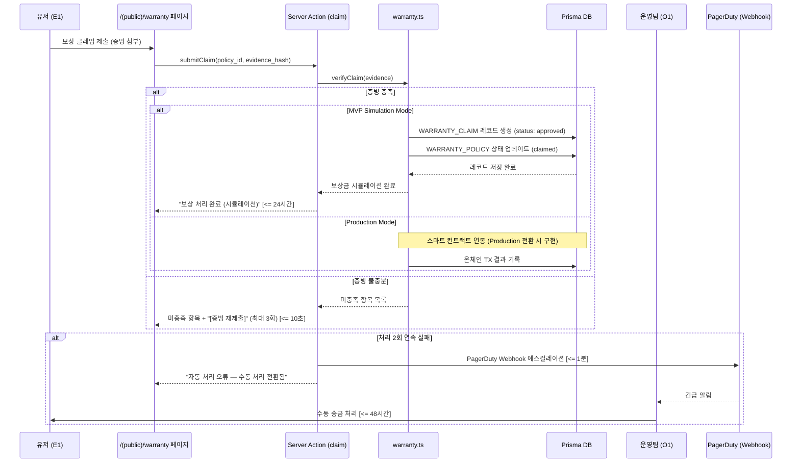

#### 6.3.2 NRM 기반 외부 네이밍 통합 리졸브 플로우 (v0.4: Strategy 패턴)

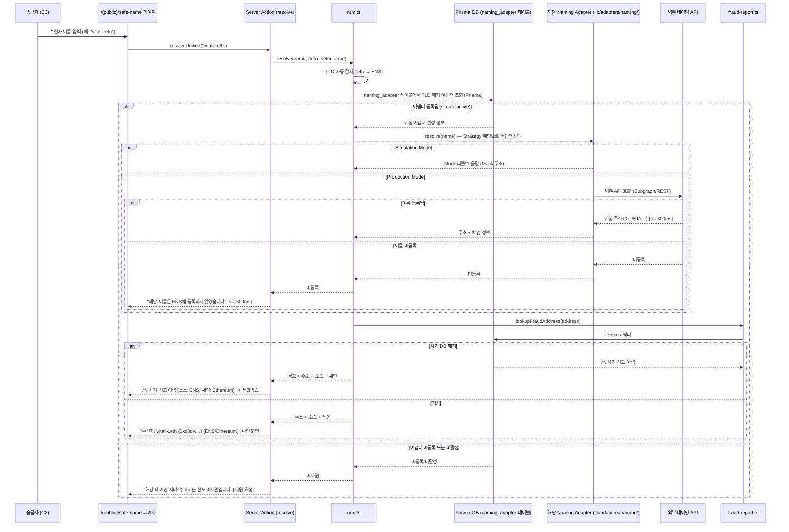

#### 6.3.3 Safe-Name 오프체인 등록 + DNS식 비용 모델 플로우 (v0.4: Prisma DB)

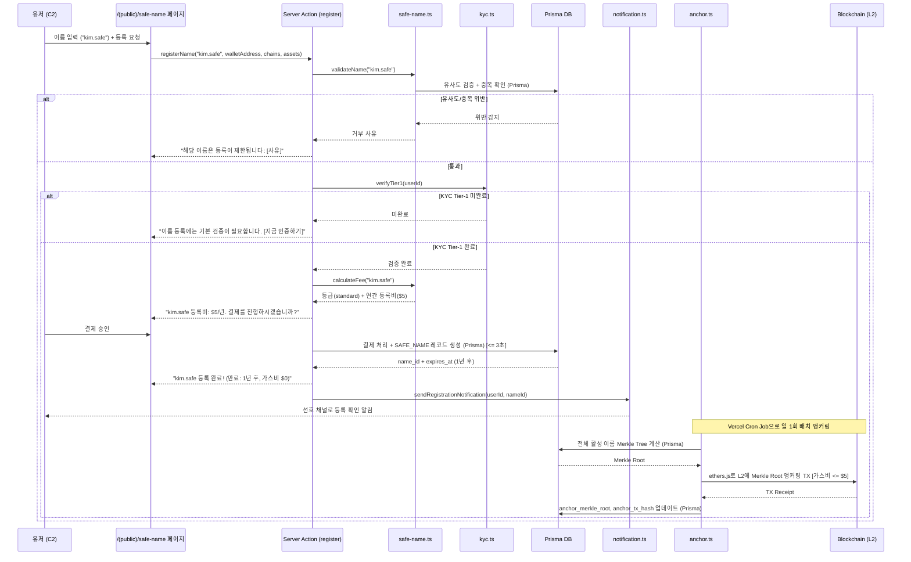

#### 6.3.4 Safe-Name 생명주기(DNS식) 상태 전환 플로우 (Vercel Cron Job)

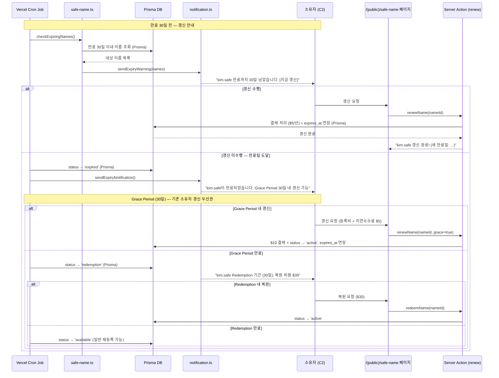

**(v0.32 삭제) §6.3.5 금융결제원 OPEN API 게이트웨이 플로우 — 향후 별도 추진**

#### 6.3.6 통합 알림 게이트웨이 라우팅 플로우 (v0.4: Route Handler + 사전 등록 핸들러)

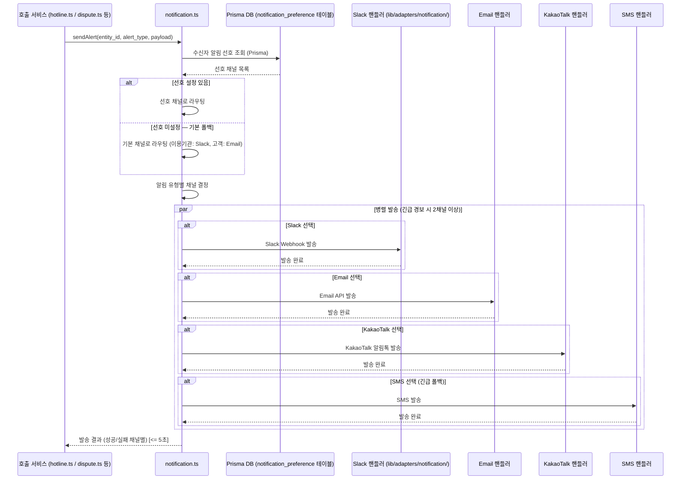

#### 6.3.7 MVP Simulation Mode 전환 플로우 (v0.4: 환경 변수 + DB Config)

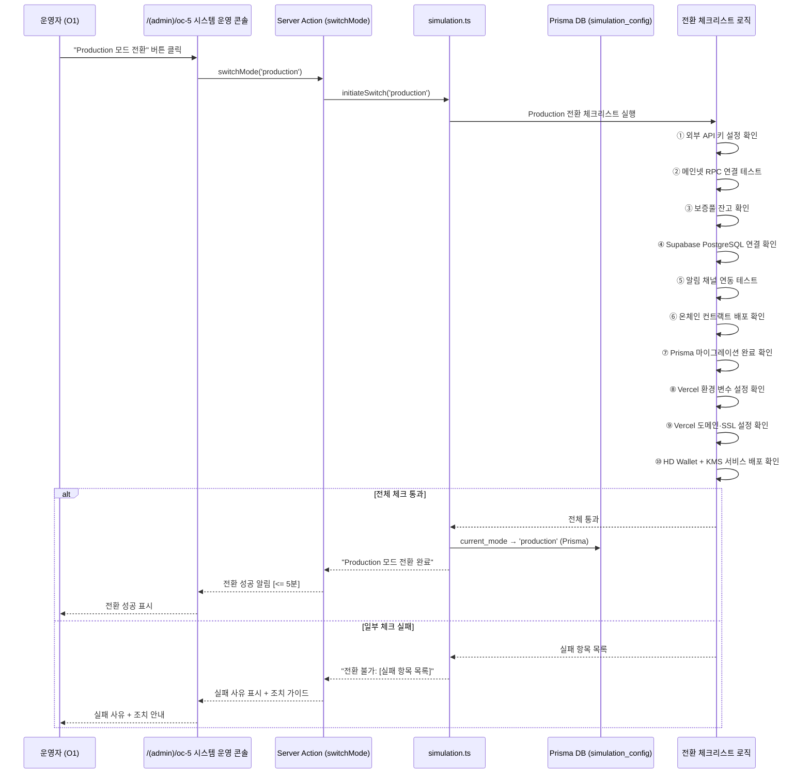

### 6.5 Simulation Mode 전환 체크리스트 (v0.4 변경)

| # | 체크 항목 | 검증 방법 | 시한 |
|---|---|---|---|
| ① | 외부 API 키 설정 확인 (Chainalysis, OFAC, KYC Provider, **Gemini API**) | 환경 변수 존재 + 테스트 호출 성공 | 전환 전 |
| ② | 메인넷 RPC 연결 테스트 | ethers.js provider 연결 확인 | 전환 전 |
| ③ | 보증풀 잔고 확인 (Production: 스마트 컨트랙트 배포 필요) | 온체인 잔고 조회 | 전환 전 |
| ④ | **Supabase PostgreSQL 연결 확인 (v0.4 신규)** | Prisma `db push` + 연결 테스트 | 전환 전 |
| ⑤ | 알림 채널 연동 테스트 (Slack, Email, KakaoTalk, SMS) | 테스트 알림 발송 | 전환 전 |
| ⑥ | 온체인 컨트랙트 배포 확인 (Warranty, Anchor) | 컨트랙트 주소 조회 | 전환 전 |
| ⑦ | **Prisma 마이그레이션 완료 확인 (v0.4 신규)** | `prisma migrate status` | 전환 전 |
| ⑧ | **Vercel 환경 변수 설정 확인 (v0.4 신규)** | `SIMULATION_MODE=false`, `DATABASE_URL`, API Keys 등 | 전환 전 |
| ⑨ | **Vercel 도메인·SSL 설정 확인 (v0.4 신규)** | 프로덕션 도메인 바인딩 + SSL 인증서 | 전환 전 |
| ⑩ | **HD Wallet + KMS 서비스 배포 확인 (v0.4 신규)** | 별도 Relayer 서비스 가동 상태 | 전환 전 |

### 6.6 Validation Plan (검증 계획)

**(v0.4: 기존 검증 계획 유지. 실행 환경을 Vercel + Supabase 기반으로 변경)**

| # | 실험 가설 | 실험 설계 | 측정 KPI | 성공 기준 |
|---|---|---|---|---|
| H1 | Zero-FP 엔진 연동 시 오탐지 CS 급감 | A/B Test (n=10,000건): 기존 보안 툴 vs 당사 엔진. Simulation Mode에서 Mock 데이터 기반 검증 | 일평균 오탐지 CS 건수, 핫라인 SLA 달성률 | CS 티켓 80% 감소, 10분 SLA 100% 달성 |
| H2 | Warranty 구독 유저의 활성도 월등 | 코호트 분석 (n=500명). **MVP: DB 기반 시뮬레이션 구독** | 주간 인당 평균 TX 수, D30 리텐션 | 활동량 2배 이상, 리텐션 >= 90% |
| H3 | 사기 주소 사전 조회가 피해율 감소 | 코호트 분석 (n=1,000명). Simulation 시드 데이터 기반 | 사기 피해 발생률, 조회→송금 중단율 | 피해율 기준선 대비 70% 감소, 중단율 >= 90% |
| H4 | Safe-Name 등록 유저의 이름 기반 송금 선호 | Within-group (n=200명). 오프체인 등록 UX 검증 포함 | 이름 기반 송금 비율, 오송금 민원 건수 | 이름 기반 >= 50%, 오송금 80% 감소 |
| H5 | 커뮤니티 신고가 자체 DB 커버리지 향상 | 누적 분석 (3개월) | 월간 신고 건수, 커버리지 증가율 | 월간 신고 >= 500건, 커버리지 >= 85% |
| H6 | 이의 신청 프로세스가 오등록 피해를 신속 복구 | 파일럿 (n=50건). OC-4 워크플로우 포함 검증 | 심사 완료 SLA 준수율, 해제 정확도 | 48시간 SLA >= 95%, 해제 정확도 >= 98% |
| H7 | Safe-Name 오프체인 등록 + DNS식 비용 모델이 등록 전환율 향상 | A/B Test (n=500명): 오프체인 등록(가스비 0원, $5/년) vs 기존 온체인 등록 | 등록 완료율, 이탈율, 등록 소요 시간 | 등록 완료율 50% 이상 향상, 이탈율 60% 감소, 등록 시간 90% 단축 |
| H8 | 무상 소스 전환 시 사기 DB 커버리지 유지 | 전환 시뮬레이션 | DB 커버리지, 정확도, 공백 기간 | 커버리지 >= 80%, 정확도 >= 95%, 공백 0일 |
| H9 | NRM Adapter 방식으로 신규 네이밍 서비스 추가 시간 단축 | 파일럿: 운영자가 OC-2에서 어댑터 DB 설정 변경 → 리졸브 동작까지 소요 시간 측정 | 어댑터 활성화→동작 소요 시간, 기존 어댑터 영향 | 소요 시간 <= 5분, 기존 어댑터 무영향 100% |
| H10 | 멀티채널 알림이 단일 채널 대비 확인율 향상 | A/B Test (n=200명): Slack 단일 vs 멀티채널(Slack+Email) | 알림 확인율, 확인 소요 시간, 에스컬레이션 건수 | 확인율 30% 향상, 확인 시간 40% 단축 |
| H11 | MVP Simulation Mode가 Production 전환 후 동일 기능 동작 보장 | 전환 테스트: Simulation → Production 전환 후 전 기능 E2E 테스트 | 전환 성공률, E2E 테스트 통과율, 전환 소요 시간 | 전환 성공률 100%, E2E 통과율 100%, 전환 <= 5분 |
| H12 | KYC Tier-1 필수 등록 정책이 사기 목적 등록 감소 | A/B Test (n=500명): KYC Tier-1 필수 vs KYC 없는 등록 | 사기 목적 등록 발견 건수, 정상 등록 전환율, 등록 이탈율 | 사기 등록 70% 감소, 정상 등록 전환율 80% 이상 유지, 이탈율 증가 <= 10% |
| H13 | Pre-Transfer Verification이 오송금·사기 피해 감소 | 코호트 분석 (n=1,000건): 사전 검증 적용 vs 미적용 | 오송금 발생률, 사기 피해 발생률, 사용자 만족도 | 오송금 90% 감소, 사기 피해 80% 감소, 만족도 >= 4.0/5 |
| H14 | Asset-Chain Compatibility Gate가 비호환 오송금 사전 차단 | 파일럿 (n=200건): 의도적 비호환 송금 시도 차단률 | 비호환 차단율, 오차단율, 사용자 인지도 | 차단율 100%, 오차단율 0%, 인지도 >= 90% |
| H15 | "이름 + 금액" 간소화 UI가 이체 완료율·만족도 향상 | A/B Test (n=500명): 간소화 UI vs 기존 UI | 이체 완료율, 이체 소요 시간, 사용자 만족도, 체인 선택 오류율 | 이체 완료율 30% 향상, 소요 시간 50% 단축, 만족도 >= 4.5/5, 체인 오류율 0% |
| H16 | 사기 주소 Hard Block이 사기 피해 추가 감소 | 코호트 분석 (n=1,000건): Hard Block vs 기존 경고+체크박스 | 사기 피해 발생률, 차단 후 신고 전환율, 사용자 만족도 | 사기 피해 95% 감소, 차단 후 신고 전환율 >= 30%, 만족도 >= 4.0/5 |
| H17 | 송수신 양측 이체 결과 통지가 신뢰도·재이용률 향상 | A/B Test (n=300명): 양측 통지 vs 송금자만 통지 | 사용자 신뢰도, D30 재이용률, 통지 확인율 | 신뢰도 20% 향상, 재이용률 15% 향상, 통지 확인율 >= 85% |
| H18 | 일회용 주소가 수신자 주소 추적·프로파일링 방지 | 보안 분석 (n=1,000건): 동일 수신자 다건 이체 후 온체인 주소 연관 분석. **MVP: Mock 주소 기반 시뮬레이션** | 주소 연관성 탐지율, 프로파일링 가능 거래 비율 | 연관성 탐지율 <= 5%, 프로파일링 가능 거래 0% |
| H19 | 일회용 주소 + 자금 포워딩이 기존 이체 UX 미저해 | A/B Test (n=300명): 일회용 주소 적용 vs 미적용 이체 완료율·만족도 비교. **MVP: DB 시뮬레이션 기반** | 이체 완료율, 이체 소요 시간, 사용자 만족도 | 이체 완료율 변동 <= 2%, 소요 시간 증가 <= 10%, 만족도 >= 4.0/5 |
| H20 | 자금 포워딩 L2 최적화로 가스비 $0.01 이하 유지 | 파일럿 (n=500건): L2(Polygon, Arbitrum) 포워딩 가스비 실측. **MVP: 해당 없음 (Production 전환 시 수행)** | 건당 포워딩 가스비, 월간 총 가스비, 포워딩 성공률 | 건당 <= $0.01(L2), 월간 <= $500, 성공률 >= 99.9% |
| **H21** | **(v0.4 신규)** Next.js 단일 풀스택으로 전환해도 전 기능이 동일하게 동작 | **전 기능 E2E 테스트 (Playwright): Simulation Mode에서 모든 UseCase 시나리오 수행** | **E2E 통과율, 응답 시간 p95, 기능 커버리지** | **통과율 100%, 응답 시간 NFR 충족, 기능 커버리지 100%** |
| **H22** | **(v0.4 신규)** LLM 기반 신고 자동 분류가 수동 분류 대비 정확도·속도 향상 | **파일럿 (n=200건): LLM 자동 분류 vs 수동 분류 비교** | **분류 정확도, 분류 소요 시간, 운영 담당자 만족도** | **정확도 >= 80%, 소요 시간 80% 단축, 만족도 >= 4.0/5** |

---

**— End of Document —**
