# Phase-0 Task 의존성 다이어그램

**원본:** `2_ISSUES_Phase0_opus46_v2.md` (90건 Task)
**생성일:** 2026-05-11

---

## 📊 개요

- **총 Task:** 90건
- **의존성 엣지:** 217건
- **위상 깊이:** 13단계 (L0 ~ L12)
- **루트 노드 (의존 없음):** 4건 — API-001, API-008, INIT-001, NFR-010
- **리프 노드 (후속 없음):** 40건
- **사이클:** 없음 (DAG 검증 완료)

## 🎨 카테고리별 통계

| 카테고리 | 명칭 | 건수 | 색상 |
|---|---|---|---|
| **INIT** | 프로젝트 초기 설정 | 4 | `#888780` |
| **DB** | 데이터베이스 | 9 | `#378ADD` |
| **API** | API 계약 | 9 | `#7F77DD` |
| **SVC** | 공통 서비스 | 2 | `#1D9E75` |
| **QRY** | 조회 로직 | 4 | `#639922` |
| **CMD** | 변경 로직 | 14 | `#BA7517` |
| **UI** | 프론트엔드 | 7 | `#D4537E` |
| **TST** | 테스트 | 30 | `#D85A30` |
| **NFR** | 비기능/인프라 | 11 | `#E24B4A` |
| **합계** | — | **90** | — |

---

## 🌐 전체 의존성 다이어그램

카테고리별로 그룹화된 90 노드 전체. 화살표 방향: **A → B**는 "B가 A에 의존"을 의미합니다(A가 완성돼야 B 착수 가능).

```mermaid
flowchart LR
  subgraph INIT_sub["프로젝트 초기 설정 (INIT) — 4건"]
    direction TB
    INIT_001["INIT-001"]
    INIT_002["INIT-002"]
    INIT_003["INIT-003"]
    INIT_004["INIT-004"]
  end
  subgraph DB_sub["데이터베이스 (DB) — 9건"]
    direction TB
    DB_001["DB-001"]
    DB_002["DB-002"]
    DB_003["DB-003"]
    DB_004["DB-004"]
    DB_005["DB-005"]
    DB_006["DB-006"]
    DB_007["DB-007"]
    DB_008["DB-008"]
    DB_009["DB-009"]
  end
  subgraph API_sub["API 계약 (API) — 9건"]
    direction TB
    API_001["API-001"]
    API_002["API-002"]
    API_003["API-003"]
    API_004["API-004"]
    API_005["API-005"]
    API_006["API-006"]
    API_007["API-007"]
    API_008["API-008"]
    API_009["API-009"]
  end
  subgraph SVC_sub["공통 서비스 (SVC) — 2건"]
    direction TB
    SVC_001["SVC-001"]
    SVC_002["SVC-002"]
  end
  subgraph QRY_sub["조회 로직 (QRY) — 4건"]
    direction TB
    QRY_001["QRY-001"]
    QRY_002["QRY-002"]
    QRY_003["QRY-003"]
    QRY_004["QRY-004"]
  end
  subgraph CMD_sub["변경 로직 (CMD) — 14건"]
    direction TB
    CMD_001["CMD-001"]
    CMD_002["CMD-002"]
    CMD_003["CMD-003"]
    CMD_004["CMD-004"]
    CMD_005["CMD-005"]
    CMD_006["CMD-006"]
    CMD_007["CMD-007"]
    CMD_008["CMD-008"]
    CMD_009["CMD-009"]
    CMD_010["CMD-010"]
    CMD_011["CMD-011"]
    CMD_012["CMD-012"]
    CMD_013["CMD-013"]
    CMD_014["CMD-014"]
  end
  subgraph UI_sub["프론트엔드 (UI) — 7건"]
    direction TB
    UI_001["UI-001"]
    UI_002["UI-002"]
    UI_003["UI-003"]
    UI_004["UI-004"]
    UI_005["UI-005"]
    UI_006["UI-006"]
    UI_007["UI-007"]
  end
  subgraph TST_sub["테스트 (TST) — 30건"]
    direction TB
    TST_000["TST-000"]
    TST_001["TST-001"]
    TST_002["TST-002"]
    TST_003["TST-003"]
    TST_004["TST-004"]
    TST_005["TST-005"]
    TST_006["TST-006"]
    TST_007["TST-007"]
    TST_008["TST-008"]
    TST_009["TST-009"]
    TST_010["TST-010"]
    TST_011["TST-011"]
    TST_012["TST-012"]
    TST_013["TST-013"]
    TST_014["TST-014"]
    TST_015["TST-015"]
    TST_016["TST-016"]
    TST_017["TST-017"]
    TST_018["TST-018"]
    TST_019["TST-019"]
    TST_020["TST-020"]
    TST_021["TST-021"]
    TST_022["TST-022"]
    TST_023["TST-023"]
    TST_024["TST-024"]
    TST_025["TST-025"]
    TST_026["TST-026"]
    TST_027["TST-027"]
    TST_028["TST-028"]
    TST_029["TST-029"]
  end
  subgraph NFR_sub["비기능/인프라 (NFR) — 11건"]
    direction TB
    NFR_001["NFR-001"]
    NFR_002["NFR-002"]
    NFR_003["NFR-003"]
    NFR_004["NFR-004"]
    NFR_005["NFR-005"]
    NFR_006["NFR-006"]
    NFR_007["NFR-007"]
    NFR_008["NFR-008"]
    NFR_009["NFR-009"]
    NFR_010["NFR-010"]
    NFR_011["NFR-011"]
  end

  API_009 --> API_002
  API_009 --> API_003
  API_009 --> API_004
  API_009 --> API_005
  API_009 --> API_006
  API_009 --> API_007
  INIT_001 --> API_009
  INIT_001 --> CMD_001
  DB_001 --> CMD_001
  API_006 --> CMD_001
  SVC_001 --> CMD_001
  CMD_001 --> CMD_002
  DB_001 --> CMD_002
  CMD_002 --> CMD_003
  DB_004 --> CMD_003
  API_002 --> CMD_003
  API_009 --> CMD_003
  SVC_002 --> CMD_003
  CMD_003 --> CMD_004
  DB_004 --> CMD_004
  DB_003 --> CMD_004
  CMD_003 --> CMD_005
  SVC_001 --> CMD_005
  SVC_002 --> CMD_005
  CMD_002 --> CMD_006
  DB_002 --> CMD_006
  API_004 --> CMD_006
  CMD_006 --> CMD_007
  SVC_001 --> CMD_007
  SVC_002 --> CMD_007
  QRY_004 --> CMD_008
  DB_003 --> CMD_008
  DB_004 --> CMD_008
  INIT_004 --> CMD_008
  API_009 --> CMD_008
  SVC_002 --> CMD_008
  QRY_004 --> CMD_009
  DB_001 --> CMD_009
  DB_004 --> CMD_009
  INIT_004 --> CMD_009
  API_005 --> CMD_009
  API_009 --> CMD_009
  CMD_008 --> CMD_010
  CMD_009 --> CMD_010
  SVC_001 --> CMD_010
  SVC_002 --> CMD_010
  CMD_002 --> CMD_011
  QRY_002 --> CMD_011
  QRY_003 --> CMD_011
  DB_006 --> CMD_011
  API_007 --> CMD_011
  API_009 --> CMD_011
  SVC_002 --> CMD_011
  CMD_011 --> CMD_012
  DB_008 --> CMD_012
  CMD_011 --> CMD_013
  CMD_012 --> CMD_014
  CMD_013 --> CMD_014
  SVC_001 --> CMD_014
  SVC_002 --> CMD_014
  INIT_001 --> DB_001
  DB_001 --> DB_002
  INIT_001 --> DB_003
  DB_001 --> DB_004
  DB_005 --> DB_004
  INIT_001 --> DB_005
  DB_001 --> DB_006
  DB_002 --> DB_006
  DB_003 --> DB_006
  DB_001 --> DB_007
  DB_002 --> DB_007
  DB_003 --> DB_007
  DB_004 --> DB_007
  DB_005 --> DB_007
  DB_006 --> DB_007
  DB_007 --> DB_008
  DB_001 --> DB_009
  DB_002 --> DB_009
  DB_003 --> DB_009
  DB_004 --> DB_009
  DB_005 --> DB_009
  DB_006 --> DB_009
  DB_007 --> DB_009
  DB_008 --> DB_009
  INIT_001 --> INIT_002
  INIT_001 --> INIT_003
  INIT_001 --> INIT_004
  INIT_003 --> INIT_004
  NFR_010 --> NFR_001
  INIT_004 --> NFR_002
  TST_019 --> NFR_002
  QRY_001 --> NFR_003
  DB_003 --> NFR_003
  TST_003 --> NFR_003
  QRY_002 --> NFR_004
  QRY_003 --> NFR_004
  DB_002 --> NFR_004
  TST_013 --> NFR_004
  CMD_006 --> NFR_005
  NFR_010 --> NFR_006
  INIT_003 --> NFR_007
  NFR_010 --> NFR_007
  DB_009 --> NFR_008
  TST_029 --> NFR_008
  NFR_003 --> NFR_008
  NFR_004 --> NFR_008
  SVC_002 --> NFR_009
  NFR_010 --> NFR_009
  INIT_004 --> NFR_011
  API_008 --> NFR_011
  DB_003 --> QRY_001
  DB_009 --> QRY_001
  API_001 --> QRY_001
  DB_002 --> QRY_002
  DB_009 --> QRY_002
  API_003 --> QRY_002
  QRY_002 --> QRY_003
  QRY_001 --> QRY_003
  DB_003 --> QRY_003
  DB_004 --> QRY_004
  API_005 --> QRY_004
  INIT_001 --> SVC_001
  INIT_003 --> SVC_001
  INIT_001 --> SVC_002
  INIT_001 --> TST_000
  DB_009 --> TST_000
  TST_000 --> TST_001
  QRY_001 --> TST_001
  API_001 --> TST_001
  TST_000 --> TST_002
  QRY_001 --> TST_002
  TST_000 --> TST_003
  QRY_001 --> TST_003
  TST_000 --> TST_004
  CMD_003 --> TST_004
  CMD_005 --> TST_004
  TST_000 --> TST_005
  CMD_003 --> TST_005
  TST_000 --> TST_006
  CMD_003 --> TST_006
  TST_000 --> TST_007
  CMD_004 --> TST_007
  TST_000 --> TST_008
  CMD_005 --> TST_008
  SVC_001 --> TST_008
  TST_000 --> TST_009
  CMD_006 --> TST_009
  CMD_007 --> TST_009
  TST_000 --> TST_010
  CMD_006 --> TST_010
  TST_000 --> TST_011
  CMD_006 --> TST_011
  TST_000 --> TST_012
  CMD_006 --> TST_012
  TST_000 --> TST_013
  QRY_002 --> TST_013
  TST_000 --> TST_014
  QRY_003 --> TST_014
  TST_000 --> TST_015
  QRY_002 --> TST_015
  TST_000 --> TST_016
  QRY_004 --> TST_016
  TST_000 --> TST_017
  CMD_008 --> TST_017
  CMD_010 --> TST_017
  TST_000 --> TST_018
  CMD_009 --> TST_018
  TST_000 --> TST_019
  INIT_004 --> TST_019
  TST_000 --> TST_020
  CMD_001 --> TST_020
  TST_000 --> TST_021
  CMD_002 --> TST_021
  TST_000 --> TST_022
  CMD_002 --> TST_022
  TST_000 --> TST_023
  CMD_002 --> TST_023
  TST_000 --> TST_024
  CMD_011 --> TST_024
  CMD_013 --> TST_024
  TST_000 --> TST_025
  CMD_011 --> TST_025
  CMD_012 --> TST_025
  TST_000 --> TST_026
  CMD_011 --> TST_026
  TST_000 --> TST_027
  CMD_014 --> TST_027
  TST_000 --> TST_028
  CMD_011 --> TST_028
  TST_000 --> TST_029
  DB_009 --> TST_029
  QRY_001 --> UI_001
  CMD_003 --> UI_001
  API_001 --> UI_001
  API_002 --> UI_001
  CMD_006 --> UI_002
  API_004 --> UI_002
  API_009 --> UI_002
  QRY_002 --> UI_003
  QRY_003 --> UI_003
  API_003 --> UI_003
  API_009 --> UI_003
  CMD_011 --> UI_004
  API_007 --> UI_004
  API_009 --> UI_004
  QRY_004 --> UI_005
  CMD_008 --> UI_005
  CMD_009 --> UI_005
  API_005 --> UI_005
  API_009 --> UI_005
  INIT_004 --> UI_005
  CMD_001 --> UI_006
  CMD_002 --> UI_006
  API_006 --> UI_006
  API_009 --> UI_006
  INIT_001 --> UI_007
  INIT_002 --> UI_007

  classDef init_cls fill:#F1EFE8,stroke:#888780,color:#222
  class INIT_001,INIT_002,INIT_003,INIT_004 init_cls
  classDef db_cls fill:#E6F1FB,stroke:#378ADD,color:#222
  class DB_001,DB_002,DB_003,DB_004,DB_005,DB_006,DB_007,DB_008,DB_009 db_cls
  classDef api_cls fill:#EEEDFE,stroke:#7F77DD,color:#222
  class API_001,API_002,API_003,API_004,API_005,API_006,API_007,API_008,API_009 api_cls
  classDef svc_cls fill:#E1F5EE,stroke:#1D9E75,color:#222
  class SVC_001,SVC_002 svc_cls
  classDef qry_cls fill:#EAF3DE,stroke:#639922,color:#222
  class QRY_001,QRY_002,QRY_003,QRY_004 qry_cls
  classDef cmd_cls fill:#FAEEDA,stroke:#BA7517,color:#222
  class CMD_001,CMD_002,CMD_003,CMD_004,CMD_005,CMD_006,CMD_007,CMD_008,CMD_009,CMD_010,CMD_011,CMD_012,CMD_013,CMD_014 cmd_cls
  classDef ui_cls fill:#FBEAF0,stroke:#D4537E,color:#222
  class UI_001,UI_002,UI_003,UI_004,UI_005,UI_006,UI_007 ui_cls
  classDef tst_cls fill:#FAECE7,stroke:#D85A30,color:#222
  class TST_000,TST_001,TST_002,TST_003,TST_004,TST_005,TST_006,TST_007,TST_008,TST_009,TST_010,TST_011,TST_012,TST_013,TST_014,TST_015,TST_016,TST_017,TST_018,TST_019,TST_020,TST_021,TST_022,TST_023,TST_024,TST_025,TST_026,TST_027,TST_028,TST_029 tst_cls
  classDef nfr_cls fill:#FCEBEB,stroke:#E24B4A,color:#222
  class NFR_001,NFR_002,NFR_003,NFR_004,NFR_005,NFR_006,NFR_007,NFR_008,NFR_009,NFR_010,NFR_011 nfr_cls
```

---

## 📏 위상 깊이별 레이어 다이어그램

각 노드의 의존성 최대 깊이로 분류한 13개 레이어. 같은 레이어 내 노드는 **병렬 작업 가능**합니다.

```mermaid
flowchart LR
  subgraph L0["깊이 0 (4건)"]
    direction TB
    API_001["API-001"]
    API_008["API-008"]
    INIT_001["INIT-001"]
    NFR_010["NFR-010"]
  end
  subgraph L1["깊이 1 (9건)"]
    direction TB
    API_009["API-009"]
    DB_001["DB-001"]
    DB_003["DB-003"]
    DB_005["DB-005"]
    INIT_002["INIT-002"]
    INIT_003["INIT-003"]
    NFR_001["NFR-001"]
    NFR_006["NFR-006"]
    SVC_002["SVC-002"]
  end
  subgraph L2["깊이 2 (13건)"]
    direction TB
    API_002["API-002"]
    API_003["API-003"]
    API_004["API-004"]
    API_005["API-005"]
    API_006["API-006"]
    API_007["API-007"]
    DB_002["DB-002"]
    DB_004["DB-004"]
    INIT_004["INIT-004"]
    NFR_007["NFR-007"]
    NFR_009["NFR-009"]
    SVC_001["SVC-001"]
    UI_007["UI-007"]
  end
  subgraph L3["깊이 3 (4건)"]
    direction TB
    CMD_001["CMD-001"]
    DB_006["DB-006"]
    NFR_011["NFR-011"]
    QRY_004["QRY-004"]
  end
  subgraph L4["깊이 4 (4건)"]
    direction TB
    CMD_002["CMD-002"]
    CMD_008["CMD-008"]
    CMD_009["CMD-009"]
    DB_007["DB-007"]
  end
  subgraph L5["깊이 5 (6건)"]
    direction TB
    CMD_003["CMD-003"]
    CMD_006["CMD-006"]
    CMD_010["CMD-010"]
    DB_008["DB-008"]
    UI_005["UI-005"]
    UI_006["UI-006"]
  end
  subgraph L6["깊이 6 (6건)"]
    direction TB
    CMD_004["CMD-004"]
    CMD_005["CMD-005"]
    CMD_007["CMD-007"]
    DB_009["DB-009"]
    NFR_005["NFR-005"]
    UI_002["UI-002"]
  end
  subgraph L7["깊이 7 (3건)"]
    direction TB
    QRY_001["QRY-001"]
    QRY_002["QRY-002"]
    TST_000["TST-000"]
  end
  subgraph L8["깊이 8 (25건)"]
    direction TB
    QRY_003["QRY-003"]
    TST_001["TST-001"]
    TST_002["TST-002"]
    TST_003["TST-003"]
    TST_004["TST-004"]
    TST_005["TST-005"]
    TST_006["TST-006"]
    TST_007["TST-007"]
    TST_008["TST-008"]
    TST_009["TST-009"]
    TST_010["TST-010"]
    TST_011["TST-011"]
    TST_012["TST-012"]
    TST_013["TST-013"]
    TST_015["TST-015"]
    TST_016["TST-016"]
    TST_017["TST-017"]
    TST_018["TST-018"]
    TST_019["TST-019"]
    TST_020["TST-020"]
    TST_021["TST-021"]
    TST_022["TST-022"]
    TST_023["TST-023"]
    TST_029["TST-029"]
    UI_001["UI-001"]
  end
  subgraph L9["깊이 9 (6건)"]
    direction TB
    CMD_011["CMD-011"]
    NFR_002["NFR-002"]
    NFR_003["NFR-003"]
    NFR_004["NFR-004"]
    TST_014["TST-014"]
    UI_003["UI-003"]
  end
  subgraph L10["깊이 10 (6건)"]
    direction TB
    CMD_012["CMD-012"]
    CMD_013["CMD-013"]
    NFR_008["NFR-008"]
    TST_026["TST-026"]
    TST_028["TST-028"]
    UI_004["UI-004"]
  end
  subgraph L11["깊이 11 (3건)"]
    direction TB
    CMD_014["CMD-014"]
    TST_024["TST-024"]
    TST_025["TST-025"]
  end
  subgraph L12["깊이 12 (1건)"]
    direction TB
    TST_027["TST-027"]
  end

  API_009 --> API_002
  API_009 --> API_003
  API_009 --> API_004
  API_009 --> API_005
  API_009 --> API_006
  API_009 --> API_007
  INIT_001 --> API_009
  INIT_001 --> CMD_001
  DB_001 --> CMD_001
  API_006 --> CMD_001
  SVC_001 --> CMD_001
  CMD_001 --> CMD_002
  DB_001 --> CMD_002
  CMD_002 --> CMD_003
  DB_004 --> CMD_003
  API_002 --> CMD_003
  API_009 --> CMD_003
  SVC_002 --> CMD_003
  CMD_003 --> CMD_004
  DB_004 --> CMD_004
  DB_003 --> CMD_004
  CMD_003 --> CMD_005
  SVC_001 --> CMD_005
  SVC_002 --> CMD_005
  CMD_002 --> CMD_006
  DB_002 --> CMD_006
  API_004 --> CMD_006
  CMD_006 --> CMD_007
  SVC_001 --> CMD_007
  SVC_002 --> CMD_007
  QRY_004 --> CMD_008
  DB_003 --> CMD_008
  DB_004 --> CMD_008
  INIT_004 --> CMD_008
  API_009 --> CMD_008
  SVC_002 --> CMD_008
  QRY_004 --> CMD_009
  DB_001 --> CMD_009
  DB_004 --> CMD_009
  INIT_004 --> CMD_009
  API_005 --> CMD_009
  API_009 --> CMD_009
  CMD_008 --> CMD_010
  CMD_009 --> CMD_010
  SVC_001 --> CMD_010
  SVC_002 --> CMD_010
  CMD_002 --> CMD_011
  QRY_002 --> CMD_011
  QRY_003 --> CMD_011
  DB_006 --> CMD_011
  API_007 --> CMD_011
  API_009 --> CMD_011
  SVC_002 --> CMD_011
  CMD_011 --> CMD_012
  DB_008 --> CMD_012
  CMD_011 --> CMD_013
  CMD_012 --> CMD_014
  CMD_013 --> CMD_014
  SVC_001 --> CMD_014
  SVC_002 --> CMD_014
  INIT_001 --> DB_001
  DB_001 --> DB_002
  INIT_001 --> DB_003
  DB_001 --> DB_004
  DB_005 --> DB_004
  INIT_001 --> DB_005
  DB_001 --> DB_006
  DB_002 --> DB_006
  DB_003 --> DB_006
  DB_001 --> DB_007
  DB_002 --> DB_007
  DB_003 --> DB_007
  DB_004 --> DB_007
  DB_005 --> DB_007
  DB_006 --> DB_007
  DB_007 --> DB_008
  DB_001 --> DB_009
  DB_002 --> DB_009
  DB_003 --> DB_009
  DB_004 --> DB_009
  DB_005 --> DB_009
  DB_006 --> DB_009
  DB_007 --> DB_009
  DB_008 --> DB_009
  INIT_001 --> INIT_002
  INIT_001 --> INIT_003
  INIT_001 --> INIT_004
  INIT_003 --> INIT_004
  NFR_010 --> NFR_001
  INIT_004 --> NFR_002
  TST_019 --> NFR_002
  QRY_001 --> NFR_003
  DB_003 --> NFR_003
  TST_003 --> NFR_003
  QRY_002 --> NFR_004
  QRY_003 --> NFR_004
  DB_002 --> NFR_004
  TST_013 --> NFR_004
  CMD_006 --> NFR_005
  NFR_010 --> NFR_006
  INIT_003 --> NFR_007
  NFR_010 --> NFR_007
  DB_009 --> NFR_008
  TST_029 --> NFR_008
  NFR_003 --> NFR_008
  NFR_004 --> NFR_008
  SVC_002 --> NFR_009
  NFR_010 --> NFR_009
  INIT_004 --> NFR_011
  API_008 --> NFR_011
  DB_003 --> QRY_001
  DB_009 --> QRY_001
  API_001 --> QRY_001
  DB_002 --> QRY_002
  DB_009 --> QRY_002
  API_003 --> QRY_002
  QRY_002 --> QRY_003
  QRY_001 --> QRY_003
  DB_003 --> QRY_003
  DB_004 --> QRY_004
  API_005 --> QRY_004
  INIT_001 --> SVC_001
  INIT_003 --> SVC_001
  INIT_001 --> SVC_002
  INIT_001 --> TST_000
  DB_009 --> TST_000
  TST_000 --> TST_001
  QRY_001 --> TST_001
  API_001 --> TST_001
  TST_000 --> TST_002
  QRY_001 --> TST_002
  TST_000 --> TST_003
  QRY_001 --> TST_003
  TST_000 --> TST_004
  CMD_003 --> TST_004
  CMD_005 --> TST_004
  TST_000 --> TST_005
  CMD_003 --> TST_005
  TST_000 --> TST_006
  CMD_003 --> TST_006
  TST_000 --> TST_007
  CMD_004 --> TST_007
  TST_000 --> TST_008
  CMD_005 --> TST_008
  SVC_001 --> TST_008
  TST_000 --> TST_009
  CMD_006 --> TST_009
  CMD_007 --> TST_009
  TST_000 --> TST_010
  CMD_006 --> TST_010
  TST_000 --> TST_011
  CMD_006 --> TST_011
  TST_000 --> TST_012
  CMD_006 --> TST_012
  TST_000 --> TST_013
  QRY_002 --> TST_013
  TST_000 --> TST_014
  QRY_003 --> TST_014
  TST_000 --> TST_015
  QRY_002 --> TST_015
  TST_000 --> TST_016
  QRY_004 --> TST_016
  TST_000 --> TST_017
  CMD_008 --> TST_017
  CMD_010 --> TST_017
  TST_000 --> TST_018
  CMD_009 --> TST_018
  TST_000 --> TST_019
  INIT_004 --> TST_019
  TST_000 --> TST_020
  CMD_001 --> TST_020
  TST_000 --> TST_021
  CMD_002 --> TST_021
  TST_000 --> TST_022
  CMD_002 --> TST_022
  TST_000 --> TST_023
  CMD_002 --> TST_023
  TST_000 --> TST_024
  CMD_011 --> TST_024
  CMD_013 --> TST_024
  TST_000 --> TST_025
  CMD_011 --> TST_025
  CMD_012 --> TST_025
  TST_000 --> TST_026
  CMD_011 --> TST_026
  TST_000 --> TST_027
  CMD_014 --> TST_027
  TST_000 --> TST_028
  CMD_011 --> TST_028
  TST_000 --> TST_029
  DB_009 --> TST_029
  QRY_001 --> UI_001
  CMD_003 --> UI_001
  API_001 --> UI_001
  API_002 --> UI_001
  CMD_006 --> UI_002
  API_004 --> UI_002
  API_009 --> UI_002
  QRY_002 --> UI_003
  QRY_003 --> UI_003
  API_003 --> UI_003
  API_009 --> UI_003
  CMD_011 --> UI_004
  API_007 --> UI_004
  API_009 --> UI_004
  QRY_004 --> UI_005
  CMD_008 --> UI_005
  CMD_009 --> UI_005
  API_005 --> UI_005
  API_009 --> UI_005
  INIT_004 --> UI_005
  CMD_001 --> UI_006
  CMD_002 --> UI_006
  API_006 --> UI_006
  API_009 --> UI_006
  INIT_001 --> UI_007
  INIT_002 --> UI_007

  classDef init_cls fill:#F1EFE8,stroke:#888780,color:#222
  class INIT_001,INIT_002,INIT_003,INIT_004 init_cls
  classDef db_cls fill:#E6F1FB,stroke:#378ADD,color:#222
  class DB_001,DB_002,DB_003,DB_004,DB_005,DB_006,DB_007,DB_008,DB_009 db_cls
  classDef api_cls fill:#EEEDFE,stroke:#7F77DD,color:#222
  class API_001,API_002,API_003,API_004,API_005,API_006,API_007,API_008,API_009 api_cls
  classDef svc_cls fill:#E1F5EE,stroke:#1D9E75,color:#222
  class SVC_001,SVC_002 svc_cls
  classDef qry_cls fill:#EAF3DE,stroke:#639922,color:#222
  class QRY_001,QRY_002,QRY_003,QRY_004 qry_cls
  classDef cmd_cls fill:#FAEEDA,stroke:#BA7517,color:#222
  class CMD_001,CMD_002,CMD_003,CMD_004,CMD_005,CMD_006,CMD_007,CMD_008,CMD_009,CMD_010,CMD_011,CMD_012,CMD_013,CMD_014 cmd_cls
  classDef ui_cls fill:#FBEAF0,stroke:#D4537E,color:#222
  class UI_001,UI_002,UI_003,UI_004,UI_005,UI_006,UI_007 ui_cls
  classDef tst_cls fill:#FAECE7,stroke:#D85A30,color:#222
  class TST_000,TST_001,TST_002,TST_003,TST_004,TST_005,TST_006,TST_007,TST_008,TST_009,TST_010,TST_011,TST_012,TST_013,TST_014,TST_015,TST_016,TST_017,TST_018,TST_019,TST_020,TST_021,TST_022,TST_023,TST_024,TST_025,TST_026,TST_027,TST_028,TST_029 tst_cls
  classDef nfr_cls fill:#FCEBEB,stroke:#E24B4A,color:#222
  class NFR_001,NFR_002,NFR_003,NFR_004,NFR_005,NFR_006,NFR_007,NFR_008,NFR_009,NFR_010,NFR_011 nfr_cls
```

---

## 📋 깊이별 작업 분배표 (스프린트 분할 권고)

| 레이어 | 깊이 | 건수 | Task ID | 비고 |
|---|---|---|---|---|
| L0 | 0 | 4 | API-001, API-008, INIT-001, NFR-010 | Sprint 1 — 기반 |
| L1 | 1 | 9 | API-009, DB-001, DB-003, DB-005, INIT-002, INIT-003, NFR-001, NFR-006, SVC-002 | Sprint 1 — 기반 |
| L2 | 2 | 13 | API-002, API-003, API-004, API-005, API-006, API-007, DB-002, DB-004, INIT-004, NFR-007, NFR-009, SVC-001, UI-007 | Sprint 1 — 기반 |
| L3 | 3 | 4 | CMD-001, DB-006, NFR-011, QRY-004 | Sprint 2 — 데이터/서비스 |
| L4 | 4 | 4 | CMD-002, CMD-008, CMD-009, DB-007 | Sprint 2 — 데이터/서비스 |
| L5 | 5 | 6 | CMD-003, CMD-006, CMD-010, DB-008, UI-005, UI-006 | Sprint 3 — 비즈니스 로직 |
| L6 | 6 | 6 | CMD-004, CMD-005, CMD-007, DB-009, NFR-005, UI-002 | Sprint 3 — 비즈니스 로직 |
| L7 | 7 | 3 | QRY-001, QRY-002, TST-000 | Sprint 4 — 통합/테스트 토대 |
| L8 | 8 | 25 | QRY-003, TST-001, TST-002, TST-003, TST-004, TST-005, TST-006, TST-007, TST-008, TST-009, TST-010, TST-011, TST-012, TST-013, TST-015, TST-016, TST-017, TST-018, TST-019, TST-020, TST-021, TST-022, TST-023, TST-029, UI-001 | Sprint 4 — 통합/테스트 토대 |
| L9 | 9 | 6 | CMD-011, NFR-002, NFR-003, NFR-004, TST-014, UI-003 | Sprint 5 — UI/통합 테스트 |
| L10 | 10 | 6 | CMD-012, CMD-013, NFR-008, TST-026, TST-028, UI-004 | Sprint 5 — UI/통합 테스트 |
| L11 | 11 | 3 | CMD-014, TST-024, TST-025 | Sprint 6 — 최종 검증 |
| L12 | 12 | 1 | TST-027 | Sprint 6 — 최종 검증 |

---

## 🎯 허브 분석

### 가장 많이 의존받는 노드 (Blockers — 완성 지연 시 영향 큼)

| 순위 | Task ID | 후속 수 | 의미 |
|---|---|---|---|
| 1 | **TST-000** | 29 | 테스트 환경. TST-001~029 전부 의존 |
| 2 | **API-009** | 15 | 에러 카탈로그. 모든 API/UI/CMD 참조 |
| 3 | **INIT-001** | 12 | 프로젝트 루트. 사실상 모든 작업의 시작점 |
| 4 | **DB-001** | 8 | USER 모델. 인증·신고·등록·이체 모두 연관 |
| 5 | **DB-003** | 8 | FRAUD_ADDRESS 모델. 조회·교차검증 핵심 |
| 6 | **SVC-002** | 8 | 구조화 로깅. 관측성 토대 |
| 7 | **DB-004** | 7 | FRAUD_REPORT 모델. 신고·승인 흐름의 중심 |
| 8 | **CMD-002** | 7 | 이메일 인증 확인. 모든 인증 필요 작업의 게이트 |
| 9 | **CMD-006** | 7 | Safe-Name 등록. 리졸브·데모 이체에 영향 |
| 10 | **CMD-011** | 7 | 데모 이체 실행. 차단/완료/통지 분기 진입점 |
| 11 | **INIT-004** | 6 | middleware. Admin 보호 라우트 게이트 |
| 12 | **DB-002** | 6 | SAFE_NAME 모델. 리졸브·등록 토대 |

### 가장 많이 의존하는 노드 (의존성 다발성 — 막판 통합 노드)

| 순위 | Task ID | 선행 수 | 의미 |
|---|---|---|---|
| 1 | **DB-009** | 8 | 시드 데이터. DB 모델 전체 + 관계 완성 후 가능 |
| 2 | **CMD-011** | 7 | 데모 이체. 인증·리졸브·교차검증·DTO 모두 필요 |
| 3 | **DB-007** | 6 | ER 관계 매핑. 6개 모델 모두 선행 |
| 4 | **CMD-008** | 6 | 신고 승인. 다수 DB·서비스 의존 |
| 5 | **CMD-009** | 6 | 신고 거부. CMD-008과 동일 패턴 |
| 6 | **UI-005** | 6 | 승인 대시보드. QRY·CMD·API·미들웨어 모두 의존 |
| 7 | **CMD-003** | 5 | 사기 신고 제출. CMD-002·DB·API·SVC 다발 |
| 8 | **CMD-001** | 4 |  |
| 9 | **CMD-010** | 4 | 승인 결과 이메일. CMD-008/009 모두 필요 |
| 10 | **CMD-014** | 4 | 이체 결과 이메일. CMD-011/012/013 전부 필요 |
| 11 | **UI-001** | 4 | 사기 조회 메인 페이지. API·QRY·CMD·TST 모두 의존 |
| 12 | **UI-003** | 4 |  |

---

## 🧩 카테고리별 의존성 다이어그램

각 카테고리 노드와 그 카테고리가 직접 의존하거나 영향을 미치는 외부 노드만 표시합니다.

### INIT — 프로젝트 초기 설정

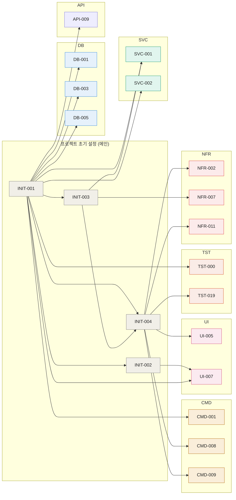

### DB — 데이터베이스

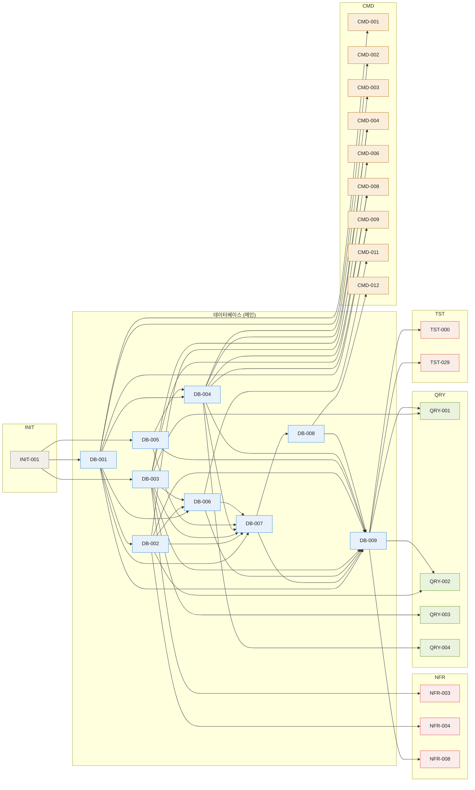

### API — API 계약

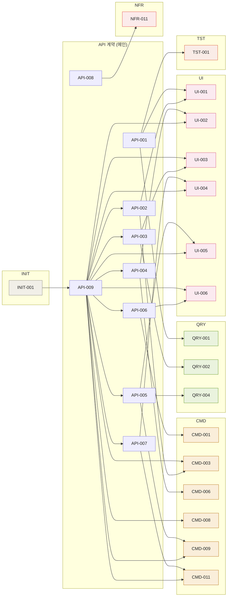

### SVC — 공통 서비스

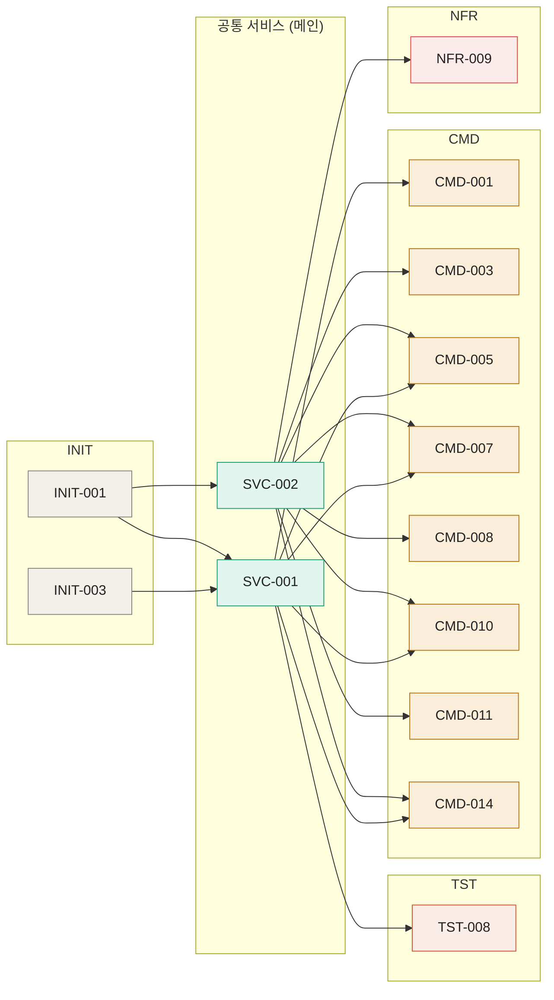

### QRY — 조회 로직

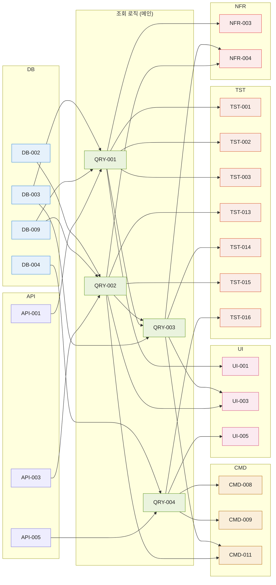

### CMD — 변경 로직

```mermaid
flowchart LR
  subgraph main_CMD["변경 로직 (메인)"]
    direction TB
    CMD_001["CMD-001"]
    CMD_002["CMD-002"]
    CMD_003["CMD-003"]
    CMD_004["CMD-004"]
    CMD_005["CMD-005"]
    CMD_006["CMD-006"]
    CMD_007["CMD-007"]
    CMD_008["CMD-008"]
    CMD_009["CMD-009"]
    CMD_010["CMD-010"]
    CMD_011["CMD-011"]
    CMD_012["CMD-012"]
    CMD_013["CMD-013"]
    CMD_014["CMD-014"]
  end
  subgraph ext_INIT["INIT"]
    direction TB
    INIT_001["INIT-001"]
    INIT_004["INIT-004"]
  end
  subgraph ext_DB["DB"]
    direction TB
    DB_001["DB-001"]
    DB_002["DB-002"]
    DB_003["DB-003"]
    DB_004["DB-004"]
    DB_006["DB-006"]
    DB_008["DB-008"]
  end
  subgraph ext_API["API"]
    direction TB
    API_002["API-002"]
    API_004["API-004"]
    API_005["API-005"]
    API_006["API-006"]
    API_007["API-007"]
    API_009["API-009"]
  end
  subgraph ext_SVC["SVC"]
    direction TB
    SVC_001["SVC-001"]
    SVC_002["SVC-002"]
  end
  subgraph ext_QRY["QRY"]
    direction TB
    QRY_002["QRY-002"]
    QRY_003["QRY-003"]
    QRY_004["QRY-004"]
  end
  subgraph ext_UI["UI"]
    direction TB
    UI_001["UI-001"]
    UI_002["UI-002"]
    UI_004["UI-004"]
    UI_005["UI-005"]
    UI_006["UI-006"]
  end
  subgraph ext_TST["TST"]
    direction TB
    TST_004["TST-004"]
    TST_005["TST-005"]
    TST_006["TST-006"]
    TST_007["TST-007"]
    TST_008["TST-008"]
    TST_009["TST-009"]
    TST_010["TST-010"]
    TST_011["TST-011"]
    TST_012["TST-012"]
    TST_017["TST-017"]
    TST_018["TST-018"]
    TST_020["TST-020"]
    TST_021["TST-021"]
    TST_022["TST-022"]
    TST_023["TST-023"]
    TST_024["TST-024"]
    TST_025["TST-025"]
    TST_026["TST-026"]
    TST_027["TST-027"]
    TST_028["TST-028"]
  end
  subgraph ext_NFR["NFR"]
    direction TB
    NFR_005["NFR-005"]
  end

  CMD_003 --> CMD_004
  DB_004 --> CMD_004
  DB_003 --> CMD_004
  CMD_004 --> TST_007
  CMD_002 --> CMD_003
  DB_004 --> CMD_003
  API_002 --> CMD_003
  API_009 --> CMD_003
  SVC_002 --> CMD_003
  CMD_003 --> CMD_005
  CMD_003 --> UI_001
  CMD_003 --> TST_004
  CMD_003 --> TST_005
  CMD_003 --> TST_006
  CMD_008 --> CMD_010
  CMD_009 --> CMD_010
  SVC_001 --> CMD_010
  SVC_002 --> CMD_010
  CMD_010 --> TST_017
  CMD_011 --> CMD_013
  CMD_013 --> CMD_014
  CMD_013 --> TST_024
  CMD_001 --> CMD_002
  DB_001 --> CMD_002
  CMD_002 --> CMD_006
  CMD_002 --> CMD_011
  CMD_002 --> UI_006
  CMD_002 --> TST_021
  CMD_002 --> TST_022
  CMD_002 --> TST_023
  CMD_006 --> CMD_007
  SVC_001 --> CMD_007
  SVC_002 --> CMD_007
  CMD_007 --> TST_009
  QRY_002 --> CMD_011
  QRY_003 --> CMD_011
  DB_006 --> CMD_011
  API_007 --> CMD_011
  API_009 --> CMD_011
  SVC_002 --> CMD_011
  CMD_011 --> CMD_012
  CMD_011 --> UI_004
  CMD_011 --> TST_024
  CMD_011 --> TST_025
  CMD_011 --> TST_026
  CMD_011 --> TST_028
  DB_008 --> CMD_012
  CMD_012 --> CMD_014
  CMD_012 --> TST_025
  DB_002 --> CMD_006
  API_004 --> CMD_006
  CMD_006 --> UI_002
  CMD_006 --> TST_009
  CMD_006 --> TST_010
  CMD_006 --> TST_011
  CMD_006 --> TST_012
  CMD_006 --> NFR_005
  QRY_004 --> CMD_009
  DB_001 --> CMD_009
  DB_004 --> CMD_009
  INIT_004 --> CMD_009
  API_005 --> CMD_009
  API_009 --> CMD_009
  CMD_009 --> UI_005
  CMD_009 --> TST_018
  SVC_001 --> CMD_014
  SVC_002 --> CMD_014
  CMD_014 --> TST_027
  INIT_001 --> CMD_001
  DB_001 --> CMD_001
  API_006 --> CMD_001
  SVC_001 --> CMD_001
  CMD_001 --> UI_006
  CMD_001 --> TST_020
  QRY_004 --> CMD_008
  DB_003 --> CMD_008
  DB_004 --> CMD_008
  INIT_004 --> CMD_008
  API_009 --> CMD_008
  SVC_002 --> CMD_008
  CMD_008 --> UI_005
  CMD_008 --> TST_017
  SVC_001 --> CMD_005
  SVC_002 --> CMD_005
  CMD_005 --> TST_004
  CMD_005 --> TST_008

  classDef init_cls fill:#F1EFE8,stroke:#888780,color:#222
  class INIT_001,INIT_004 init_cls
  classDef db_cls fill:#E6F1FB,stroke:#378ADD,color:#222
  class DB_001,DB_002,DB_003,DB_004,DB_006,DB_008 db_cls
  classDef api_cls fill:#EEEDFE,stroke:#7F77DD,color:#222
  class API_002,API_004,API_005,API_006,API_007,API_009 api_cls
  classDef svc_cls fill:#E1F5EE,stroke:#1D9E75,color:#222
  class SVC_001,SVC_002 svc_cls
  classDef qry_cls fill:#EAF3DE,stroke:#639922,color:#222
  class QRY_002,QRY_003,QRY_004 qry_cls
  classDef cmd_cls fill:#FAEEDA,stroke:#BA7517,color:#222
  class CMD_001,CMD_002,CMD_003,CMD_004,CMD_005,CMD_006,CMD_007,CMD_008,CMD_009,CMD_010,CMD_011,CMD_012,CMD_013,CMD_014 cmd_cls
  classDef ui_cls fill:#FBEAF0,stroke:#D4537E,color:#222
  class UI_001,UI_002,UI_004,UI_005,UI_006 ui_cls
  classDef tst_cls fill:#FAECE7,stroke:#D85A30,color:#222
  class TST_004,TST_005,TST_006,TST_007,TST_008,TST_009,TST_010,TST_011,TST_012,TST_017,TST_018,TST_020,TST_021,TST_022,TST_023,TST_024,TST_025,TST_026,TST_027,TST_028 tst_cls
  classDef nfr_cls fill:#FCEBEB,stroke:#E24B4A,color:#222
  class NFR_005 nfr_cls
```

### UI — 프론트엔드

```mermaid
flowchart LR
  subgraph main_UI["프론트엔드 (메인)"]
    direction TB
    UI_001["UI-001"]
    UI_002["UI-002"]
    UI_003["UI-003"]
    UI_004["UI-004"]
    UI_005["UI-005"]
    UI_006["UI-006"]
    UI_007["UI-007"]
  end
  subgraph ext_INIT["INIT"]
    direction TB
    INIT_001["INIT-001"]
    INIT_002["INIT-002"]
    INIT_004["INIT-004"]
  end
  subgraph ext_API["API"]
    direction TB
    API_001["API-001"]
    API_002["API-002"]
    API_003["API-003"]
    API_004["API-004"]
    API_005["API-005"]
    API_006["API-006"]
    API_007["API-007"]
    API_009["API-009"]
  end
  subgraph ext_QRY["QRY"]
    direction TB
    QRY_001["QRY-001"]
    QRY_002["QRY-002"]
    QRY_003["QRY-003"]
    QRY_004["QRY-004"]
  end
  subgraph ext_CMD["CMD"]
    direction TB
    CMD_001["CMD-001"]
    CMD_002["CMD-002"]
    CMD_003["CMD-003"]
    CMD_006["CMD-006"]
    CMD_008["CMD-008"]
    CMD_009["CMD-009"]
    CMD_011["CMD-011"]
  end

  INIT_001 --> UI_007
  INIT_002 --> UI_007
  CMD_006 --> UI_002
  API_004 --> UI_002
  API_009 --> UI_002
  CMD_011 --> UI_004
  API_007 --> UI_004
  API_009 --> UI_004
  QRY_004 --> UI_005
  CMD_008 --> UI_005
  CMD_009 --> UI_005
  API_005 --> UI_005
  API_009 --> UI_005
  INIT_004 --> UI_005
  QRY_001 --> UI_001
  CMD_003 --> UI_001
  API_001 --> UI_001
  API_002 --> UI_001
  CMD_001 --> UI_006
  CMD_002 --> UI_006
  API_006 --> UI_006
  API_009 --> UI_006
  QRY_002 --> UI_003
  QRY_003 --> UI_003
  API_003 --> UI_003
  API_009 --> UI_003

  classDef init_cls fill:#F1EFE8,stroke:#888780,color:#222
  class INIT_001,INIT_002,INIT_004 init_cls
  classDef api_cls fill:#EEEDFE,stroke:#7F77DD,color:#222
  class API_001,API_002,API_003,API_004,API_005,API_006,API_007,API_009 api_cls
  classDef qry_cls fill:#EAF3DE,stroke:#639922,color:#222
  class QRY_001,QRY_002,QRY_003,QRY_004 qry_cls
  classDef cmd_cls fill:#FAEEDA,stroke:#BA7517,color:#222
  class CMD_001,CMD_002,CMD_003,CMD_006,CMD_008,CMD_009,CMD_011 cmd_cls
  classDef ui_cls fill:#FBEAF0,stroke:#D4537E,color:#222
  class UI_001,UI_002,UI_003,UI_004,UI_005,UI_006,UI_007 ui_cls
```

### TST — 테스트

```mermaid
flowchart LR
  subgraph main_TST["테스트 (메인)"]
    direction TB
    TST_000["TST-000"]
    TST_001["TST-001"]
    TST_002["TST-002"]
    TST_003["TST-003"]
    TST_004["TST-004"]
    TST_005["TST-005"]
    TST_006["TST-006"]
    TST_007["TST-007"]
    TST_008["TST-008"]
    TST_009["TST-009"]
    TST_010["TST-010"]
    TST_011["TST-011"]
    TST_012["TST-012"]
    TST_013["TST-013"]
    TST_014["TST-014"]
    TST_015["TST-015"]
    TST_016["TST-016"]
    TST_017["TST-017"]
    TST_018["TST-018"]
    TST_019["TST-019"]
    TST_020["TST-020"]
    TST_021["TST-021"]
    TST_022["TST-022"]
    TST_023["TST-023"]
    TST_024["TST-024"]
    TST_025["TST-025"]
    TST_026["TST-026"]
    TST_027["TST-027"]
    TST_028["TST-028"]
    TST_029["TST-029"]
  end
  subgraph ext_INIT["INIT"]
    direction TB
    INIT_001["INIT-001"]
    INIT_004["INIT-004"]
  end
  subgraph ext_DB["DB"]
    direction TB
    DB_009["DB-009"]
  end
  subgraph ext_API["API"]
    direction TB
    API_001["API-001"]
  end
  subgraph ext_SVC["SVC"]
    direction TB
    SVC_001["SVC-001"]
  end
  subgraph ext_QRY["QRY"]
    direction TB
    QRY_001["QRY-001"]
    QRY_002["QRY-002"]
    QRY_003["QRY-003"]
    QRY_004["QRY-004"]
  end
  subgraph ext_CMD["CMD"]
    direction TB
    CMD_001["CMD-001"]
    CMD_002["CMD-002"]
    CMD_003["CMD-003"]
    CMD_004["CMD-004"]
    CMD_005["CMD-005"]
    CMD_006["CMD-006"]
    CMD_007["CMD-007"]
    CMD_008["CMD-008"]
    CMD_009["CMD-009"]
    CMD_010["CMD-010"]
    CMD_011["CMD-011"]
    CMD_012["CMD-012"]
    CMD_013["CMD-013"]
    CMD_014["CMD-014"]
  end
  subgraph ext_NFR["NFR"]
    direction TB
    NFR_002["NFR-002"]
    NFR_003["NFR-003"]
    NFR_004["NFR-004"]
    NFR_008["NFR-008"]
  end

  TST_000 --> TST_009
  CMD_006 --> TST_009
  CMD_007 --> TST_009
  TST_000 --> TST_007
  CMD_004 --> TST_007
  TST_000 --> TST_029
  DB_009 --> TST_029
  TST_029 --> NFR_008
  TST_000 --> TST_016
  QRY_004 --> TST_016
  TST_000 --> TST_018
  CMD_009 --> TST_018
  TST_000 --> TST_011
  CMD_006 --> TST_011
  TST_000 --> TST_022
  CMD_002 --> TST_022
  TST_000 --> TST_023
  CMD_002 --> TST_023
  TST_000 --> TST_020
  CMD_001 --> TST_020
  TST_000 --> TST_005
  CMD_003 --> TST_005
  TST_000 --> TST_026
  CMD_011 --> TST_026
  TST_000 --> TST_015
  QRY_002 --> TST_015
  TST_000 --> TST_024
  CMD_011 --> TST_024
  CMD_013 --> TST_024
  TST_000 --> TST_013
  QRY_002 --> TST_013
  TST_013 --> NFR_004
  TST_000 --> TST_017
  CMD_008 --> TST_017
  CMD_010 --> TST_017
  TST_000 --> TST_006
  CMD_003 --> TST_006
  TST_000 --> TST_021
  CMD_002 --> TST_021
  TST_000 --> TST_012
  CMD_006 --> TST_012
  TST_000 --> TST_003
  QRY_001 --> TST_003
  TST_003 --> NFR_003
  TST_000 --> TST_014
  QRY_003 --> TST_014
  TST_000 --> TST_008
  CMD_005 --> TST_008
  SVC_001 --> TST_008
  TST_000 --> TST_027
  CMD_014 --> TST_027
  TST_000 --> TST_025
  CMD_011 --> TST_025
  CMD_012 --> TST_025
  TST_000 --> TST_004
  CMD_003 --> TST_004
  CMD_005 --> TST_004
  TST_000 --> TST_001
  QRY_001 --> TST_001
  API_001 --> TST_001
  TST_000 --> TST_028
  CMD_011 --> TST_028
  INIT_001 --> TST_000
  DB_009 --> TST_000
  TST_000 --> TST_002
  TST_000 --> TST_010
  TST_000 --> TST_019
  QRY_001 --> TST_002
  INIT_004 --> TST_019
  TST_019 --> NFR_002
  CMD_006 --> TST_010

  classDef init_cls fill:#F1EFE8,stroke:#888780,color:#222
  class INIT_001,INIT_004 init_cls
  classDef db_cls fill:#E6F1FB,stroke:#378ADD,color:#222
  class DB_009 db_cls
  classDef api_cls fill:#EEEDFE,stroke:#7F77DD,color:#222
  class API_001 api_cls
  classDef svc_cls fill:#E1F5EE,stroke:#1D9E75,color:#222
  class SVC_001 svc_cls
  classDef qry_cls fill:#EAF3DE,stroke:#639922,color:#222
  class QRY_001,QRY_002,QRY_003,QRY_004 qry_cls
  classDef cmd_cls fill:#FAEEDA,stroke:#BA7517,color:#222
  class CMD_001,CMD_002,CMD_003,CMD_004,CMD_005,CMD_006,CMD_007,CMD_008,CMD_009,CMD_010,CMD_011,CMD_012,CMD_013,CMD_014 cmd_cls
  classDef tst_cls fill:#FAECE7,stroke:#D85A30,color:#222
  class TST_000,TST_001,TST_002,TST_003,TST_004,TST_005,TST_006,TST_007,TST_008,TST_009,TST_010,TST_011,TST_012,TST_013,TST_014,TST_015,TST_016,TST_017,TST_018,TST_019,TST_020,TST_021,TST_022,TST_023,TST_024,TST_025,TST_026,TST_027,TST_028,TST_029 tst_cls
  classDef nfr_cls fill:#FCEBEB,stroke:#E24B4A,color:#222
  class NFR_002,NFR_003,NFR_004,NFR_008 nfr_cls
```

### NFR — 비기능/인프라

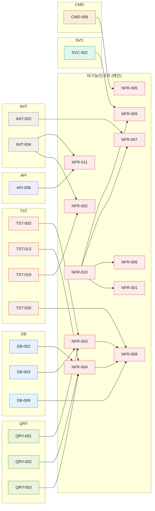

---

## 📊 전체 의존성 표

| Task ID | 카테고리 | 깊이 | 의존 수 | 후속 수 | 의존 대상 |
|---|---|---|---|---|---|
| `API-001` | API | L0 | 0 | 3 | _(루트)_ |
| `API-008` | API | L0 | 0 | 1 | _(루트)_ |
| `INIT-001` | INIT | L0 | 0 | 12 | _(루트)_ |
| `NFR-010` | NFR | L0 | 0 | 4 | _(루트)_ |
| `API-009` | API | L1 | 1 | 15 | INIT-001 |
| `DB-001` | DB | L1 | 1 | 8 | INIT-001 |
| `DB-003` | DB | L1 | 1 | 8 | INIT-001 |
| `DB-005` | DB | L1 | 1 | 3 | INIT-001 |
| `INIT-002` | INIT | L1 | 1 | 1 | INIT-001 |
| `INIT-003` | INIT | L1 | 1 | 3 | INIT-001 |
| `NFR-001` | NFR | L1 | 1 | 0 | NFR-010 |
| `NFR-006` | NFR | L1 | 1 | 0 | NFR-010 |
| `SVC-002` | SVC | L1 | 1 | 8 | INIT-001 |
| `API-002` | API | L2 | 1 | 2 | API-009 |
| `API-003` | API | L2 | 1 | 2 | API-009 |
| `API-004` | API | L2 | 1 | 2 | API-009 |
| `API-005` | API | L2 | 1 | 3 | API-009 |
| `API-006` | API | L2 | 1 | 2 | API-009 |
| `API-007` | API | L2 | 1 | 2 | API-009 |
| `DB-002` | DB | L2 | 1 | 6 | DB-001 |
| `DB-004` | DB | L2 | 2 | 7 | DB-001, DB-005 |
| `INIT-004` | INIT | L2 | 2 | 6 | INIT-001, INIT-003 |
| `NFR-007` | NFR | L2 | 2 | 0 | INIT-003, NFR-010 |
| `NFR-009` | NFR | L2 | 2 | 0 | SVC-002, NFR-010 |
| `SVC-001` | SVC | L2 | 2 | 6 | INIT-001, INIT-003 |
| `UI-007` | UI | L2 | 2 | 0 | INIT-001, INIT-002 |
| `CMD-001` | CMD | L3 | 4 | 3 | INIT-001, DB-001, API-006, SVC-001 |
| `DB-006` | DB | L3 | 3 | 3 | DB-001, DB-002, DB-003 |
| `NFR-011` | NFR | L3 | 2 | 0 | INIT-004, API-008 |
| `QRY-004` | QRY | L3 | 2 | 4 | DB-004, API-005 |
| `CMD-002` | CMD | L4 | 2 | 7 | CMD-001, DB-001 |
| `CMD-008` | CMD | L4 | 6 | 3 | QRY-004, DB-003, DB-004, INIT-004, API-009, SVC-002 |
| `CMD-009` | CMD | L4 | 6 | 3 | QRY-004, DB-001, DB-004, INIT-004, API-005, API-009 |
| `DB-007` | DB | L4 | 6 | 2 | DB-001, DB-002, DB-003, DB-004, DB-005, DB-006 |
| `CMD-003` | CMD | L5 | 5 | 6 | CMD-002, DB-004, API-002, API-009, SVC-002 |
| `CMD-006` | CMD | L5 | 3 | 7 | CMD-002, DB-002, API-004 |
| `CMD-010` | CMD | L5 | 4 | 1 | CMD-008, CMD-009, SVC-001, SVC-002 |
| `DB-008` | DB | L5 | 1 | 2 | DB-007 |
| `UI-005` | UI | L5 | 6 | 0 | QRY-004, CMD-008, CMD-009, API-005, API-009, INIT-004 |
| `UI-006` | UI | L5 | 4 | 0 | CMD-001, CMD-002, API-006, API-009 |
| `CMD-004` | CMD | L6 | 3 | 1 | CMD-003, DB-004, DB-003 |
| `CMD-005` | CMD | L6 | 3 | 2 | CMD-003, SVC-001, SVC-002 |
| `CMD-007` | CMD | L6 | 3 | 1 | CMD-006, SVC-001, SVC-002 |
| `DB-009` | DB | L6 | 8 | 5 | DB-001, DB-002, DB-003, DB-004, DB-005, DB-006, DB-007, DB-008 |
| `NFR-005` | NFR | L6 | 1 | 0 | CMD-006 |
| `UI-002` | UI | L6 | 3 | 0 | CMD-006, API-004, API-009 |
| `QRY-001` | QRY | L7 | 3 | 6 | DB-003, DB-009, API-001 |
| `QRY-002` | QRY | L7 | 3 | 6 | DB-002, DB-009, API-003 |
| `TST-000` | TST | L7 | 2 | 29 | INIT-001, DB-009 |
| `QRY-003` | QRY | L8 | 3 | 4 | QRY-002, QRY-001, DB-003 |
| `TST-001` | TST | L8 | 3 | 0 | TST-000, QRY-001, API-001 |
| `TST-002` | TST | L8 | 2 | 0 | TST-000, QRY-001 |
| `TST-003` | TST | L8 | 2 | 1 | TST-000, QRY-001 |
| `TST-004` | TST | L8 | 3 | 0 | TST-000, CMD-003, CMD-005 |
| `TST-005` | TST | L8 | 2 | 0 | TST-000, CMD-003 |
| `TST-006` | TST | L8 | 2 | 0 | TST-000, CMD-003 |
| `TST-007` | TST | L8 | 2 | 0 | TST-000, CMD-004 |
| `TST-008` | TST | L8 | 3 | 0 | TST-000, CMD-005, SVC-001 |
| `TST-009` | TST | L8 | 3 | 0 | TST-000, CMD-006, CMD-007 |
| `TST-010` | TST | L8 | 2 | 0 | TST-000, CMD-006 |
| `TST-011` | TST | L8 | 2 | 0 | TST-000, CMD-006 |
| `TST-012` | TST | L8 | 2 | 0 | TST-000, CMD-006 |
| `TST-013` | TST | L8 | 2 | 1 | TST-000, QRY-002 |
| `TST-015` | TST | L8 | 2 | 0 | TST-000, QRY-002 |
| `TST-016` | TST | L8 | 2 | 0 | TST-000, QRY-004 |
| `TST-017` | TST | L8 | 3 | 0 | TST-000, CMD-008, CMD-010 |
| `TST-018` | TST | L8 | 2 | 0 | TST-000, CMD-009 |
| `TST-019` | TST | L8 | 2 | 1 | TST-000, INIT-004 |
| `TST-020` | TST | L8 | 2 | 0 | TST-000, CMD-001 |
| `TST-021` | TST | L8 | 2 | 0 | TST-000, CMD-002 |
| `TST-022` | TST | L8 | 2 | 0 | TST-000, CMD-002 |
| `TST-023` | TST | L8 | 2 | 0 | TST-000, CMD-002 |
| `TST-029` | TST | L8 | 2 | 1 | TST-000, DB-009 |
| `UI-001` | UI | L8 | 4 | 0 | QRY-001, CMD-003, API-001, API-002 |
| `CMD-011` | CMD | L9 | 7 | 7 | CMD-002, QRY-002, QRY-003, DB-006, API-007, API-009, SVC-002 |
| `NFR-002` | NFR | L9 | 2 | 0 | INIT-004, TST-019 |
| `NFR-003` | NFR | L9 | 3 | 1 | QRY-001, DB-003, TST-003 |
| `NFR-004` | NFR | L9 | 4 | 1 | QRY-002, QRY-003, DB-002, TST-013 |
| `TST-014` | TST | L9 | 2 | 0 | TST-000, QRY-003 |
| `UI-003` | UI | L9 | 4 | 0 | QRY-002, QRY-003, API-003, API-009 |
| `CMD-012` | CMD | L10 | 2 | 2 | CMD-011, DB-008 |
| `CMD-013` | CMD | L10 | 1 | 2 | CMD-011 |
| `NFR-008` | NFR | L10 | 4 | 0 | DB-009, TST-029, NFR-003, NFR-004 |
| `TST-026` | TST | L10 | 2 | 0 | TST-000, CMD-011 |
| `TST-028` | TST | L10 | 2 | 0 | TST-000, CMD-011 |
| `UI-004` | UI | L10 | 3 | 0 | CMD-011, API-007, API-009 |
| `CMD-014` | CMD | L11 | 4 | 1 | CMD-012, CMD-013, SVC-001, SVC-002 |
| `TST-024` | TST | L11 | 3 | 0 | TST-000, CMD-011, CMD-013 |
| `TST-025` | TST | L11 | 3 | 0 | TST-000, CMD-011, CMD-012 |
| `TST-027` | TST | L12 | 2 | 0 | TST-000, CMD-014 |

---

## 📝 사용 가이드

### Mermaid 다이어그램 렌더링

본 마크다운의 ```` ```mermaid ```` 블록은 다음 환경에서 자동 렌더링됩니다.

- **GitHub** (Issue, PR, README, Wiki): 네이티브 지원
- **GitLab**: 네이티브 지원
- **VS Code**: Markdown Preview Mermaid Support 확장
- **Obsidian**: 네이티브 지원
- **Notion**: 코드 블록 → Mermaid 변환 후

### 다이어그램 활용 시나리오

| 의도 | 권장 다이어그램 |
|---|---|
| 전체 윤곽 파악 | 전체 의존성 다이어그램 |
| 스프린트 분할 계획 | 위상 깊이별 레이어 다이어그램 + 깊이별 작업 분배표 |
| 특정 영역 착수 전 영향 분석 | 카테고리별 의존성 다이어그램 |
| 병목 식별 / 우선순위 결정 | 허브 분석 표 |
| 특정 Task의 의존성 추적 | 전체 의존성 표 |

### 변경 시 갱신 방법

1. `2_ISSUES_Phase0_opus46_v2.md`의 `Depends on:` 라인 수정
2. 의존성 추출 스크립트 재실행 (Python 정규식 기반)
3. 본 마크다운 재생성
